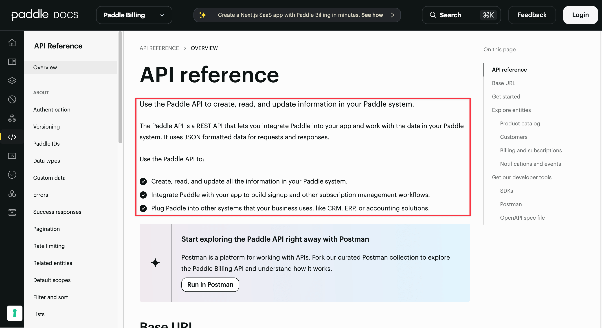
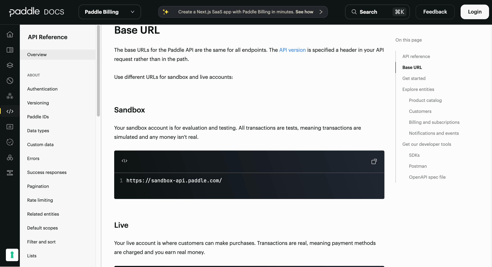
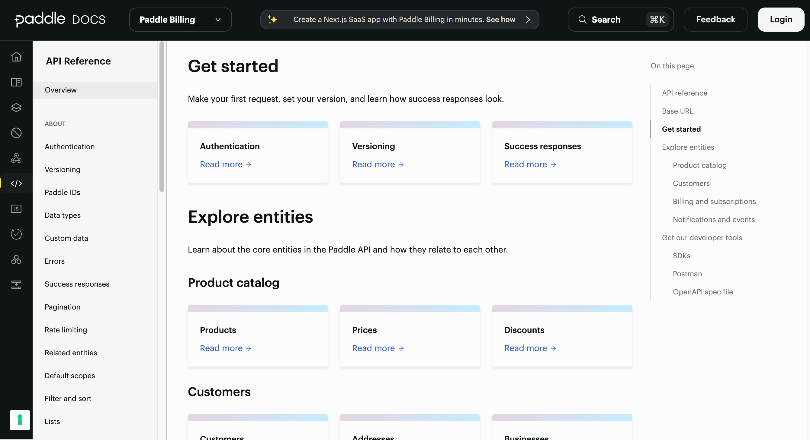
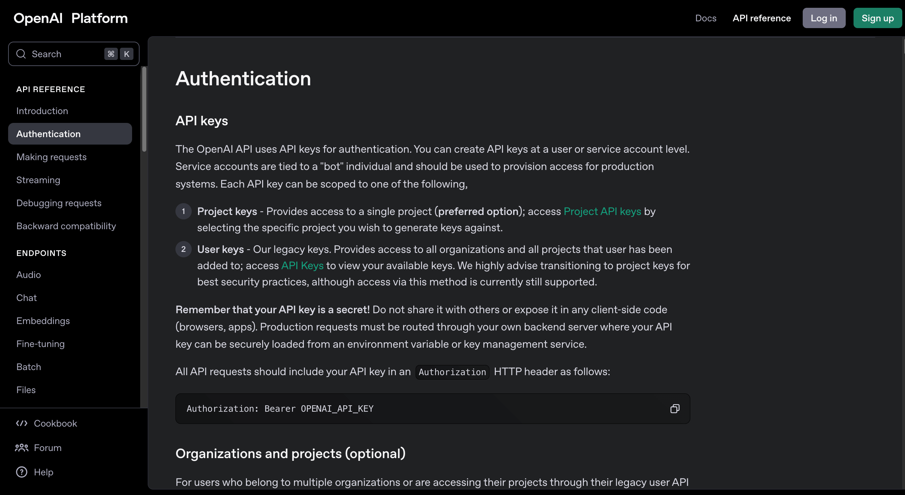
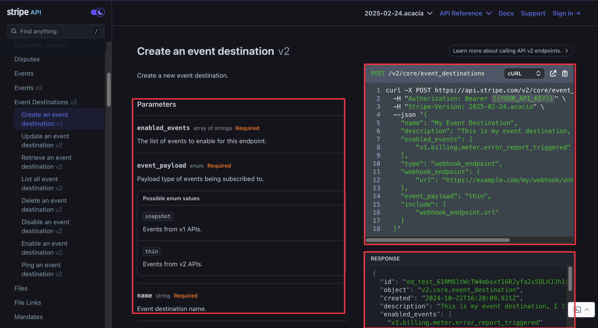
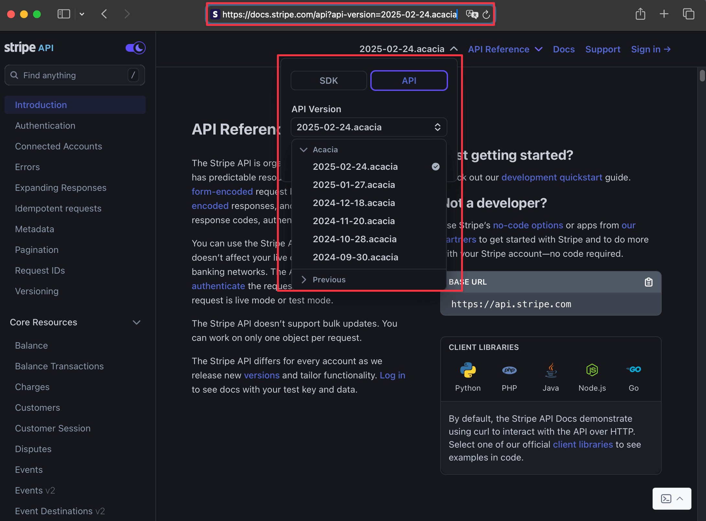
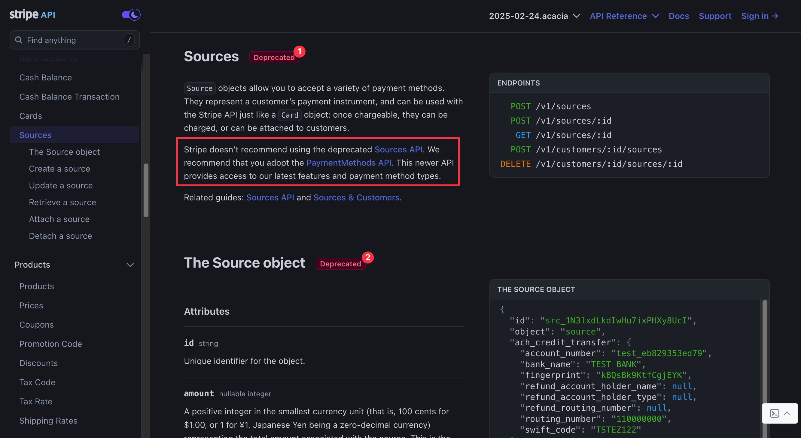
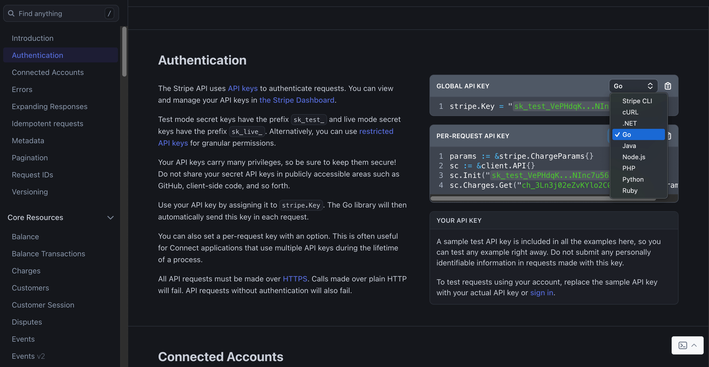
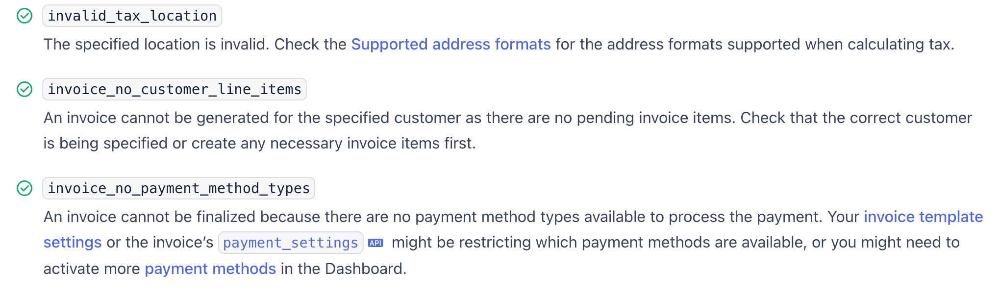

# How to document your API

Developers are the principal adopters of API products. By writing developer-friendly documentation, you can retain users, attract investment, and stand out from your competitors.

In this guide, we break down how to document an API effectively, covering documentation structure, ongoing maintenance, user experience, internal documentation, platform choice, and more.

## Structuring your API documentation

Good API documentation is intuitive to navigate, as it follows a familiar format.

Most API documentation includes the following essential sections:

* **Getting started:** An overview of the API and a simple first request.
* **Setup and authentication:** An explanation of how users can authenticate and configure access to the API.
* **API reference:** A detailed description of the API endpoints, request parameters, and responses.

### Getting started

The **Getting started** page summarizes the purpose of the API and directs the developer to important sections. It should be short and to the point. The goal is to help users make their first successful request as quickly as possible by providing the following:

* A short introduction explaining what the API does.
* A description of the environment or a brief example of an authentication and request.
* Links to the setup section, the reference section, and any other important resources.

The Paddle API [Overview](https://developer.paddle.com/api-reference/overview) page for the Paddle API demonstrates this structure. It begins with an introduction.



Then, there is a short description of the [base URLs](https://developer.paddle.com/api-reference/overview#base-url) for the sandbox and live environments.



Finally, the page provides [links to key resources](https://developer.paddle.com/api-reference/overview#explore-entities), such as API references, SDKs, and authentication guides.



### Authentication

Authentication is a critical part of any API, and developers require a clear explanation of how they can authenticate their requests. Whether your API uses API keys, OAuth, or another method, this section should describe the following:

* How users can obtain API credentials (for example, by completing a sign-up process and generating API keys.
* How to use authentication tokens (such as in a header or query parameter).
* Security considerations (including refresh strategies, token storage and expiration information, and whether a token can be used publicly).

For example, view the [OpenAI Authentication page](https://platform.openai.com/docs/api-reference/authentication), which demonstrates these requirements by explaining where to create API keys, what their scopes are, how not to expose them, and where to include them in a request.



### API reference

Your API reference forms the core of your documentation. It is typically generated from an OpenAPI specification (more on this later). This section should be structured for quick lookup and clearly provide the following details for all endpoints:

* The method and URL (for example, `GET /orders`).
* The parameters (such as `path`, `query`, `body`, and `headers`).
* An example request (with real values, not placeholders).
* An example response (including both a success and a failure case).
* Error codes (with explanations).

The documentation for the Stripe endpoint used to [Create an event destination](https://docs.stripe.com/api/v2/core/event_destinations/create) is a great example of an API reference. It clearly demonstrates the parameters of the request and provides an example request and response.



### Additional sections

The **Getting started**, **Authentication**, and **API references** sections form the integral parts of your API documentation. Whether you include other sections is up to you. However, if you want your documentation to stand out, we recommend you add the following pages:

* **Usage limits:** Explain rate limits, pagination constraints, and whether certain requests support idempotency.
* **Versioning:** Outline how you handle versioning. This may not seem important at launch, but when a major update occurs, a clear versioning strategy becomes essential.
* **Table of contents:** Include a clear table of contents and strong cross-references between related documents (linking, for example, an "Order creation" guide to the relevant API reference). This helps developers quickly find what they need and improves the SEO and overall usability of your documentation.

When it comes to documentation, too much text overwhelms developers, but too little text leaves them confused. You can use the following guidelines to balance conciseness with clarity:

* For straightforward concepts, like authentication, your explanations should not exceed three paragraphs.
* For more complex topics, like security challenges, rather focus on providing a clear outline and sufficient descriptions and demonstrations to ensure users' full understanding without unnecessary verbosity.

## Versioning your API

Once your API is live, your documentation must evolve alongside it. Without a proper maintenance and versioning strategy, developers will struggle to keep up with changes, resulting in unnecessary frustration.

### Automate maintenance where possible

If your API documentation integrates with OpenAPI, you can partially automate maintenance. A well-documented API schema (such as a thorough OpenAPI document) allows you to configure automatic updates triggered by changes to your code. However, while these updates ensure your API reference pages remain accurate, they do not apply to the rest of your documentation. If you're using a hybrid approach that includes guides and explanations, you'll still need to update other sections manually when your workflows or concepts change.

### Version your documentation

APIs evolve, and so should your documentation. It's essential to **indicate precisely which API version** your documentation describes. As long as users rely on older versions of your API, your **previous documentation should remain accessible**.

There are two common strategies for hosting multiple API documentation versions:

* **Subdomains:** You can host legacy versions on subdomains like `docs.v1.project.io`, while keeping latest version documentation at `docs.project.io`.
* **Query parameters:** Alternatively, you can use a query parameter approach, such as `docs.project.io?version=v1`.

Both methods allow users to access previous versions while ensuring the default view displays your latest documentation.

For example, Stripe uses query parameters to display a different version of the documentation after you select the API reference.



### Maintain documentation stability with CI/CD and linting

When using an automated or hybrid approach to documentation, integrated linting and CI/CD checks allow you to ensure none of your documentation breaks during production. To prevent developer frustration due to malformed Swagger files or broken links, you should always:

* Use linting tools to validate API documents.
* Set up CI/CD pipelines to test documentation builds before pushing changes live.
* Verify hyperlinks and cross-references to prevent broken documentation links.

For example, you can run the Speakeasy [linting command](/docs/prep-openapi/linting) to detect OpenAPI document formatting errors and warnings before generating your SDKs.

### Keep a public changelog

Developers use changelogs to track API updates, deprecated fields, and breaking changes. Publishing a record of your API changes prevents users from unknowingly using outdated features and missing new improvements.

Your changelog should:

* List every significant API update accompanied by its date.
* Clearly mark deprecated fields and provide alternatives.
* Separate breaking changes from non-breaking changes.

We recommend using the [Keep a Changelog](https://keepachangelog.com/en/1.1.0/) format, which offers a well-structured and consistent approach to publicly recording your updates.

### Mark deprecated elements clearly

Inadequately documenting your deprecated fields endpoints and fields creates confusion and frustration for developers. In your API reference, you should mark deprecated elements with a `Deprecated` or `Legacy` tag and provide a short explanation of the change:

* Indicate when you will remove the endpoint or field, giving developers time to transition.
* Suggest alternatives to the deprecated functionality.
* Use visual cues like strikethroughs, warning icons, or color changes to highlight deprecated elements.

You can take inspiration from the [Stripe API documentation](https://docs.stripe.com/api/sources).



Using OpenAPI Specification 3.0, you can add the `deprecated` annotation to [endpoints](https://swagger.io/docs/specification/v3_0/paths-and-operations/#deprecated-operations) and [parameters](https://swagger.io/docs/specification/v3_0/describing-parameters/?sbsearch=Deprecated#deprecated-parameters). However, only OpenAPI Specification 3.1.x supports the `deprecated` annotation of schemas.

* If you deprecate an endpoint, mark the entire endpoint as deprecated by adding `deprecated: true` under the operation:

```yaml
paths:
  /v1/orders:
    get:
      summary: Get all orders
      deprecated: true
      description: This endpoint is deprecated. Use `/v2/orders` instead.
      responses:
        "200":
          description: Successful response
```

* If you deprecate a query parameter but the endpoint is still valid, mark the parameter as follows:

```yaml
paths:
  /v1/orders:
    get:
      summary: Get all orders
      parameters:
        - name: status
          in: query
          description: Filter orders by status. This parameter is deprecated. Use state instead.
          deprecated: true
          schema:
            type: string
      responses:
        "200":
          description: Successful response
```

* If you deprecate a schema field, first ensure you are using a 3.1.x version of the OpenAPI Specification, then mark the specific field inside the request or response body as deprecated:

```yaml
components:
  schemas:
    Order:
      type: object
      properties:
        id:
          type: string
        legacyField:
          type: string
          deprecated: true
          description: This field is deprecated and will be removed in future versions.
```

Notice how each example includes a description that informs the reader of the removal date or version and, when applicable, specifies the replacement field or endpoint to facilitate a smooth transition.

## Best practices for user and developer experience

There is a difference between well-structured API documentation and great API documentation. Use the following recommendations to create a seamless, intuitive experience that makes developers want to integrate and recommend your API.

### Focus on quality

A clean OpenAPI document leads to better autogenerated docs, higher quality SDKs, and a specification that is more useful to the developers who rely on it for their own tools and integrations. If you use Speakeasy for SDK generation, a well-structured OpenAPI document ensures clean, idiomatic SDK code samples that reduce friction.

You can improve your OpenAPI document using the Speakeasy [OpenAPI guide](/openapi), which covers everything from introductory concepts to the best practices for writing OpenAPI components.

### Include a dark mode option

Dark mode is a must-have for the accessibility of modern documentation. Many developers prefer it for readability, especially when working for long hours. Most documentation tools, including Docusaurus, ReadMe, and Mintlify, support dark mode by default, so enabling it should be a standard practice rather than an afterthought.

### Support copy-paste code snippets

Developers should be able to copy API request examples with one click. Including a copy-to-clipboard button in all code blocks prevents manual errors and accelerates integration. Most documentation platforms, such as ReadMe, Mintlify, and Docusaurus, support copy-paste snippets natively, so be sure to add this feature if you create a custom documentation site.

### Use SDK code samples instead of raw HTTP requests

Autogenerated API documentation often relies on `cURL`, `fetch`, or `requests` examples of API calls, but developers **prefer SDKs** that abstract API calls into **clean, idiomatic functions**. SDK-based examples reduce the code developers need to write, allowing users to integrate APIs more quickly. When an SDK includes a copy-paste button, using the API becomes even faster.

[Speakeasy](/docs/sdk-docs) automatically generates SDKs and SDK documentation from OpenAPI files, including SDK-based snippets of sample code that enhance the documentation. We offer integrations with [Scalar](/docs/integrations/scalar), [ReadMe](/docs/integrations/readme), and [Mintlify](/docs/integrations/mintlify), reducing the effort required for documenting your SDKs.

### Offer multi-language code examples

Not all developers use the same programming language. If your API supports multiple SDKs, we recommend you provide examples in Python, JavaScript, Go, Java, and other languages.

For example, Stripe and Twilio enhance user and developer experience by allowing users to switch between languages in the documentation.



### Add a search feature

Developers rely on the search function to navigate documentation efficiently. If your platform doesn't have a built-in search feature, consider adding one of the following.

* [Algolia](https://www.algolia.com/) is a market leader known for the speed and accuracy of its searches. It is free for open-source projects, but getting approval for free access can take time.
* [Typesense](https://typesense.org/) is a self-hosted, open-source alternative to Algolia with great performance. It requires more setup and has a steeper learning curve but offers users full control over the search functionality.

### Implement detailed error messages

Error messages should do more than state an issue - they should help developers resolve the problem by offering explanations and solutions.

The Stripe [Error codes](https://docs.stripe.com/error-codes) page provides examples of detailed error messages that:

* Describe why the error occurred.
* Indicate what caused the error.
* Provide clear steps to resolving the error (when possible).



### Integrate a testing client

You can improve the developer experience of your documentation by integrating seamless API testing and authentication. We recommend that you:

* **Enable shared authentication between your API dashboard and documentation:** This removes the need for developers to copy API keys manually, improves tracking across environments, and streamlines testing. While shared authentication requires additional development effort, the reduced friction makes it a valuable improvement.
* **Allow API requests to be executed directly from the documentation:** Tools like Swagger UI provide basic request execution, while Scalar offers a more refined and configurable experience.
* **Add an API playground for developers to experiment with live requests:** This makes it easier for developers to test different endpoints without additional setup and creates a more interactive and engaging documentation experience.

## Documenting internal APIs

While much of this guide focuses on public-facing API documentation, internal APIs have their own documentation needs and considerations. Internal documentation doesn't need the same level of polish as public-facing docs, but it still needs to be clear and useful for your team.

### Simpler requirements for internal documentation

Internal API documentation can be more streamlined than public-facing docs for several reasons:

* Your audience already understands your company's domain language and technical context
* You can make assumptions about your users' technical knowledge level
* There's less need for extensive marketing content or competitive positioning

For many teams, using something as simple as the raw protocol definition may be sufficient. Common approaches include:

* **Protocol Buffers (protobuf)** for gRPC services
* **OpenAPI documents** for REST APIs
* **GraphQL schemas** for GraphQL APIs

However, these raw specifications aren't always the most ergonomic for developers to use. They provide complete technical details but lack the narrative and context that make documentation user-friendly.

### Enhancing internal documentation

Even for internal APIs, adding a layer of polish can significantly improve developer productivity and reduce onboarding time. Consider implementing:

* **A lightweight documentation portal** using tools like Scalar, which can add a clean UI on top of your OpenAPI documents without requiring significant effort
* **Context and explanations** around endpoints, explaining the business purpose rather than just the technical details
* **Usage examples** that demonstrate common integration patterns specific to your internal systems
* **Authentication workflow guides** tailored to your company's identity management system

### Internal documentation best practices

When documenting internal APIs, prioritize:

* **Keeping documentation close to code** to make updates easier and more consistent
* **Documenting "why" not just "how"** to help developers understand the business context
* **Including team contact information** so developers know who to ask for help
* **Maintaining a changelog** specific to internal consumers
* **Simplifying authentication examples** using internal tokens or service account patterns
* **Setting up a documentation CI/CD pipeline** to ensure docs stay in sync with code

### Tooling for internal documentation

For internal APIs, lightweight tools are often preferable:

* **Scalar** provides a clean, modern interface for OpenAPI documents without requiring extensive setup
* **Swagger** is probably the documentation tool most users are familiar with. It's a bit daedm but it's functional.
* **Redocly** can be self-hosted for teams that need to keep documentation behind a firewall
* **GitHub/GitLab Pages** with a simple static site generator can work well for teams with CI/CD pipelines

Even for internal APIs, investing in good documentation pays dividends in developer productivity, reduced onboarding time, and fewer integration errors.

## Choosing your API documentation tools

Selecting the right platform for creating, hosting, and maintaining your API documentation directly impacts developer experience, SEO, and scalability. The table below compares the leading documentation tools based on their strengths, standout features, and pricing.

| Tool | Standout Feature | Best For | Strengths | Limitations | Starting Price |
|------|------------------|----------|-----------|-------------|----------------|
| [**Scalar**](scalar.com) | Interactive API client (downloadable as standalone app) | Developer-focused teams | Clean interface, framework integrations, great value | Limited MDX support, basic CI/CD | $12/user/month (Free for public APIs) |
| **Mintlify** | Extensive theming & customization | Brand-conscious companies | Beautiful UI, MDX support, AI-ready documentation | Less robust API validation, higher price point | $150/month |
| **Bump** | Performance with large APIs | Enterprise teams with complex APIs | Handles massive specs, excellent versioning, fast load times | Less polished UI, steeper pricing | $265/month |
| **ReadMe** | Web-based visual editing | Non-technical teams | User-friendly for marketers and product managers, familiar interface | Limited automation, manual updates required | $99/month |
| **Redocly** | Ecosystem integration | Teams using common frameworks | Built-in support in many frameworks, robust Git workflow | Dated UI, requires more customization effort | $10/user/month |

### Documentation approaches

When selecting a platform, consider which approach fits your needs:

1. **Automated documentation:** Generate references directly from OpenAPI specs with minimal effort.
2. **Manual documentation:** Create narrative-driven docs with custom explanations and examples.
3. **Hybrid approach:** Combine automated references with handcrafted guides for the best developer experience.

Your choice should align with your API's complexity, team composition, and available resources. Smaller APIs with technical users might do well with simple automated documentation, while customer-facing APIs benefit from more comprehensive solutions with robust customization options.

## Final thoughts

Ultimately, the success of your API documentation comes down to the quality of your content and hosting. Everything else we cover in this guide serves as a boost to make your documentation stand out.

Our core recommendations are straightforward:

* **For an API with five or fewer endpoints:** Automate your reference documentation with Swagger or Scalar UI and include a basic introduction page and an authentication section.
* **For a large or growing API:** Adopt a hybrid approach using both Docusaurus and Swagger to increase your control over the documentation while keeping it manageable, or if you can afford the additional cost, use a managed solution that offers more features, like ReadMe, Bump.sh, or Mintlify.
* **For internal APIs:** Use lightweight solutions like Scalar that provide just enough polish on top of protocol definitions without requiring significant investment.

Start simple, scale smartly, and always prioritize clarity over complexity.
