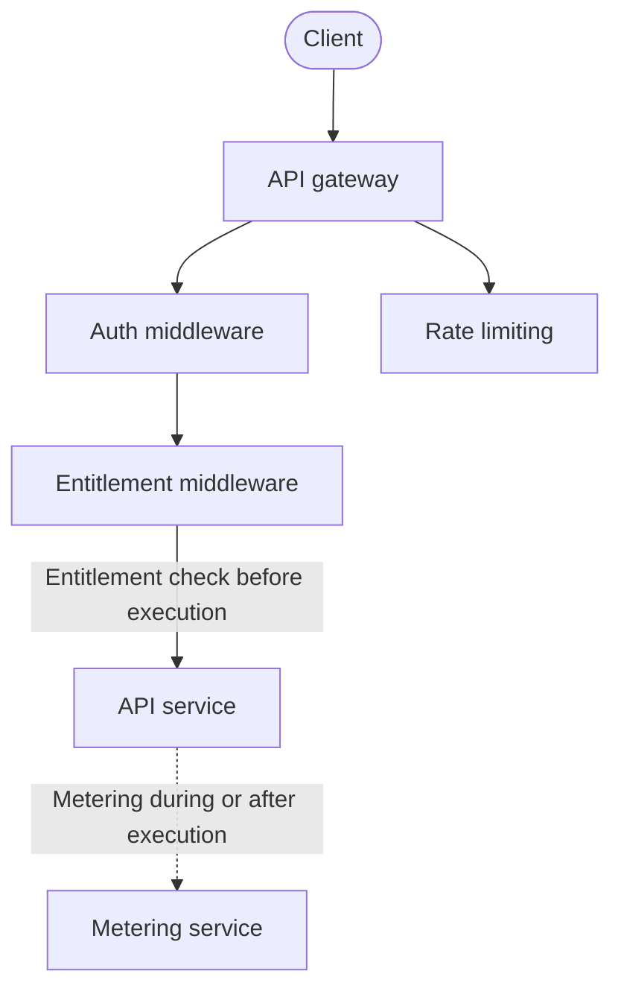
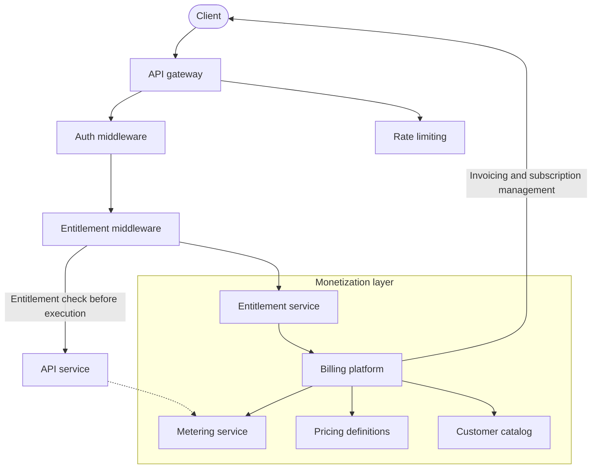

# Monetizing your API: Focus on flexibility for iterative pricing

Anyone who has ever monetized an API will tell you: It's harder than you think. Monetization is an organization-wide project that affects the bottom line unlike anything else you'll build.

This guide focuses on the early-stage technical billing decisions you can make to avoid painting yourself and your organization into a corner.

Although we'll touch on pricing models and other strategic topics, this guide is intended for product teams and engineers and focuses on the technical aspects of monetizing an API.

## Anticipate change

In the crunch-time rush to sign up your first enterprise customer, you may be tempted to assume a fixed pricing model. Building this pricing logic into your application is the critical mistake you want to avoid.

Pricing changes over time. We're not talking only about inflation or the price of eggs (although inflation plays a role); we're referring to the inevitable and often rapid changes you should expect in market conditions.

Anticipating rather than fighting these changes can bring sustained competitive advantage in the face of the wonderful surprises the market inevitably brings: Competitive pivots, rapid market entry, customer bargaining, pricing experiments, product expansion, and shifting cost structures will all demand iterative pricing changes. These principles are inspired by the five pillars of [PriceOps](https://priceops.org/) and long nights of patching home-grown billing systems.

When API functionality and monetization are tightly intertwined, even modest changes to pricing models will require code refactoring, pulling engineers away from core product development, growing organizational friction, and making expensive rewrites the norm.

## Design principles that support pricing flexibility

The engineering best practices that enable monetization flexibility revolve around decoupling, modularity, and the separation of concerns. In many ways, the following principles resemble good engineering practice in general, but we can't overstate their importance in pricing systems.

### Create a single source of truth for your immutable pricing definitions

Your pricing definitions must exist in a single, authoritative database or system. Pricing plans and their definitions must be immutable; once set, they must never change directly. Instead, new variations should emerge as new, separately versioned plans so that existing customers retain their current versions of the pricing plan until they are explicitly moved.

This principle ensures that new monetization plans or experimental tiers are added independently and safely, never affecting existing subscriptions or breaking customer configurations.

### Use modular entitlement checking that is decoupled from business logic

Entitlements (a concept that will come up often in this guide) are the permissions granted to customers according to their subscription plans. You can think of entitlements as the features a customer is allowed to use based on their chosen plan or the usage they've accrued.

You must never embed explicit plan or entitlement logic directly into your API business logic. Each request to your endpoints should merely check the customer's entitlement in a decoupled entitlement service layer or middleware component, which determines whether the customer can use a specific API feature by referencing your single source of pricing and entitlement truth. When you query customer plans dynamically, your pricing adjustments become simple changes to entitlement rules rather than risky API code changes.

### Centralize your pricing-agnostic metering and analytics

Don't embed detailed metering logic directly into your application code. Instead, generalize the usage reporting to metering systems and ensure it is pricing agnostic. This reduces the load on developers and engineers by eliminating the need for new code in future pricing experiments or approaches and by enabling the reuse of historical metering records for launching new plans.

Measure and record usage continuously, regardless of your current monetization model. If there is the slightest chance a user action can one day be monetized, its usage should be recorded.

### Create clear boundaries and responsibilities

You should have clearly defined responsibilities and boundaries for your pricing data definitions, entitlement checks, and billing mechanics, as well as for your core API functionality. Ideally, each area should be owned by different teams and services, and use clean APIs and messaging patterns to communicate across boundaries so that transformation in one area occurs independently, without cascading changes to other areas.

## Designing your technical stack for monetization

From the API service's perspective, there should be only two connections to monetization.



This intentionally minimal coupling creates a clean separation between your core service functionality and monetization concerns. The API service only needs to know:

1. Whether the request is allowed to proceed (entitlement check before execution)
2. What usage to report once the request completes (metering after execution)

Everything else (pricing plans, rate calculations, billing periods, invoicing, and subscription management) lives outside your core API code. This separation delivers several benefits:

First, it enables your engineering and product teams to evolve core functionality independent of monetization strategies. Your API developers can focus on building features without worrying about pricing implications, while your product and business teams can experiment with pricing models without requiring engineering resources.

Second, this separation minimizes the risk of critical errors during pricing model changes. When pricing logic is embedded throughout your codebase, seemingly innocuous changes to pricing can introduce subtle bugs that are difficult to detect until they impact customers. By isolating monetization to specific touchpoints, you contain both the risks and the testing surface area.

Third, it creates a future-proof architecture that can adapt to evolving business models. As your product matures, you might transition from simple request-based pricing to more sophisticated models like outcome-based, value-based, or tiered pricing. With proper separation, these transitions become configuration changes rather than engineering projects.

## Step-by-step implementation

There are several practical approaches to maintaining the separation between monetization and your API code. We recommend following a step-based approach, starting from your API service and working outwards, to ensure flexibility from day one.

### Step 1: Add entitlement checks as middleware

Implement entitlement checking as true middleware that runs before your API controllers. This approach works well with gateway-based architectures, like Express, Django, FastAPI, and Spring Framework, which allow you to configure middleware chains. The middleware should:

1. Extract customer identification from the authenticated request.
2. Extract the feature identifier from the request.
3. Query your entitlement service to check whether the feature is allowed.
4. Reject unauthorized requests before they reach your business logic.

Here's how this could work as a FastAPI middleware:

```python
from fastapi import FastAPI, Request
from fastapi.responses import JSONResponse

from features import map_path_to_feature_id


app = FastAPI()

@app.middleware("http")
async def check_entitlement(request: Request, call_next):
    # Step 1: Extract customer identification from the authenticated request.
    customer_id = request.state.user.customer_id # Assumes auth middleware sets this

    # Step 2: Extract the feature identifier from the request.
    feature_id = map_path_to_feature_id(request.url.path)

    # Step 3: Query your entitlement service to check if the feature is allowed
    entitled, message = await check_entitlement(customer_id, feature_id)

    # Step 4: Reject unauthorized requests before they reach your business logic
    if not entitled:
        return JSONResponse(status_code=403, content={"error": message})

    # Request is authorized for this feature
    return await call_next(request)
```

This is overly simplified, so let's consider the strategies for handling complex entitlement checks.

The FastAPI solution above becomes slightly complicated when the entitlement service requires other attributes (or worse, **derived** attributes) of the request.

If, for example, your API has an endpoint that takes potentially large file uploads as input, you may wish to send the sizes of attached files to the entitlement service, along with the `customer_id` and `feature_id`, to test entitlement. Essentially, you would be asking something like, "Is customer 23 entitled to the upload image feature if the image is 32GB?"

If computing the required context isn't computationally expensive, you could send the length of the request body and the file sizes along with your entitlement request for each request.

For example:

```python
from fastapi import FastAPI, Request
from fastapi.responses import JSONResponse

from features import map_path_to_feature_id


@dataclass
class EntitlementContext:
    file_sizes: Dict[str, int]
    body_size: int

app = FastAPI()

@app.middleware("http")
async def check_entitlement(request: Request, call_next):
    customer_id = request.state.user.customer_id
    feature_id = map_path_to_feature_id(request.url.path)

    # Calculate the context of this request
    context = EntitlementContext(
        file_sizes={file.filename: len(file.body) for file in request.files},
        body_size=len(await request.body())
    )

    entitled, message = await check_entitlement(customer_id, feature_id)
    if not entitled:
        return JSONResponse(status_code=403, content={"error": message})

    return await call_next(request)
```

Calculating these sizes can be expensive. If this is the case, you might consider a more complex solution that uses the feature mapping function to return another function that, when called, calculates the context. This function can be passed to the middleware to calculate the context only when needed.

```python
from fastapi import FastAPI, Request
from fastapi.responses import JSONResponse

from features import map_path_to_feature_id


app = FastAPI()

@app.middleware("http")
async def check_entitlement(request: Request, call_next):
    customer_id = request.state.user.customer_id

    # map_path_to_feature_id returns a tuple of feature_id and a function that calculates the context
    feature_id, context_calculator = map_path_to_feature_id(request.url.path)

    if context_calculator:
        # Calculate the context of this request if needed. Push complexity to the feature mapping function.
        context = context_calculator(request)
    else:
        context = None

    entitled, message = await check_entitlement(customer_id, feature_id, context)
    if not entitled:
        return JSONResponse(status_code=403, content={"error": message})

    return await call_next(request)
```

However simple your entitlement logic might be now, you should push any entitlement-checking complexity as far from your core business logic as possible. Don't let it creep into your controllers or service layer. You may think [YAGNI](https://en.wikipedia.org/wiki/You_aren%27t_gonna_need_it), but as your API grows, you'll definitely require this separation.

### Step 2: Set up metering as asynchronous events or logs

For usage metering, prioritize asynchronous approaches that don't block your API response flow. Emit metering events to a queue or event stream that is processed and aggregated by a separate service.

Don't use your current pricing model to determine which metrics to meter. Meter everything you can, even if you don't currently charge for it. This data will be invaluable when you experiment with new pricing models or need to understand customer behavior.

The discipline of metering does not come naturally to many developers. To avoid the temptation to meter only what you charge for, consider a simple metering library that records all request details to a central store.

We also recommend you further separate your API code from your billing system by pushing metering events to an external service.

Many billing platforms ingest metering data via APIs or event streams. Our suggestion is to push metering events to your own event stream or queue, then have a separate service consume these events and push them to your billing platform. This approach decouples your API service from the billing platform, allowing you to switch billing providers without changing your core API code.

Here's an example of how you might emit metering events to a Kafka topic:

```python
from kafka import KafkaProducer
import json


producer = KafkaProducer(bootstrap_servers='localhost:9092')

def emit_metering_event(customer_id, feature_id, usage):
    event = {
        "customer_id": customer_id,
        "feature_id": feature_id,
        "usage": usage
    }
    producer.send('metering-events', json.dumps(event).encode('utf-8'))
```

This code assumes you have a Kafka producer running and a topic named `metering-events`. You can then have a separate service consume these events and push them to your billing platform.

### Step 3: Centralize your pricing definitions

Pricing plans should typically live in structured databases or systems designed explicitly for fast read/write and easy evolution, like a versioned NoSQL data store, a relational PostgreSQL database, or a dedicated billing platform (such as [Chargebee](https://www.chargebee.com/recurring-billing-invoicing/metered-usage-billing/), [Stripe Billing](https://docs.stripe.com/billing/subscriptions/usage-based/pricing-models), [Metronome](https://docs.metronome.com/pricing-packaging/), or [Lago](https://www.getlago.com/products/plans)).

Defining your pricing plans in a structured format allows you to version them, experiment with new plans, and roll back changes if necessary. It also enables you to build tooling (like dashboards, reports, and customer-facing pricing pages) around your pricing plans.

How you centralize your pricing definitions depends on your specific requirements and the tools you use. If you're using a billing platform, you might define pricing plans directly in its UI. If you're managing pricing in your database, you might create a simple CRUD interface for managing pricing plans. The most basic implementation might be a YAML file that you load into memory at startup.

Whichever option you choose, ensure that your pricing definitions are **versioned** and **immutable**. Once a customer subscribes to a plan, they should remain on that plan until they explicitly change it.

If, for example, the basic plan changes from $10/month to $15/month, existing customers on the basic plan should continue to pay $10/month until your system migrates them to the new plan. This migration should be a separate process that you can roll back if necessary, not a direct change to the pricing plan.

Here's why centralized pricing definitions are important:

- **Versioning**: Versioning your pricing plans allows you to experiment with new plans without affecting existing customers. If a new plan doesn't work out, you can roll back to the previous version without impacting your customers.
- **Immutability**: Making your pricing plans immutable ensures that existing customers remain on the plan they signed up for. If you change the basic plan, existing customers should continue to pay the old price until they explicitly change plans or you migrate them to the new plan.
- **Consistency**: By centralizing your pricing definitions, you ensure that all parts of your system use the same pricing data. This consistency is crucial for accurate billing and reporting. For example, you are less likely to have discrepancies between the prices shown on your website and the prices charged to customers when your pricing is centralized.

### Step 4: Create your entitlement service

Your entitlement service should be a separate service that handles entitlement checks for your API. This service should be responsible for:

- Checking whether a customer is entitled to use a specific feature.
- Providing an API for your API service entitlement middleware to query.
- Logging entitlement checks for auditing and debugging.
- Integrating with your billing platform to fetch customer entitlements.

The entitlement service should be a simple, stateless service that queries your pricing definitions to determine whether a customer is entitled to use a specific feature. It should not contain any business logic or pricing rules. Instead, it should be a thin layer that translates customer and feature identifiers into entitlement checks.

You may be tempted to embed entitlement logic into your API service or middleware. But keeping this logic separate allows you to change billing rules, experiment with new pricing models, and integrate with different billing platforms without changing your core API code. It also makes it easier to audit and debug entitlement checks because you can log each check and its result.

Teams working on your API service can focus on building features and improving performance. Teams working on your entitlement service can focus on pricing rules, billing integrations, and entitlement checks. This separation of concerns makes it easier to scale your team and your product.

The entitlement middleware in your API service depends only on the clean, simple API provided by the entitlement service. This API should be well-documented and easy to use, allowing your API service to query entitlements with minimal overhead.

### Step 5: Integrate your entitlement service with your billing platform

If you're using a billing platform like Chargebee, Stripe Billing, Metronome, or Lago, you'll need to integrate your entitlement service with your billing platform.

Expanding on our previous stack diagram, the billing platform should form the final piece of the puzzle:



## Preventing billing vendor lock-in

When integrating with a billing platform, it's essential to consider the risk of vendor lock-in. Just because a billing platform fits your needs now, doesn't mean it will in the future. You can prevent vendor lock-in by ensuring the following are not dependent on your billing platform:

- **Pricing definitions**: Keep your pricing definitions in a structured format separate from the billing platform. If possible, use the billing platform's API to sync pricing definitions, rather than defining them directly in the platform. This way, when you can switch billing platforms by syncing your pricing definitions to the new platform instead of redefining them from scratch.
- **Entitlement service**: Keep your entitlement service separate from the billing platform. The entitlement service should be responsible for checking entitlements, logging checks, and integrating with the billing platform. This separation allows you to switch billing platforms without changing your entitlement logic.
- **Metering service**: Keep your metering service separate from the billing platform. The metering service should be responsible for recording usage data, emitting metering events, and integrating with the billing platform. This separation allows you to switch billing platforms without changing your metering logic.

Building a separate customer catalog service that integrates with your billing platform can also help prevent vendor lock-in, but this step may be overkill for early-stage startups.

## Compliance considerations

As your API usage grows, you'll encounter the following billing-related compliance considerations.

### Security compliance

Billing systems often handle sensitive customer data. Make sure your billing service is PCI compliant and follows industry standards for data protection.

The Payment Card Industry Data Security Standard (PCI DSS) ensures that all companies that accept, process, store, or transmit credit card information maintain a secure environment. If your billing platform handles credit card information, it must be PCI compliant. Most are, but it's worth checking.

### Tax compliance

When your API business grows beyond a certain scale, you'll need to handle taxes for your customers in multiple jurisdictions. This is a surprisingly complex problem, as tax laws vary widely between countries, states, and even cities.

This is also an issue that creeps up on you, then suddenly reaches a tipping point. Don't ignore it until you're forced to deal with it, but more importantly, don't build this problem into any of your own systems. Use a billing platform that handles tax compliance for you.

## Tools and libraries for getting started

When implementing a flexible monetization system for your API, selecting the right tools can significantly reduce development time and complexity. Here are some tools and libraries worth considering.

### Billing platforms and subscription management

These platforms handle the complex aspects of subscription billing, invoicing, and payment processing:


- [Stripe Billing](https://stripe.com/billing): A comprehensive solution with flexible subscription models, usage-based billing, and extensive API capabilities.
- [Polar](https://polar.sh/): A developer-first billing platform that offers a flexible subscription model, usage-based billing, and extensive API capabilities.
- [Chargebee](https://www.chargebee.com/): Offers a robust subscription management platform with a focus on subscription lifecycle automation.
- [Lago](https://www.getlago.com/): An open-source alternative that provides metering, subscription management, and invoicing capabilities.
- [Metronome](https://metronome.com/): Specializes in usage-based pricing with metering and aggregation features.
- [Paddle](https://www.paddle.com/): Handles global tax compliance and payment processing with subscription management.

### Metering libraries and services

These metering tools can be used for tracking API usage:

- [Prometheus](https://prometheus.io/): An open-source monitoring and alerting toolkit that can be used for metering API usage.
- [OpenTelemetry](https://opentelemetry.io/): A set of APIs, libraries, agents, and instrumentation for collecting telemetry data from your services.
- [Segment](https://segment.com/): A customer data platform that can be used to track API usage and customer behavior.
- [CloudWatch Metrics](https://aws.amazon.com/cloudwatch/): A monitoring service for AWS resources that can be used to track API usage.
- [Azure Monitor](https://azure.microsoft.com/en-us/services/monitor/): A monitoring service for Azure resources that can be used to track API usage.

### Entitlement service implementations

These services can manage feature access and entitlements:

- [Open Policy Agent](https://www.openpolicyagent.org/): A general-purpose policy engine that can be used for entitlement checking.
- [Oso](https://www.osohq.com/): A rule-based access control engine that can be used for entitlement checking.
- [Stigg](https://stigg.io/): A billing and entitlement service that can be used to manage feature access and pricing.
- [LaunchDarkly](https://launchdarkly.com/blog/managing-entitlements-in-launchdarkly/): A feature-flag service that can be adapted for entitlement checking.
- Custom entitlement services: Building your own service gives you maximum flexibility, especially when coupled with caching layers like Redis.

API gateways can handle authentication, rate limiting, and in some cases, entitlement checking:

- [Kong](https://konghq.com/): An open-source API gateway with a plugin architecture that supports custom logic for entitlement checking.
- [Tyk](https://tyk.io/): An open-source API gateway with rate limiting, authentication, and access control features.
- [Apigee](https://cloud.google.com/apigee): A cloud-based API management platform that can be used for entitlement checking.

## Beware the all-in-one solution

Many of the tools and services listed here offer comprehensive solutions for API monetization. While using an all-in-one platform can speed up your development process, it can also lead to vendor lock-in and reduced flexibility.

This doesn't mean you should avoid these platforms entirely. Instead, use them judiciously by sticking to the monetization principles in this guide. Keep your pricing definitions, entitlement checks, and metering logic separate from the billing platform. This way, you can switch billing platforms without rewriting your core API code.

## Double-beware the in-house solution

Whatever you do, don't build your own billing system. When it comes to developing an in-house billing solution, you can expect complexity unlike anything you'll build in your core product. You may not be building a moon lander, but considering how complex billing systems are, you're definitely building a rocket.

Billing entails dealing with the intricacies of time (some months and years are shorter than others), tax, currency conversion, payment gateways, fraud detection, and compliance.

Customers expect discounts, refunds, and credits. They'll want to change plans (mid-way through a billing cycle), pause subscriptions, and cancel services.

Avoid building this yourself at all costs. Use a billing platform that can handle these complexities for you.

Off-the-shelf billing platforms are built by teams of experts who have spent years solving these problems. They may be expensive to the early-stage startup, but they're a bargain compared to the cost of building and maintaining your own billing system.
