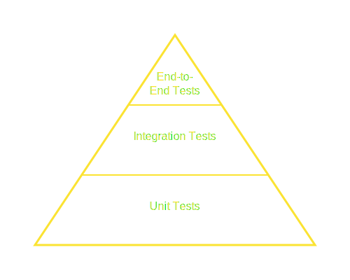
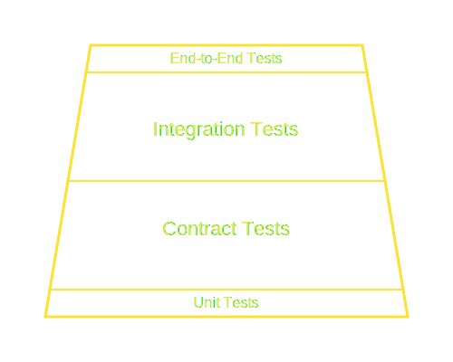

# Testing your API

We write tests to build trust. Trust that our software is reliable, safe, and extendable. When it comes to testing public APIs, robust testing gives users confidence that the API *behaves* as expected. This guide not only covers the *how* of API testing, but also how to project externally the confidence brought by testing.

## Why API testing matters

API testing involves sending requests to your API endpoints and validating the responses. It's faster and more focused than UI testing, allowing for fast feedback, better coverage of edge cases and errors, and more stable verification of the contracts between system components.

But for *public* or third-party-consumed APIs, the *why* extends further. Your tests aren't just for *you* to catch regressions. They are potentially the single most accurate, up-to-date source of truth about how your API actually behaves, especially in nuanced situations.

## The test pyramid does not apply to API testing

API testing clashes with the traditional test pyramid - you know, the one that says, "Many unit tests at the bottom, fewer integration tests in the middle, and a few end-to-end tests at the top."



This pyramid is a good model for verifying the implementation details of small units of work, but it's a terrible model for verifying an API's behavior. Unit tests, useful on the server when testing complex logic, don't tell us much about how the API behaves as a whole.

We need a new model for API tests.

## The API test ~pyramid~ trapezoid

The traditional test pyramid (many unit tests, fewer integration tests, fewest E2E tests) is okay for internal implementation details. But for verifying API *behavior* from a consumer's viewpoint, the emphasis shifts.



It's not exactly a pyramid, but you get the idea.

At the base, we have **unit tests**. These are the tests that verify the internal workings of your API. They're important for maintaining code quality and catching regressions, but they don't tell us much about how the API behaves from a consumer's perspective, so we'll limit their scope and keep them private.

In the middle, we've added **contract tests**. These tests verify that the API's contract with consumers is upheld. They're a step up from unit tests because they verify the API's behavior at its boundaries. We've covered contract testing in detail in a [previous post](https://www.speakeasy.com/post/contract-testing-with-openapi).

We'll focus on **integration tests** at the top-middle layer of the pyramid. These tests verify the API's behavior from a consumer's perspective. They're the most relevant tests for API consumers because they show exactly how the API behaves in different scenarios.

Finally, **end-to-end tests** sit at the top. These tests verify the API's behavior in a real-world scenario, often spanning multiple systems. They're useful from an API consumer's perspective, but they're also the most brittle and expensive to maintain (unless you're generating them, but we'll get to that).

Let's focus on why we're advocating for making these integration tests public as part of your SDK.

## A practical guide to API integration testing

We've established that integration tests are vital for verifying API behavior from a consumer's viewpoint - but how do you write good integration tests? Here's a practical approach:

### 1. Prerequisites

Before you start, ensure you have:

- **Access to a test environment:** Obtain access to a deployed instance of your API, ideally isolated from production (for example, staging or QA). This environment should have representative, non-production data.
- **API credentials:** Acquire valid credentials (API keys, OAuth tokens) for accessing the test environment. Use dedicated test credentials, *never* production ones.
- **A testing framework:** Choose a testing framework suitable for your language (for example, `pytest` for Python, `Jest`/`Vitest` for Node.js/TypeScript, `JUnit`/`TestNG` for Java, or `Go testing` for Go).
- **An HTTP client or SDK:** Establish the way you'll make requests. While you can use standard HTTP clients (`requests`, `axios`, `HttpClient`), **we strongly recommend using your own SDK** for these tests. This validates the SDK itself and mirrors the consumer experience.

### 2. Test structure

The Arrange-Act-Assert (AAA) pattern provides you with a clear, standardized approach to structuring your tests:

- **Arrange:** Set up all preconditions for your test. This includes initializing the SDK client, preparing request data, and potentially ensuring the target test environment is in the correct state (for example, by checking that the required resources exist or *don't* exist).
- **Act:** Execute the specific action you want to test. This is typically a single method call on your SDK that corresponds to an API operation.
- **Assert:** Verify the outcome of the action. Check the response status, headers, and body content. Assert any expected side effects if applicable.

You can also include a **Teardown** step (often via `afterEach`, `afterAll`, or fixture mechanisms in testing frameworks) to clean up any resources created during the test to ensure your tests don't interfere with one another.

Here's an example using TypeScript with Vitest, testing the Vercel SDK generated by Speakeasy. Notice how the code maps to the AAA pattern:

```typescript
import { expect, test } from "vitest";
import { Vercel } from "../index.js"; // Assuming SDK is in ../index.js
import { createTestHTTPClient } from "./testclient.js"; // Helper for test client

test("User Request Delete - Happy Path", async () => {
  // --- ARRANGE ---
  const testHttpClient = createTestHTTPClient("requestDelete");
  const vercel = new Vercel({
    serverURL: process.env["TEST_SERVER_URL"] ?? "http://localhost:18080",
    httpClient: testHttpClient,
    bearerToken: process.env["VERCEL_TEST_TOKEN"] ?? "<YOUR_BEARER_TOKEN_HERE>",
  });
  const requestParams = {}; // No specific parameters needed for this call

  // --- ACT ---
  const result = await vercel.user.requestDelete(requestParams);

  // --- ASSERT ---
  expect(result).toBeDefined();
  // Example: Asserting specific fields in the response.
  // Again, the exact values here might be due to the testHttpClient.
  // In live tests, you might check `result.id` exists and is a string,
  // `result.email` matches a known test user, etc.
  expect(result).toEqual({
    id: "<id>", // Placeholder suggests fixed response
    email: "Lamont82@gmail.com", // Placeholder suggests fixed response
    message: "Verification email sent",
  });
});
```

In this example, the AAA comments make the test flow obvious to someone reading the tests.

Because the test uses the [Vercel SDK](https://www.npmjs.com/package/@vercel/sdk), the level of abstraction matches that of a developer using the SDK.

### 3. Selecting scenarios to test

When deciding which tests to write, make sure you cover happy paths and edge cases, avoiding the temptation to write tests only for the way your API was "meant to be used".

- **Happy paths:** Verify the core functionality works as expected with valid inputs, for example, by checking that it can list resources or retrieve a specific item.

    ```typescript
    // Example: Listing deployments (happy path)
    test('should list deployments for a project successfully', async () => {
      // Arrange
      const vercel = new Vercel(/* ... setup client ... */);
      const projectId = 'prj_testProject123'; // Assume this project exists in test env
      const listParams = { projectId: projectId, limit: 5 };

      // Act
      const result = await vercel.deployments.list(listParams);

      // Assert
      expect(result).toBeDefined();
      expect(result.pagination).toBeDefined();
      expect(result.deployments).toBeInstanceOf(Array);
      // Add more specific assertions if needed, e.g., checking deployment properties
      if (result.deployments.length > 0) {
          expect(result.deployments[0].uid).toBeDefined();
          expect(result.deployments[0].state).toBeDefined();
      }
    });
    ```

- **Error handling:** Test how the API responds to invalid scenarios. Use `try...catch` or framework-specific methods (`expect().rejects`) to verify error responses.

    ```typescript
    // Example: Getting a non-existent project (404 Not Found)
    test('should return 404 when getting a non-existent project', async () => {
      // Arrange
      const vercel = new Vercel(/* ... setup client ... */);
      const nonExistentProjectId = 'prj_doesNotExistXYZ';

      // Act & Assert
      try {
        await vercel.projects.get(nonExistentProjectId);
        // If the above line doesn't throw, the test fails
        throw new Error('API call should have failed with 404');
      } catch (error) {
        // Assuming the SDK throws a specific error type with status code
        expect(error).toBeInstanceOf(ApiError); // Replace ApiError with actual error type
        expect(error.statusCode).toBe(404);
        // Optionally check error code or message from the API response body
        // expect(error.body.error.code).toBe('not_found');
      }

      // Alternative using Vitest/Jest 'rejects' matcher:
      // await expect(vercel.projects.get(nonExistentProjectId))
      //   .rejects.toThrow(ApiError); // Or specific error message/type
      // await expect(vercel.projects.get(nonExistentProjectId))
      //   .rejects.toHaveProperty('statusCode', 404);
    });

    // Example: Missing permissions (403 Forbidden)
    test('should return 403 when attempting action without permissions', async () => {
        // Arrange
        // Assume 'readOnlyVercelClient' is configured with a token that only has read permissions
        const readOnlyVercelClient = new Vercel(/* ... setup with read-only token ... */);
        const projectIdToDelete = 'prj_testProject123';

        // Act & Assert
        await expect(readOnlyVercelClient.projects.delete(projectIdToDelete))
          .rejects.toThrow(/* Specific Error Type or Message Indicating Forbidden */);
        await expect(readOnlyVercelClient.projects.delete(projectIdToDelete))
          .rejects.toHaveProperty('statusCode', 403);
    });
    ```

- **Edge cases:** Test boundary conditions like pagination limits or the handling of optional parameters.

    ```typescript
    // Example: Testing pagination limits (listing user events)
    test('should respect pagination limit parameter', async () => {
      // Arrange
      const vercel = new Vercel(/* ... setup client ... */);
      const limit = 5; // Request a small limit

      // Act
      // Use the listUserEvents endpoint from the previous example
      const result = await vercel.user.listUserEvents({ limit: limit });

      // Assert
      expect(result).toBeDefined();
      expect(result.events).toBeInstanceOf(Array);
      // Check if the number of returned events is less than or equal to the limit
      expect(result.events.length).toBeLessThanOrEqual(limit);
      expect(result.pagination).toBeDefined();
      // Maybe check pagination 'next' value based on expected total results
    });

    test('should handle requests with only optional parameters', async () => {
      // Arrange
      const vercel = new Vercel(/* ... setup client ... */);

      // Act: Call an endpoint with only optional query params, e.g., listing projects without filters
      const result = await vercel.projects.list({}); // Pass empty object or omit params

      // Assert
      expect(result).toBeDefined();
      expect(result.projects).toBeInstanceOf(Array);
      // Assert default behavior when no filters are applied
    });
    ```

- **Business logic:** Verify specific rules unique to your domain (this depends heavily on the API's features).

    ```typescript
    // Example: Verifying default deployment domain structure
    test('should create a deployment with the correct default domain format', async () => {
      // Arrange
      const vercel = new Vercel(/* ... setup client ... */);
      const projectId = 'prj_testProject123';
      // Simplified deployment request data
      const deploymentData = { name: 'my-test-app', files: [/* ... file data ... */] };

      // Act: Create a new deployment (assuming a method exists)
      // Note: Real deployment creation is complex, this is illustrative
      // const deployment = await vercel.deployments.create(projectId, deploymentData);
      // Let's assume we list deployments instead to find the latest one
      const deploymentsResult = await vercel.deployments.list({ projectId: projectId, limit: 1});
      const latestDeployment = deploymentsResult.deployments[0];


      // Assert: Check if the autogenerated domain follows the expected pattern
      expect(latestDeployment).toBeDefined();
      expect(latestDeployment.url).toBeDefined();
      // Example assertion: checks if URL matches Vercel's typical preview URL pattern
      expect(latestDeployment.url).toMatch(/^my-test-app-\w+\.vercel\.app$/);
      // Or check against a specific alias rule if applicable
    });
    ```

- **Authentication:** Test different auth scenarios.

    ```typescript
    // Example: Using an invalid bearer token (401 Unauthorized)
    test('should return 401 Unauthorized with invalid token', async () => {
      // Arrange
      const invalidToken = 'invalid-bearer-token';
      const vercelInvalidAuth = new Vercel({
        serverURL: process.env["TEST_SERVER_URL"] ?? "http://localhost:18080",
        // httpClient: createTestHTTPClient(...), // Use real client for auth tests
        bearerToken: invalidToken,
      });

      // Act & Assert
      // Attempt any API call, e.g., getting user info
      await expect(vercelInvalidAuth.user.get())
        .rejects.toThrow(/* Specific Error for Unauthorized */);
      await expect(vercelInvalidAuth.user.get())
        .rejects.toHaveProperty('statusCode', 401);
    });

    // Example: Successful auth (implicitly tested in happy path tests)
    test('should succeed with a valid bearer token', async () => {
       // Arrange
       const vercel = new Vercel(/* ... setup with VALID token ... */);

       // Act
       const user = await vercel.user.get();

       // Assert
       expect(user).toBeDefined();
       expect(user.id).toBeDefined();
       expect(user.email).toBeDefined(); // Assuming user object has email
    });
    ```

### 4. Managing state and dependencies

- **Isolation:** Aim for independent tests. Avoid tests that rely on the state left by a previous test. Use `beforeEach`/`afterEach` or test fixtures to set up and tear down state.
- **Test Data:** Use dedicated test accounts and seed data. Generate unique identifiers (like UUIDs or timestamped names) within tests to prevent collisions.
- **Cleanup:** Implement cleanup logic to remove created resources. This is important for keeping the test environment clean and tests repeatable.

### 5. Running tests

- **Locally:** Run tests frequently during development against your local or a dedicated dev environment.
- **CI/CD:** Integrate tests into your CI/CD pipeline. Run them automatically on every commit or pull request against a staging environment *before* deploying to production.

By following these steps and focusing on testing through your SDK, you'll build a strong test suite that verifies your API's *actual behavior* from the perspective of your consumers. These are precisely the kinds of tests - written using the SDK - that provide immense value when shared publicly.

## Publishing Tests

When your API is a black box, every consumer pays a "reverse engineering tax" while they need to rediscover knowledge that you already have. If you have the knowledge internally, save your API consumers the trouble and share it with them.

API-first companies are already following this approach. Stripe, for example, maintains extensive test fixtures and behavioral tests as part of their SDKs. These tests serve as both verification and documentation, showing exactly how their APIs respond in various scenarios.

Here's what belongs in the public domain:

✅ **Authentication flow verification:** Tests that demonstrate how authentication works, covering token acquisition, refresh flows, and error handling.

```python auth_flow_test.py
def test_invalid_api_key_returns_401():
    client = ApiClient(api_key="invalid_key")
    response = client.users.list()
    assert response.status_code == 401
    assert response.json()["error"] == "unauthorized"
    assert "invalid_api_key" in response.json()["error_code"]
```

✅ **Rate limit behavior tests:** Tests that verify how your API behaves when rate limits are approached or exceeded.

```python rate_limit_test.py
def test_rate_limit_headers_present():
    response = client.resources.list()
    assert "X-RateLimit-Limit" in response.headers
    assert "X-RateLimit-Remaining" in response.headers
    assert "X-RateLimit-Reset" in response.headers
```

✅ **Error condition handling:** Tests that demonstrate how your API responds to different error states, such as invalid inputs, missing resources, and service errors.

```python error_handling_test.py
def test_resource_not_found():
    response = client.products.get(id="nonexistent")
    assert response.status_code == 404
    assert response.json()["error"] == "not_found"
    assert response.json()["resource_type"] == "product"
```

✅ **State transition tests:** Tests that verify how resources change state between API operations.

```python order_transition_test.py
def test_order_transition_from_pending_to_processing():
    # Create order
    order = client.orders.create({"items": [{"product_id": "123", "quantity": 1}]})
    assert order.status == "pending"

    # Process payment
    payment = client.payments.create({"order_id": order.id, "amount": order.total})

    # Check updated order
    updated_order = client.orders.get(order.id)
    assert updated_order.status == "processing"
```

✅ **Complex business logic validation:** Tests that verify domain-specific rules and constraints.

```python discount_test.py
def test_discount_applied_only_to_eligible_items():
    # Create cart with mixed eligible and non-eligible items
    cart = client.carts.create({
        "items": [
            {"product_id": "eligible-123", "quantity": 2},
            {"product_id": "non-eligible-456", "quantity": 1}
        ]
    })

    # Apply discount
    updated_cart = client.carts.apply_discount(cart.id, {"code": "SUMMER10"})

    # Verify discount only applied to eligible items
    eligible_items = [i for i in updated_cart.items if i.product_id.startswith("eligible")]
    non_eligible_items = [i for i in updated_cart.items if i.product_id.startswith("non-eligible")]

    for item in eligible_items:
        assert item.discount_applied == True

    for item in non_eligible_items:
        assert item.discount_applied == False
```

Here's what should remain private:

❌ **SDK implementation unit tests:** Tests that verify specific SDK implementation details or internal methods.

❌ **SDK build verification:** Tests that ensure your SDK builds correctly on different platforms or versions.

❌ **Internal platform tests:** Tests that verify behavior of internal services or dependencies.

❌ **SDK compatibility checks:** Tests that verify compatibility with different language versions or environments.

The distinction comes down to this: If the test verifies behavior that your API consumers need to understand, it should be public. If it verifies internal implementation details that could change without affecting the API's external behavior, it should remain private.

This separation creates a clean boundary between what's public and what's private:

| Public tests (ship these) | Private tests (keep these) |
|---------------------------|----------------------------|
| Verify API behavior | Verify implementation details |
| Written from consumer perspective | Written from maintainer perspective |
| Stable as long as the API is stable | May change with internal refactoring |
| Serve as executable documentation | Serve as implementation verification |
| Focus on what happens at API boundaries | Focus on internal components |

By making this distinction clear, you can confidently share the tests that provide value to your consumers while maintaining the freedom to change your implementation details privately.

### What is gained by sharing your API tests?

When you publish your API behavior tests, you transform your internal verification tools into living documentation that can never go stale. Unlike traditional documentation, tests fail loudly when they don't match reality. This creates a powerful guarantee for your users - if the tests pass, the documented behavior is accurate.

Public tests create a cycle of trust and quality:

1. **Improved API design:** When you know your tests will be public, you design more thoughtfully.
2. **Higher test quality:** Public scrutiny leads to better, higher-quality tests.
3. **Reduced support burden:** Users can answer their own questions by examining tests.
4. **Faster integration:** Developers can understand behavior more quickly and completely.
5. **Increased trust:** Transparent verification builds confidence in your API.

The very act of preparing tests for public consumption forces a level of clarity and quality that might otherwise be neglected.

## Further testing considerations

While sharing your API's behavioral tests provides tremendous value, there are several complementary testing approaches worth researching:

### Contract testing

Investigate tools like [Pact](/post/pact-vs-openapi) that formalize the provider-consumer contract. These approaches complement public tests by allowing consumers to define their expectations explicitly.

### Chaos testing

Research how companies like Netflix use [chaos engineering](https://en.wikipedia.org/wiki/Chaos_engineering) principles for API resilience. Deliberately introducing failures helps verify how your API behaves under unexpected conditions - which provides invaluable knowledge for your consumers.

### Performance test benchmarks

Consider publishing performance benchmarks alongside behavioral tests. These reveal important scaling characteristics like throughput limits and latency under various loads, which impact consumer application design.

Sharing performance tests in full may be risky due to the potential for misuse, but sharing high-level results and methodologies can still provide valuable insights.

### Security testing frameworks

Explore frameworks like [OWASP ZAP](https://www.zaproxy.org/) that can verify API security controls. While you shouldn't publish vulnerability tests, sharing your approach to security verification builds trust.

### Consumer-driven testing

Research how companies implement consumer-driven tests where API consumers contribute test cases representing their usage patterns. This collaborative approach strengthens the relationship between provider and consumer.

Consumer-driven testing overlaps with contract testing, but it emphasizes the consumer's perspective more directly.

### Snapshot testing

Look into [snapshot testing](https://vitest.dev/guide/snapshot) to detect unintended changes in API responses. These tests can serve as early warnings for breaking changes that might affect consumers.

### Testing in production

Investigate techniques like [feature flags](https://launchdarkly.com/), [canary releases](https://martinfowler.com/bliki/CanaryRelease.html), and synthetic testing that extend verification into production environments.
