<Callout type="tip" title="Generate MCP Servers">
    This post shows you how to developer an MCP server by hand for education purposes. For anyone who wants to build a production MCP server, Speakeasy can [automatically generate one from your OpenAPI spec](/docs/model-context-protocol).
</Callout>

import { Callout } from "~/components";

Anthropic recently released the [Model Context Protocol (MCP)](https://modelcontextprotocol.io/introduction), an open protocol and specification for how large language models (LLMs) should interact with external applications.

This open protocol and specification is paving the way for a new generation of intelligent tools — tools that can, for example, review GitHub repositories and contributions, provide concise summaries of Slack conversations, or even generate overviews and responses directly within the Claude desktop app.

In this article, we'll develop an MCP server that interfaces with the Discord API, enabling it to send, read, and add reactions to specific messages.

## The Model Context Protocol

When an application uses an LLM, it often has to give the model context about other applications, the real world, or data on the user's computer.

Without direct access to any data outside its training data and the user's inputs, an LLM depends on either the client (such as Anthropic's Claude desktop app) or the user to pass in enough context.

What Anthropic offers with MCP is a standardized way for clients to expose arbitrary context to LLMs. Technically, the MCP server sends structured data and prompts to the MCP client, while the protocol layer enforces key behaviors like message framing, request-response matching, and maintaining stateful communication.

It operates in a client-server architecture where:

- The host is the LLM application (for example, Claude Desktop) that starts the connection.
- The client handles communication on behalf of the host, establishing 1:1 connections with servers.
- The server provides structured context, tools, and prompts to the client for processing.

## How MCP is used

To make it practical, imagine you are using the Claude desktop application to summarize long emails from your manager. You might open each email in Gmail, copy the message text, and then paste it into the Claude app with a request to summarize the message.

This is okay for one or two emails, but what if you're trying to summarize twenty messages?

To add to this, imagine some of the emails refer to calendar events by date only, without any other details. You'd need to open Google Calendar, find the events, then copy and paste their descriptions.

Instead, you could enable the [`mcp-gsuite`](https://github.com/MarkusPfundstein/mcp-gsuite) MCP server and give Claude access to selected tools. This server allows Claude to query your Gmail messages, search your Google Calendar events, and combine all this data to summarize your emails. All the while, Claude keeps you in the loop, requiring authorization to act on your behalf.

MCP servers may also expose tools that allow an LLM to act on the world. In our example, you could enable Claude not only to read emails but also to draft or send responses on your behalf.

This seems immensely useful; we definitely want to explore it in more depth.

## What we'll build: Allow Claude to chat with Discord

We've learned that the best way to learn something new is to get our hands dirty, so here's what we'll do:

- Build an MCP server that lets the Claude desktop app interact with a Discord bot.
- Create tools that enable Claude to send messages, read messages, and add reactions through the bot, leveraging Discord's core functionalities.

You can [find the finished server on GitHub](https://github.com/speakeasy-api/discord-mcp-server-example) or keep reading to see how we built it.


## Prerequisites for building an MCP server

If you're following along with the steps we take, you'll need the following installed:

- Python 3.11+
- [uv](https://github.com/astral-sh/uv) (the package manager)
- [Claude for Desktop](https://claude.ai/download)


## Claude configuration

<Callout type="info" title="Note">
We'll use the Claude app to test our server. We used the macOS version, but there are also versions for Windows.
</Callout>

Open the Claude desktop app and navigate to **Settings -> Developer -> Edit Config**. This will open the location of the `claude_desktop_config.json`.


## Discord configuration

In Discord, activate "Developer Mode" by navigating to **Settings -> Advanced -> Developer Mode**.

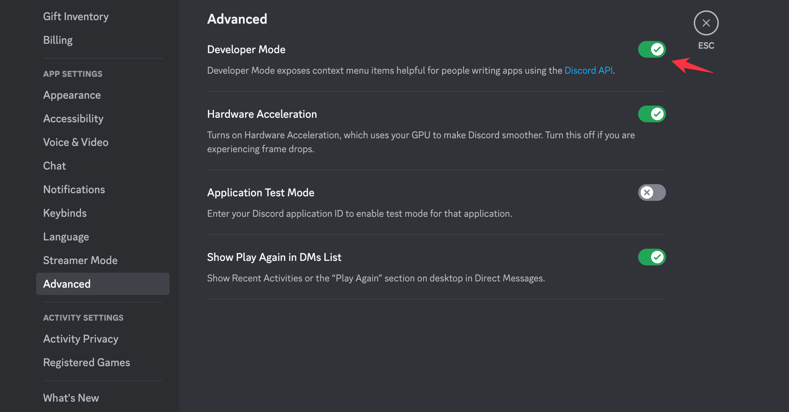

To interact with the Discord API, you'll need a secret key. Get yours on the [Discord developer portal](https://discord.com/developers/applications).

Create a Discord application by navigating to **Applications -> New Application**.

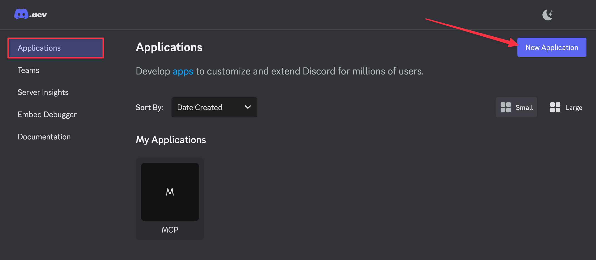

Give the application a name, accept the terms of service, and click **Create** to create the application.

Navigate to the **Bot** tab and click **Reset Token** to generate a new token.

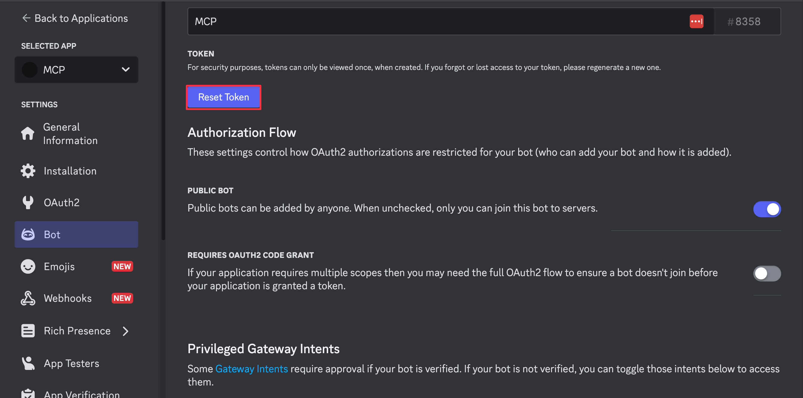

Copy and make a note of the token, as you will need to use it later.

Next, to make sure you can install the bot easily in a Discord server, you need to configure [gateway intents](https://discord.com/developers/docs/events/gateway#gateway-intents), such as the presence intent, server members intent, and message content intent. These will allow your bot to join a server, receive messages, and send messages smoothly.

On the **Bot** tab of the Discord developer portal, scroll to the **Privileged Gateway Intents** section and enable the following intents:

- Presence Intent
- Server Members Intent
- Message Content Intent

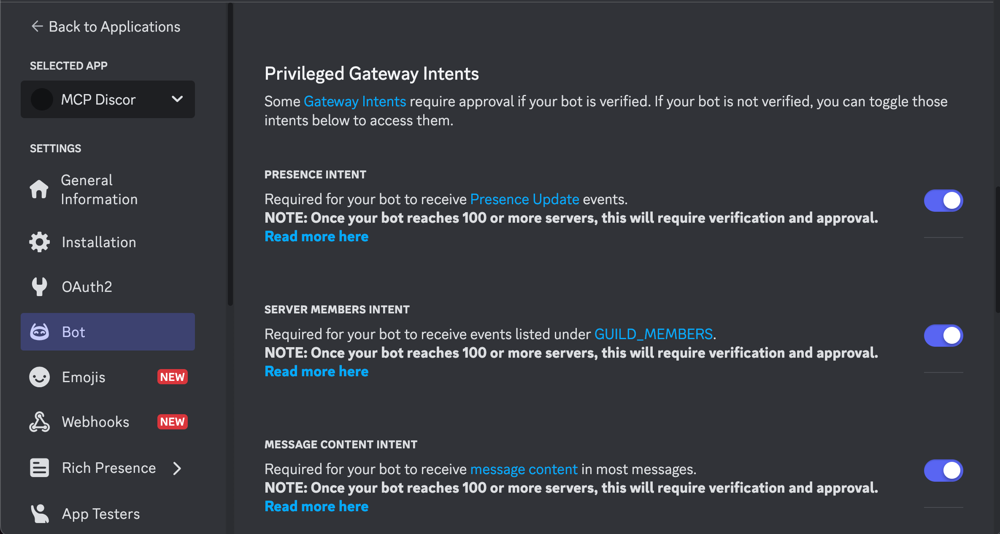

Then, navigate to the **OAuth2** tab and enable the following scopes:

- Under **Scopes**, select `bot`
- Under **Bot Permissions**, select `Administrator`
- Under **Integration type**, leave the default `Guild Install` value selected.

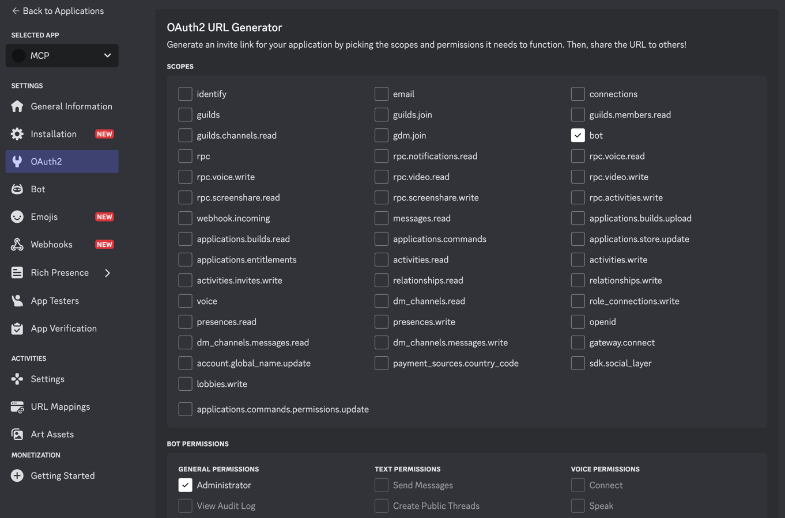

Now copy the **Generated URL** at the end of the page and paste it in a channel in your Discord server to send a message. On the sent message, click the link you pasted and you will be prompted to authorize the bot. Click **Continue**.

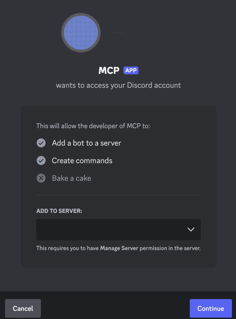

On the following screen, click **Authorize**.

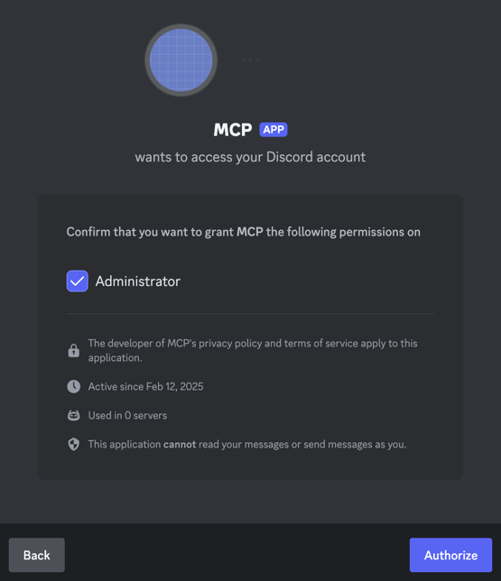

Finally, make sure you copy and save the channel IDs of the channel you want to interact with and the server. Right-click on a channel and select **Copy Channel ID**. Right-click on the server and select **Copy Server ID**.

## MCP server project configuration

### Step 1: Create a new MCP server project

We'll use uvx to create a new Python MCP server project using [MCP Create Server](https://github.com/modelcontextprotocol/create-python-server). When we built this project, the latest version was v1.0.5.

Begin by running the following command in the terminal from the directory where you want to create the project:

```bash
uvx create-mcp-server
```

You'll be presented with project-creation options:

- For "Project name", use `mcp-discord-chat`.
- For "Project description", use `MCP server for interacting with Discord`.
- You can leave the default project version and project creation location.
- When prompted to install the server for the Claude desktop app, choose `Y` for yes.

```text
? Would you like to install this server for Claude.app? Yes
✔ MCP server created successfully!
✓ Successfully added MCP server to Claude.app configuration

✅ Created project mcp-discord-chat in mcp-discord-chat
ℹ️ To install dependencies run:
   cd mcp-discord-chat
   uv sync --dev --all-extras
```

To see how this command installed the MCP server, you can take a look at the Claude app configuration file:

```bash
cat ~/Library/Application\ Support/Claude/claude_desktop_config.json
```

The file contains a list of servers that Claude can use. You should see the newly created server:

```json ~/Library/Application Support/Claude/claude_desktop_config.json
{
  "mcpServers": {
      "mcp-discord-chat": {
      "command": "uv",
      "args": [
        "--directory",
        "path-to-project/mcp-discord-chat",
        "run",
        "mcp-discord-chat"
      ]
    }
  }
}
```

Here, you can see that the Claude desktop app runs the server using the `uv` command with the path to the server's directory.

The new `mcp-discord-chat` directory contains the following files:

```text
.
├── README.md
├── pyproject.toml
└── src/
    └── mcp_discord_chat/
        ├── __init__.py
        └── server.py
```


### Step 2: Run the server in the Claude desktop app

Let's run the server in the Claude desktop app.

Open Claude and click the **🔨 hammer icon** button to open the **Available MCP Tools** dialog:

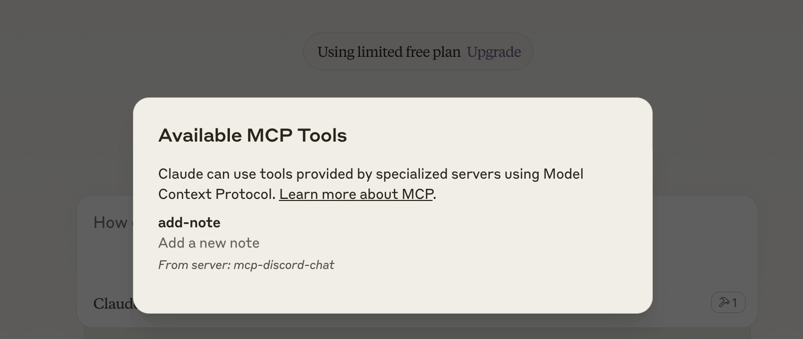

In the dialog, you can see the Discord MCP Server makes a tool called **create-note** available to Claude. Let's try it out.

Close the dialog. Type a message that implies you want to create a note and press `enter`.

We used the following message:

```
Create a note to remind me to call Grandma when I get home.
```

Claude requests permission to use a tool from the Discord MCP Server. Click **Allow for This Chat**.

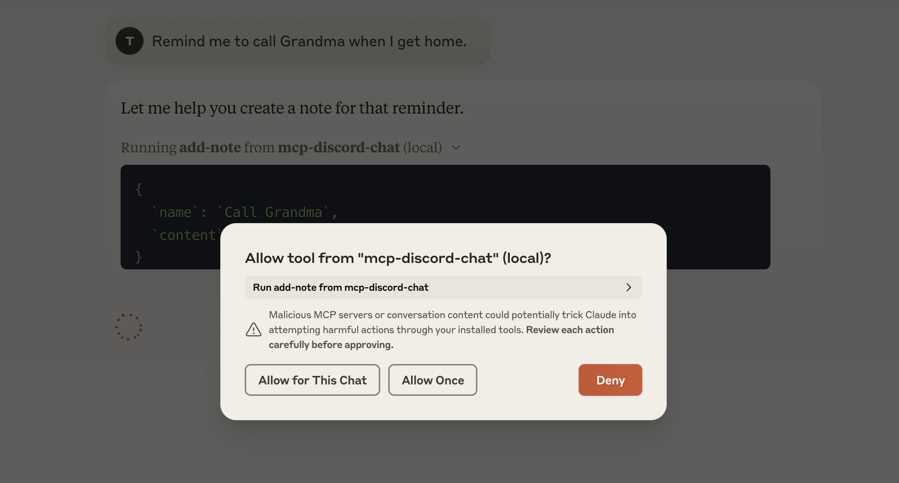

Claude shows three messages.

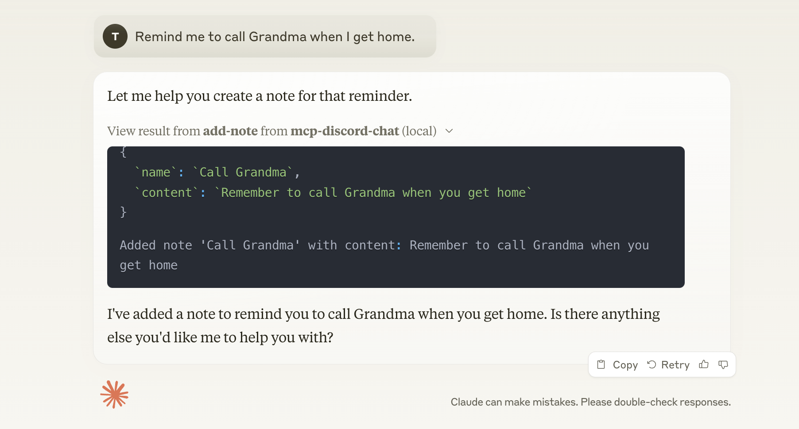

The first message appears to be the arguments Claude sent to `add-note`.

```javascript
{
  `name`: `Call Grandma`,
  `content`: `Remember to call Grandma when you get home.`
}
```

The next message looks like a response from the server:

```
Added note 'Call Grandma' with content: Remember to call Grandma when you get home
```

The final message is a response from Claude:

> I've added a note to remind you to call Grandma when you get home. Is there anything else you'd like me to help you with?

To access a created note from the chat window, open the **Share context with Claude** dialog by clicking the 🔌 **plug connection icon**.

<Callout type="info" title="Note">
If the 🔌 **plug connection icon** isn't visible, you can reveal it by hovering over the 📎 **paperclip icon** to the right of the textbox.
</Callout>

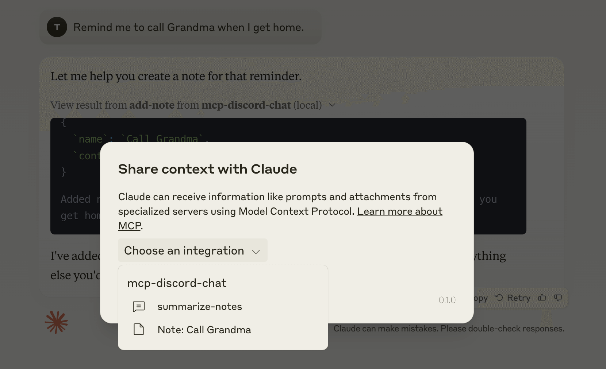

In the dialog, click **Choose an integration** and select **summarize_notes**. A new **Fill Prompts Arguments** dialog appears where you can select the style of reply. We'll enter `Be concise` but feel free to change it to your liking.

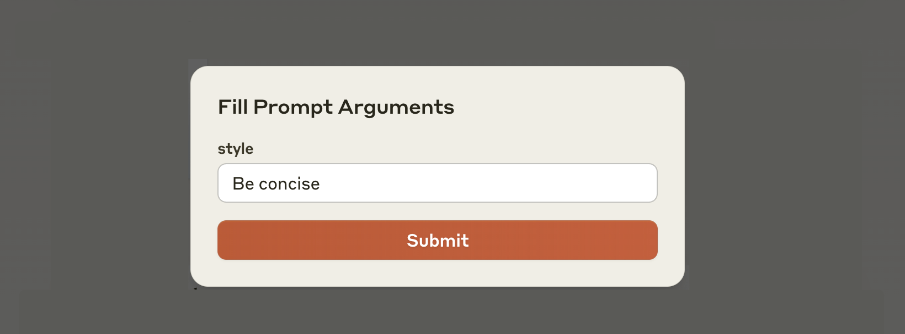

Click **Submit** and a `txt` file is attached to the chat as context. The file includes the note we just created, and a prompt asking Claude to summarize the notes.

```txt
Here are the current notes to summarize:

- Call Grandma: Remember to call Grandma when you get home.
```

Click **Send** to send a blank message with the attached `txt` file to Claude.

Claude responds to the prompt and delivers a summary of the notes.

```txt
Based on the notes, you have one reminder:
- Call Grandma when you get home
```


### Step 3: Install the Discord SDK and other Python dependencies

We want to write the code for the Discord bot, so we need to introduce some changes to the server.

We'll use discord.py from PyPI to create our Discord bot. Add the package as a dependency to the `pyproject.toml` file:

```toml pyproject.toml
dependencies = [
    "discord.py>=2.3.0",
    "mcp>=1.2.1",
    "audioop-lts; python_version >= '3.13'"
]
```

Now run the following command to install the dependencies:

```bash
uv sync --dev --all-extras
```

### Step 4: Add the Discord configuration and imports

In the `src/mcp_discord_chat/server.py` file, replace all the code with the following:

```python src/mcp_discord_chat/server.py
import os
import asyncio
import logging
from datetime import datetime
from typing import Any, List
from functools import wraps

import discord
from discord.ext import commands
from mcp.server import Server
from mcp.types import Tool, TextContent
from mcp.server.stdio import stdio_server

logging.basicConfig(level=logging.INFO)
logger = logging.getLogger("discord-mcp-server")

DISCORD_TOKEN = os.getenv("DISCORD_TOKEN")
if not DISCORD_TOKEN:
    raise ValueError("DISCORD_TOKEN environment variable is required")

intents = discord.Intents.default()
intents.message_content = True
intents.members = True
bot = commands.Bot(command_prefix="!", intents=intents)

# -----------------------------------------------------------------------------
# MCP Server Initialization
# -----------------------------------------------------------------------------
# Create an MCP server instance. The MCP (Model Context Protocol) server will
# allow external calls to registered tools (commands) in this application.
app = Server("discord-server")

# Global variable to store the Discord client instance once the bot is ready.
discord_client = None
```

This code initializes a Discord bot using discord.py and integrates custom MCP server functionality. It performs environment checks for required variables, configures logging, and sets up bot intents and command prefixes. Key steps include:

- Verifying that the `DISCORD_TOKEN` environment variable is set.
- Creating a bot instance with appropriate permissions and a command prefix.
- Initializing an MCP server instance and preparing a placeholder for the Discord client.

### Step 5: Add helper functions

The next step is to add helper functions for data formatting and repetitive tasks.

```python src/mcp_discord_chat/server.py
def format_reactions(reactions: List[dict]) -> str:
    """
    Format a list of reaction dictionaries into a human-readable string.
    Each reaction is shown as: emoji(count).
    If no reactions are present, returns "No reactions".
    """
    if not reactions:
        return "No reactions"
    return ", ".join(f"{r['emoji']}({r['count']})" for r in reactions)

def require_discord_client(func):
    """
    Decorator to ensure the Discord client is ready before executing a tool.
    Raises a RuntimeError if the client is not yet available.
    """
    @wraps(func)
    async def wrapper(*args, **kwargs):
        if not discord_client:
            raise RuntimeError("Discord client not ready")
        return await func(*args, **kwargs)
    return wrapper
```

### Step 6: Add an event handler

Now add the Discord event handler after a successful login:

```python src/mcp_discord_chat/server.py
@bot.event
async def on_ready():
    """
    Event handler called when the Discord bot successfully logs in.
    Sets the global discord_client variable and logs the bot's username.
    """
    global discord_client
    discord_client = bot
    logger.info(f"Logged in as {bot.user.name}")
```

### Step 7: Add the tools

Tools in the MCP server enable servers to expose executable functionality to clients, allowing Claude to interact with external systems according to instructions provided in the server code.

We will add three tools to:

- Read messages from a channel.
- Send messages to a channel.
- Add a reaction to a message in a channel.

```python src/mcp_discord_chat/server.py
@app.list_tools()
async def list_tools() -> List[Tool]:
    return [
        Tool(
            name="add_reaction",
            description="Add a reaction to a message",
            inputSchema={
                "type": "object",
                "properties": {
                    "channel_id": {
                        "type": "string",
                        "description": "ID of the channel containing the message",
                    },
                    "message_id": {
                        "type": "string",
                        "description": "ID of the message to react to",
                    },
                    "emoji": {
                        "type": "string",
                        "description": "Emoji to react with (Unicode or custom emoji ID)",
                    },
                },
                "required": ["channel_id", "message_id", "emoji"],
            },
        ),
        Tool(
            name="send_message",
            description="Send a message to a specific channel",
            inputSchema={
                "type": "object",
                "properties": {
                    "channel_id": {
                        "type": "string",
                        "description": "Discord channel ID where the message will be sent",
                    },
                    "content": {
                        "type": "string",
                        "description": "Content of the message to send",
                    },
                },
                "required": ["channel_id", "content"],
            },
        ),
        Tool(
            name="read_messages",
            description="Read recent messages from a channel",
            inputSchema={
                "type": "object",
                "properties": {
                    "channel_id": {
                        "type": "string",
                        "description": "Discord channel ID from which to fetch messages",
                    },
                    "limit": {
                        "type": "number",
                        "description": "Number of messages to fetch (max 100)",
                        "minimum": 1,
                        "maximum": 100,
                    },
                },
                "required": ["channel_id"],
            },
        ),
    ]
```

Each tool has a name that should be unique, a description, and an input schema.

Now that the tools are defined, we can write the dispatch function for tool calls.

```python src/mcp_discord_chat/server.py
@app.call_tool()
@require_discord_client
async def call_tool(name: str, arguments: Any) -> List[TextContent]:
    if name == "send_message":
        # Retrieve the channel and send the message with the provided content.
        channel = await discord_client.fetch_channel(int(arguments["channel_id"]))
        message = await channel.send(arguments["content"])
        return [
            TextContent(
                type="text",
                text=f"Message sent successfully. Message ID: {message.id}"
            )
        ]

    elif name == "read_messages":
        # Retrieve the channel and fetch a limited number of recent messages.
        channel = await discord_client.fetch_channel(int(arguments["channel_id"]))
        limit = min(int(arguments.get("limit", 10)), 100)
        messages = []
        async for message in channel.history(limit=limit):
            reaction_data = []
            # Iterate through reactions and collect emoji data.
            for reaction in message.reactions:
                emoji_str = (
                    str(reaction.emoji.name)
                    if hasattr(reaction.emoji, "name") and reaction.emoji.name
                    else (
                        str(reaction.emoji.id)
                        if hasattr(reaction.emoji, "id")
                        else str(reaction.emoji)
                    )
                )
                reaction_info = {"emoji": emoji_str, "count": reaction.count}
                logger.debug(f"Found reaction: {emoji_str}")
                reaction_data.append(reaction_info)
            messages.append(
                {
                    "id": str(message.id),
                    "author": str(message.author),
                    "content": message.content,
                    "timestamp": message.created_at.isoformat(),
                    "reactions": reaction_data,
                }
            )
        # Format the messages for output.
        formatted_messages = "\n".join(
            f"{m['author']} ({m['timestamp']}): {m['content']}\nReactions: {format_reactions(m['reactions'])}"
            for m in messages
        )
        return [
            TextContent(
                type="text",
                text=f"Retrieved {len(messages)} messages:\n\n{formatted_messages}"
            )
        ]

    elif name == "add_reaction":
        # Retrieve the channel and message, then add the specified reaction.
        channel = await discord_client.fetch_channel(int(arguments["channel_id"]))
        message = await channel.fetch_message(int(arguments["message_id"]))
        await message.add_reaction(arguments["emoji"])
        return [
            TextContent(
                type="text",
                text=f"Added reaction '{arguments['emoji']}' to message {message.id}"
            )
        ]

    # If the tool name is not recognized, raise an error.
    raise ValueError(f"Unknown tool: {name}")
```

When the dispatch function is called, it compares the `name` parameter to predefined tool names to ensure the correct function is executed, and then carries out the corresponding task. For example, when the dispatch function is called with `read_messages`, it retrieves a limited number of recent messages from the specified channel, processes each message to extract details such as author, content, timestamp, and reactions, and then formats these details into a readable output.

Make sure the last lines of the file look like this:

```python src/mcp_discord_chat/server.py
async def main():
    asyncio.create_task(bot.start(DISCORD_TOKEN))

    # Open a connection using the stdio server transport and run the MCP server.
    async with stdio_server() as (read_stream, write_stream):
        await app.run(read_stream, write_stream, app.create_initialization_options())

# -----------------------------------------------------------------------------
# Application Entry Point
# -----------------------------------------------------------------------------
if __name__ == "__main__":
    asyncio.run(main())
```

Finally, modify the `claude_desktop_config.json` file to include the `DISCORD_TOKEN` environment variable, to ensure it's injected when the server is running.

```json ~/Library/Application Support/Claude/claude_desktop_config.json
{
  "mcpServers": {
    "discord": {
      "command": "uv",
      "args": [
        "--directory",
        "path-to-project/mcp-discord-chat",
        "run",
        "mcp-discord-chat"
      ],
      "env": {
        "DISCORD_TOKEN": "YOUR_DISCORD_TOKEN"
      }
    }
  }
}
```


## Test the MCP Discord Chat server

Now we can test the MCP server in the Claude desktop app.

First, make sure that you have the tools listed in the application.

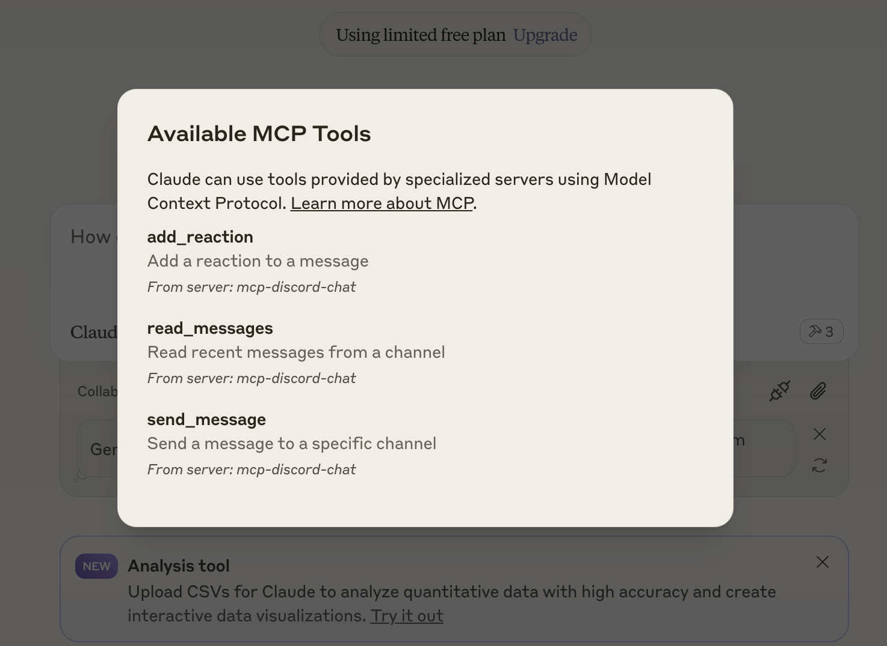

Now get the channel and server IDs from the Discord application and send the following message:

```txt
Hi! Here are the channel ID <value> and the server ID <value> for the Discord app. What is the previous message in this channel?
```

You'll get a response similar to this:

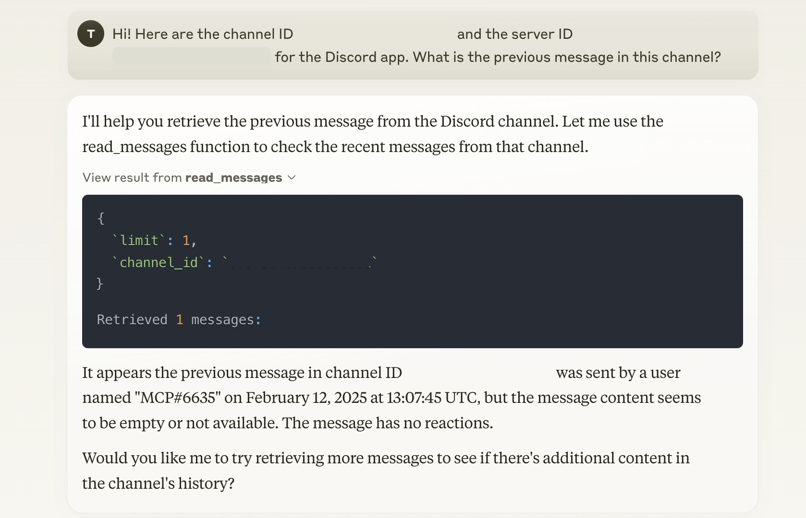

You can tell Claude to add a reaction to the message:

```txt
Add a reaction to the last message in this channel.
```

Send a message to prompt Claude to post to the channel:

```txt
Say Hi in the channel.
```

## Tips for working with MCP servers

We encountered a few stumbling blocks while building our MCP server. Here are some tips to help you avoid the same issues.

### 1. Environment variables: Pass them to your server

By default, MCP servers have limited access to environment variables. Either pass the environment variables as part of the server configuration for your MCP client or use a `.env` file in the root of your server project.

```json ~/Library/Application Support/Claude/claude_desktop_config.json
{
  "mcpServers": {
    "discord": {
      "command": "uv",
      "args": [
        "--directory",
        "path-to-project/mcp-discord-chat",
        "run",
        "mcp-discord-chat"
      ],
      "env": {
        // !focus(1:1)
        "DISCORD_TOKEN": "YOUR_DISCORD_TOKEN"
      }
    }
  }
}
```

### 2. Debugging: Beware of `STDOUT`

MCP servers communicate with clients through `stdio`. Be mindful of what you log to `STDOUT` and `STDERR`, as this output is sent to the client.

We ran into issues debugging our server because logging errors to the console caused the messages to fail.

Instead, use `console.error()` to log errors in a JavaScript environment or the logging tool provided by the MCP server SDK.

### 3. MCP clients: Our options are currently limited in number and capabilities

We tried Claude as our first MCP client, then tried a couple of others.

- [Claude](https://claude.ai/download) was the most feature-rich, but struggled with complex interactions.
- [Zed](https://zed.dev/) was the most basic, and since it doesn't support MCP tools yet (we only found out after building our server), we couldn't test our server with it.
- [Cline](https://github.com/cline/cline) was helpful, as it supports MCP tools, but it hallucinated a server name for us, which was a bit confusing. It self-corrected after the first try, though.

## Closing thoughts

This was a fun project for becoming familiar with MCP. We only used one of the many message types supported by the protocol.

New MCP servers are popping up every day, and we're excited to see what people build. We hope it takes off and becomes, as we've heard commenters wish, "the USB-C of AI integrations."


## Resources

- [Model Context Protocol](https://modelcontextprotocol.io/) - The official MCP website
- [discord.py](https://discordpy.readthedocs.io/en/stable/) - The discord.py documentation
- [Anthropic](https://anthropic.com/) - The creators of MCP and Claude
