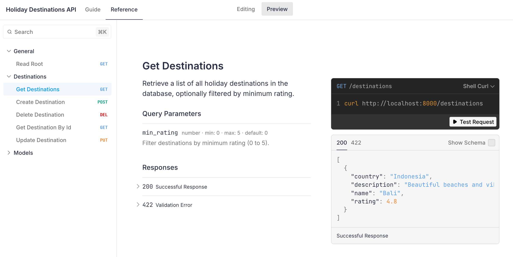
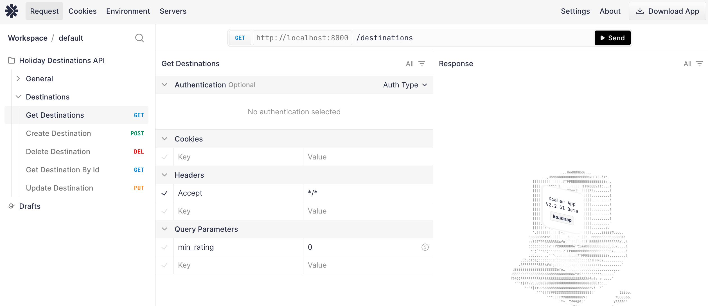
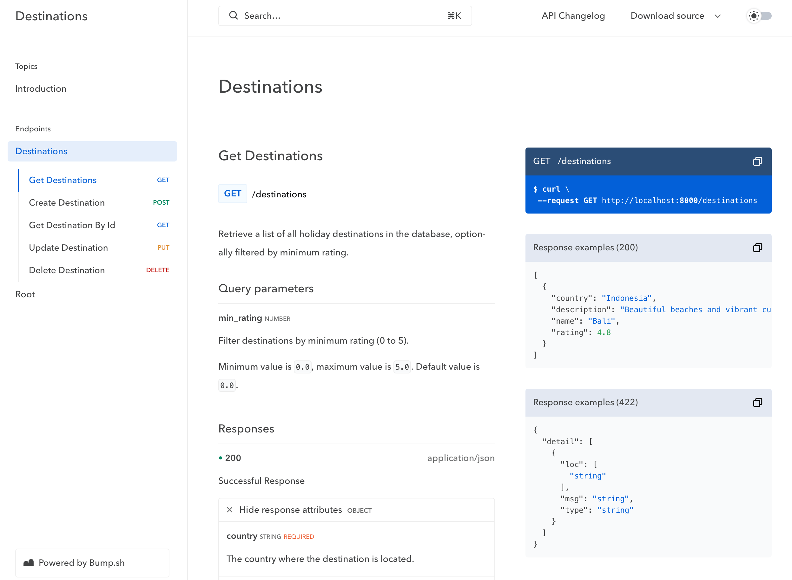
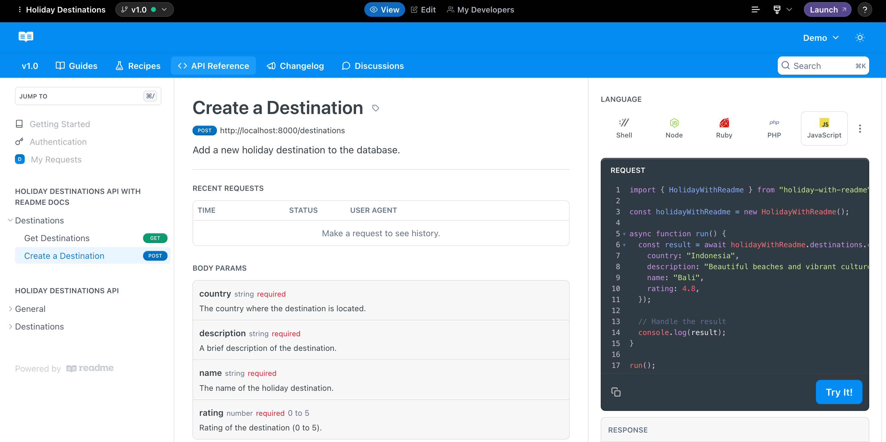
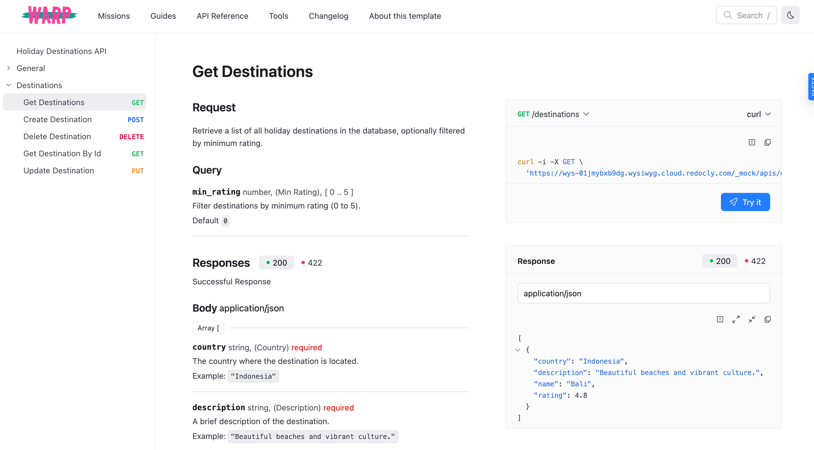

import ReviewCard from '~/features/shared/recipes/ReviewCard'
import scalar from '/public/media/product/scalar-logo-large.svg'
import mintlify from '/public/media/shared/mintlify.svg'
import bump from '/public/media/shared/bump.svg'

High-quality docs are the backbone of a positive developer experience. Whether you're building an API, an SDK, or a complex piece of software, accessible and well-structured documentation helps users adopt your product more quickly and keeps users engaged over time.

The right docs tool is indispensable, helping you organize information clearly and making it easy to update and expand your documentation as your product evolves.

As SDK providers, we have worked with users of every docs platform. In this post, we compare five popular documentation vendors: Mintlify, Scalar, Bump, ReadMe, and Redoc. We'll guide you through a simple API docs setup for each tool and share our impressions to help you decide which best suits your needs.

*Disclaimer: While we have worked extensively with every platform, **Speakeasy does have a reseller relationship with Scalar**.*

## Matching docs tools to use cases

Let's start with the highlights. The recent entrants to the docs market: Scalar, Mintlify, Bump outshine the established incumbents: Redocly, and Readme.

There are good arguments for each depending on your use case. We'll explore the strengths and weaknesses of each tool in detail later in this post, but here's the high level breakdown.

      

        <ReviewCard
          logo={scalar}
          href="https://scalar.com"
          title="Best for APIs"
          review="For the price, it's hard to beat Scalar. The platform balances impressive features like a built-in API client with a clean DX that's easy to use. It's ideal for teams that want a developer-friendly interface with a low onboarding  and maintenance cost."
          pricing={{ amount: 12, model: "seat" }}
        />
      

      

        <ReviewCard
          logo={mintlify}
          href="https://mintlify.com"
          title="Best for customization"
          review="Mintlify's extensive customization options, granular theming, and the ability to add custom React components via MDX, which is great if you need a visually refined documentation site made unique for your brand."
          pricing={{ amount: 150, model: "mo" }}
        />
      

      

        <ReviewCard
          logo={bump}
          href="https://bump.sh"
          title="Best for massive APIs"
          review="Bump isn't as sleek as Scalar and isn't as pretty as Mintlify, but its focus on performance and versioning makes it a standout for teams managing large, complex APIs. Its rapid load times, chunked documentation delivery, and robust version management ensure a smooth experience even when handling thousands of endpoints."
          pricing={{ amount: 265, model: "mo" }}
        />
      

    

### Feature Matrix

<Table 
  data={[
    { feature: "OpenAPI support", mintlify: "✅", scalar: "✅", bump: "✅", readme: "✅", redoc: "✅" },
    { feature: "Automated API reference generation", mintlify: "✅", scalar: "✅", bump: "✅", readme: "✅", redoc: "✅" },
    { feature: "x-codeSamples", mintlify: "✅", scalar: "✅", bump: "✅", readme: "❌", redoc: "✅" },
    { feature: "API client", mintlify: "Limited", scalar: "✅ Full-featured (Postman-style)", bump: "❌", readme: "Limited", redoc: "❌" },
    { feature: "Custom branding", mintlify: "✅", scalar: "✅", bump: "✅", readme: "Limited (online editor, less granular control)", redoc: "✅ Full control (CSS or JavaScript customization)" },
    { feature: "Collab tools", mintlify: "❌", scalar: "✅", bump: "✅", readme: "❌", redoc: "✅" },
    { feature: "Performance", mintlify: "❌", scalar: "❌", bump: "✅", readme: "❌", redoc: "✅" },
    { feature: "CI/CD", mintlify: "❌", scalar: "❌", bump: "✅", readme: "❌", redoc: "✅" },
    { feature: "Open source", mintlify: "❌", scalar: "✅", bump: "❌", readme: "❌", redoc: "✅" }
  ]}
  columns={[
    { key: "feature", header: "Feature" },
    { key: "mintlify", header: "Mintlify" },
    { key: "scalar", header: "Scalar" },
    { key: "bump", header: "Bump" },
    { key: "readme", header: "ReadMe" },
    { key: "redoc", header: "Redoc" }
  ]}
/>

---

## Evaluation criteria

We focus on the following key aspects that matter most to development teams:

- **One special feature:** What's the singular feature that sets each tool apart from the others.
- **Ease of use:** How quickly you can get started, how steep the learning curve is, and what automation features are available to speed up the workflow.
- **Theming & customization:** How much control you have over the look and feel of docs, including theming options, layout flexibility, and the ability to match your brand identity.
- **Developer experience:** How well the tool integrates with existing tools, particularly its CI/CD support and version control capabilities.
- **Support & pricing:** The boring, but important things to consider when choosing a docs tool.

---

### Scalar: Interactive API docs that developers love

    

#### One special feature: standalone API client

What truly sets Scalar apart is that its API client isn't just embedded in the documentation—developers can download it as a standalone application for local development. It's like Postman++, transforming documentation from mere reference material into an actual development tool that supports the entire workflow. This creates a unique bridge between documentation and active development that other platforms don't offer.

#### Ease of Use

Setup is straightforward with a simple "New Project" flow and WYSIWYG editor. The platform automatically processes OpenAPI documents to generate an interactive reference without requiring additional configuration.

#### Theming & customization

Scalar offers a set of clean unpinionated default themes with customization available to create branded documentation. Users can also upload their own custom CSS and JavaScript files to fully customize the look and feel of their documentation. The only major limitation is the lack of support for MDX for those companies that want to embed custom components within their documentation.

#### Developer experience

One thing that really sets Scalar apart is its array of API framework integrations. For code-first organizations that use frameworks like Django, FastAPI, and Express, Scalar provides seamless integration. Developers can generate documentation directly from their codebase with little additional configuration.If you host your OpenAPI spec at a static URL, Scalar also has automatic updates via URL fetching that makes updates frictionless.

The only limitation is for organizations with a complex release process. For these organizations, Scalar offers a CLI which you could use to create a custom CI/CD pipeline, but nothing off the shelf for previewing doc builds.

#### Support and pricing

You won't find better in terms of product for the price. Scalar offers three subscription tiers:

- **Free:** Full features for public APIs
- **Team ($12/user/month):** Private docs, team features, upcoming Speakeasy integration
- **Enterprise (custom pricing):** Advanced security and support

---

### Mintlify: Seriously beautiful docs

import mintlify_openapi_docs_video from "@/content/blog/choosing-a-docs-vendor/assets/mintlify/mintlify-openapi-docs.webm";

  {/* eslint-disable-next-line jsx-a11y/media-has-caption */}
  <video controls={true} loop={false} autoPlay={false} width="100%">
    <source src={mintlify_openapi_docs_video} type="video/webm" />
  </video>

#### One Special Feature: AI-ready

Mintlify is the provider best equipped to make your API accessible to LLMs. They generate vanilla `.md` files for every documentation page, and automatically generate an `llms.txt`. That makes it easy for LLMs to parse and understand your API documentation.

#### Ease of Use

Onboarding is exceptionally smooth, with a guided process from signup to repository creation. The local development workflow using the Mintlify CLI provides immediate feedback through localhost previews.

Mintlify's OpenAPI integration is less robust than other documentation tools, with some opaque error messages, and incorrect validation failures. But these can usually be worked through. IN part this is because Mintlify is a comprehensive docs solution first, and an API reference solution second.

#### Theming & customization

This is where Mintlify shines. It has sleek default themes, but also offers extensive customization options for:

- Styling (primary colors, theming)
- Navigation structure
- Content layouts

Plus, it supports MDX. That means that you can create custom components and embed them directly into your documentation.

#### Developer Experience

Mintlify embraces developer-friendly workflows with:

- Git-based content management
- Local development with live previews
- Integration with external services (analytics, SDK generators,etc.)

Mintlify also offers a great developer experience for teams creating narrative-based documentation in addition to references.

#### Support and pricing

Mintlify is a more expensive offering with three subscription tiers:

- **Free:** For individual hobbyists
- **Pro: $150/month** - For small teams and startups
- **Growth: $550/month** - For growing companies
- **Enterprise: custom pricing** - Custom built packages based on your needs

---

### Bump: Built for scale

    

#### One Special Feature: Performance at Scale

Bump's exceptional handling of massive API specifications sets it apart from competitors. Our evaluation includes a real-world test with Twilio's OpenAPI document containing over 900 endpoints and 2000+ schema definitions. While other platforms "struggled or crashed with this spec, Bump loaded it in under three seconds and maintained smooth scrolling and instant search results." While not relevant to most companies,this performance advantage becomes valuable as APIs grow in complexity, offering a solution that doesn't degrade with scale.

#### Ease of Use

Setup is simple, with a streamlined process that jumps straight to API documentation without templates or complex configuration. OpenAPI parsing is very thorough and accurate, we didn't encounter any unexpected issues. From a styling perspective, it doesn't take you as close to "production-ready" as some of the other platforms, but it also doesn't require extensive customization or configuration before you see output.

#### Theming & customization

Some would argue that clarity is better than polish when it comes to docs. And that's true, but why not have both? Compared with Mintlify & Scalar, docs made on Bump are sinply not as "sexy". You can do the basics like: logo & brand colors, custom CSS, navbar. But docs tend to retain a very Bump-like feel to them. Appearance is a nice to have compared with performance, which is why Bump is still the best choice for companies with huge API surface areas.

#### Developer experience

Bump lacks some of the slick polish that Mintlify and Scalar offer. But the core functionality is undoubtably solid.

And one place where Bump outperforms is when it comes to versioning. Bump allows you to create multiple versions of your API documentation, making it easy to manage changes and updates. Again, a feature that shines for enterprise's with gnarly API surface areas.

#### Support and pricing

Bump has a slightly steep payment model:

- **Basic: free:** - 1 user
- **Standard: $265/month** - For small teams
- **Enterprise: custom pricing** - SSO, custom branding, custom domain, custom integrations

---

### ReadMe: Simple for Non-Technical Teams, Limited for Developers

    

#### One special feature: One tool for the whole team

ReadMe's standout capability being accessible to team members without technical expertise. While other platforms assume users have familiarity with Git, local development environments, or code-based workflows, ReadMe provides a completely web-based experience with visual editing tools that feel familiar to anyone comfortable with basic web interfaces. This empowers non-technical marketing teams, technical writers, or product managers to take ownership of documentation without depending on engineering resources, which can be valuable in organizations where resources are constrained.

However, this feature highlights the fundamental trade-off that ReadMe makes: simplicity and accessibility for non-technical users at the expense of the automation, version control, and workflow integration that developers expect in modern documentation tools. The platform clearly prioritizes lowering the barrier to entry over providing the robust technical features that development teams need for sustainable documentation practices.

#### Theming and customization

ReadMe has been around for a while, so maybe it's not surprising that some of its default themes don't have the sparkle when compared to newer offerings like Scalar and Mintify. But that's largely a result of being a victim of their own success in the docs arena. The pro is that users will be intimately familiar with a Readme docsite, the con is that it's harder to feel unique.

You can add [custom CSS and JavaScript](https://docs.readme.com/main/docs/custom-css-and-javascript) using ReadMe's online editor. This doesn't provide the same level of control as editing the source files directly, but it's a quick way to make small tweaks.

#### Developer experience

As mentioned, ReadMe's most significant weakness is for technical teams. We couldn't find a way to programmatically update the API reference when our OpenAPI document changes. Instead, updated documents need to be manually uploaded each time. This creates a disconnection between code and documentation that introduces multiple risks:

- Documentation easily becomes outdated as APIs evolve
- No integration with continuous integration/deployment pipelines
- Manual processes introduce opportunities for human error
- Potential bottlenecks when documentation updates depend on specific team members with access

For non-technical teams maintaining stable APIs with infrequent changes, this limitation might be acceptable. For development teams working in agile environments with frequent iterations, this manual approach creates substantial maintenance overhead and reliability concerns.

#### Support and pricing

Readme has plans for companies of different sizes:

- **Free:** Create a foundation using your API reference.
- **Startup: $99/month** - For small teams who want to build out their docs and create a community.
- **Business: $399/month** - For multi-role teams who want advanced styling and basic management tools.
- **Enterprise: custom pricing** - For organizations looking to build scalable docs with multi-project management and security needs.

---

### Redocly: Tried & tested

    

### One special feature: ecosystem

Redoc's standout advantage is its deep integration across the broader API development ecosystem. Unlike newer platforms that require specific adaptations or plugins, Redoc has become something of a standard that many frameworks support natively. Tools like FastAPI, Django, ASP.NET Core, and others often include built-in Redoc support, allowing teams to generate documentation with minimal additional configuration. This widespread adoption means teams can often implement Redoc without disrupting existing workflows or adding new dependencies.

#### Ease of Use

Setting up Redoc feels like returning to a tool you've used before — recognizable but showing its age. The IDE-style dashboard provides an environment that developers will find instantly familiar, with its project structure sidebar, editor pane, and preview panel arrangement. However, this familiarity comes with a dated user experience that lacks the polish of newer competitors.

#### Theming & customization

The familiarity and ecosystem integrations come at a cost. The documentation produced by Redocly tends to have a utilitarian aesthetic that lacks the visual appeal of newer platforms like Mintlify. The interface feels somewhat dated compared to modern web applications, with a functional but not particularly inspiring presentation. For teams prioritizing developer experience and modern design aesthetics, this represents a trade-off.

You can customize nearly everything: typography, spacing, layout, color schemes, code blocks, but you're starting from behind relative to the look and feel of newer platforms. So you'll need to put in more effort to achieve a modern polished look.

#### Developer experience

Redoc's integration with development workflows represents its most enduring strength. The platform offers several approaches to keeping documentation synchronized with code:

- Git integration for automatic rebuilds
- API sync for periodic updates
- CLI workflow for local development

#### Support and pricing

Redocly offers three subscription tiers:

- **Pro: $10/user/month** 1 project
- **Enterprise: $24/user/month** - Advanced security and support
- **Enterprise+ (custom pricing)** - Premium support and advanced features

---

## Wrapping up

Each of the five documentation vendors excels in different areas:

- **Scalar** is a great all-rounder for developer-focused teams who want interactive documentation with powerful testing tools.
- **Bump** optimizes performance for large APIs, making it ideal when reliability and speed are paramount.
- **Mintlify** offers superior customization, making it perfect for projects where visual and functional control is key.
- **ReadMe** remains a solid choice for teams that value a quick and easy setup over deeper automation and customization.
- **ReDoc** is a popular choice for teams that just want a simple, functional documentation platform.

Your choice of docs tool will depend on your team's priorities, but whichever platform you choose, Speakeasy's integration capabilities can enhance your API documentation, keeping it robust and developer-friendly.
