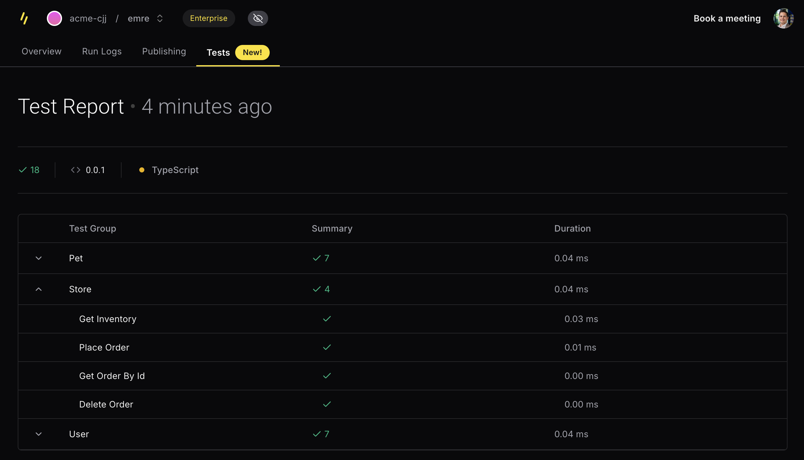
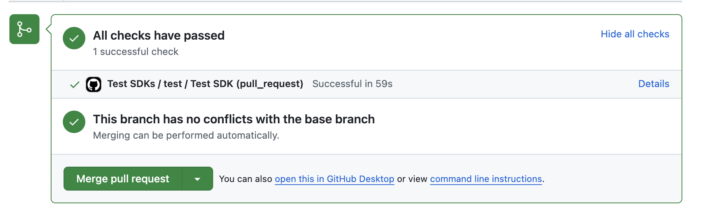
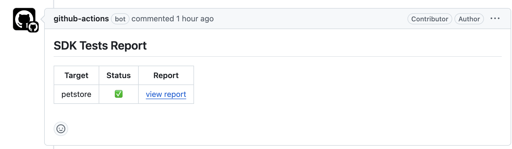

Today we're excited to announce the enhanced version of **SDK Testing**, a powerful addition to the Speakeasy Platform that transforms how you validate client libraries for your APIs. SDK Testing now provides comprehensive validation for SDKs in Go, TypeScript, and Python, with a focus on developer experience and efficiency.

### The Hidden Cost of SDK Testing

For API providers, maintaining reliable client libraries comes with significant challenges:

-   **Manual SDK testing drains developer resources** with repetitive, error-prone tasks
-   **API evolution breaks test synchronization**, leading to outdated validation
-   **Breaking changes often reach customers** before they're caught in testing
-   **Complex API workflows** require sophisticated test sequences that are difficult to maintain

Without robust testing, you risk developer frustration, reduced API adoption, and a surge in support issues. Our enhanced SDK Testing directly addresses these pain points.

### Comprehensive SDK Testing Solution

Speakeasy SDK Testing approaches this problem holistically. We don't just generate the test code -- we create the entire testing environment including mock servers and realistic test data.

### Key Features

-   **Auto-generated tests from OpenAPI specs** with rich field coverage based on your schema definitions
-   **Zero-config mock servers** that simulate your API behavior without connecting to backend systems
-   **Example-aware test generation** that uses your OpenAPI examples or creates realistic test data
-   **GitHub Actions integration** for continuous validation on every PR
-   **Language-specific test implementations** that follow idiomatic patterns for each language
-   **Automatically updated tests** that evolve with your API changes
-   **Real server testing** for validating against actual API endpoints
-   **Multi-operation test workflows** using the [Arazzo specification](https://www.speakeasy.com/openapi/arazzo) for complex scenarios
-   **End-to-end validation** across entire user journeys

### Native Test Generation

Tests are generated in your favorite language's native testing framework ([pytest](https://docs.pytest.org/en/stable/) for Python, [vitest](https://vitest.dev/) for TypeScript, etc.), ensuring they integrate seamlessly with your existing development workflow. We know that debugging impenetrable auto-generated tests is a nightmare, so we've put a lot of work into making our generated tests look and feel like they were written by your team.

<CodeWithTabs>

```ts !!tabs users.test.ts
test("Users Create User", async () => {
  const petstore = new Petstore({
    serverURL: process.env["TEST_SERVER_URL"] ?? "http://localhost:18080",
    httpClient: createTestHTTPClient("createUser"),
    apiKey: process.env["PETSTORE_API_KEY"] ?? "",
  });
  const result = await petstore.users.create({
    id: 10,
    username: "theUser",
    firstName: "John",
    lastName: "James",
    email: "john@email.com",
    password: "12345",
    phone: "12345",
    userStatus: 1,
  });
  expect(result).toBeDefined();
  expect(result).toEqual({
    id: 10,
    username: "theUser",
    firstName: "John",
    lastName: "James",
    email: "john@email.com",
    password: "12345",
    phone: "12345",
    userStatus: 1,
  });
});
```

```python !!tabs test_user_sdk.py
def test_user_sdk_create_user():
    with Petstore(
        server_url=os.getenv("TEST_SERVER_URL", "http://localhost:18080"),
        client=create_test_http_client("createUser"),
        api_key="<YOUR_API_KEY_HERE>",
    ) as s:
        assert s is not None

        res = s.user.create_user(
            request={
                "id": 10,
                "username": "theUser",
                "first_name": "John",
                "last_name": "James",
                "email": "john@email.com",
                "password": "12345",
                "phone": "12345",
                "user_status": 1,
            }
        )
        assert res is not None
        assert res == petstore.User(
            id=10,
            username="theUser",
            first_name="John",
            last_name="James",
            email="john@email.com",
            password="12345",
            phone="12345",
            user_status=1,
        )
```

```go !!tabs user_test.go
func TestUser_CreateUser(t *testing.T) {
	s := petstoresdk.New(
		petstoresdk.WithServerURL(utils.GetEnv("TEST_SERVER_URL", "http://localhost:18080")),
		petstoresdk.WithClient(createTestHTTPClient("createUser")),
		petstoresdk.WithSecurity("<YOUR_API_KEY_HERE>"),
	)

	ctx := context.Background()
	res, err := s.User.CreateUser(ctx, &components.User{
		ID:         petstoresdk.Int64(10),
		Username:   petstoresdk.String("theUser"),
		FirstName:  petstoresdk.String("John"),
		LastName:   petstoresdk.String("James"),
		Email:      petstoresdk.String("john@email.com"),
		Password:   petstoresdk.String("12345"),
		Phone:      petstoresdk.String("12345"),
		UserStatus: petstoresdk.Int(1),
	})
	require.NoError(t, err)
	assert.Equal(t, 200, res.HTTPMeta.Response.StatusCode)
	assert.NotNil(t, res.User)
	assert.Equal(t, &components.User{
		ID:         petstoresdk.Int64(10),
		Username:   petstoresdk.String("theUser"),
		FirstName:  petstoresdk.String("John"),
		LastName:   petstoresdk.String("James"),
		Email:      petstoresdk.String("john@email.com"),
		Password:   petstoresdk.String("12345"),
		Phone:      petstoresdk.String("12345"),
		UserStatus: petstoresdk.Int(1),
	}, res.User)
}
```

</CodeWithTabs>


### Technical Implementation

The SDK Testing framework operates through a streamlined architecture:

1.  **Test bootstrapping**: The system analyzes your OpenAPI document and generates a `.speakeasy/tests.arazzo.yaml` file containing test workflows
2.  **Mock server generation**: A language-specific mock server is created based on your API specification
3.  **Test execution**: Tests run against the mock (or real) server, validating request/response handling
4.  **Result aggregation**: Test outcomes are compiled into detailed reports

Each test verifies critical aspects of SDK functionality:

-   Correct request formation (headers, path parameters, query strings, etc.)
-   Proper serialization and deserialization of complex objects
-   Accurate response handling and type conversions
-   Graceful error management

## End-to-End Testing with Arazzo

Beyond simple contract testing, we're introducing end-to-end testing capabilities powered by the [Arazzo specification](https://www.speakeasy.com/openapi/arazzo). This allows you to validate complex workflows across multiple API endpoints with data dependencies between steps.

### What is Arazzo?

Arazzo is a simple, human-readable specification for defining API workflows. It enables you to create rich tests that can:

-   Test sequences of multiple operations with dependencies
-   Extract data from responses to use in subsequent requests
-   Validate complex success criteria across operations
-   Test against both mock servers and real API endpoints
-   Configure setup and teardown routines for complex scenarios

### Example: User Lifecycle Testing

Here's a simplified example of an Arazzo workflow that tests the complete lifecycle of a user resource:

```yaml
arazzo: 1.0.0
workflows:
  - workflowId: user-lifecycle
    steps:
      - stepId: create
        operationId: createUser
        requestBody:
          contentType: application/json
          payload: {
            "email": "user@example.com",
            "first_name": "Test",
            "last_name": "User"
          }
        successCriteria:
          - condition: $statusCode == 200
        outputs:
          id: $response.body#/id

      - stepId: get
        operationId: getUser
        parameters:
          - name: id
            in: path
            value: $steps.create.outputs.id
        successCriteria:
          - condition: $statusCode == 200

      - stepId: update
        operationId: updateUser
        parameters:
          - name: id
            in: path
            value: $steps.create.outputs.id
        requestBody:
          contentType: application/json
          payload: $steps.get.outputs.user
          replacements:
            - target: /email
              value: "updated@example.com"
        successCriteria:
          - condition: $statusCode == 200

      - stepId: delete
        operationId: deleteUser
        parameters:
          - name: id
            in: path
            value: $steps.create.outputs.id
        successCriteria:
          - condition: $statusCode == 200

```

This workflow will automatically generate tests that:

1.  Create a new user
2.  Retrieve the user by ID
3.  Update the user's information
4.  Delete the user

The tests share data between steps (like the user ID) and verify expected responses at each stage.

## ⚡ Getting Started in Three Simple Steps

1️⃣ **Generate tests** with `speakeasy configure tests`\
This will enable test generation in your configuration and create a `.speakeasy/tests.arazzo.yaml` file with default tests for all operations in your OpenAPI document.

import configure from "@/content/blog/release-sdk-testing/assets/changelog-2025-03-06-configure.mp4";

<div className="mt-5 flex justify-center">
  <video
    controls={false}
    loop={true}
    autoPlay={true}
    muted={true}
    width="90%"
    title="Configure tests"
  >
    <source src={configure} type="video/mp4" />
  </video>
</div>

2️⃣ **Run tests locally or in CI/CD** with `speakeasy test`\
This will run all tests against a mock server, validating your SDK's functionality without requiring a real backend.

import test from "@/content/blog/release-sdk-testing/assets/changelog-2025-03-06-test.mp4";

<div className="mt-5 flex justify-center">
  <video
    controls={false}
    loop={true}
    autoPlay={true}
    muted={true}
    width="90%"
    title="Run tests"
  >
    <source src={test} type="video/mp4" />
  </video>
</div>

3️⃣ **View reports** in the Speakeasy dashboard for insights.



## Advanced Usage

### Customizing Tests

You can customize tests by modifying the `.speakeasy/tests.arazzo.yaml` file. Some common customizations include:

-   **Grouping tests**: Use [`x-speakeasy-test-group`](/docs/customize-testing/customizing-sdk-tests#grouping-tests) to organize tests into logical file groupings
-   **Target-specific tests**: Use [`x-speakeasy-test-targets`](/docs/customize-testing/customizing-sdk-tests#generate-tests-only-for-specific-targets) to generate tests only for specific language targets
-   **Disabling tests for operations**: Add [`x-speakeasy-test: false`](/docs/customize-testing/customizing-sdk-tests#disable-auto-generation-of-tests-for-specific-operations) in your OpenAPI spec for operations you don't want to test

### Testing Against Real APIs

SDK Tests can be configured to run against your actual API endpoints instead of mock servers:

- **Configuring server URLs**: Use [`x-speakeasy-test-server`](/docs/api-contract-tests#configuring-an-api-to-test-against) to specify real API endpoints
- **Security credentials**: Add [`x-speakeasy-test-security`](/docs/api-contract-tests#configuring-security-credentials-for-contract-tests) to authenticate with your API
- **Environment variables**: Use [`x-env`](/docs/api-contract-tests#configuring-environment-variable-provided-values-for-contract-tests) syntax to inject environment variables into tests

### GitHub Actions Integration

Run your tests automatically on every pull request with our out-of-the-box GitHub Actions workflow:





## Getting Started

Ready to automate your API testing?

SDK Testing is available today. You can generate tests in TypeScript, Python, and Go today, with more languages coming soon.  [Sign up now](https://app.speakeasy.com/) or check out our [documentation](https://speakeasy.com/docs/testing) to learn more.
