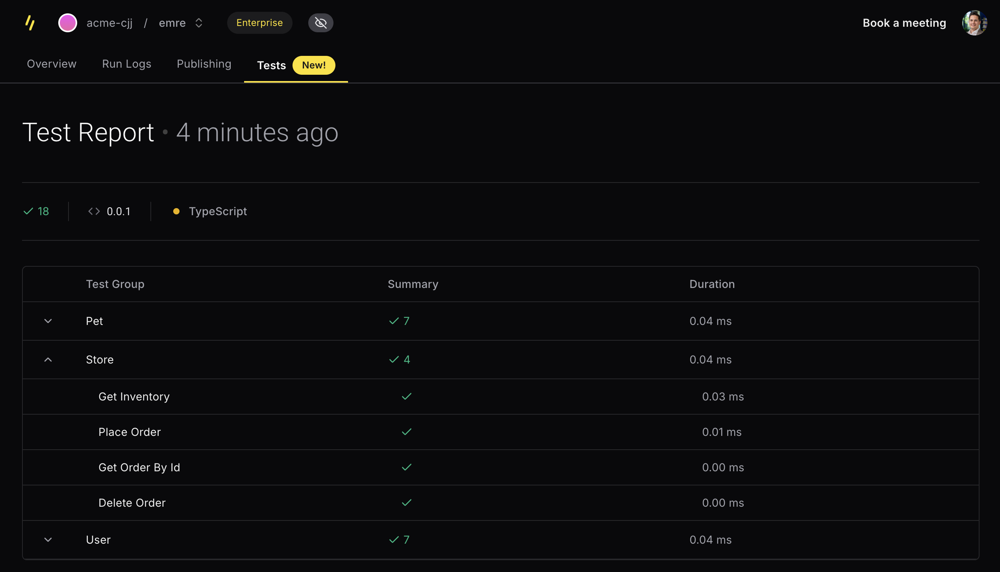

We’ve made SDK Testing more powerful with real server validation, GitHub integration, and multi-operation workflows. Plus, every TypeScript SDK now includes an MCP server, making your API instantly accessible to AI-powered tools like Claude, Cursor, Zed and many other AI applications*.

Let’s dive into what’s new!

## 🧪 More Powerful SDK Testing

We've enhanced our SDK Testing capabilities to help API providers maintain reliable client libraries with less effort. Our revamped SDK Testing now provides comprehensive validation for SDKs in Go, TypeScript, and Python.

### ✨ Key Highlights

- **Auto-generated tests from OpenAPI specs** with rich field coverage based on your schema definitions
- **Zero-config mock servers** that simulate your API behavior without connecting to backend systems
- **Real server testing** for validating against actual API endpoints
- **Multi-operation test workflows** using the Arazzo specification for complex scenarios
- **GitHub Actions integration** for continuous validation on every PR

🔗 [**Read the Full SDK Testing Release Post**](https://www.speakeasy.com/post/release-sdk-testing) for in-depth details on implementation, examples, and advanced usage.

### ⚡ Getting Started in Three Simple Steps

1️⃣ **Generate tests** with `speakeasy configure tests`

import configure from "@/content/changelog/changelog-2025-03-06/assets/changelog-2025-03-06-configure.mp4";

<div className="mt-5 flex justify-center">
  <video
    controls={false}
    loop={true}
    autoPlay={true}
    muted={true}
    width="90%"
    title="Configure tests"
  >
    <source src={configure} type="video/mp4" />
  </video>
</div>

2️⃣ **Run tests locally or in CI/CD** with `speakeasy test`

import test from "@/content/changelog/changelog-2025-03-06/assets/changelog-2025-03-06-test.mp4";

<div className="mt-5 flex justify-center">
  <video
    controls={false}
    loop={true}
    autoPlay={true}
    muted={true}
    width="90%"
    title="Run tests"
  >
    <source src={test} type="video/mp4" />
  </video>
</div>

3️⃣ **View reports** in the Speakeasy dashboard for insights.



🔗 [**Read the full SDK Testing release post**](https://www.speakeasy.com/post/release-sdk-testing) for in-depth details on implementation, examples, and advanced usage.

---

## 🤖 MCP Server Generation: AI-Ready APIs, No Extra Work

Two weeks ago, we launched MCP Server Generation, and the response has been incredible! We've seen strong adoption across the community, with great feedback from developers who have integrated MCP servers into their APIs.

### What is MCP?

Model Context Protocol (MCP) is an open standard from Anthropic that enables secure, two-way connections between APIs and AI-powered tools like Claude, Cursor, and Zed.

Think of MCP as a Rosetta Stone for your APIs—allowing AI agents to instantly understand and interact with your services without custom integrations or deciphering complex documentation.

### 🚀 What's New?

Every TypeScript SDK generated by Speakeasy now includes an MCP server that:

-   **Acts as a thin wrapper** around your existing TypeScript SDK
-   **Generates a tool for each SDK method** so AI agents can discover and use them
-   **Uses your SDK's Zod schemas** to give agents an accurate picture of request formats
-   **Supports customization** via OpenAPI extensions to control tool names and descriptions
-   **Includes scoping capabilities** to tag and control which operations are available to AI agents

The generated MCP server structure looks like this:

```yaml bluesky-ts/src/mcp-server
├── tools
│   ├── accountDelete.ts
│   ├── accountExportData.ts
│   ├── accountsGetInviteCodes.ts
│   ├── actorGetSuggestions.ts
│   └── ...
├── build.mts
├── mcp-server.ts
├── resources.ts
├── server.ts
├── shared.ts
└── tools.ts
```

Watch Claude using Dub's MCP server to create a shortlink in real-time:

import dub_demo from "@/content/changelog/changelog-2025-03-06/assets/dub-mcp-demo.mp4";

<div className="mt-5 flex justify-center">
  <video
    controls={false}
    loop={true}
    autoPlay={true}
    muted={true}
    width="90%"
    title="Claude using MCP to create a Dub shortlink"
  >
    <source src={dub_demo} type="video/mp4" />
  </video>
</div>

### ⚡ Getting Started

With MCP servers now included in every TypeScript SDK:

-   **AI agents can instantly interact** with your API
-   **No extra setup is needed**-just merge the PR and run the server
-   **Launch with scopes** to control which operations are available:

    ```
    npx your-sdk mcp start --scope read

    ```

### 📢 Customers Already Using MCP Servers

Shoutout to [**Dub**](https://github.com/dubinc/dub-ts)**,** [**Polar**](https://github.com/polarsource/polar-js)**,** [**Hathora**](https://github.com/hathora/cloud-sdk-typescript)**,** [**Novu**](https://github.com/novuhq/novu-ts)**,** [**Acuvity**](https://github.com/acuvity/acuvity-ts) for being among the first to generate their MCP servers! 🚀

🔗 [**Learn More About MCP Server Generation**](https://www.speakeasy.com/docs/customize/typescript/model-context-protocol)

🔗 [**Read the Full Release Post**](https://www.speakeasy.com/post/release-model-context-protocol)

---

## 🛠️ New Features and Bug Fixes 🐛

<Callout title="NOTE" variant="info">
  Based on the most recent CLI version: [**Speakeasy v1.510.0**](https://github.com/speakeasy-api/speakeasy/releases/tag/v1.510.0)
</Callout>

**Platform**\
🐛 **Fix:** Prevented compilation errors with naming in various targets due to special characters in operationId.\
🐝 **Feat:** Improved inline schema naming to refine name resolution and reduce ambiguities.\
🐝 **Feat:** Added --env CLI flag for passing environment variables to MCP servers.\
🐝 **Feat:** Improved security and global authentication handling in MCP servers.

**Python**\
🐝 **Feat:** Implemented TYPE_CHECKING safeguards to properly handle circular dependencies in Pydantic models.

**Ruby**\
🐛 **Fix:** Removed extraneous config_server and config_server_url methods in SDK class.\
🐝 **Feat:** Added global security flattening to streamline authentication via constructor parameters.\
🐝 **Feat:** Refactored Ruby serializer into a standalone module for better maintainability.

**TypeScript**\
🐝 **Feat:** Switched to jsonpath-rfc9535 for RFC9535-compliant JSONPath handling, improving compatibility with Next.js and SWC.\
🐝 **Feat:** Introduced Model Context Protocol (MCP) servers for hosting SDK functions as callable tools.

**Terraform**\
🐝 **Feat:** Added support for **map of array types** (e.g., map of list of strings).\
🐝 **Feat:** Enabled proper rendering of **array of array types** (e.g., list of list of floats).\
🐝 **Feat:** Added support for **array of empty objects** to improve Terraform schema handling.\
🐝 **Feat:** Enabled support for **maps of double, float, int32, and number types**.\
🐛 **Fix:** Properly rendered union type examples with stable single selection.\
🐛 **Fix:** Prevented OAuth authentication errors when other API security options are available.\
🐛 **Fix:** Prevented package name shadowing for required dependencies.\
🐛 **Fix:** Correctly rendered examples for maps of booleans and integers.\
🐛 **Fix:** Added support for nullable maps in Terraform SDKs.
