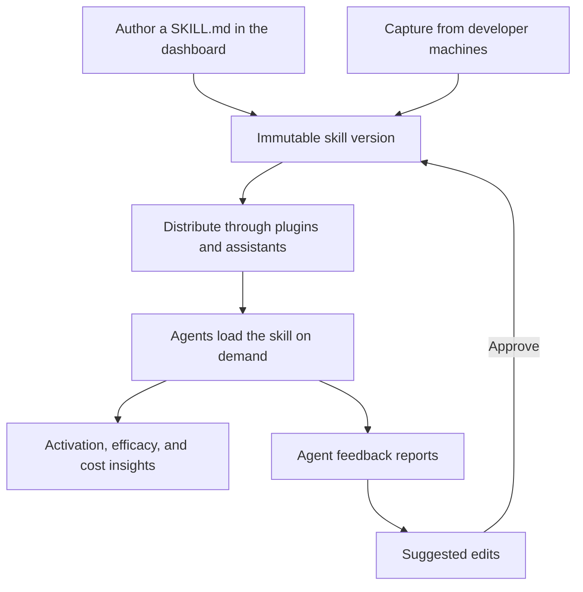

import { Callout, Screenshot } from "@/mdx/components";

A skill is a versioned `SKILL.md` manifest: reusable instructions that agents load on demand. The **Skills** page records, inspects, and versions the skills available to the project. Open it from **Distribute > Skills** in the dashboard.

## Access requirements

<Callout type="info">
  Viewing this page requires the `skill:read` scope. Adding, editing, or archiving a skill requires the `skill:write` scope. The default [Admin role](/docs/ai-control-plane/org-admin/roles-and-permissions) includes full access; the default Member role can browse skills but cannot add, edit, or archive them.
</Callout>

## How skills work

Skills follow a lifecycle: a manifest enters the registry by being authored in the dashboard or captured from developer machines, every change records an immutable version, versions ship to agents through plugins and assistants, and usage data flows back as insights and feedback that drive the next version.

## Skill list

The list shows each skill with its source and classification badges, version count, 30-day activations, sampled efficacy, and estimated savings. Search by name, filter by source and classification, and sort by recent updates, activation volume, efficacy, or estimated savings. Add skills with **Add skill**.

<Screenshot
  url="app.speakeasy.com"
  image={{
    src: "/assets/docs/ai-control-plane/distribute/skills/skills-list.webp",
    darkSrc: "/assets/docs/ai-control-plane/distribute/skills/skills-list-dark.webp",
    alt: "The skills list with source and classification badges, activation counts, efficacy, and estimated savings columns",
  }}
/>

Each skill carries two labels. The source records how the skill entered the registry: **Manual** for skills added in the dashboard and **Captured** for skills observed in use on developer machines. The classification separates **Custom** skills owned by the project from **Built-in** skills that ship with agent tooling.

The **Unknown activations** section below the list collects activations whose manifest could not be matched to one skill version, with the reason: an invalid name, a manifest that was not captured, or an ambiguous version.

## Adding a skill

**Add skill** accepts a pasted `SKILL.md` manifest or an uploaded Markdown file. A manifest starts with YAML frontmatter that declares at minimum a `name` (lowercase letters, numbers, and single hyphens, up to 64 characters) and a `description` (up to 1,024 characters). Optional keys such as `compatibility`, `license`, and `metadata` are recorded and shown on the skill's detail page. A manifest can be up to 65,536 bytes.

A manifest that fails validation is still recorded. The errors are surfaced on the detail page and the skill is flagged **Needs review** until a valid version replaces it.

Versions are content-addressed: saving an edit records a new immutable version, and uploading content identical to an existing version is a no-op rather than a duplicate.

## Capturing skills from developer machines

The [device agent](/docs/ai-control-plane/reference/device-agent) detects skill activations in coding agents such as Claude Code, Cursor, Codex, and OpenCode, and reports them to the platform. When **Upload Skill Content** is enabled in the [organization's skill settings](/docs/ai-control-plane/org-admin/skills), the manifest content is uploaded at activation, so skills already in use across the organization appear in the registry with the **Captured** badge and full version tracking. When the toggle is off, only skill names, source details, hashes, users, and hostnames are reported.

## Skill detail

A skill's detail page shows the latest version of its manifest exactly as agents load it, with validation errors surfaced when a manifest is invalid. The sidebar summarizes visibility, distributions, versions, and activations at a glance.

<Screenshot
  url="app.speakeasy.com"
  image={{
    src: "/assets/docs/ai-control-plane/distribute/skills/skill-detail.webp",
    darkSrc: "/assets/docs/ai-control-plane/distribute/skills/skill-detail-dark.webp",
    alt: "A skill's detail page with the distribution banner, skill details, and adoption and drift statistics",
  }}
/>

The **Adoption and drift** section tracks activation coverage and version convergence over the last 30 days: how many machines are active, how many run the distributed version, and how many have drifted to another version. The **Activation timeline** charts daily activations broken down by version.

Archiving a skill from the **Danger zone** removes it from the project's catalog and revokes its plugin distributions. Renaming a skill keeps activation attribution intact.

## Version history

The **Version history** section records every version of the skill's manifest with its validity, activation counts, and creation date. Select any two versions to see a side-by-side diff, so changes to a skill are auditable over time.

<Screenshot
  url="app.speakeasy.com"
  image={{
    src: "/assets/docs/ai-control-plane/distribute/skills/skill-version-diff.webp",
    darkSrc: "/assets/docs/ai-control-plane/distribute/skills/skill-version-diff-dark.webp",
    alt: "Version history with two versions selected and a side-by-side diff of the manifest change",
  }}
/>

Any valid, non-current version can be restored with **Roll back** or **Promote**. Restoring makes that historical content current again without rewriting the immutable record, and explicit version pins on distributions are preserved. See [Improving skills with agent feedback](/docs/ai-control-plane/distribute/skills/improving-skills-with-agent-feedback) for the full restore semantics.

## Distributing skills

Skills reach agents by being bundled into [plugins](/docs/ai-control-plane/distribute/plugins) alongside MCP servers. A distributed skill ships inside the plugin package as `skills/<name>/SKILL.md`, the layout that Claude Code, Cursor, Codex, and OpenCode load plugin skills from, and reaches everyone who installs the plugin.

<Screenshot
  url="app.speakeasy.com"
  image={{
    src: "/assets/docs/ai-control-plane/distribute/skills/plugin-skills.webp",
    darkSrc: "/assets/docs/ai-control-plane/distribute/skills/plugin-skills-dark.webp",
    alt: "The skills section of a plugin with a distributed skill tracking the latest version",
  }}
/>

Manage distributions from the banner on the skill's detail page or from the **Skills** section of a plugin. A distribution either tracks the latest valid version or pins a specific one. When a plugin carries at least one skill, the package also bundles a local feedback server so agents can report how the skill performed.

Skills can also be attached to assistants. An attached skill tracks the latest valid version by default, or pins a specific version, and the assistant loads it on demand at runtime.

## Sharing a skill

Every skill is private to its project by default. Switching visibility to **Public** creates a share link to a read-only page showing the skill's latest manifest, with options to copy the Markdown or download the `SKILL.md` file. The link works without a Speakeasy account and can be reset at any time to revoke the previous URL.

<Screenshot
  url="app.speakeasy.com"
  image={{
    src: "/assets/docs/ai-control-plane/distribute/skills/skill-shared.webp",
    darkSrc: "/assets/docs/ai-control-plane/distribute/skills/skill-shared-dark.webp",
    alt: "The public read-only page of a shared skill with copy and download actions",
  }}
/>

## Skill insights

Once a skill is in use, skill insights estimate how much it actually helps agent sessions: sampled efficacy scores, estimated time saved, and attributed session cost, each broken down by version.

<Screenshot
  url="app.speakeasy.com"
  image={{
    src: "/assets/docs/ai-control-plane/distribute/skills/skill-insights.webp",
    darkSrc: "/assets/docs/ai-control-plane/distribute/skills/skill-insights-dark.webp",
    alt: "The insights section of a skill with sampled efficacy, attributed session cost, estimated ROI, and per-version trend charts",
  }}
/>

See [Measuring skill efficacy](/docs/ai-control-plane/distribute/skills/measuring-skill-efficacy) for how the scoring works and how to interpret the results. Organization administrators control sampling limits from the [Skills settings page](/docs/ai-control-plane/org-admin/skills).

## Improving skills with agent feedback

Agents report whether a skill helped after using it, and the platform turns that feedback into reviewable suggested edits: evidence-backed diffs against the current manifest that a project member can apply as a new version. See [Improving skills with agent feedback](/docs/ai-control-plane/distribute/skills/improving-skills-with-agent-feedback) for the full review workflow.
