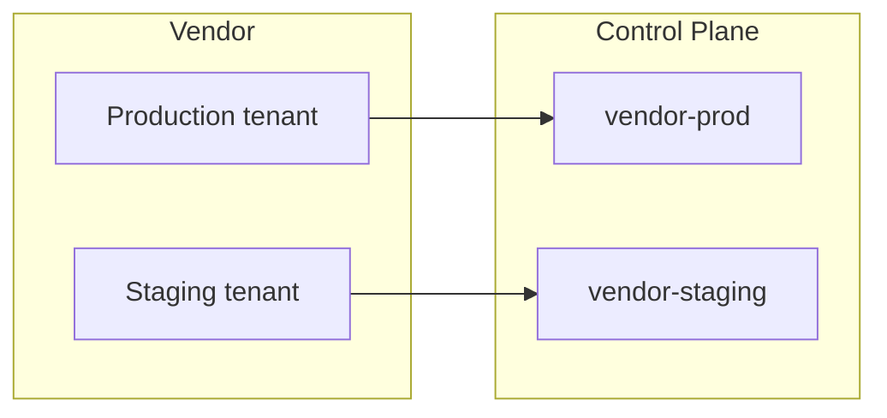

import { Callout } from "@/mdx/components";

Vendor MCP servers often serve many customer organizations from one URL. A tenant might be an organization, a workspace, a region, or a customer account, and each one has its own credentials and its own data. Connecting every tenant through a single Control Plane server mixes credentials and audit trails.

The pattern is one MCP server per tenant. Installing the same catalog entry again creates a second independent server. Each server stores its own upstream headers, has its own slug and access rules, and logs its own traffic.

This guide covers repeating a catalog install, naming servers before the slug is locked, and two registry behaviors that look like extra tenants and are not.

## One catalog entry, several servers

Installing an entry that is already in the project is allowed. It creates another server rather than editing the existing one. The "already in this project" marker is informational.

Each install is a full [remote MCP server](/docs/ai-control-plane/distribute/mcp-servers/remote-servers):

- Its own upstream URL
- Its own encrypted upstream headers
- Its own visibility, team access, and plugin membership
- Its own tool logs

Two tenants on the same vendor deployment share one MCP URL. The second install is what separates them, not a second remote on the same catalog card.

A catalog entry can also publish several remote endpoints. That is a different case: one install creates one server per selected endpoint, after discarding non-streamable-HTTP remotes and deduplicating by URL. Re-installing the entry is the path for two tenants that share an endpoint URL.

The diagram below shows two tenants of one vendor, each with its own Control Plane server. Agents connect to the Control Plane URLs, not to the vendor directly.

## Name the server at install

The install dialog asks for a **Server name**. That name becomes the display name and seeds the URL slug.

The display name can be renamed later from **Settings**. The URL slug is fixed at creation. Client configs, plugin installs, and custom-domain routes keep pointing at the original slug, so renaming the display name does not fix a poorly chosen slug.

Pick a name that identifies the tenant before confirming the install. A name that combines the vendor with the tenant dimension that varies works well:

- `datadog-us1-prod`
- `github-acme-corp`
- `linear-eu-staging`

<Callout type="warning">
  Changing an MCP server slug after creation is not supported. Recreating the
  server is the only way to get a different slug, and that issues a new
  endpoint URL.
</Callout>

## Credentials stay on the server

The **configure** step of the install dialog collects upstream headers. Values are encrypted at rest and sent with every upstream request. Skip the step when the keys are not ready and fill them in later from the server's **Settings** tab.

Each server holds its own header values. An API key stored on one tenant's server is never sent on calls through another tenant's server.

Two authentication models fit a tenant-scoped server:

| Tenant model | Use | Shared across callers? |
| --- | --- | --- |
| One tenant, people acting as themselves | OAuth, set up automatically when the upstream supports dynamic client registration | No, per end user |
| One tenant, one service account | Static headers holding that tenant's API key | Yes, for that server only |

Prefer OAuth where the upstream supports it, because the audit trail then answers who made a call. Static keys are the fallback for environments that cannot complete an OAuth flow. [Upstream credentials](/docs/ai-control-plane/distribute/mcp-servers/authentication/upstream-credentials) covers both.

<Callout title="Header rows from the registry are definitions, not values" type="info">
  Catalog installs copy the header names the registry publishes onto the
  server. Skipping values at install does not remove those rows. Empty rows can
  be filled later. A row deleted in **Settings** can reappear on the next
  source deploy, because the registry definition is written again. That is
  expected. It is not a saved secret coming back.
</Callout>

Authorization is never collected during catalog install. On servers that support dynamic client registration, automatic auth setup owns it. Everywhere else it belongs in the server's **Authentication** section.

## Install once per tenant

Adding the entry from the [catalog](/docs/ai-control-plane/connect/catalog) is the shortest path when the published URL already matches the deployment for that tenant.

- Open **Catalog**, search for the vendor, and click **Add**.
- Set **Server name** to a tenant-specific value.
- Enter that tenant's credentials if the server authenticates with keys, or skip headers and complete OAuth afterward.
- Confirm. Repeat the install for the next tenant.

The by-URL path is the alternative when the catalog URL does not match the deployment for that tenant. Open **Connect > Sources**, choose **Add a custom remote MCP server**, and enter the resolved MCP URL. [Govern a third-party MCP server](/docs/ai-control-plane/guides/govern-a-third-party-mcp-server) walks that form.

After each server exists, add it to a plugin or share its install page the same way as any other remote server.

## Registry caveats

Two properties of a catalog entry look like extra tenants and are not.

### Duplicate remotes share one URL

An entry can publish two remotes at the same streamable-HTTP URL, one for OAuth and another for API-key headers. The install dialog collapses those to a single checkbox, matching deploy-time behavior. The first matching URL wins. The second variant is not a second server.

OAuth versus API keys is configured on the created server, not by selecting both remotes. One install still produces one server.

### Templated URLs are not filled in at install

Registry remotes can include URL template variables, such as a region or site. The install dialog collects headers, not those variables. The URL stored on the server is the URL the registry published.

If that URL still contains a placeholder, or points at the wrong region for the tenant, the proxy cannot reach the right tenant. Register the server by URL with the fully resolved endpoint, or edit **Upstream URL** on the server's **Settings** tab after install.

Entries that publish distinct paths per region are different. Those URLs are already concrete, so selecting several endpoints in one install is correct.

## Example: one server per Datadog organization

Datadog is a typical multi-tenant upstream. Each organization has its own site, API keys, and data, and the entry hits both caveats above.

Datadog hosts a different MCP endpoint per site. The host is `mcp.` plus the site domain, and the path is `/api/unstable/mcp-server/mcp`.

| Datadog site | MCP URL |
| --- | --- |
| US1 (`datadoghq.com`) | `https://mcp.datadoghq.com/api/unstable/mcp-server/mcp` |
| US3 (`us3.datadoghq.com`) | `https://mcp.us3.datadoghq.com/api/unstable/mcp-server/mcp` |
| US5 (`us5.datadoghq.com`) | `https://mcp.us5.datadoghq.com/api/unstable/mcp-server/mcp` |
| EU1 (`datadoghq.eu`) | `https://mcp.datadoghq.eu/api/unstable/mcp-server/mcp` |
| AP1 (`ap1.datadoghq.com`) | `https://mcp.ap1.datadoghq.com/api/unstable/mcp-server/mcp` |
| AP2 (`ap2.datadoghq.com`) | `https://mcp.ap2.datadoghq.com/api/unstable/mcp-server/mcp` |

Confirm the site from the Datadog app URL before registering. A valid key against the wrong site fails to connect. Datadog government sites (`ddog-gov.com`) do not host the MCP server.

Two organizations on the same site share one URL, so the second catalog install is what separates them. Name each server for its organization, such as `datadog-us1-prod` and `datadog-eu-staging`. Datadog recommends OAuth; `DD_API_KEY` and `DD_APPLICATION_KEY` are the fallback, and each pair stays on its own server.

## Further reading

- [Remote MCP servers](/docs/ai-control-plane/distribute/mcp-servers/remote-servers) is the reference for catalog installs, upstream headers, and editing a server after creation.
- [Govern a third-party MCP server](/docs/ai-control-plane/guides/govern-a-third-party-mcp-server) covers registering an upstream by URL when the catalog path does not apply.
- [Catalog overview](/docs/ai-control-plane/connect/sources/catalog/overview) documents **Add another** for a second copy of the same entry.
