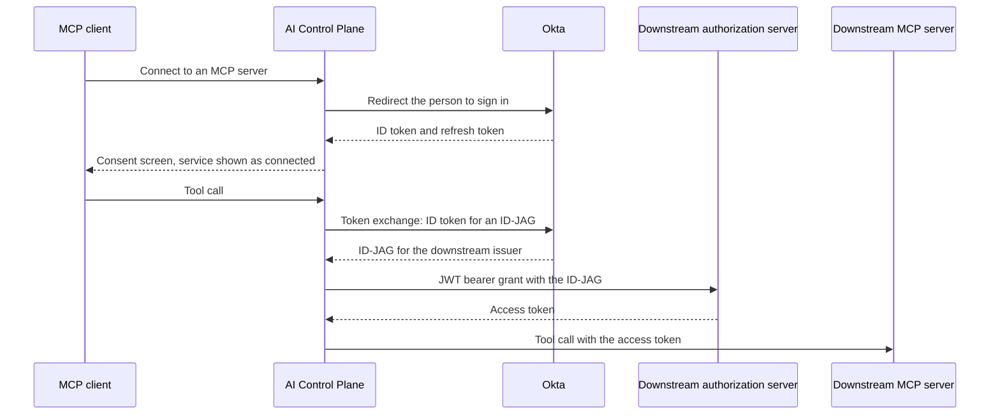

import { Callout } from "@/mdx/components";

Enterprise Managed Auth lets a person sign in once with Okta and reach every MCP server the organization has set up for them, without a separate OAuth prompt for each service behind those servers. The platform implements the MCP Enterprise Managed Authorization (EMA) extension, which Okta supports as Cross App Access (XAA). Instead of asking each person to connect Linear, Notion, or another service one at a time, it asks Okta for access on that person's behalf. Okta decides which people may reach which apps, under policies the organization controls centrally, and removing access in Okta stops it everywhere.

## Access requirements

<Callout type="info">
  Setting up Enterprise Managed Auth requires the `org:admin` scope, which only the default [Admin role](/docs/ai-control-plane/org-admin/roles-and-permissions) holds, and an Okta administrator who can create apps, register AI agents, and grant API scopes.
</Callout>

## How Enterprise Managed Auth works

Without Enterprise Managed Auth, each MCP server that uses **User Identity** asks each person to [connect the upstream service](/docs/ai-control-plane/mcp-gateway/access/upstream-credentials#what-the-end-user-sees), creating separate grants the organization cannot see or revoke from one place. With Enterprise Managed Auth, an Okta administrator connects the platform to each resource app once and assigns the people allowed to use it. The platform signs people in through Okta and, on each tool call, trades the person's Okta identity for an access token at the downstream service.

Enterprise Managed Authorization works in two directions. Inbound, an MCP client presents an identity assertion it already holds to the platform, acting as the [authorization server](/docs/ai-control-plane/concepts#inbound-the-control-plane-as-authorization-server), in place of an interactive sign-in. Outbound, the platform obtains tokens for downstream services by identity chaining, which is what this page covers. See [OAuth and upstream providers](/docs/ai-control-plane/concepts#oauth-and-upstream-providers) for how the two fit together.

The following diagram shows one person reaching one downstream service.

- **Sign in.** The person signs in through Okta, with its MFA and conditional access policies. The platform keeps the returned ID token and refresh token, encrypted, as the person's delegation.
- **Exchange.** On a tool call, the platform asks Okta to exchange the ID token for an Identity Assertion JWT Authorization Grant (ID-JAG) addressed to the downstream service. Okta checks that the person is assigned and that a resource connection exists for that service.
- **Redeem and call.** The platform presents the ID-JAG to the downstream authorization server, receives an access token for that resource and its scopes, and runs the tool call as that person.

## Requirements

- **Okta.** Okta is the supported identity provider.
- **Provisioned people.** Each person must already be a member of the organization, typically through [directory sync](/docs/ai-control-plane/org-admin/identity#how-directory-sync-works), and assigned to the Okta app linked to the Speakeasy AI agent. Sign-in does not create accounts.
- **Supported downstream servers.** The downstream server needs its own authorization server, configured as a [remote identity provider](/docs/ai-control-plane/identity/remote-identity-providers), that advertises the identity assertion grant and has a client registered for the platform. Servers without support keep using the ordinary connect flow.

## Set up Enterprise Managed Auth

Setup happens partly in the dashboard and partly in the Okta Admin Console.

### Connect Okta

Speakeasy reads apps, users, and groups from Okta through an API service app. There are two ways to set one up:

- **Okta Integration Network.** Install the Speakeasy integration from the Okta catalog. Okta creates the app and gives you a client ID and client secret.
- **Custom API Services app.** Create the app yourself in Okta. It authenticates with a public key that Speakeasy hosts, so there is no secret to copy.

#### Install from the Okta Integration Network

- In the Okta Admin Console, open **Applications and Resources > API Service Integrations**, select **Add Integration**, and choose **Speakeasy**.
- Review the read-only permissions for apps, users, and groups, and select **Install & Authorize**.
- Copy the **Okta domain**, **Client ID**, and **Client secret**. Okta shows the client secret only once.
- In the dashboard, open [**IDP and SSO > Identity providers**](https://app.getgram.ai/@self/identity?tab=identity-providers) and select **Connect Okta** on the Okta card.
- Choose **Okta Integration Network (client secret)**, enter the Okta organization URL, such as `https://example.okta.com`, and select **Create connection**.
- Enter the **Client ID** and **Client secret** and select **Submit and verify**.

The client secret is stored encrypted and never shown again. If you rotate it in Okta, select **Replace client secret** on the connection and enter the new one. If Okta rejects the new secret, the connection keeps the previous one.

#### Create a custom API Services app

- Open [**IDP and SSO > Identity providers**](https://app.getgram.ai/@self/identity?tab=identity-providers) and select **Connect Okta** on the Okta card.
- Choose **Custom API Services app (private key)**, enter the Okta organization URL, such as `https://example.okta.com`, and select **Create connection**. The Okta Admin Console address also works.
- Follow the **Okta setup checklist**, which shows the key URL to use. In the Okta Admin Console:
  - Open **Applications and Resources > Applications**, choose **Create App Integration**, and select **API Services**. Name the app Speakeasy, choose **Use Okta-generated client ID**, and save it. Do not choose Client ID Metadata Document (CIMD).
  - On the app's **General** tab, edit **Public keys**, choose **Use a URL to fetch keys dynamically**, and enter the key URL from the checklist.
  - Under **Client Credentials**, set **Client authentication** to **Public key / Private key**. Okta enables this option only after the key URL is saved; refresh the page if it is still grayed out.
  - Leave **Require Demonstrating Proof of Possession (DPoP) header in token requests** enabled.
  - On the **Okta API Scopes** tab, grant `okta.apps.read`, `okta.users.read`, and `okta.groups.read`.
  - On the **Admin roles** tab, assign **Application Administrator** (org-wide) and **Read-only Administrator**.
- Paste the app's **Client ID**, which starts with `0oa`, and select **Submit and verify**. The client ID can be saved only once; to change it, revoke the connection and connect again.

#### After connecting

When verification passes, the Okta card shows **Verified** and a **Manage Okta** button.

If verification fails, the **Setup** tab lists what to fix, such as a missing scope. Select **Re-verify** after changing the app in Okta.

### Sync applications

Select **Manage Okta** and open the **Applications** tab. Apps sync from Okta on a schedule, and **Update now** syncs immediately. The tab also suggests catalog MCP servers that match apps the organization already uses.

### Register the Speakeasy AI agent

Okta issues Cross App Access assertions only through a registered AI agent. Open the **Cross App Access** tab and follow the **Cross App Access setup** checklist. The tab also counts the servers still waiting for confirmation.

The checklist covers three steps:

- In Okta, register an AI agent named Speakeasy Agent under **Directory > AI Agents**, and let Okta create a new OIDC app linked to it.
- Activate the linked app and assign the users or groups who use MCP servers through the platform.
- Back on the **Cross App Access** tab, enter the **Agent ID** and, optionally, the linked app's client ID, then select **Save agent**. With the client ID saved, the platform reports when the linked app is inactive or has no assignments.

### Trust Okta for MCP sign-in

On the organization's [user session](/docs/ai-control-plane/mcp-gateway/access/user-sessions) issuer, select Okta as the trusted identity provider and pick the client registration the platform uses at Okta. Allow the refresh token grant and the `offline_access` scope on that Okta app so delegation survives past the ID token's lifetime. Then select that issuer on each MCP server that should use Enterprise Managed Auth.

### Connect each server in Okta

The AI agent needs one resource connection in Okta per downstream service. The **Cross App Access** tab lists each eligible server with the **Resource**, **Client ID**, and **Scopes** to use.

- Select **Review setup** on a server.
- Select **Open Okta connections**. Reuse an existing connection for that resource, or create one with the **Resource**, **Client ID**, and **Scopes** from the dashboard.
- Enter the **Issuer URL** from the resource app in Okta, under **Resource Server > Cross App Access (XAA)**. Use the issuer of the service this MCP server connects to, not a Speakeasy app and not the MCP server URL.
- Select **Confirm setup**.

Servers that share an Okta app and Issuer URL can be selected together and confirmed in one step.

<Callout type="info">
  A confirmation records the settings an admin reviewed. It is not a live check: saving it does not create the connection in Okta or prove that access works. A server shows as verified once a real token exchange succeeds, or as not working with the reason when one fails.
</Callout>

## What people see

The [consent screen](/docs/ai-control-plane/mcp-gateway/access/user-sessions#the-consent-screen) still appears on every sign-in. Services the platform can reach through Okta show as **Connected through your organization**, with no redirect to the service and no disconnect control, because Okta manages the grant. Services without Cross App Access support keep their ordinary **Connect** cards.

When Okta access is missing or has lapsed, the card asks for a fresh enterprise sign-in. A policy denial in Okta never falls back to an interactive connect flow, so Enterprise Managed Auth cannot be used to work around the organization's Okta policy.

## Renewal, revocation, and deprovisioning

- **Renewal.** Tokens renew on demand. When a tool call needs a downstream token and the stored one has expired, the platform uses the refresh token to get a new ID token, requests a new ID-JAG, and redeems it. Without a refresh token from Okta, the person signs in again once the ID token expires.
- **Revocation and deprovisioning.** Deactivating a person in Okta, unassigning them from the linked app, or removing a resource connection makes Okta refuse the next renewal or exchange. The platform then asks the person to sign in again and does not fall back to another credential. Downstream tokens already issued stay valid until they expire, so revocation is not instantaneous.
- **Platform sessions.** The MCP session still ends at the server's session length. Ending a session in the platform does not revoke anything in Okta. See [Revoking access](/docs/ai-control-plane/mcp-gateway/access/user-sessions#revoking-access).

To check a setup end to end, select **Sign in as yourself to check**. It runs a real sign-in and exchange as the acting admin and reports, per downstream service, whether it worked or which stage failed. The Platform MCP's `get_xaa_readiness` tool reports the same readiness for one server. See [Readiness and troubleshooting](/docs/ai-control-plane/reference/platform-mcp#readiness-and-troubleshooting).

## Limitations

- Okta is the only supported identity provider, and delegation requires OIDC sign-in. SAML sign-in does not create a delegation.
- Delegation acts for people. For agents and workloads acting on their own, see [Agent identity](/docs/ai-control-plane/identity/agents).

## Related

- [Remote identity providers](/docs/ai-control-plane/identity/remote-identity-providers), where downstream authorization servers and their clients are configured
- [Upstream credentials](/docs/ai-control-plane/mcp-gateway/access/upstream-credentials), for the per-user and shared credential modes Enterprise Managed Auth complements
- [User sessions](/docs/ai-control-plane/mcp-gateway/access/user-sessions), for sign-in, the consent screen, and token lifetimes
- [IDP and SSO](/docs/ai-control-plane/org-admin/identity), for employee sign-in and directory sync
