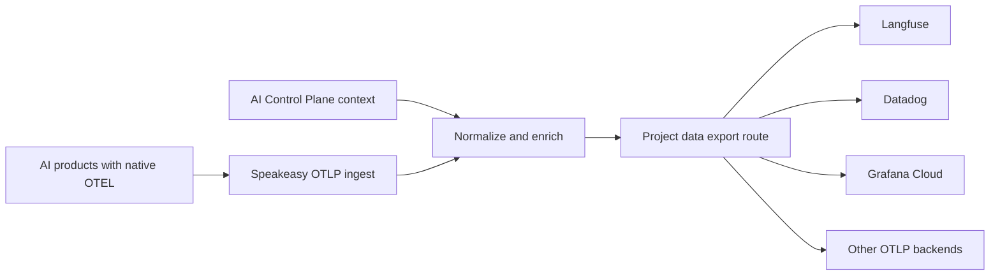

import { Callout } from "@/mdx/components";

Data exports send normalized OpenTelemetry (OTEL) from AI products to project-scoped OTLP/HTTP destinations. The **Data > Exports** page shows every configured project route in one organization-level view.

## Access requirements

<Callout type="info">
  A direct OTEL connection requires a **Hooks** API key and a project slug.
  Plugins handle the connection automatically. Viewing data exports requires the
  `org:read` scope. Creating, changing, pausing, or deleting an export requires
  the `org:admin` scope, which is
  included in the default [Admin
  role](/docs/ai-control-plane/org-admin/roles-and-permissions).
</Callout>

## How data exports work

AI products with native OTEL exporters send telemetry to the platform. The platform normalizes each signal, adds organization and project context, and checks for an enabled data export route for that project. The route connects one data source to one OTLP destination.



The destination is independent of the producer. Changing a route does not require reconfiguring the AI product that sends telemetry to the platform.

## Current signal coverage

The **Product telemetry** source exports normalized OTLP logs, metrics, and traces from supported products.

| Source                            | Signals                   | Export behavior                                                                          |
| --------------------------------- | ------------------------- | ---------------------------------------------------------------------------------------- |
| Compatible OTLP/HTTP producers    | Logs, metrics, and traces | Normalized and sent as OTLP/HTTP Protobuf to `/v1/logs`, `/v1/metrics`, and `/v1/traces` |
| Products without an OTEL exporter | Plugin hook events        | Available to Observe and Secure, but not included in OTLP data exports                   |

OpenCode and OpenClaw do not expose native OTEL exporters. Their observability plugins still supply sessions, tool calls, tokens, and cost to the platform, but those plugin-only events are not part of the **Product telemetry** export.

## Connect without a plugin

<Callout type="info">
  If a supported Speakeasy plugin is installed, skip this section. The plugin
  connects the product to the platform automatically. Configure an OTEL producer
  directly only when the product is not using a plugin.
</Callout>

Create a **Hooks** key from the [API Keys page](/docs/ai-control-plane/org-admin/api-keys), then configure the product or its OpenTelemetry SDK to use OTLP over HTTP with Protobuf encoding.

Most OpenTelemetry SDKs accept the standard exporter environment variables:

```bash
export OTEL_EXPORTER_OTLP_ENDPOINT="https://app.getgram.ai/otel"
export OTEL_EXPORTER_OTLP_PROTOCOL="http/protobuf"
export OTEL_EXPORTER_OTLP_HEADERS="Gram-Key=<HOOKS_API_KEY>,Gram-Project=<PROJECT_SLUG>"
```

The generic endpoint appends the signal path automatically. For a trace-specific exporter, set the complete endpoint instead:

```bash
export OTEL_EXPORTER_OTLP_TRACES_ENDPOINT="https://app.getgram.ai/otel/v1/traces"
export OTEL_EXPORTER_OTLP_TRACES_PROTOCOL="http/protobuf"
export OTEL_EXPORTER_OTLP_TRACES_HEADERS="Gram-Key=<HOOKS_API_KEY>,Gram-Project=<PROJECT_SLUG>"
```

The trace endpoint accepts identity or gzip content encoding. Both the compressed request and its decompressed form must be no larger than 20 MiB. The endpoint acknowledges an export only after every span in the request has been accepted for processing, so standard OTLP retry behavior remains effective when ingestion fails.

## Telemetry enrichment

The trace pipeline keeps the original OTLP resource, scope, span, event, link, status, and producer attributes. It adds attributes under the `speakeasy.*` namespace when the corresponding context is available.

| Attribute                                       | Description                                                             |
| ----------------------------------------------- | ----------------------------------------------------------------------- |
| `speakeasy.organization.id`                     | AI Control Plane organization ID derived from the authenticated request |
| `speakeasy.organization.slug`                   | Organization slug, when available                                       |
| `speakeasy.project.id`                          | Project ID derived from the authenticated request                       |
| `speakeasy.project.slug`                        | Project slug, when available                                            |
| `speakeasy.api_key.id`                          | ID of the key that supplied the telemetry, when available               |
| `speakeasy.api_key.name`                        | Name of the key that supplied the telemetry, when available             |
| `speakeasy.tokens.count`                        | Token count calculated from supported prompt and completion attributes  |
| `speakeasy.tokens.codec`                        | Tokenizer used for `speakeasy.tokens.count`                             |
| `speakeasy.original_instrumentation_scope.name` | Producer scope name before normalization, when one was present          |

Instrumentation scopes are normalized to `com.speakeasy.ai.tracing`. Unknown OTLP fields are retained for forward compatibility, while private transport metadata is removed before export.

### Identity context

Producer identity attributes such as `user.email` and `user.id` remain on the signal. Elsewhere in the AI Control Plane, these values resolve against organization membership and [Directory Sync](/docs/ai-control-plane/org-admin/identity), which provides department, division, job title, employee type, cost center, IdP groups, and role context for identity-aware Observe views when that data is available from the connected directory.

## Configure a data export

Open **Data > Exports** in the dashboard. The page combines configured exports from every visible project into one topology.

To add an export:

- Click **New export**.
- Choose a project. The picker includes only projects that do not already have a route for the selected data source.
- Select **Product telemetry** under **Data to export**.
- Select an existing destination for that project, or select **Create a new destination**.
- For a new destination, enter a name, the base OTLP endpoint, and any required headers.
- Choose whether to include sensitive data.
- Leave **Start exporting** on to enable delivery immediately, or turn it off to save the route paused.
- Click **Create export**.

The endpoint must use HTTP or HTTPS. Enter the base without `/v1/traces`, `/v1/logs`, or `/v1/metrics`. The platform appends the path for each signal.

Destination headers are encrypted at rest and write-only. The API returns each header name and whether a value exists, but never returns the stored value.

### Control sensitive data

New destinations exclude sensitive data by default. The exclude policy replaces classified content and identity values with `[REDACTED]` while preserving the OTLP attribute keys. Classified values include prompts, model input and output, tool arguments, tool results, and user identifiers.

Turning on **Include sensitive data** preserves the normalized OTLP payload. Apply access controls and retention policies at the destination before enabling this setting.

The policy belongs to the destination. Selecting an existing destination uses its stored policy.

### Manage an export

Each source card includes controls to pause or enable delivery, change its destination, or delete the route. Deleting an export stops delivery and removes the route. The destination remains available for another export in the same project.

## Choose a destination

Data exports use the open OTLP/HTTP format. Any destination that accepts OTLP/HTTP Protobuf at the standard signal paths can receive exported telemetry. The configurations below support OTLP/HTTP traces. Confirm log and metric support with the destination when all three signals are required.

### Langfuse

Use the regional base endpoint ending in `/api/public/otel`. Add a Basic `Authorization` header. Langfuse v4 also recommends the `x-langfuse-ingestion-version: 4` header. See the [Langfuse OpenTelemetry integration](https://langfuse.com/integrations/native/opentelemetry).

### Datadog

Use the site-specific OTLP intake base endpoint and add a `dd-api-key` header. The optional `compute_stats: true` header enables trace metrics. Datadog recommends the Datadog Agent or OpenTelemetry Collector for production workloads. See the [Datadog OTLP intake documentation](https://docs.datadoghq.com/opentelemetry/setup/otlp_ingest/).

### Grafana Cloud

Copy the base endpoint and Basic `Authorization` header from the **OpenTelemetry** connection tile for the Grafana Cloud stack. See the [Grafana Cloud OTLP documentation](https://grafana.com/docs/grafana-cloud/observe-and-act/send-data/otlp/send-data-otlp/).

### OpenTelemetry Collector

Use the OTLP/HTTP receiver base URL, commonly port `4318`, plus any headers enforced by the collector. The collector can process or route signals before sending them to another backend. See the [OpenTelemetry Collector receiver documentation](https://opentelemetry.io/docs/collector/configuration/#receivers).

For a destination that supplies a signal-specific URL ending in `/v1/traces`, remove that suffix before saving the endpoint.

## Delivery behavior

The platform sends normalized logs, metrics, and traces as `application/x-protobuf`. It appends the standard signal path to the configured base endpoint and applies the destination headers to every request.

Delivery is asynchronous after ingestion. The relay retries transient network failures, `408` and `429` responses, and `5xx` responses. Other `4xx` responses are treated as permanent configuration or authentication failures. Each outbound attempt has a ten-second timeout.

Delivery failures do not affect the source agent or the copy processed by the platform for Observe and Secure. Route and destination changes can take up to 60 seconds to reach every relay worker.
