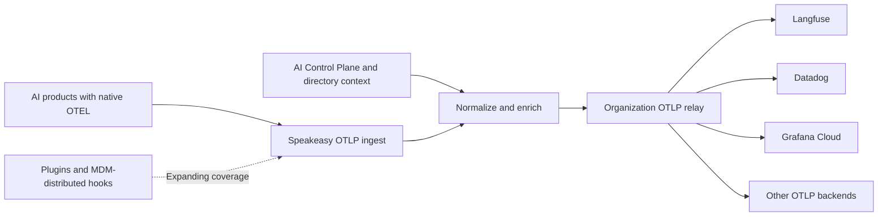

import { Callout } from "@/mdx/components";

The OpenTelemetry (OTEL) pipeline accepts telemetry from AI products, adds context from the Speakeasy AI Control Plane, and relays it to an organization-owned OTLP destination. One vendor-neutral stream can feed Langfuse, Datadog, Grafana Cloud, or any collector that accepts OTLP over HTTP.

## Access requirements

<Callout type="info">
  Sending OTEL requires a **Hooks** API key and a project slug. Viewing the
  forwarding configuration requires the `org:read` scope. Enabling, changing, or
  deleting it requires the `org:admin` scope, which is included in the default
  [Admin role](/docs/ai-control-plane/org-admin/roles-and-permissions).
</Callout>

## How OpenTelemetry works

AI products with native OTEL exporters can send traces directly to the platform. Supported agent integrations also send OTEL logs and metrics when the product exposes them. The platform normalizes the incoming data, adds organization and project context, and sends the resulting signal to the configured OTLP/HTTP destination.



The direct OTLP path avoids a separate collector at every source. The destination remains independent of the AI product, so changing observability backends does not require reconfiguring each producer.

## Current signal coverage

Signal coverage depends on how each AI product exposes telemetry.

| Source                            | Signals            | Forwarding behavior                                                                                       |
| --------------------------------- | ------------------ | --------------------------------------------------------------------------------------------------------- |
| Any compatible OTLP/HTTP producer | Traces             | Normalized, enriched, batched, and sent as OTLP/HTTP Protobuf to `/v1/traces`                             |
| Supported agent integrations      | Logs and metrics   | Forwarded from the hooks endpoint to `/v1/logs` and `/v1/metrics` with the original body and content type |
| Products without an OTEL exporter | Plugin hook events | Available to the Observe and Secure pipelines, but not included in OTEL forwarding today                  |

<Callout title="Coverage roadmap" type="info">
  Speakeasy plugins and MDM-distributed hooks are converging on the same OTEL
  pipeline. As those integrations emit OTEL, products without a native exporter
  can use the same enrichment and destination configuration.
</Callout>

## Connect an OTEL producer

Create a **Hooks** key from the [API Keys page](/docs/ai-control-plane/org-admin/api-keys), then configure the product or its OpenTelemetry SDK to use OTLP over HTTP with Protobuf encoding.

Most OpenTelemetry SDKs accept the standard exporter environment variables:

```bash
export OTEL_EXPORTER_OTLP_ENDPOINT="https://app.getgram.ai/otel"
export OTEL_EXPORTER_OTLP_PROTOCOL="http/protobuf"
export OTEL_EXPORTER_OTLP_HEADERS="Gram-Key=<HOOKS_API_KEY>,Gram-Project=<PROJECT_SLUG>"
```

The generic endpoint appends the signal path automatically. For a trace-specific exporter, set the complete endpoint instead:

```bash
export OTEL_EXPORTER_OTLP_TRACES_ENDPOINT="https://app.getgram.ai/otel/v1/traces"
export OTEL_EXPORTER_OTLP_TRACES_PROTOCOL="http/protobuf"
export OTEL_EXPORTER_OTLP_TRACES_HEADERS="Gram-Key=<HOOKS_API_KEY>,Gram-Project=<PROJECT_SLUG>"
```

The trace endpoint accepts identity or gzip content encoding. Both the compressed request and its decompressed form must be no larger than 20 MiB. The endpoint acknowledges an export only after every span in the request has been accepted for processing, so standard OTLP retry behavior remains effective when ingestion fails.

## Telemetry enrichment

The trace pipeline keeps the original OTLP resource, scope, span, event, link, status, and producer attributes. It then adds attributes under the `speakeasy.*` namespace when the corresponding context is available.

| Attribute                                       | Description                                                             |
| ----------------------------------------------- | ----------------------------------------------------------------------- |
| `speakeasy.organization.id`                     | AI Control Plane organization ID derived from the authenticated request |
| `speakeasy.organization.slug`                   | Organization slug, when available                                       |
| `speakeasy.project.id`                          | Project ID derived from the authenticated request                       |
| `speakeasy.project.slug`                        | Project slug, when available                                            |
| `speakeasy.api_key.id`                          | ID of the key that supplied the telemetry, when available               |
| `speakeasy.api_key.name`                        | Name of the key that supplied the telemetry, when available             |
| `speakeasy.tokens.count`                        | Token count calculated from supported prompt and completion attributes  |
| `speakeasy.tokens.codec`                        | Tokenizer used for `speakeasy.tokens.count`                             |
| `speakeasy.original_instrumentation_scope.name` | Producer scope name before normalization, when one was present          |

Instrumentation scopes are normalized to `com.speakeasy.ai.tracing`. Unknown OTLP fields are retained for forward compatibility, while private transport metadata is removed before export.

### Identity context

Producer identity attributes such as `user.email` and `user.id` remain on the signal. Elsewhere in the AI Control Plane, these values resolve against organization membership and [Directory Sync](/docs/ai-control-plane/org-admin/identity), which provides department, division, job title, employee type, cost center, IdP groups, and role context for identity-aware Observe views when that data is available from the connected directory.

## Configure a destination

Open **Settings > Logging & Telemetry** in the dashboard. The **OTEL forwarding** section contains the organization-wide destination configuration.

- **Endpoint URL** is the base OTLP/HTTP endpoint. Enter the base without `/v1/traces`, `/v1/logs`, or `/v1/metrics`; the platform appends the path for each signal.
- **Headers** adds the authentication and routing headers required by the destination. Click **Add header** for each name and value.
- **Enable forwarding** activates delivery after **Save** is pressed.


Header values are encrypted at rest and never returned by the API. A stored value appears as a masked placeholder. Leaving that placeholder unchanged preserves the existing value; entering a new value replaces it. **Delete** removes the endpoint and all stored headers.

Configuration changes can take up to 60 seconds to reach every relay worker.

## Choose a destination

Use the endpoint and authentication values supplied by the destination. The following services accept OTLP/HTTP traces:

| Destination                                                                                            | Configuration notes                                                                                                                                   |
| ------------------------------------------------------------------------------------------------------ | ----------------------------------------------------------------------------------------------------------------------------------------------------- |
| [Langfuse](https://langfuse.com/integrations/native/opentelemetry)                                     | Use the regional `/api/public/otel` base endpoint with a Basic `Authorization` header. Langfuse v4 also recommends `x-langfuse-ingestion-version: 4`. |
| [Datadog](https://docs.datadoghq.com/opentelemetry/setup/otlp_ingest/traces/)                          | Use the site-specific OTLP trace intake endpoint and a `dd-api-key` header. The optional `compute_stats: true` header enables trace metrics.          |
| [Grafana Cloud](https://grafana.com/docs/grafana-cloud/observe-and-act/send-data/otlp/send-data-otlp/) | Copy the base endpoint and Basic `Authorization` header from the stack's **OpenTelemetry** connection tile.                                           |
| OpenTelemetry Collector                                                                                | Use the OTLP/HTTP receiver base URL, commonly port `4318`, plus any headers enforced by the collector.                                                |

For a destination that supplies a signal-specific URL ending in `/v1/traces`, remove that suffix before saving the **Endpoint URL**. The trace relay sends `application/x-protobuf`. Logs and metrics keep the encoding received from the source, so the destination must accept those encodings if all three signals are enabled.

## Delivery behavior

Trace delivery is asynchronous after ingestion. The relay retries transient network failures, `408` and `429` responses, and `5xx` responses. Other `4xx` responses are treated as permanent configuration or authentication failures and are not retried. Each outbound attempt has a ten-second timeout.

Logs and metrics use a separate copy-forwarding path:

- Payloads larger than 4 MiB are still processed by the platform but are not forwarded.
- Delivery failures are not retried and do not affect the source agent or the copy processed by the platform.
- A recognized Hooks key must be present so the request can be matched to the correct organization destination.

OTEL payloads can contain prompts, completions, tool inputs, tool outputs, user identifiers, and other sensitive data. Apply suitable access controls and retention settings at the destination before enabling forwarding.
