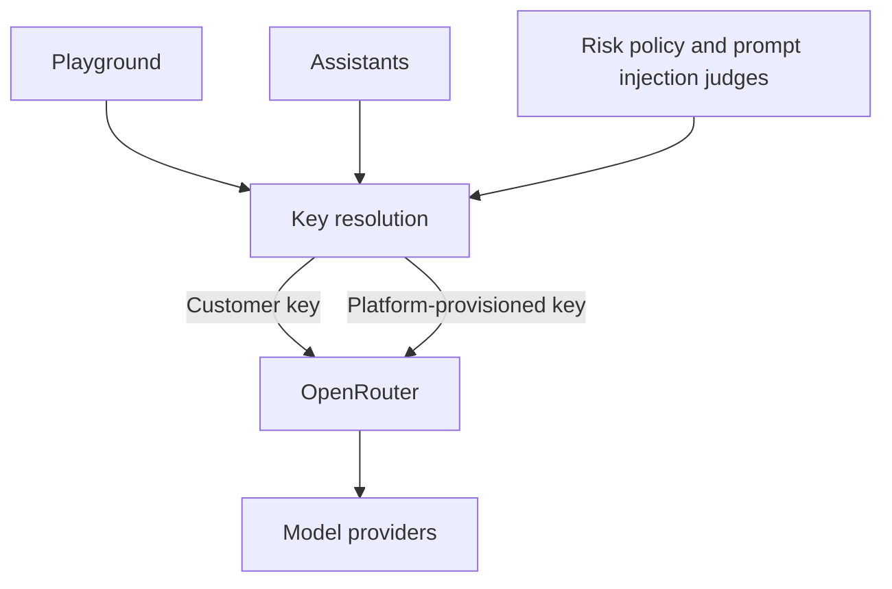

[OpenRouter](https://openrouter.ai) is the model gateway behind every completion the platform runs itself: playground chats, assistant runs, and the risk-scanning judges all reach their models through OpenRouter's OpenAI-compatible API. Unlike the compliance providers elsewhere in this section, OpenRouter is not a connection to configure on the AI Integrations page. The integration is built in, and the configurable part is whose OpenRouter account funds the inference: platform-provisioned keys (the default) or keys from the organization's own OpenRouter account, managed as [model provider keys](/docs/ai-control-plane/org-admin/model-provider-keys) in project settings.

## How it works

Each platform-initiated completion resolves an OpenRouter key per request and forwards the call to OpenRouter, which routes it to the underlying model provider. Key resolution prefers an enabled customer key on the surface's own slot, then an enabled project default key, then the platform-provisioned key.

Outbound completions carry a session identifier, the organization as the user dimension, a source tag naming the surface, and distributed-trace identifiers. OpenRouter's [activity view](https://openrouter.ai/activity) uses them to group requests per conversation and attribute cost per surface. Anthropic `cache_control` markers pass through the proxy untouched, so Claude requests with stable prefixes serve from the prompt cache instead of billing full input rates.

## Platform-provisioned keys

By default, the platform provisions and manages OpenRouter keys per organization and funds the inference they carry. Spend is bounded by managed monthly credit caps that are reconciled automatically as usage shifts, and organization billing contacts receive warning emails as usage crosses 50%, 75%, 90%, and 100% of the monthly cap, so credits never run out by surprise.

## Fund inference from an organization's own account

Organizations already running on OpenRouter can point the platform's inference at their own account. Keys are scoped per project and per surface:

| Surface | Slot | Covers |
| --- | --- | --- |
| Project default | `default` | Every surface below without a dedicated key |
| Playground | `playground` | Completions from the dashboard [playground](/docs/ai-control-plane/connect/playground) |
| Assistants | `assistants` | Completions from assistant runs and triggers |
| Risk policy judge | `risk-policy` | Prompt-based [risk policy](/docs/ai-control-plane/secure/guardrails) evaluations of observed agent traffic |
| Prompt injection judge | `prompt-injection` | Prompt injection scanning of observed agent traffic |

Setup takes two steps:

- In the OpenRouter dashboard, create an API key on the [**Keys**](https://openrouter.ai/settings/keys) page and make sure the account holds [credits](https://openrouter.ai/settings/credits). A per-key credit limit caps what the platform can spend through the key.
- In the platform dashboard, open the project's **Settings** page and paste the key into the **Model Provider Keys** table, either on the **Project default** row or on an individual surface.

The key is validated with OpenRouter before it is stored, then encrypted. Keys are write-only: no API or dashboard view ever returns the key material. See [model provider keys](/docs/ai-control-plane/org-admin/model-provider-keys) for rotation, disabling, deletion, and the management API.

Platform-internal completions outside the listed slots, such as chat title generation, always stay on the platform's own key. A customer key never captures them.

## Spend and credits on customer keys

Completions on a customer key bill to the OpenRouter account that issued it and appear in that account's activity view; the managed credit caps and warning emails above apply only to platform-provisioned keys. Budgets live on the OpenRouter side through account credits and per-key limits. If the account behind a customer key runs out of credits, completions on the affected surfaces fail with HTTP 402 until credits are added.

## Security

Customer key material is encrypted at rest, used only for completion egress to OpenRouter, and never returned by any read path. Every key change is recorded in the [audit log](/docs/ai-control-plane/org-admin/audit-logs) as `model_provider_key:upsert` and `model_provider_key:delete` events with the actor and a before-and-after snapshot of the slot's state.
