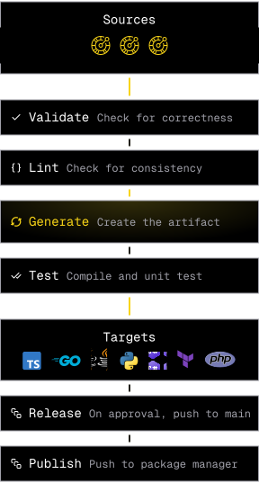

# Core concepts

The core concepts explained on this page are essential to understanding the Speakeasy platform. To skip to getting started with the platform, [go here](/docs/introduction).

## Generation workflows

A workflow is how the Speakeasy platform defines the process of generating a [target](#Target) from a [source](#Source). A workflow is defined in a `workflow.yaml` file stored in the root of the target repository in the `.speakeasy` directory. A workflow is run using the `speakeasy run` command.

Workflows can be run locally for fast iteration, or via a set of GitHub Actions for production usage. For a complete reference of the GitHub workflow, see [the documentation](/docs/manage/github-setup).

<div style={{textAlign:"center", width:"80%"}}>
    
</div>

### Sources

A source is one or more OpenAPI documents and OpenAPI overlays merged to create a single OpenAPI document.

- **OpenAPI specification (OAS)** is a widely accepted REST specification for building APIs. An OpenAPI document is a JSON or YAML file that defines the structure of an API. The Speakeasy platform uses OpenAPI documents as the source for generating SDKs and other code.
- **OpenAPI overlay** is a JSON or YAML file used to specify additions, removals, or modifications to an OpenAPI document. Overlays enable users to alter an OpenAPI document without making changes to the original document.

### Targets

A target refers to an SDK, agent tool, docs, or other code generated from sources.

- **[SDKs](/docs/create-client-sdks)** are available in 8 languages (and growing). Each SDK generator has been developed in tandem with language experts to ensure a high level of idiomatic code generation. For the full details on how we've designed and implemented generation for each language, see the [SDK design documentation](/docs/languages/philosophy).
- **[Agent tools](/docs/model-context-protocol)** are a new surface for interacting with APIs. They provide a way for LLMs and other agentic platforms to interact with APIs. We support [MCP server generation](/docs/model-context-protocol) with other tools on the way.
- **[Documentation](/docs/code-samples/generate-code-samples)** is available in the form of an API reference. Generated docs will include with SDK code snippets for every API method. Code snippets can also be embedded into an existing documentation site.
- **[Terraform providers](/docs/create-terraform)** can be generated from an annotated OpenAPI document. Terraform providers do not map 1:1 with APIs and so annotations are required to specify the Terraform entities and their methods.

### Workflow file syntax

The `workflow.yaml` workflow file is a YAML file that defines the steps of a workflow. The file is broken down into the following sections:

```yaml
workflowVersion: 1.0.0
speakeasyVersion: latest
sources:
  my-source:
    inputs:
      - location: ./openapi.yaml
      - location: ./overlay.yaml
      - location: ./another-openapi.yaml
      - location: ./another-overlay.yaml
      # .... more openapi documents and overlays can be added here
  # more inputs can be added here through `speakeasy configure sources` command
  # ....
  # ....
targets:
  python-sdk:
    target: python
    source: my-source
  # more inputs can be added here through `speakeasy configure targets` command
  # ....
  # ....
```

The workflow file syntax allows for 1:1, 1:N, or N:N mapping of `sources` to `targets`. A common use case for 1:N mapping is setting up a monorepo of SDKs. See our [monorepo guide](/guides/sdks/creating-a-monorepo) for details.

### Workflow steps

#### Validation

Validation is the process of checking whether an OpenAPI document is ready for code generation. The Speakeasy platform defines the default validation rules used to validate an OpenAPI document. Validation is done using the `speakeasy validate` command, and validation rules are defined in the `lint.yaml` file.
By default the `validate` CLI command will use the `speakeasy-default` linting ruleset if custom rules are not defined.

#### Linting

Linting is the process of checking an OpenAPI document for errors and style issues. The Speakeasy platform defines the default linting rules used to validate an OpenAPI document. Linting is done using the `speakeasy lint` command, and linting rules are defined in the `lint.yaml` file.

#### Testing

Testing is the process of checking a generated target for errors. The Speakeasy platform generates a test suite for each target, which can be run using the `speakeasy test` command. A test will be created for each operation in the API.

#### Release and versioning

Speakeasy automatically creates releases and versions for your target artifacts. The release and version are defined in the `gen.yaml` file and used to track the state of a generation and create a release on the target repository. [Releases](https://docs.github.com/en/repositories/releasing-projects-on-github/about-releases) are used synonymously with GitHub releases, the primary way Speakeasy distributes artifacts. For more information on how to manage versioning, see our [versioning reference](/docs/manage/versioning).

#### Publishing

Publishing is the process of making a generated target available to the public. The Speakeasy platform generates a package for each target, which can be pushed to the relevant package manager.
