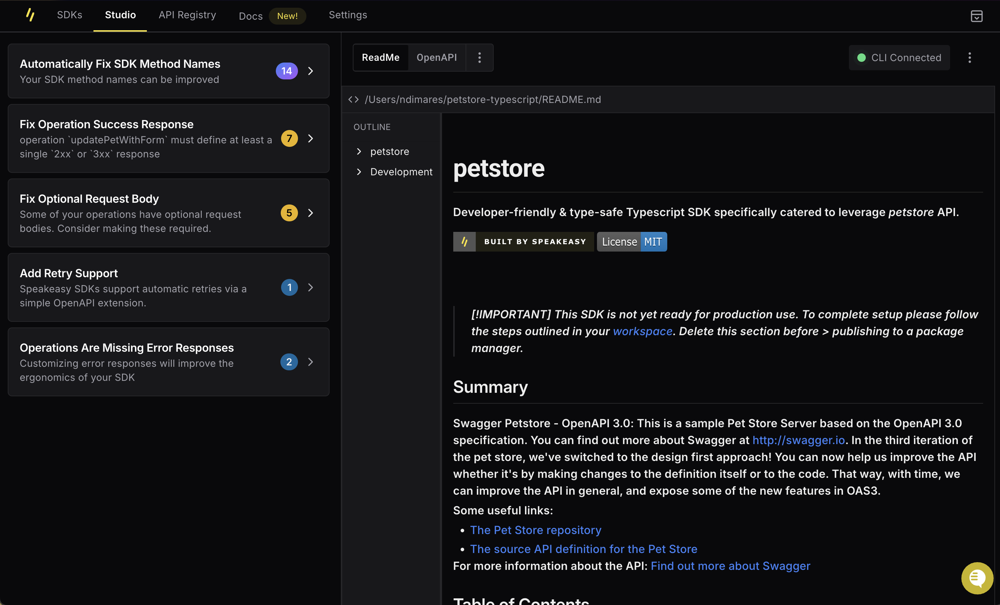

import { Callout } from "~/components";
import { SupportedLanguagesData } from "~/data/shared/supportedLanguages";
import { IconGrid } from "~/features/shared/recipes";
import { CodeWithTabs } from "~/components/codehike/CodeTabs";
import { SignUpButton } from "~/features/shared/recipes";

# Generate SDKs from OpenAPI

Generating your first SDK with Speakeasy takes no more than a few minutes. Follow these steps to get started.

## Sign up for Speakeasy
First sign up for a free Speakeasy account at [https://app.speakeasy.com](https://app.speakeasy.com).

<SignUpButton className="w-fit my-8"/>

New accounts start with a 14 day free trial of Speakeasy's business tier, to enable users to try out every SDK generation feature. At the end of the trial, accounts will revert to the free tier. No credit card is required.

Free accounts can continue to generate one SDK with up to 50 API methods free of charge.

---

## Install the Speakeasy CLI

After signing up, install the Speakeasy CLI using one of the following methods:

<CodeWithTabs>

```bash !!tabs Homebrew
# Homebrew (macOS)
brew install speakeasy-api/homebrew-tap/speakeasy
```

```bash !!tabs Script
# Script Installation (macOS and Linux)
curl -fsSL https://go.speakeasy.com/cli-install.sh | sh
```

```bash !!tabs Winget
# Windows Installation
# Using winget:
winget install speakeasy
```

```bash !!tabs Choclatey
# Using Chocolatey:
choco install speakeasy
```
</CodeWithTabs>

For manual installation, download the latest release from the [releases page](https://github.com/speakeasy-api/speakeasy/releases), extract the binary, and add it to the system path.

---

## Speakeasy Quickstart

For first-time SDK generation, run `speakeasy quickstart`.

```bash
speakeasy quickstart
```

The CLI will prompt you to authenticate with your Speakeasy account. A browser window will open where you can select a workspace to associate the CLI with. You can always change workspaces later if required.

---

## Upload an OpenAPI document

After authenticating you will be prompted to input an OpenAPI document:

<Screenshot variant="cli" docs={true}>
  
</Screenshot>

Provide either a link to a remote hosted OpenAPI document, or a relative path to a local file in one of the supported formats:

| Spec Format         | Supported |
| ------------------- | :-------: |
| OpenAPI 3.0         |    ✅     |
| OpenAPI 3.1         |    ✅     |
| JSON Schema         |    ✅     |

<Callout title="TIP" variant="success">
  If your spec is in an unsupported format, use one of the following tools to convert it:

- [Swagger 2.0 -> OpenAPI 3.0](https://editor.swagger.io/): go to **Edit > Convert to OpenAPI 3.0**
- [Postman -> OpenAPI 3.0](https://kevinswiber.github.io/postman2openapi/)

</Callout>

---

## Select an SDK language

After configuring the OpenAPI document, the next step prompt is to name your SDK. It's best to name the SDK after the company or project it's being used for.

Choose a name for your SDK. And pick an SDK output directory.

<Screenshot variant="cli" docs={true}>
  
</Screenshot>

There will then be a language selection prompt:

<Screenshot variant="cli" docs={true}>
  
</Screenshot>

For each language,Speakeasy has crafted generators with language experts to be highly idiomatic. Follow the links below for all the details on the design decisions that have gone into each language we support:

<IconGrid { ...SupportedLanguagesData } />

## Complete the SDK configuration

The final steps are to configure a package name for the SDK package and pick an SDK output directory. The package name will only be relevant, when it comes time to publish the package. The CLI will infer a name from the OpenAPI document, which can be optionally overwritten.

Then you specify the output directory for the generated SDK.

<Screenshot variant="cli" docs={true}>

</Screenshot>

Speakeasy validates the specifications and generates the SDK after receiving all inputs. The process executes [`speakeasy run`](/docs/speakeasy-reference/cli/run) to validate, generate, compile, and set up the SDK. A confirmation message displays the generated SDK details upon successful completion:

<Screenshot variant="cli" docs={true}>
  
</Screenshot>

---

## Iterating on the SDK

If the SDK is successfully generated, there will be a prompt asking the user to open the SDK studio. The Studio is a web GUI that helps users make look & feel improvements to their SDKs. It uses [OpenAPI Overlays](/openapi/overlays) to preserve the original OpenAPI specification while allowing users to make changes to the generated SDK.

Saved changes in the Studio automatically triggers a regeneration of the SDK locally.

<Screenshot variant="webapp" docs={true}>
  
</Screenshot>

It is also posisble to make changes without the Studio. Check out the following guide on [customizing your SDKs](/docs/customize-sdks/) for all the details.

## Next Step: Uploading your SDK to GitHub

Once the SDK is looking good, you can upload it to GitHub. Follow the [Github setup guide](/docs/manage/github-setup)
