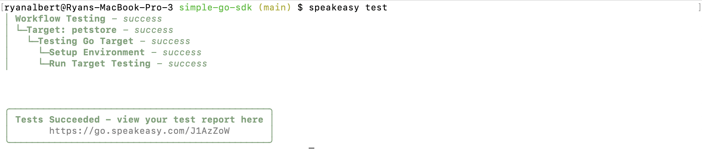
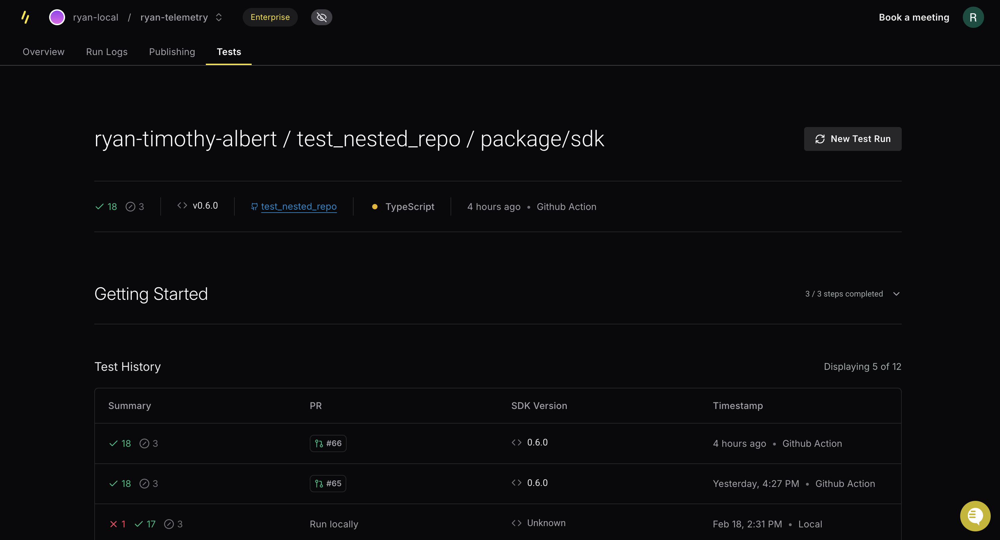

# Running SDK Tests

Run testing, via any of these options, depends on your desired use case:

- Directly via the [`speakeasy test`](/docs/speakeasy-reference/cli/test) CLI command.
- In [GitHub Actions workflows](/docs/customize-testing/github-actions).
- In the [`speakeasy run`](/docs/speakeasy-reference/cli/run) CLI command and existing GitHub Actions generation workflow with additional Speakeasy workflow configuration.

## Via CLI

If you have multiple SDK targets the following will prompt you on which targets you would like to run tests for.
```bash
speakeasy test
```

This will run tests for all SDKs in the repo.
```bash
speakeasy test -t all
```

<Screenshot variant="cli">
  
</Screenshot>

## During Run

For `speakeasy run` support, modify the Speakeasy workflow configuration (`.speakeasy/workflow.yaml`).

Enable running tests during Speakeasy workflows by adding to one or more of the targets in the  `targets` section of the configuration.

```yaml
# !focus(4:5)
targets:
  example-target:
    # ... other existing configuration ...
    testing:
      enabled: true
```

## Viewing Test Reports

You can view your test reports by navigating to the Tests tab under a particular SDK in the [speakeasy dashboard](https://app.speakeasy.com/).

<Screenshot
  darkened
  url="app.speakeasy.com"
>
  
</Screenshot>

## Next Steps

- [Customize your SDK tests](/docs/customize-testing/customizing-sdk-tests)
- [Setup testing in GitHub Actions](/docs/customize-testing/github-actions)
