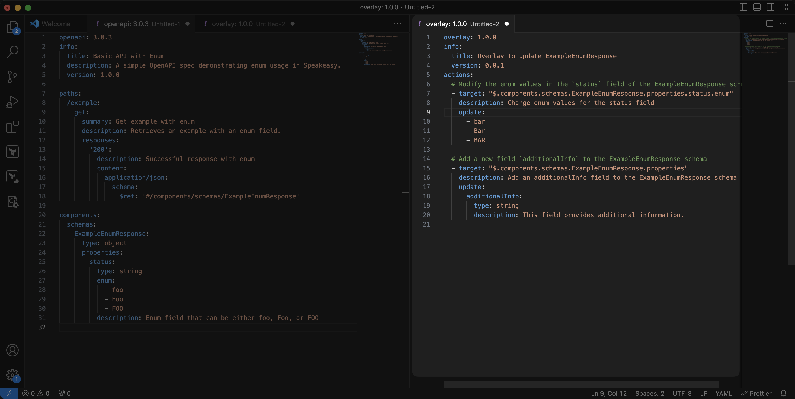
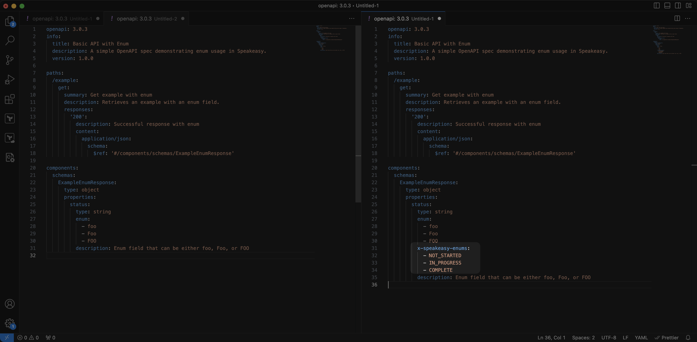
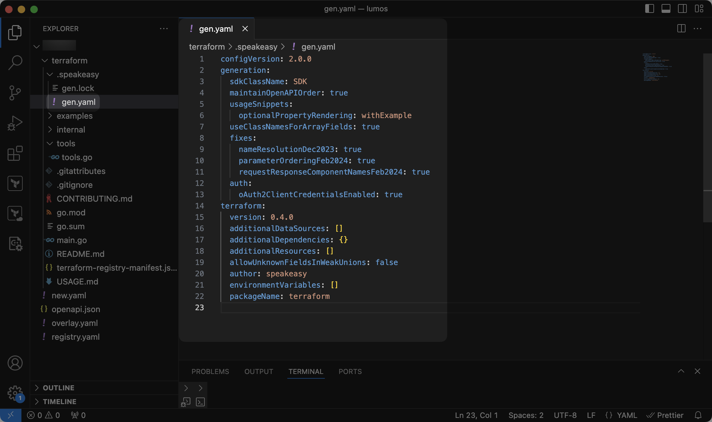

# Customization basics

The Speakeasy SDK pipeline uses sensible defaults to generate SDKs, but various customizations can improve the user experience. Customizations can be applied using the following methods:

1. Modifying the OpenAPI document.
2. Adding `x-speakeasy` extensions to the OpenAPI document.
3. Editing the `gen.yaml` file in the SDK repository.

---

## 1. Modifying the OpenAPI document

The OpenAPI document is the foundation of SDK generation. Modifications to the OpenAPI document influence the structure, naming conventions, and functionality of generated SDKs.

Learn more about OpenAPI in [the reference documentation](/openapi).

### Modifying the OpenAPI document with overlays

Speakeasy supports OpenAPI overlays, which you can use to customize and extend existing OpenAPI documents without directly modifying them. Overlays are especially useful for applying different configurations or updates to the specification for various environments or SDKs without altering the base OpenAPI document.

Overlays work by referencing and extending parts of the base OpenAPI document. They can be used to add, override, or remove elements such as paths, schemas, parameters, or security configurations.

[Learn more about overlays](/docs/prep-openapi/overlays/create-overlays).

---

## 2. Using x-speakeasy extensions

Proprietary Speakeasy extensions provide fine-tuned control over the SDK, enabling you to modify behaviors like retries, pagination, error handling, and other advanced SDK features.

Add Speakeasy extensions to the OpenAPI document.

For a complete list of available extensions, see the [Speakeasy extensions reference](/docs/speakeasy-extensions).

---

## 3. Editing the gen.yaml file

Further customize Speakeasy-generated SDKs by editing the `gen.yaml` file, typically located in the `.speakeasy` folder at the root of the SDK. This configuration file contains both language-agnostic and language-specific settings, offering more control over the structure and behavior of the SDK beyond what the OpenAPI document provides.

Edit the `gen.yaml` file to modify elements like class names, method parameters, and response formatting.

For a complete list of available options, refer to the [`gen.yaml` reference](/docs/gen-reference).

---

## SDK Dependencies

Speakeasy-generated SDKs use carefully tested dependencies and tools to ensure reliability and compatibility. These dependencies are selected based on extensive testing and best practices for each language ecosystem.

### Dependency Version Management

Speakeasy does not provide an out-of-the-box way to change the versions of dependencies that are automatically added to generated SDKs. This design decision ensures that:

- All SDKs use dependencies that have been thoroughly tested with the generator

- Compatibility issues between dependencies are minimized

- Security vulnerabilities in dependencies can be addressed systematically

If you need to use specific dependency versions for your project, the recommended approach is:

1. **Post-generation scripts**: Implement a post-generation build process that modifies dependency specifications before building or publishing your SDK. This can be integrated into your CI/CD pipeline to run automatically after SDK generation.

For example, you might create a script that:

- Parses and modifies package.json, requirements.txt, go.mod, or other dependency files

- Updates specific dependency versions to meet your requirements

- Runs before the build or publish step in your workflow

2. **Contact Speakeasy support**: For enterprise customers with specific dependency requirements, contact [Speakeasy support](/docs/enterprise-support) to discuss custom solutions.

<Callout title="CAUTION" variant="warning">

  Modifying dependency versions may lead to compatibility issues or unexpected behavior. Proceed with caution and thorough testing.

</Callout>
