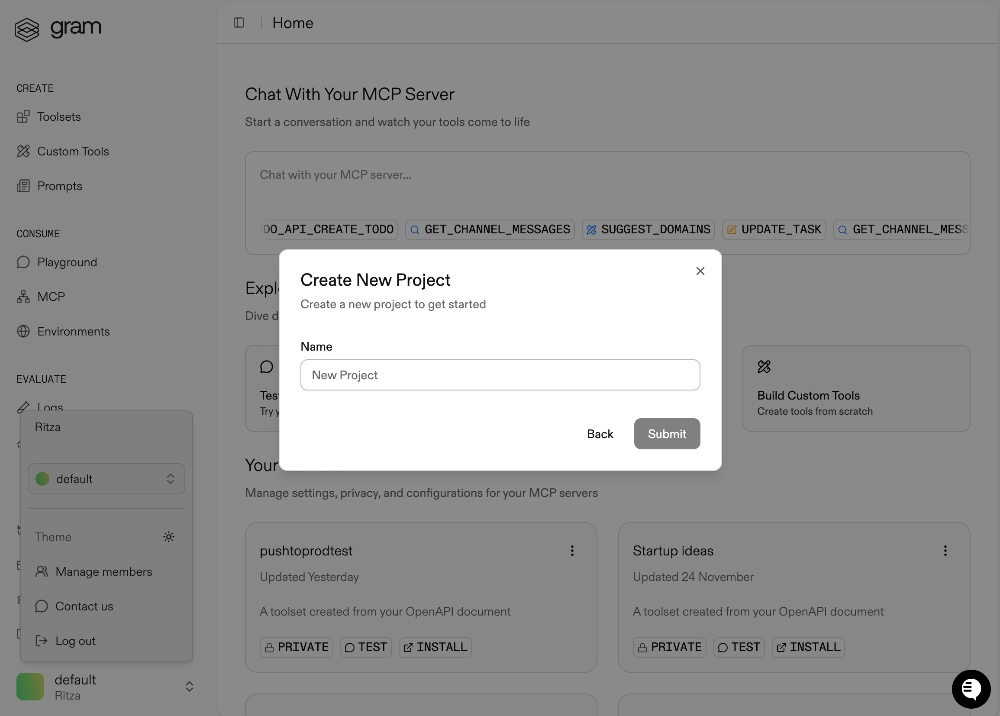
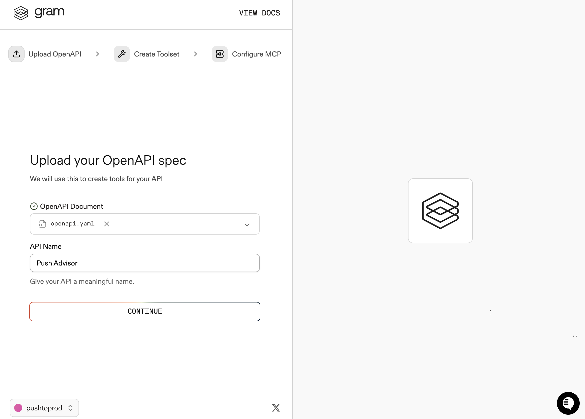
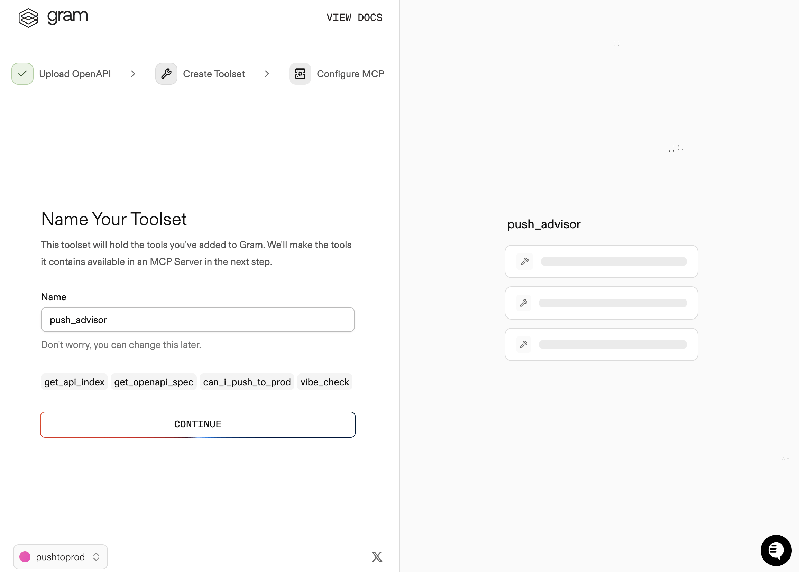
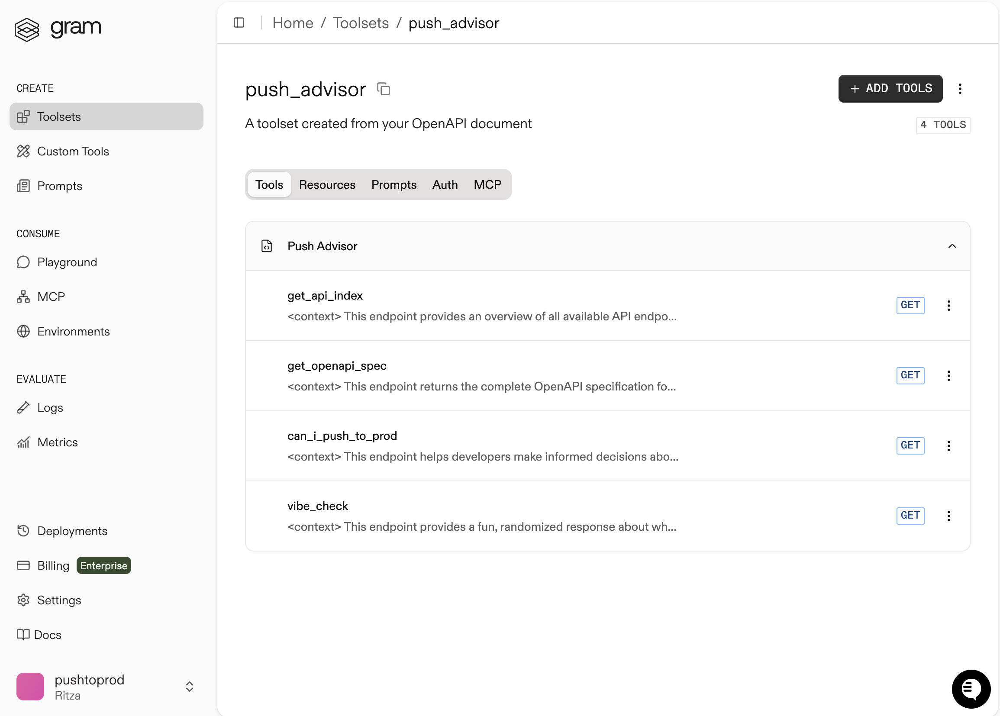
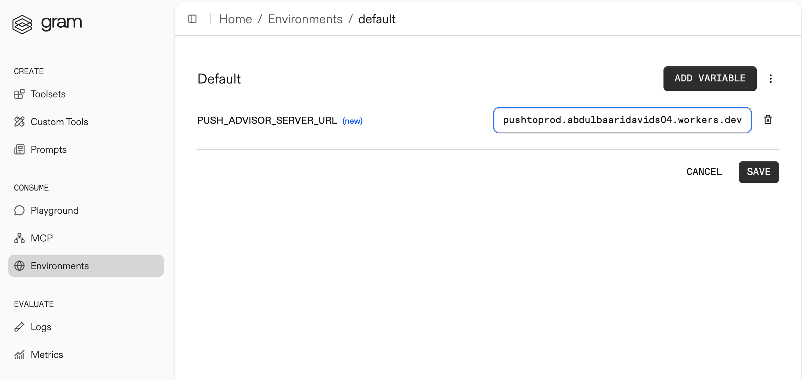
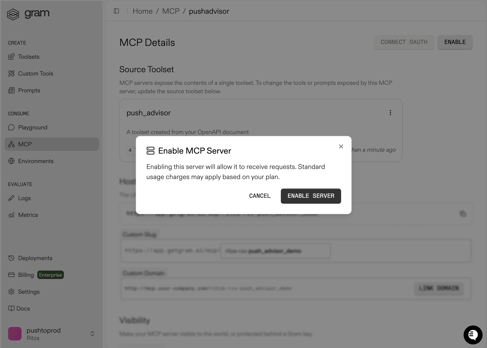

```
title: "Connecting Mastra Agents to Gram-Hosted MCP Servers"
description: "Build a Mastra agent that connects to a Gram-hosted MCP server and uses natural language to query your APIs."
sidebar:
  order: 2
```

[Mastra](https://mastra.ai/) is a TypeScript framework for building AI-powered applications. Its MCP client lets you connect agents to external tools and APIs. This guide shows you how to connect a Mastra agent to a Gram-hosted MCP server using the Push Advisor API from the [Gram concepts guide](https://docs.speakeasy.com/mcp/concepts).

By the end, you'll have a workflow that uses natural language to check whether it's safe to push to production.

Find the complete code and OpenAPI document in the [Push Advisor API repository](LINK_HERE).

## Prerequisites

To follow this tutorial, you need:

- A [Gram account](/product/gram)
- An OpenAPI API key
- A Node environment set up on your machine

## Creating a Gram MCP server

If you already have a Gram MCP server configured, you can skip to [connecting Mastra to your Gram-hosted MCP server](#connecting-mastra-to-your-gram-hosted-mcp-server). For an in-depth guide to how Gram works and more details on how to create a Gram-hosted MCP server, check out the [Gram concepts guide](/mcp/core-concepts).

### Setting up a Gram project

In the [Gram dashboard](https://app.getgram.ai), click **New Project** to create a new project. Enter a project name and click **Submit**



Once the project is created click the **Get Started** button.

Choose **Start from API**. Gram will then guide you through the following steps.

#### Step 1: Upload the OpenAPI document

Upload the [Push Advisor OpenAPI document](https://github.com/ritza-co/gram-examples/blob/main/push-advisor-api/openapi.yaml), enter the name of your API, and click **Continue**.



#### Step 2: Create a toolset

Give your toolset a name (for example, "Push Advisor") and click **Continue**.



Notice that the names of the tools that will be generated from your OpenAPI document are displayed in this dialog.

#### Step 3: Configure MCP

Enter a URL slug for the MCP server and click **Continue**.


Gram will create a new toolset from the OpenAPI document.

Click **Toolsets** in the sidebar to view the Push Advisor toolset.



### Configuring environment variables

[Environments](/docs/gram/concepts/environments) store API keys and configuration separately from your toolset logic.

In the **Environments** tab, click the **Default** environment. Click **Fill for Toolset**. Select the **Push Advisor** toolset and click **Fill Variables** to automatically populate the required variables.


The Push Advisor API is hosted at `https://canpushtoprod.abdulbaaridavids04.workers.dev`, so set the `<your_API_name>_SERVER_URL` environment variable to `https://canpushtoprod.abdulbaaridavids04.workers.dev`. Click **Save**.




### Publishing an MCP server

Let's make the toolset available as an MCP server.

Go to the **MCP** tab, find the Push Advisor toolset, and click the title of the server.

On the **MCP Details** page, click **Enable**  and then **Enable Server** to enable the server.



Take note of your MCP server URL on the **Hosted URL** section.

[Generate a GRAM API key](/docs/gram/concepts/api-keys) in the **Settings** tab.

## Connecting Mastra to your Gram-hosted MCP server

This section walks you through building an agentic workflow using Mastra. 

### Project setup

Run the following command to create a Mastra project. 

```bash
npm create mastra@latest
```

You will be prompted with the following options: 

- The project name: mastra-mcp
- The destination for the Mastra files: Press Enter
- The default provider: OpenAI
- The OpenAI key: Enter the OpenAI key

Then press Enter for the rest of options. 

 

Once the project is created, you will have a `.env.local` environment variable file. Add the Gram key in the file. 

```txt
GRAM_KEY=your-gram-api-key-here
OPENAI_API_KEY=your-openai-api-key-here
```

