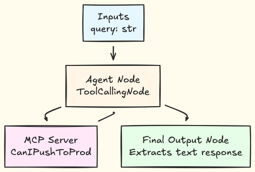
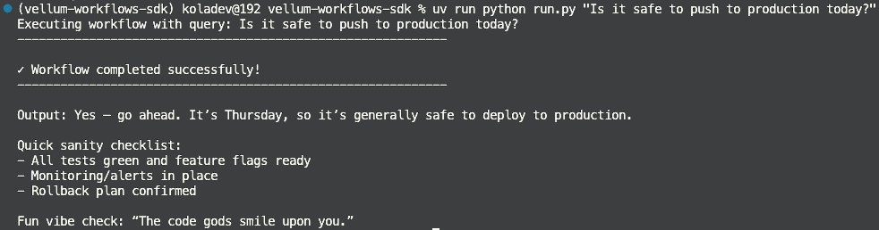

[Vellum](https://www.vellum.ai/) workflows can connect to Model Context Protocol (MCP) servers to interact with external APIs and tools. This guide shows you how to connect a Vellum workflow to a [Gram-hosted MCP server](/blog/release-gram-beta) using the Push Advisor API from the [Gram concepts guide](/mcp/core-concepts).

By the end, you'll have a workflow that uses natural language to check whether it's safe to push to production.

Find the full code and OpenAPI document in the [Push Advisor API repository](https://github.com/ritza-co/gram-examples/tree/main/push-advisor-api).

## Prerequisites

To follow this tutorial, you need:

- A [Gram account](/product/gram)
- A [Vellum account](https://vellum.ai/) with an API key
- A Python environment set up on your machine
-  `uv` package manager installed
- Basic familiarity with making API requests

## Creating a Gram MCP server

If you already have a Gram MCP server configured, you can skip to [connecting Vellum to your Gram-hosted MCP server](#connecting-vellum-to-your-gram-hosted-mcp-server). For an in-depth guide to how Gram works and more details on how to create a Gram-hosted MCP server, check out the [Gram concepts guide](/mcp/core-concepts).

### Setting up a Gram project

In the [Gram dashboard](https://app.getgram.ai), click **New Project** to start the guided setup flow for creating a toolset and MCP server.


Enter a project name and click **Submit**.

Gram will then guide you through the following steps.

#### Step 1: Upload the OpenAPI document

Upload the [Push Advisor OpenAPI document](https://github.com/ritza-co/gram-examples/blob/main/push-advisor-api/openapi.yaml), enter the name of your API, and click **Continue**.


#### Step 2: Create a toolset

Give your toolset a name (for example, "Push Advisor") and click **Continue**.


Notice that the names of the tools that will be generated from your OpenAPI document are displayed in this dialog.

#### Step 3: Configure MCP

Enter a URL slug for the MCP server and click **Continue**.


Gram will create a new toolset from the OpenAPI document.

Click **Toolsets** in the sidebar to view the Push Advisor toolset.


### Publishing an MCP server

Let's make the toolset available as an MCP server.

Go to the **MCP** tab, find the Push Advisor toolset, and click the title of the server.

On the **MCP Details** page, tick the **Public** checkbox and click **Save**.


Scroll down to the **MCP Config** section and note your MCP server URL. For this guide, we'll use the public server URL format:

`https://app.getgram.ai/mcp/canipushtoprod`

For authenticated servers, you'll need an API key. [Generate an API key](/docs/gram/concepts/api-keys) in the **Settings** tab.

## Connecting Vellum to your Gram-hosted MCP server

This section walks you through creating a Vellum workflow using the Workflow SDK. The workflow will include an entry point, an agent node, and an output that determines whether today is a good day to push to production.

Run these commands to create the project directory and initialize a Python project:

```bash
# Create project directory
mkdir vellum-workflows-sdk
cd vellum-workflows-sdk

# Initialize with uv
uv init
```

Install the dependencies:

```bash
# Add Vellum SDK
uv add vellum-ai

# Add python-dotenv for environment variable management
uv add python-dotenv
```

Create a `.env` file in the project root with your API keys:

```txt
// .env

VELLUM_API_KEY=your-vellum-api-key-here
GRAM_KEY=your-gram-api-key-here
```

Test that your Vellum API key works:

```bash
export VELLUM_API_KEY=$(grep "^VELLUM_API_KEY=" .env | cut -d'=' -f2-)
uv run vellum ping
```

You should see your organization, workspace, and environment information printed to the console.

### Creating the workflow

A Vellum workflow has three main components: inputs that define what data the workflow accepts, nodes that process the data, and outputs that the workflow returns.

For this workflow, the agent node can make multiple calls to the MCP server as needed to answer the query.



Inside the project directory, create a file called `workflow.py`. Start by defining the input structure:

```python
from vellum.workflows.inputs.base import BaseInputs

...

class Inputs(BaseInputs):
    """Workflow input variables."""
    query: str
```

This defines a single input field `query` that accepts a string containing the user's question.

Next, define the MCP server connection:

```python
from vellum.workflows.constants import AuthorizationType
from vellum.workflows.references import EnvironmentVariableReference
from vellum.workflows.types.definition import MCPServer

...

# MCP server configuration
mcp_server = MCPServer(
    name="CanIPushToProd",
    url="https://app.getgram.ai/mcp/ritza-rzx-2cav1",
    authorization_type=AuthorizationType.API_KEY,
    api_key_header_key="Authorization",
    api_key_header_value=EnvironmentVariableReference(name="GRAM_KEY"),
)
```

Now define the agent node. The `Agent` class is a `ToolCallingNode` that uses the MCP server:

```python
from vellum import ChatMessagePromptBlock, PlainTextPromptBlock, PromptParameters, RichTextPromptBlock
from vellum.workflows.nodes.displayable.tool_calling_node import ToolCallingNode

class Agent(ToolCallingNode):
    """Agent node that uses the CanIPushToProd MCP server as a tool."""
    
    ml_model = "gpt-5-responses"
    prompt_inputs = {"query": Inputs.query}
    max_prompt_iterations = 25
    
    blocks = [
        ChatMessagePromptBlock(
            chat_role="SYSTEM",
            blocks=[
                RichTextPromptBlock(
                    blocks=[
                        PlainTextPromptBlock(
                            text="You are a helpful assistant with access to the CanIPushToProd MCP server. When users ask questions about pushing to production, you must actively use the available MCP tools to check the current status and provide a direct, clear answer. Do not ask the user what they want - instead, automatically use the appropriate tools and provide a helpful response based on the tool results. Always give a definitive answer when possible."
                        )
                    ]
                )
            ],
        ),
        ChatMessagePromptBlock(
            chat_role="USER",
            blocks=[
                RichTextPromptBlock(
                    blocks=[
                        PlainTextPromptBlock(text="{{ query }}")
                    ]
                )
            ],
        ),
    ]
    
    parameters = PromptParameters(
        temperature=0,
        max_tokens=1000,
        custom_parameters={"json_mode": False},
    )
    
    settings = {"stream_enabled": False}
    
    functions = [mcp_server]
```

The `Agent` class defines a tool-calling node that uses GPT-5 with the CanIPushToProd MCP server. The `blocks` list structures the conversation: a system message sets the assistant's role, and a user message injects the query using Jinja templating (`{{ query }}`). The `functions` list connects the MCP server, giving the agent access to its tools.

Create the output node to define how the workflow returns results:

```python
from vellum.workflows.nodes.displayable.final_output_node import FinalOutputNode
from vellum.workflows.state.base import BaseState

...

class FinalOutput(FinalOutputNode[BaseState, str]):
    """Final output node that returns the agent's text response."""
    
    class Outputs(FinalOutputNode.Outputs):
        value = Agent.Outputs.text
```

This node extracts the text output from the Agent node.

Finally, connect all components:

```python
from vellum.workflows.workflows.base import BaseWorkflow

class Workflow(BaseWorkflow[Inputs, BaseState]):
    """Vellum workflow with Agent node configured to use CanIPushToProd MCP server."""

    graph = Agent >> FinalOutput

    class Outputs(BaseWorkflow.Outputs):
        final_output = FinalOutput.Outputs.value
```

The `graph` defines the execution flow: `Agent >> FinalOutput` means data flows from the Agent node to the FinalOutput node.

### Running the workflow

Run the workflow with a query:
```bash
uv run python run.py "Is it safe to push to production today?"
```

The output shows the agent's response after it queries the MCP server and evaluates whether pushing to production is safe.



## What's next

You now have Vellum workflows connected to your Gram-hosted MCP server, giving them access to your custom APIs and tools.

Ready to build your own MCP server? [Try Gram today](/product/gram) and see how easy it is to turn any API into agent-ready tools that work with both Anthropic and OpenAI models.
