[Vellum](https://www.vellum.ai/) agents can connect to Model Context Protocol (MCP) servers to interact with external APIs and tools. This guide shows you how to connect a Vellum agent to a [Gram-hosted MCP server](/blog/release-gram-beta) using the Push Advisor API from the Gram [core concepts](/mcp/core-concepts) guide.

By the end, you'll have a Vellum Workflow that uses natural language to check whether it's safe to push to production.

Find the full code and OpenAPI document in the [Push Advisor API repository](https://github.com/ritza-co/gram-examples/tree/main/push-advisor-api).

## Prerequisites

To follow this tutorial, you need:

- A [Gram account](/product/gram)
- A [Vellum account](https://vellum.ai/)

## Creating a Gram MCP server

If you already have a Gram MCP server configured, you can skip to [connecting Vellum to your Gram-hosted MCP server](#connecting-vellum-to-your-gram-hosted-mcp-server). For an in-depth guide to how Gram works and more details on how to create a Gram-hosted MCP server, check out the [core concepts](/mcp/core-concepts) documentation.

### Setting up a Gram project

In the [Gram dashboard](https://app.getgram.ai), click **New Project** to create a new project. Enter a project name and click **Submit**

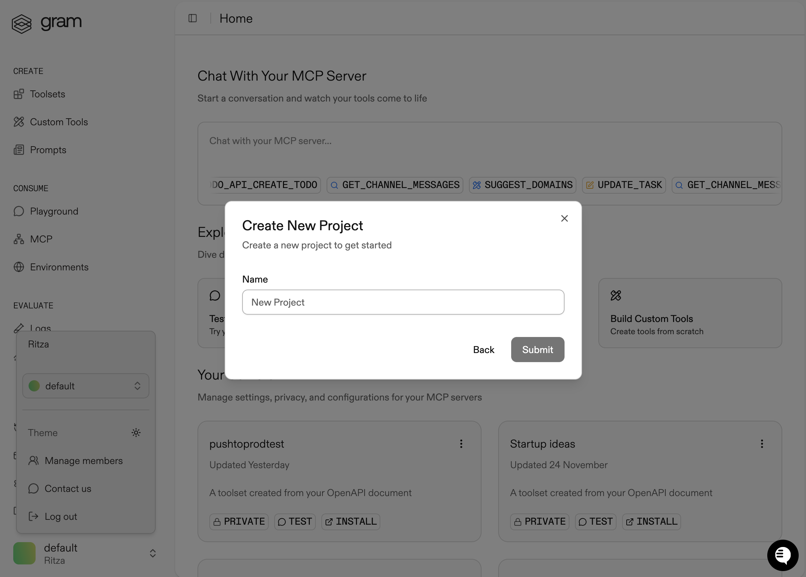

Once you've created the project, click the **Get Started** button.

Choose **Start from API**. Gram then guides you through the following steps.

#### Step 1: Upload the OpenAPI document

Upload the [Push Advisor OpenAPI document](https://github.com/ritza-co/gram-examples/blob/main/push-advisor-api/openapi.yaml), enter the name of your API, and click **Continue**.


#### Step 2: Create a toolset

Give your toolset a name (for example, `Push Advisor`) and click **Continue**.

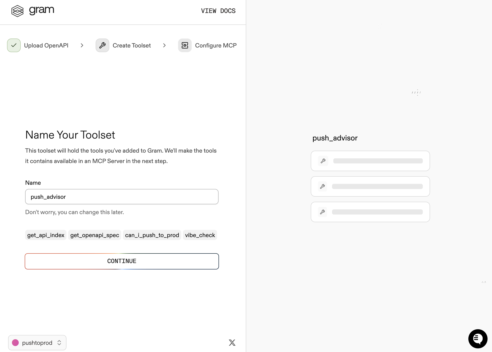

Notice that the **Name Your Toolset** dialog displays the names of the tools that Gram will generate from your OpenAPI document.

#### Step 3: Configure MCP

Enter a URL slug for the MCP server and click **Continue**.

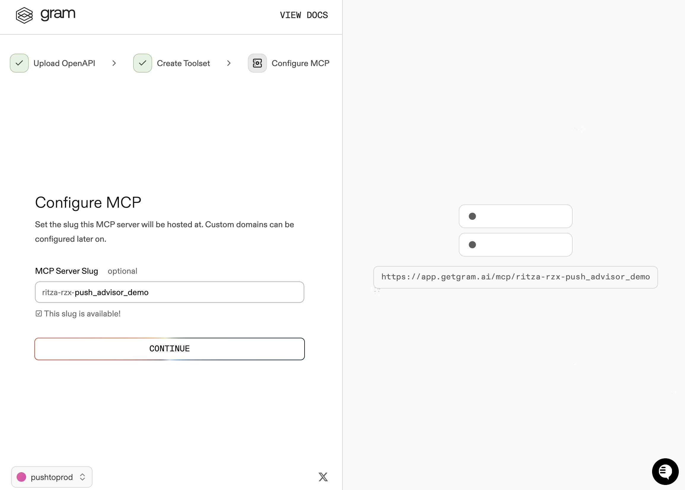

Gram will create a new toolset from the OpenAPI document.

Click **Toolsets** in the sidebar to view the Push Advisor toolset.

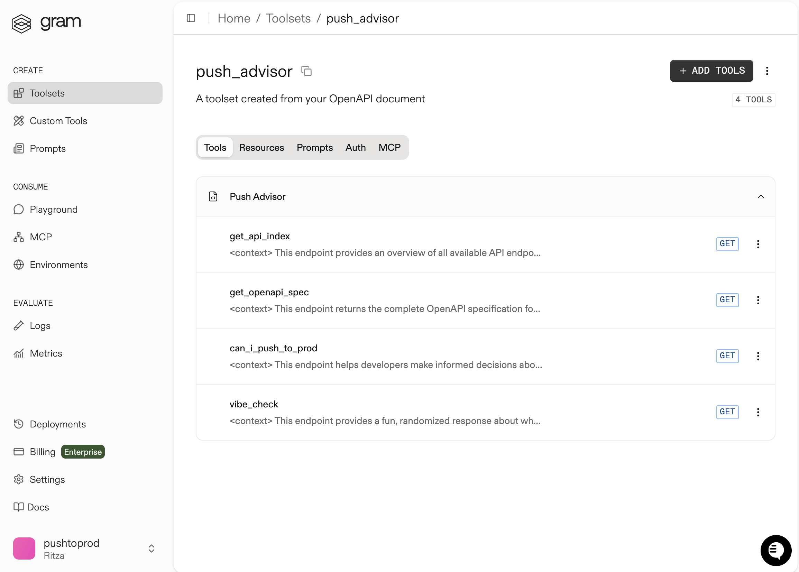

### Configuring environment variables

[Environments](/docs/gram/concepts/environments) store API keys and configuration separately from your toolset logic.

In the **Environments** tab, click the **Default** environment. Then click **Fill for Toolset**, select the **Push Advisor** toolset, and click **Fill Variables** to automatically populate the required variables.

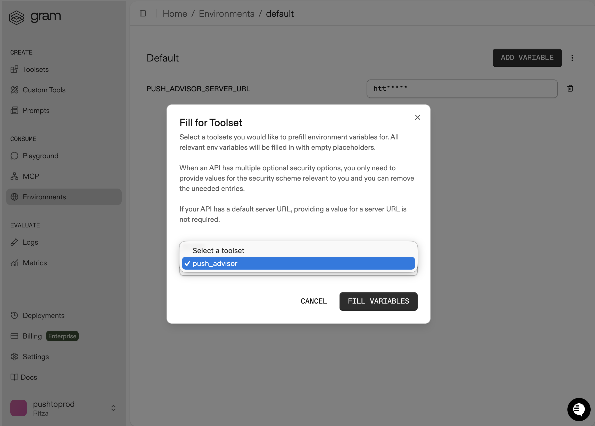

The Push Advisor API is hosted at `https://canpushtoprod.abdulbaaridavids04.workers.dev`, so set the `<your_API_name>_SERVER_URL` environment variable to `https://canpushtoprod.abdulbaaridavids04.workers.dev`. Click **Save**.

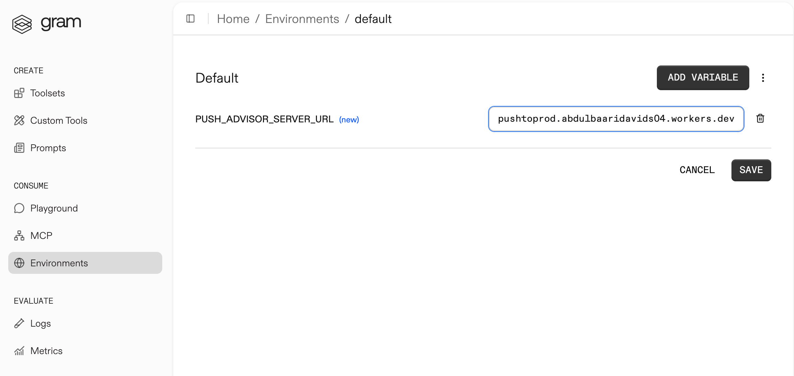

### Publishing an MCP server

Let's make the toolset available as an MCP server.

Go to the **MCP** tab, find the Push Advisor toolset, and click the title of the server.

On the **MCP Details** page, click **Enable** and then **Enable Server** to enable the server.


Take note of your MCP server URL in the **Hosted URL** section.

[Generate a GRAM API key](/docs/gram/concepts/api-keys) in the **Settings** tab.

## Connecting Vellum to your Gram MCP server

With the Push Advisor MCP server ready, you can connect it to Vellum by configuring a tool in an agent node.

## Adding a secret environment to Vellum

Configuring the MCP server requires your Gram Key. To add it as a secret, navigate to **Profile → Settings → Secrets & Variables → + Add Environment Variable**.

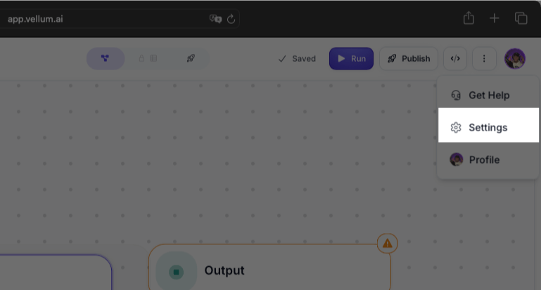

Enter `GRAM_KEY` for the variable name, paste your Gram key as the value, and click **Create Variable**.

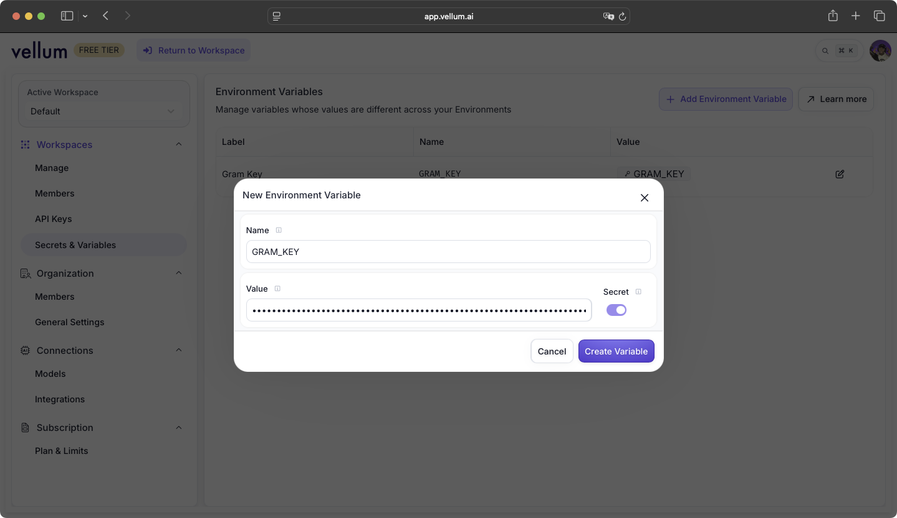

## Adding a Vellum agent

If you see a prompt input screen on the **New Workflow** creation screen, send Vellum the following prompt:

```
Create entrypoint, agent, and output nodes
```

Otherwise, use the **Create Workflow** button to create a new Workflow:

- Add an **Agent** node.

  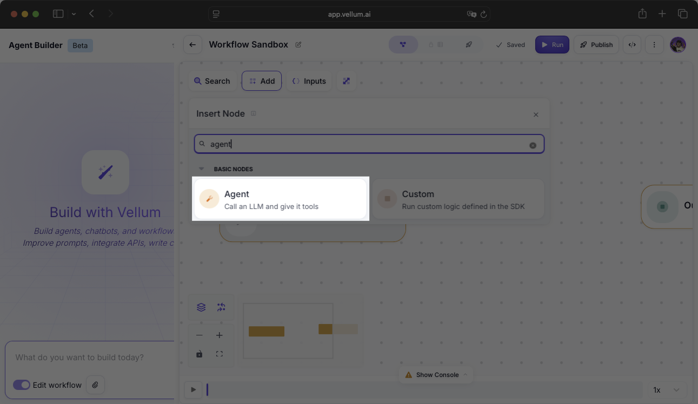

- Click the **Agent** node, then click **+ Tool**.

  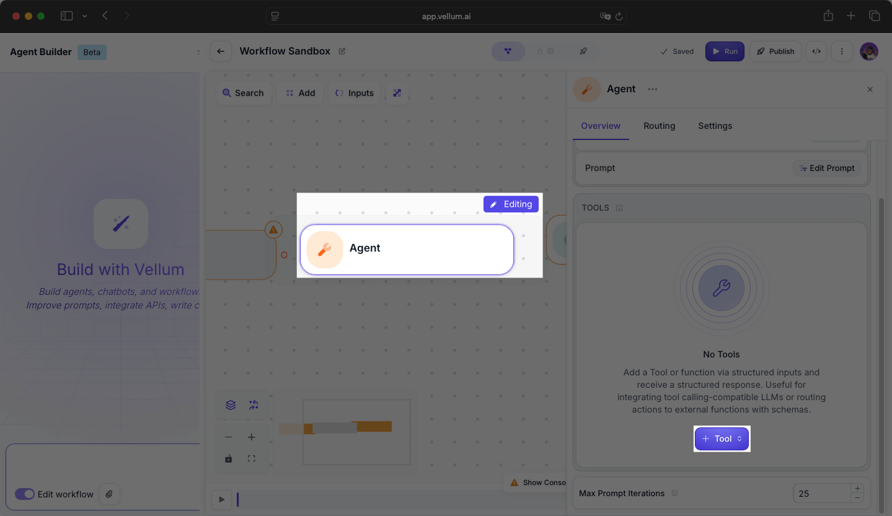

- Select **MCP Server** from the **Tool Type** options.

  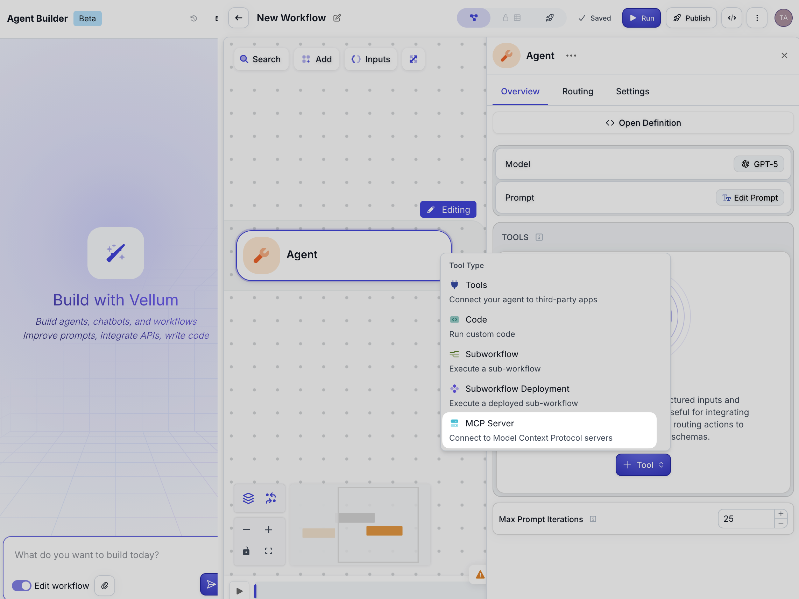

- Configure the MCP server as follows:

  - **Server Name:** Push Advisor
  - **Server URL:** `https://app.getgram.ai/mcp/your-server-slug` (your Gram MCP server URL)
  - **Authentication:** API Key
  - **API Key Header Name:** Authorization
  - **API Key Value:** GRAM_KEY

  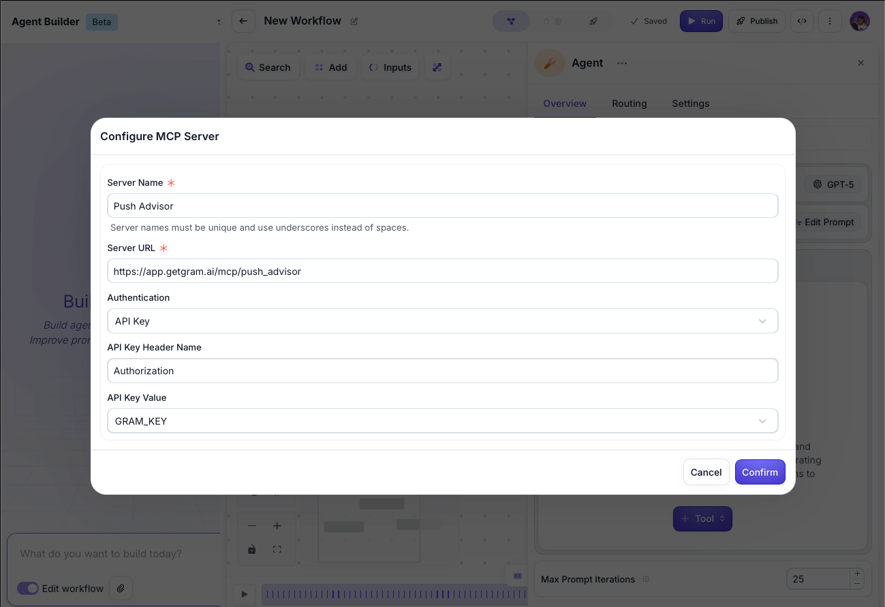

- Click **Confirm** to save.

  Vellum automatically discovers the available tools. You should see the MCP server listed under **Tools**.

- Now, go to the **Overview** tab and click **Edit Prompt** to add a prompt.

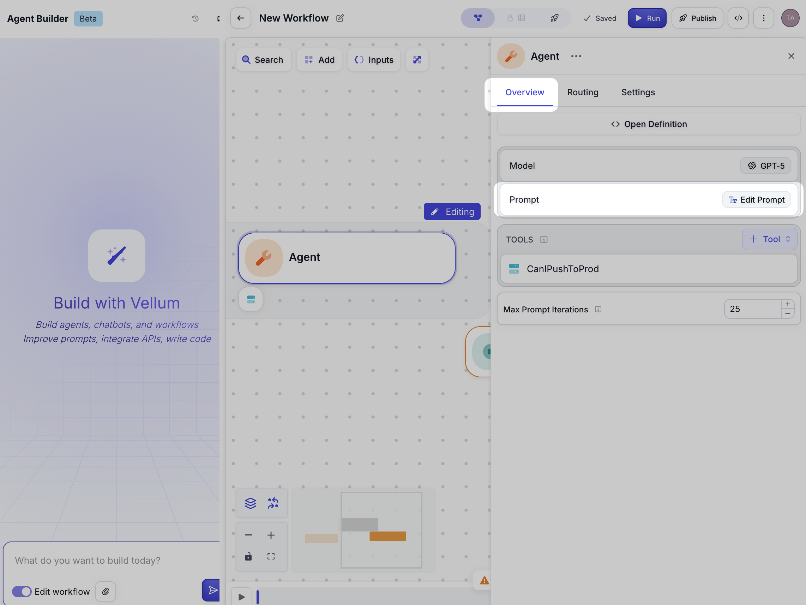

- In the modal, enter this system prompt:

  ```
  Is it safe to push to production today?
  ```

  

- Connect the **Entrypoint** node to the **Agent** node, then connect the **Agent** node to the **Output**. Click on the **Output** node and under **Overview → Output Value**, select **Agent** for the **Node Output**, and select **Text** for the **Output Name**.

  

- Click **▶️ Run**. The Workflow should return a response indicating whether pushing to production is safe based on the Push Advisor server's evaluation.

  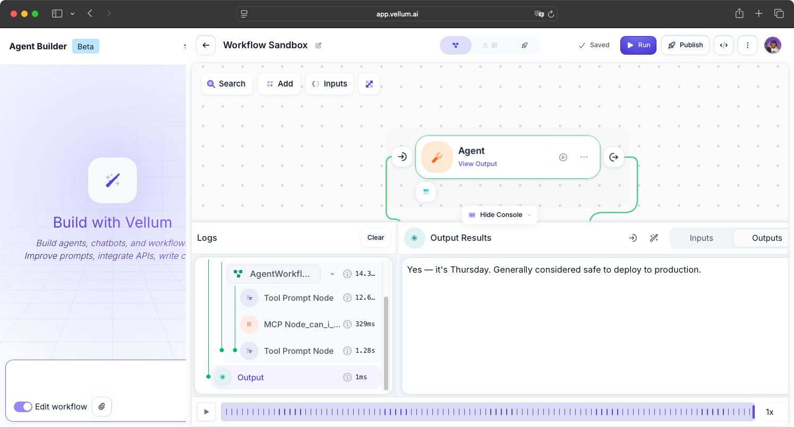

## Troubleshooting

Let's go through some common issues and how to fix them.

### MCP Client not connecting

If the MCP client can't connect to your server:

- Verify the server URL is correct.
- Check that the MCP server is published as public in Gram.
- For authenticated servers, ensure your Gram API key is valid.
- Test the connection using the Gram Playground first.

### Tool calls not working

If the AI agent isn't calling the MCP tools:

- Ensure the MCP client is properly configured in the AI Agent node.
- Check that your AI model has sufficient context about available tools.
- Try being more explicit in your prompts about using the Push Advisor tool.

### Authentication errors

For authenticated servers:

- Verify your Gram API key in the dashboard under **Settings → API Keys**.
- Ensure the authorization header format is correct.
- Check that environment variables are correctly set in Gram.

## What's next

You now have Vellum connected to a Gram-hosted MCP server, enabling AI-powered automation workflows with access to your APIs and tools.

Ready to build your own MCP server? [Try Gram today](/product/gram) and see how easy it is to turn any API into agent-ready tools.

