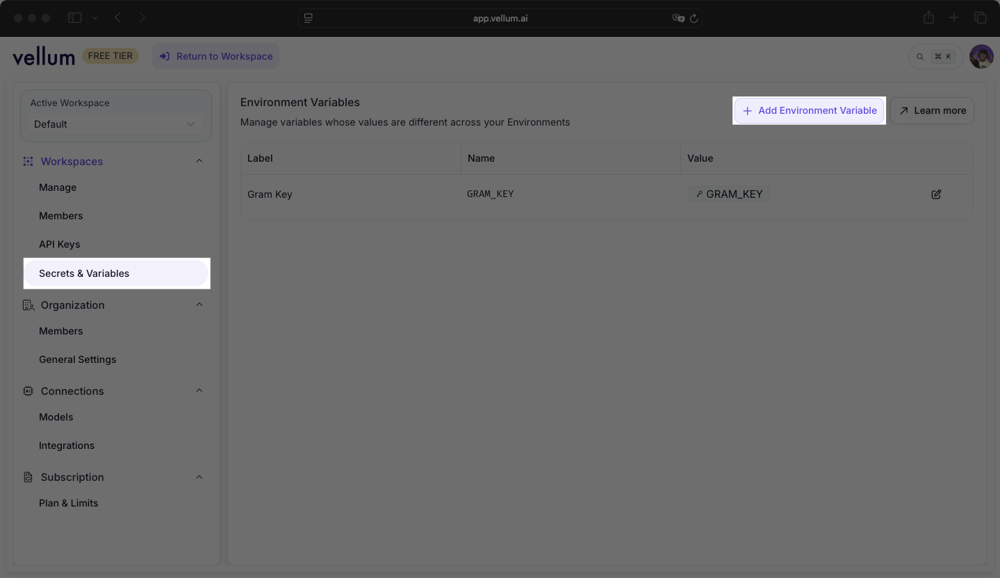

[Vellum](https://www.vellum.ai/) agents can connect to Model Context Protocol (MCP) servers to interact with external APIs and tools. This guide shows you how to connect a Vellum agent to a [Gram-hosted MCP server](/blog/release-gram-beta) using the Push Advisor API from the [Gram concepts guide](/mcp/core-concepts).

By the end, you'll have a workflow that uses natural language to check whether it's safe to push to production.

Find the full code and OpenAPI document in the [Push Advisor API repository](https://github.com/ritza-co/gram-examples/tree/main/push-advisor-api).

## Prerequisites

To follow this tutorial, you need:

- A [Gram account](/product/gram)
- A [Vellum account](https://vellum.ai/)

## Creating a Gram MCP server

If you already have a Gram MCP server configured, you can skip to [connecting Vellum to your Gram-hosted MCP server](#connecting-vellum-to-your-gram-hosted-mcp-server). For an in-depth guide to how Gram works and more details on how to create a Gram-hosted MCP server, check out the [Gram concepts guide](/mcp/core-concepts).

### Setting up a Gram project

In the [Gram dashboard](https://app.getgram.ai), click **New Project** to start the guided setup flow for creating a toolset and MCP server.


Enter a project name and click **Submit**. 

Gram will then guide you through the following steps.

#### Step 1: Upload the OpenAPI document

Upload the [Push Advisor OpenAPI document](https://github.com/ritza-co/gram-examples/blob/main/push-advisor-api/openapi.yaml), enter the name of your API, and click **Continue**.


#### Step 2: Create a toolset

Give your toolset a name (for example, `Push Advisor`) and click **Continue**. 


Notice that the names of the tools that will be generated from your OpenAPI document are displayed in this dialog.

#### Step 3: Configure MCP

Enter a URL slug for the MCP server and click **Continue**.


Gram will create the toolset from the OpenAPI document.

Click **Toolsets** in the sidebar to view the Push Advisor toolset.


### Configuring environment variables

[Environments](/docs/gram/concepts/environments) store API keys and configuration separately from your toolset logic.

In the **Environments** tab, click the **Default** environment. Click **Edit** and then **Fill for Toolset**. Select the **Push Advisor** toolset and click **Fill Variables** to automatically populate the required variables.


The Push Advisor API is hosted at `canpushtoprod.abdulbaaridavids04.workers.dev`, so set the `<API_name>_SERVER_URL` environment variable to `https://canpushtoprod.abdulbaaridavids04.workers.dev`. Click **Update** and then **Save**.


### Publishing an MCP server

Let's make the toolset available as an MCP server.

Go to the **MCP** tab, find the Push Advisor toolset, and click **Edit**. 

On the **MCP Details** page, tick the **Public** checkbox and click **Save**.


Scroll down to the **MCP Installation** section and click the **View** button to open the Installation page.


Scroll down to the **Raw Configuration** section and copy the configuration.


The configuration will look something like this:

```json
{
  "mcpServers": {
    "GramPushadvisor": {
      "command": "npx",
      "args": [
          "mcp-remote",
          "https://app.getgram.ai/mcp/canipushtoprod"
        ]
    }
  }
}
```

Use the **Authenticated Server** configuration if you want to use the MCP server in a private environment.

You'll need an API key to use an authenticated server. [Generate an API key](/docs/gram/concepts/api-keys) in the **Settings** tab and copy it to the `GRAM_KEY` environment variable in place of `<your-key-here>`.

The authenticated server configuration looks something like this:

```json
{
  "mcpServers": {
    "GramPushadvisor": {
      "command": "npx",
      "args": [
        "mcp-remote",
        "https://app.getgram.ai/mcp/canipushtoprod",
        "--header",
        "Authorization: ${GRAM_KEY}"
      ],
      "env": {
        "GRAM_KEY": "Bearer <your-key-here>"
      }
    }
  }
}
```

## Connecting Vellum to your Gram MCP server

With the CanIPushToProd MCP server ready, you can connect it to Vellum by configuring a tool in an agent Node.

## Adding a secret environment to Vellum

Configuring the MCP server requires your Gram Key. To add it as a secret, navigate to **Profile → Settings**.


Go to the **Secrets & Variables** page and click **+ Add Environment Variable**.



Enter `GRAM_KEY` for the variable name, paste your Gram key as the value, and click **Create Variable**.


## Adding a Vellum agent

In a new workflow, add an input as an Agent Node.


Click the Agent Node, then click **+ Tool**.


Select **MCP Server** from the options.


Fill in the MCP server configuration:

- **Server Name**: CanIPushToProd
- **Server URL**: https://app.getgram.ai/mcp/canipushtoprod
- **Authentication**: API Key
- **API Key Header Name**: Authorization
- **API Key Value**: GRAM_KEY


Confirm to save. Vellum automatically discovers the available tools. You should see the MCP server listed under Tools.


To add a prompt, go to the **Overview** tab and click **Edit Prompt**. In the modal, enter this system prompt:

```txt
Is it safe to push to production today?
```


Connect the Entrypoint to the Agent Node, then connect the Agent Node to the Output. Click the Output node, select **Agent** for the output type, and set the output name to `Text`.


Click **▶️ Run**. The workflow should return a response indicating whether pushing to production is safe based on the CanIPushToProd server's evaluation.


## Troubleshooting

Let's go through some common issues and how to fix them.

### MCP Client not connecting

If the MCP Client can't connect to your server:

- Verify the server URL is correct.
- Check that the MCP server is published as public in Gram.
- For authenticated servers, ensure your API key is valid.
- Test the connection using the Gram Playground first.

### Tool calls not working

If the AI agent isn't calling the MCP tools:

- Ensure the MCP Client is properly configured in the AI Agent node.
- Check that your AI model has sufficient context about available tools.
- Try being more explicit in your prompts about using the Push Advisor tool.

### Authentication errors

For authenticated servers:

- Verify your Gram API key in the dashboard under **Settings > API Keys**.
- Ensure the authorization header format is correct.
- Check that environment variables are correctly set in Gram.

## What's next

You now have Vellum connected to a Gram-hosted MCP server, enabling AI-powered automation workflows with access to your APIs and tools.

Ready to build your own MCP server? [Try Gram today](/product/gram) and see how easy it is to turn any API into agent-ready tools.

