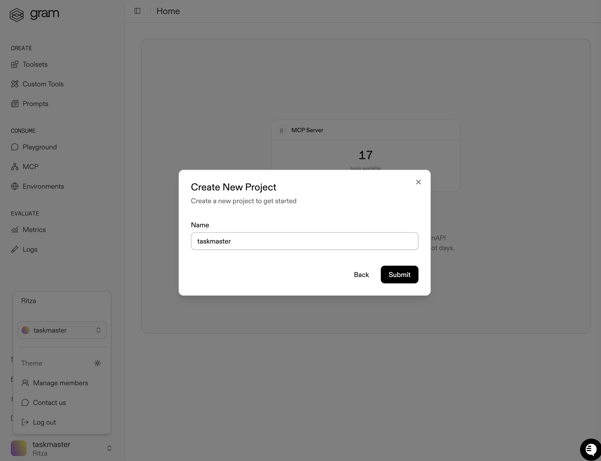
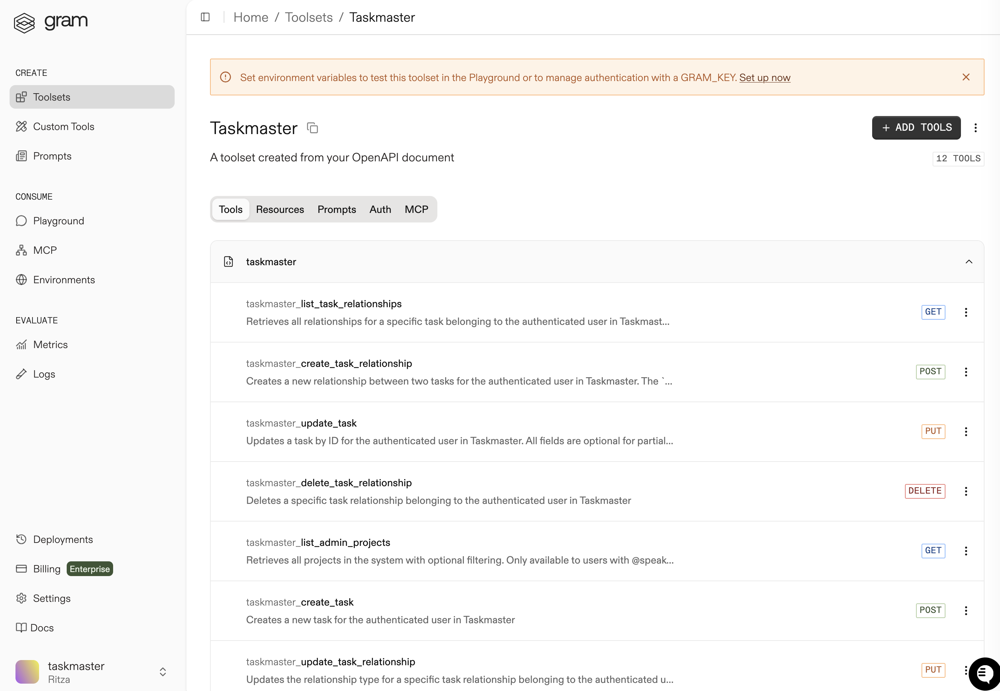
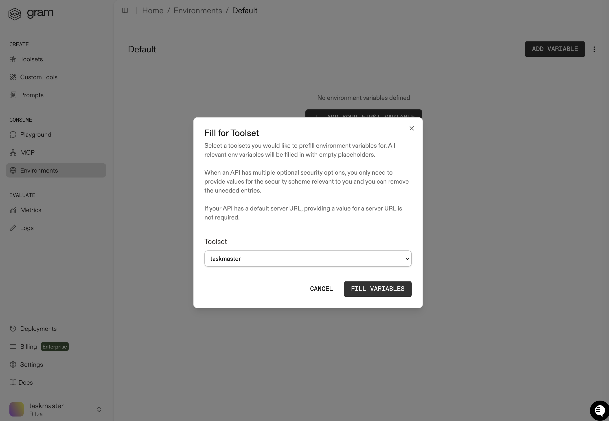
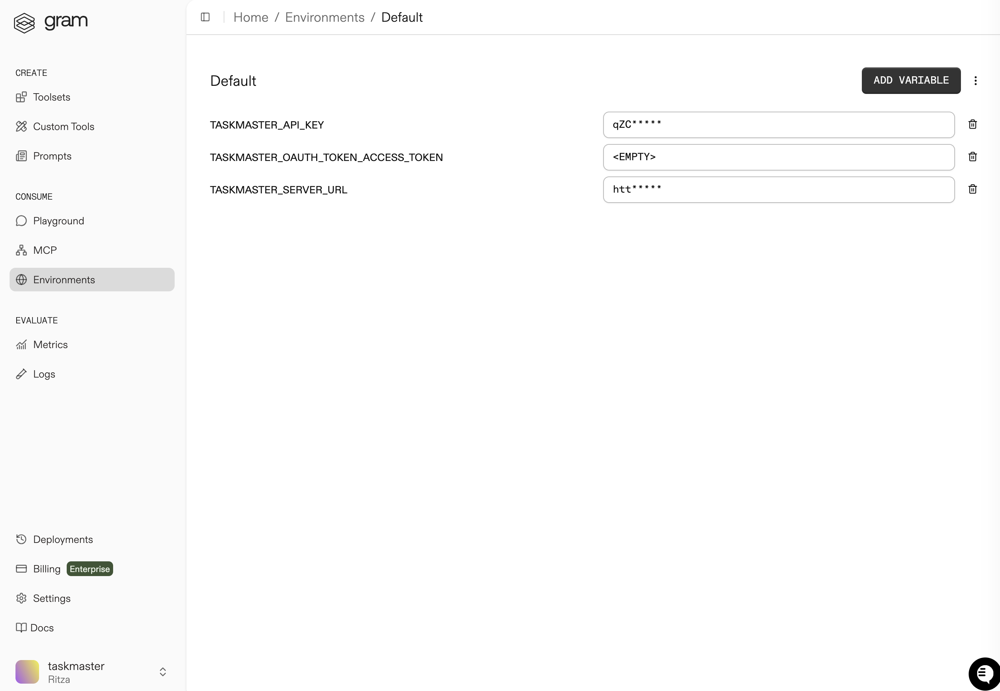
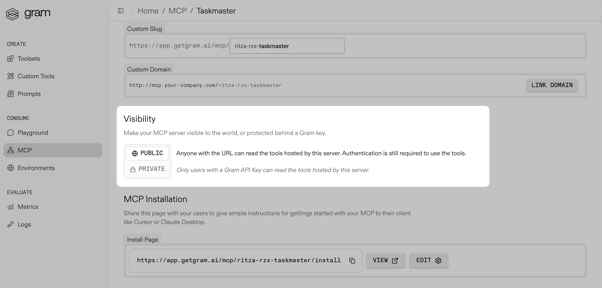
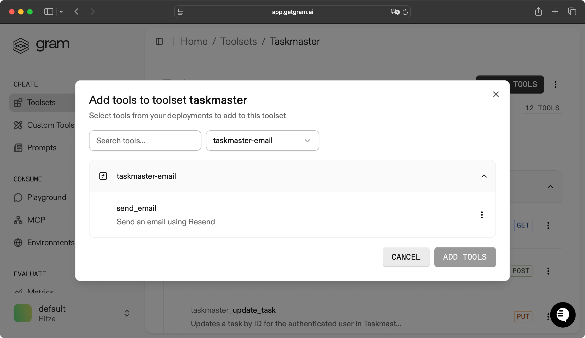
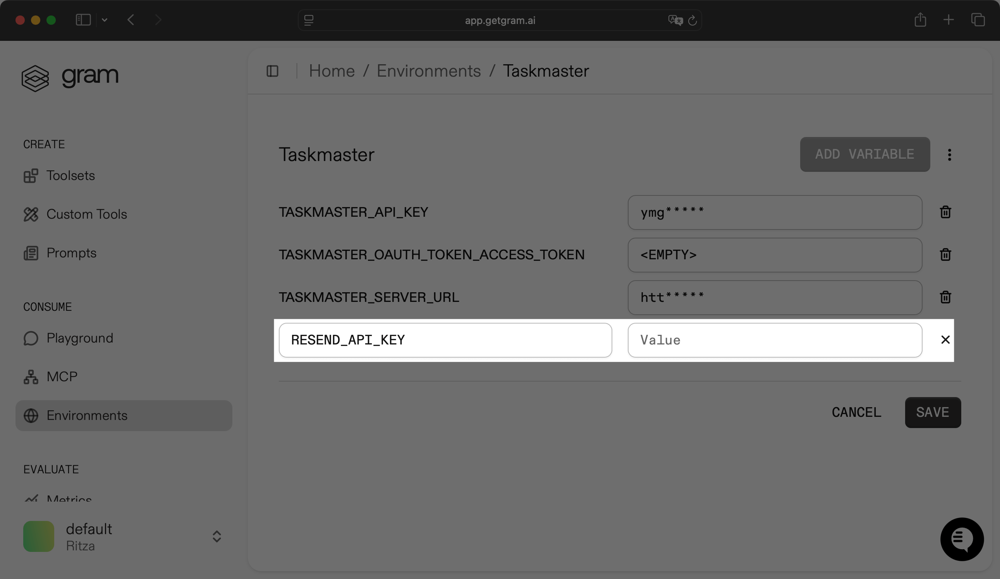
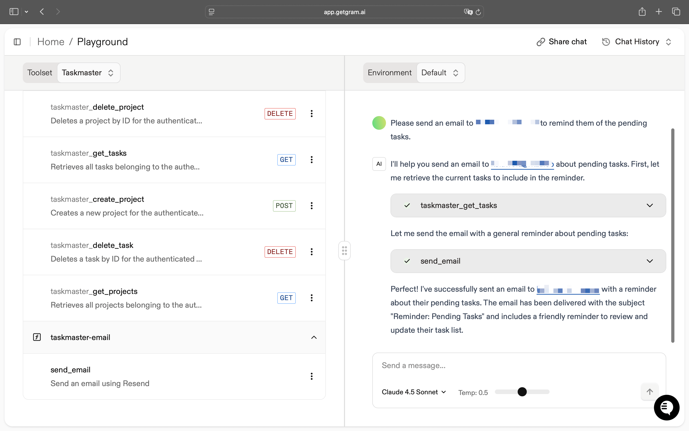

import { Callout } from "@/mdx/components";

This guide walks you through creating a Gram-hosted MCP server for Taskmaster. You'll learn how to upload an OpenAPI document, create a toolset, configure authentication, and publish your MCP server.


## What is Taskmaster?

<Callout title="Try it out" type="info">
You can try out Taskmaster [here](https://taskmaster-speakeasyapi.vercel.app/).
</Callout>

Taskmaster is a full-stack CRUD application for tasks and projects. It includes:

- A web UI for managing projects and tasks
- A built-in HTTP API
- OAuth 2.0 authentication
- A Neon PostgreSQL database for storing tasks and projects

This guide focuses on using Taskmaster to manage tasks and projects via an MCP server, although you can also manage them using the web UI or the built-in HTTP API.

Find the full code and OpenAPI document in the [Taskmaster repository](https://github.com/speakeasy-api/taskmaster).

## Prerequisites

To follow this tutorial, you need:

- A [Gram account](https://app.getgram.ai)
- Access to Taskmaster, using our [demo app](https://taskmaster-speakeasyapi.vercel.app/) or your own self-hosted instance

## Setting up a Gram project

In the [Gram dashboard](https://app.getgram.ai), click your username at the bottom-left and then select the projects dropdown. Select **+ New Project**, enter a project name and click **Submit**.



Click **GET STARTED** and select **Start fom API** to start the guided setup flow for creating a toolset and MCP server.

Gram will then guide you through the following steps:

### 1. Upload the OpenAPI document

Upload the [Taskmaster OpenAPI document](https://github.com/speakeasy-api/taskmaster/blob/main/static/openapi.yaml), enter the name of your API, and click **Continue**.


### 2. Create a toolset

Give your toolset a name (for example, `Taskmaster`) and click **Continue**.


Notice that this dialog also displays the names of the tools generated from your OpenAPI document.

### 3. Configure MCP

Enter a URL slug for the MCP server and click **Continue**.


Gram then creates the toolset from the OpenAPI document.

Click **Toolsets** in the sidebar to view the **Taskmaster** toolset.



As you can see, the toolset needs environment variables before you can use it.

## Getting a Taskmaster API key

Before configuring environment variables, create an API key:

- Navigate to your Taskmaster app (for example, `https://taskmaster-speakeasyapi.vercel.app`).
- Sign in and go to **Settings → Developer**.
- Under **API Keys**, click **+ New**.
- Give it a label and click **Generate Key**.
- Copy the API key. You will not be able to see it again.

<video width="600" muted={true} controls>
  <source src="/assets/docs/gram/videos/creating-api-key-taskmaster.mp4" type="video/mp4" />
    Your browser does not support the video tag.
</video>

## Configuring environment variables

[Environments](/docs/gram/concepts/environments) store API keys and configuration separately from your toolset logic.

In the **Environments** tab, click the **Default** environment. Click **Fill for Toolset**. Select the **Taskmaster** toolset and click **Fill Variables** to automatically populate the required variables.



Configure the following environment variables:

- Set the `TASKMASTER_SERVER_URL` environment variable to your API base URL. For example: `https://taskmaster-speakeasyapi.vercel.app/api`
- Set the `TASKMASTER_API_KEY` environment variable to your API key. For example: `tm_abc123_def456`

Click **Save**.



## Publishing an MCP server

Let's make the toolset available as an MCP server.

Go to the **MCP** tab, find the **Taskmaster** toolset, and click on it to open the MCP details page. Click **ENABLE** and then **ENABLE SERVER** in the modal that shows, to enable the MCP server.

Scroll down to the **Visibility** section and select the **Public** checkbox.



Next, you'll need to copy the MCP server configuration.

Scroll down to the **MCP Installation** section and click the **VIEW** button to open the configuration details page.

If you set the visibility to public the configuration will look something like this:

```json
{
  "mcpServers": {
    "GramTaskmaster": {
      "command": "npx",
      "args": [
          "mcp-remote",
          "https://app.getgram.ai/mcp/ritza-rzx-taskmaster",
          "--header",
          "MCP-TASKMASTER-API-KEY:${MCP_TASKMASTER_API_KEY}",
          "--header",
          "MCP-TASKMASTER-OAUTH-TOKEN-ACCESS-TOKEN:${MCP_TASKMASTER_OAUTH_TOKEN_ACCESS_TOKEN}"
        ],
        "env": {
          "MCP_TASKMASTER_OAUTH_TOKEN_ACCESS_TOKEN": "<your-value-here>",
          "MCP_TASKMASTER_API_KEY": "<your-value-here>"
        }
    }
  }
}
```

If you set the visibility to private, you will need a Gram API key to connect to the server. You  can generate an API key under **Settings → NEW API KEY** in the Gram dashboard, copy it, and paste it in the `GRAM_KEY` environment variable in place of `<your-key-here>`.

The configuration using the Gram key looks something like this:

```json
{
  "mcpServers": {
    "GramTaskmaster": {
      "command": "npx",
      "args": [
        "mcp-remote",
        "https://app.getgram.ai/mcp/ritza-rzx-taskmaster",
        "--header",
        "Gram-Environment:${GRAM_ENVIRONMENT}",
        "--header",
        "Authorization:${GRAM_KEY}"
      ],
      "env": {
        "GRAM_ENVIRONMENT": "<your-value-here>",
        "GRAM_KEY": "Bearer <your-key-here>"
      }
    }
  }
}
```

## Extending your MCP server with Gram Functions

While the tools generated from your OpenAPI document handle basic CRUD operations, you can extend your MCP server with custom logic using [Gram Functions](/docs/gram/concepts/functions). This is useful for adding business logic that goes beyond simple API calls.

For example, let's add a function that sends email reminders to users about their pending tasks. We'll use [Resend](https://resend.com) for sending emails. You can sign up for a free account and get an API key from their dashboard.

### Creating a task reminder function

1. Create a new Gram function project:

```bash
pnpm create @gram-ai/function@latest --template gram
```

This will prompt you to enter the directory name and the project name, which will be the name of the Gram function.

2. Install the `resend` package with `pnpm install resend` and  replace the contents of `src/gram.ts` with the following code:

```ts
import { Gram } from "@gram-ai/functions";
import * as z from "zod/mini";
import { Resend } from "resend";

const gram = new Gram({
  envSchema: {
    RESEND_API_KEY: z.string(),
  },
}).tool({
  name: "send_email",
  description: "Send an email using Resend",
  inputSchema: {
    email: z.string(),
    subject: z.string(),
    text: z.string(),
  },
  async execute(ctx, input) {
    const resend = new Resend(ctx.env["RESEND_API_KEY"]);

    try {
      const result = await resend.emails.send({
        from: "Acme <onboarding@resend.dev>",
        to: [input["email"]],
        subject: input["subject"],
        html: `<p>${input["text"]}</p>`,
      });

      return ctx.json({
        success: true,
        id: result.data?.id,
        message: "Email sent successfully",
      });
    } catch (error) {
      return ctx.fail(
        {
          error: "Failed to send email",
          details: error instanceof Error ? error.message : String(error),
        },
        { status: 500 }
      );
    }
  },
});

export default gram;
```

The code above creates a function called `send_email` that accepts an email address, task title, and description as validated inputs using Zod schemas. The function uses the Resend API to send formatted HTML emails, with comprehensive error handling using `ctx.fail()` to return structured error responses with appropriate HTTP status codes, and `ctx.json()` to return successful results with the email message ID.

3. Build and deploy the function:

```bash
pnpm build
pnpm push
```

4. In the Gram dashboard, go to **Toolsets**, click on the **Taskmaster** toolset, click **+ ADD TOOLS**, select the newly created function, and save the changes.



5. Update the environment variables by going to the **Auth** tab and update the new added `RESEND_API_KEY` variable with your Resend API key, and save the environment.



Now the MCP server includes both the auto-generated CRUD tools from your OpenAPI document and a custom function for sending task reminders.

You can test the tool in the Playground with the following prompt:

```
Please send an email to user@example.com to remind them of the pending tasks.
```



You can find the complete code for this Resend integration example in the [Gram repository](https://github.com/speakeasy-api/gram/tree/main/examples/resend).

## Testing the MCP server

Before connecting to external clients, test your setup by using the **Gram Playground** to verify that your tools are working correctly.

<video width="600" muted={true} controls>
  <source src="/assets/docs/gram/videos/taskmaster-playground.mp4" type="video/mp4" />
    Your browser does not support the video tag.
</video>

## What's next

Your Taskmaster MCP server is now ready to use with any MCP client. You can connect it to:

- [Claude Code](/docs/gram/clients/using-claude-code-with-gram-mcp-servers)
- [Claude Desktop](/docs/gram/clients/using-claude-desktop-with-gram-mcp-server)
- [Your IDE](/docs/gram/clients/using-your-ide-with-gram-mcp-server)
- [Cline](/docs/gram/clients/using-cline-with-gram-mcp-server)
- Any other MCP-compatible client


