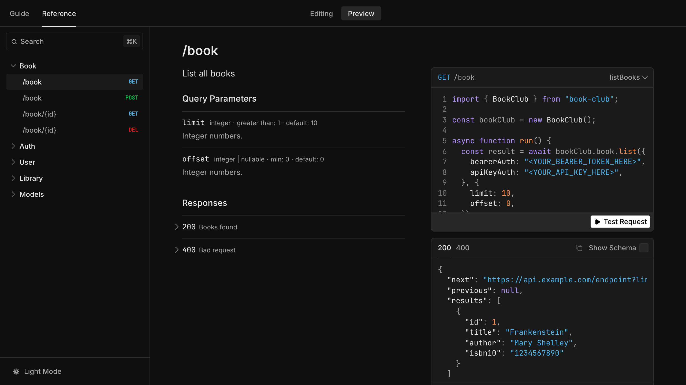
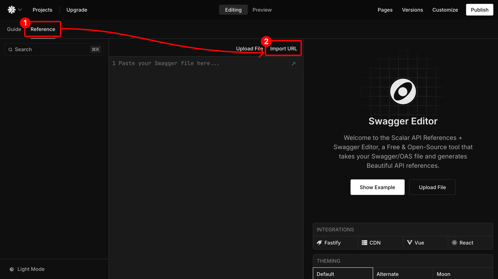
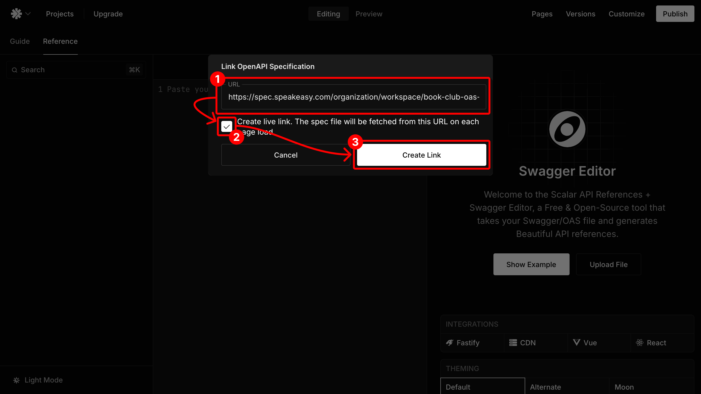

# Integrate Speakeasy With Scalar

---

## Overview

**Scalar** makes creating and maintaining API documentation _very_ easy. It is
able to to render documentation by referencing a live OpenAPI spec, making it a
great tool to use in conjunction with [Speakeasy's Automated Code Samples
feature](/docs/code-samples/automated-code-sample-urls).

  

## Setting up the Integration

### Prerequisites

  Before continuing with this guide, ensure that the following prerequisites
  have been met:
   
  <ul>
    <li>
      An <a href="/docs/code-samples/automated-code-sample-urls">Automated Code Sample URL</a> has been configured for the desired Speakeasy SDK, and
    </li>
    <li>
      Created an account on <a href="https://scalar.com">Scalar</a>.
    </li>
  </ul>
  Once those requirements have been met, proceed with the following steps.

### Locate & Copy the Combined Spec URL

### Import the Combined Spec URL into Scalar

Next, open a [Scalar project](https://docs.scalar.com), open the **Reference**
tab, then click **Import URL**.

  

Finally, paste the copied URL into the provided field, check **Create Live Link**
(optional), then click **Import**.

  

After the import process has completed, the API documentation will be rendered.

  

## What Next?

Scalar is much more than just an OpenAPI spec renderer. Continue to learn more
about Scalar by visiting their [official
documentation](https://guides.scalar.com/scalar/introduction).