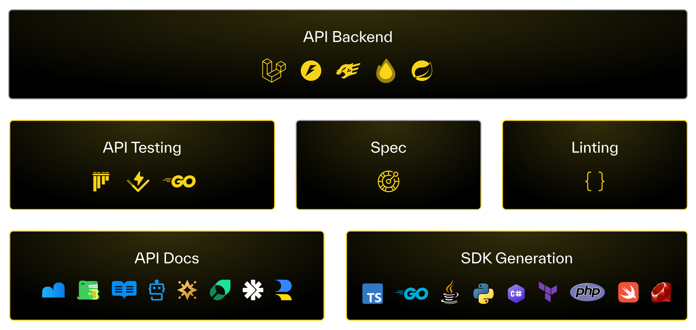

# Introduction to Speakeasy

Speakeasy is a platform that provides API developers with tools, workflows, and infrastructure to create APIs optimized for both developers and LLMs.

With Speakeasy, you can create SDKs, agent tools, API documentation, and more.

## Why APIs matter

APIs are a powerful force for innovation. One team solves a problem, exposes an API, and every engineer (or AI agent) benefits from their work. That means more time spent tackling new problems, and less time reinventing the wheel.

The problem is that most APIs are bad.

The tools and practices for building quality, reliable APIs hasn't kept pace with the central role APIs play in modern software development.

That's the problem Speakeasy exists to solve.

## Speakeasy Products

{/* <div className="py-8">
    <div className="max-w-7xl mx-auto">
        <ProductCards />
    </div>
</div> */}

## Before you Begin

### Sign up
Sign up for a free Speakeasy account at [https://app.speakeasy.com](https://app.speakeasy.com).

{/* <SignUpButton className="w-fit my-8"/> */}

New accounts start with a 14 day free trial of Speakeasy's business tier, to enable users to try out every SDK generation feature. At the end of the trial, accounts will revert to the free tier. No credit card is required.

Free accounts can continue to generate one SDK with up to 50 API methods free of charge.

### Install the Speakeasy CLI
Install the Speakeasy CLI using one of the following methods:

<CodeWithTabs>

```bash !!tabs Homebrew
# Homebrew (macOS)
brew install speakeasy-api/homebrew-tap/speakeasy
```

```bash !!tabs Script
# Script Installation (macOS and Linux)
curl -fsSL https://go.speakeasy.com/cli-install.sh | sh
```

```bash !!tabs Winget
# Windows Installation
# Using winget:
winget install speakeasy
```

```bash !!tabs Choclatey
# Using Chocolatey:
choco install speakeasy
```
</CodeWithTabs>


## Workflow

<div style={{textAlign: "center"}}>
    
</div>

Our platform is built to be OpenAPI-native, no proprietary DSLs to lock you in. From your OpenAPI specs, we enable you to generate SDKs, API documentation, agent tools & more.

To make it seamless, we provide native CI/CD workflows that automate updates, from backend changes through to SDK release management.

## Support

We operate as an extension of our customers API platform teams. We have dedicated support to help with sensitive releases and provide feedback on API design & best practices.
