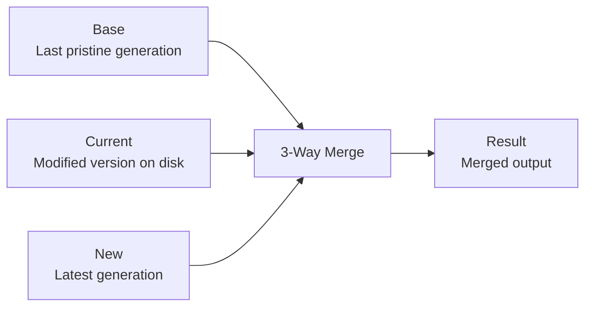

import { Callout } from "@/mdx/components";

# Custom code technical reference

<Callout title="Note" type="info">
  This reference describes the internal implementation of custom code. Understanding these details is not required to use the feature - this information is for debugging, troubleshooting, or satisfying technical curiosity.
</Callout>

## How the 3-way merge works

Custom code uses a 3-way merge algorithm similar to Git merge. For each file, three versions are tracked:



The merge process:
1. **Base**: The pristine version from the last generation (stored in Git objects)
2. **Current**: The version on disk (potentially with custom changes)
3. **New**: The newly generated version from Speakeasy

If changes do not overlap, the merge completes automatically. When changes overlap, Speakeasy writes conflict markers to the file and stages the conflict in Git's index using three-stage entries (base, ours, theirs). This ensures `git status`, IDEs, and other Git tools recognize the conflict and prompt for resolution.

## File tracking and move detection

### Generated file headers

Each generated file contains a tracking header:

```typescript
// Code generated by Speakeasy (https://speakeasy.com). DO NOT EDIT.
// @generated-id: a1b2c3d4e5f6
```

The `@generated-id` is a deterministic hash based on the file's original path. This allows Speakeasy to detect when files are moved:

1. File generated at `src/models/user.ts` gets ID based on that path
2. File is moved to `src/entities/user.ts`
3. Next generation, Speakeasy scans for the ID and finds it at the new location
4. Updates are applied to the moved file

### Lockfile structure

The `.speakeasy/gen.lock` file tracks generation state:

```json
{
  "generationVersion": "2.500.0",
  "persistentEdits": {
    "generation_id": "abc-123",
    "pristine_commit_hash": "deadbeef123",
    "pristine_tree_hash": "cafebabe456"
  },
  "trackedFiles": {
    "src/models/user.ts": {
      "id": "a1b2c3d4e5f6",
      "last_write_checksum": "sha1:7890abcdef",
      "pristine_git_object": "blobhash123",
      "moved_to": "src/entities/user.ts"
    }
  }
}
```

Fields explained:
- `generation_id`: Unique ID for this generation
- `pristine_commit_hash`: Git commit storing pristine generated code
- `pristine_tree_hash`: Git tree hash for no-op detection
- `trackedFiles`: Per-file tracking information
  - `id`: File's generated ID for move detection
  - `last_write_checksum`: Checksum when last written (dirty detection)
  - `pristine_git_object`: Git blob hash of pristine version
  - `moved_to`: New location if file was moved

## Git integration details

### Object storage

Custom code stores pristine generated code using Git's object database:

1. **Blob objects**: Each generated file is stored as a blob
2. **Tree objects**: Directory structure is stored as trees
3. **Commit objects**: Each generation creates a commit

These objects live in `.git/objects` but are not referenced by any branch.

### Git refs

Generation snapshots are stored at:
```
refs/speakeasy/gen/<generation_id>
```

These refs:
- Are not visible in `git branch` or GitHub
- Keep objects reachable so `git gc` does not prune them
- Can be fetched/pushed like any other ref

### Git commands used

The Speakeasy CLI uses the following Git operations internally:

| Operation | Git command |
| --- | --- |
| Store file content | `git hash-object -w --stdin` |
| Create tree | `git write-tree` |
| Create commit | `git commit-tree` |
| Read pristine content | `git cat-file -p <hash>` |
| Check object exists | `git cat-file -e <hash>` |
| Stage conflict | `git update-index --index-info` |
| Fetch snapshot | `git fetch origin refs/speakeasy/gen/<id>` |
| Push snapshot | `git push origin <commit>:refs/speakeasy/gen/<id>` |

When conflicts are detected, Speakeasy stages three versions of the file in Git's index (stages 1, 2, and 3 representing base, ours, and theirs). This is the same mechanism Git uses for merge conflicts, ensuring compatibility with standard Git conflict resolution tools.

## Edge cases and behavior

### File moves before enabling

If files are moved before enabling custom code:
- No `@generated-id` header exists
- Move cannot be detected
- File treated as deleted at old location, created at new location
- History is broken for that file

**Recommendation**: Enable custom code before reorganizing files.

### Duplicate IDs

If a file is copied (not moved):
- Both files have the same `@generated-id`
- System detects duplicate and logs warning
- Prefers the file at the expected (original) location
- Other copies may not receive updates correctly

### Deleted files

When a generated file is deleted:
- Marked as `deleted: true` in lockfile
- Speakeasy does not recreate it
- To restore: remove the file entry from `trackedFiles` in gen.lock

### Binary files

Binary files (images, JARs, etc.) are handled differently:
- No `@generated-id` header (cannot add comments)
- Tracked by path only (no move detection)
- Replaced entirely on regeneration if changed

<Callout title="Important" type="warning">
  Regeneration completely overwrites binary files. Any manual modifications to binary files are lost.
</Callout>

### CI mode detection

Custom code runs in two modes:

- **Interactive mode**: when stdin is a TTY and no explicit CI mode is set. Prompts like "Enable custom code?" are shown.
- **CI mode**: when running non-interactively (no TTY) or when `mode: ci` is configured in the SDK generation action or CLI environment. Prompts are suppressed and conflicts cause a non-zero exit.

In GitHub Actions, the `speakeasy-api/sdk-generation-action` automatically sets the appropriate mode.

## Troubleshooting

### Common issues

#### "Failed to fetch pristine snapshot"

This occurs when:
- Remote repository is unreachable
- CI does not have permission to fetch refs

**Solution**: Ensure full clone in CI:
```yaml
- uses: actions/checkout@v4
  with:
    fetch-depth: 0  # Full clone, not shallow
```

#### "Duplicate generated ID detected"

This means multiple files have the same `@generated-id`:
- Check if files were copied instead of moved
- Remove duplicate headers from copied files
- Let Speakeasy assign new IDs on next generation

#### "Cannot resolve conflicts automatically"

Manual changes and Speakeasy updates modify the same lines:
1. Open the conflicted files
2. Resolve conflicts manually (keep desired code)
3. Run `speakeasy run --skip-versioning`
4. Commit the resolution

The `--skip-versioning` flag tells Speakeasy to reuse the existing pristine snapshot (the "Base" in the 3-way merge) instead of creating a new snapshot from the conflicted state. This keeps the merge inputs stable while resolving conflicts.

### Resetting to pristine state

#### Full reset (low-level)

To discard all customizations and also reset custom code internal tracking:

1. Delete all generated files
2. (Optional, advanced) Remove the `persistentEdits` section from `.speakeasy/gen.lock`
3. Run `speakeasy run` to generate fresh files and create a new snapshot

For a higher-level reset workflow that does not require editing internal tracking files, see the "How to reset to pristine generated code" FAQ in the [main custom code guide](/docs/sdks/customize/code/custom-code/custom-code).

To temporarily disable without losing configuration:
```yaml
persistentEdits:
  enabled: false  # or "never" to prevent prompts
```

### Inspecting Git objects

To debug custom code internals:

```bash
# View stored refs
git show-ref | grep refs/speakeasy/gen/

# Inspect a specific generation
git log --oneline refs/speakeasy/gen/<generation_id>

# See pristine version of a file
git show <pristine_git_object_hash>

# Check if object exists locally
git cat-file -e <hash> && echo "exists" || echo "missing"
```

## Performance considerations

### Repository size

Generation snapshots use a commit history (each new generation commit has the previous as its parent), enabling Git delta compression. This keeps storage efficient:
- Git pack files compress content efficiently using deltas between generations
- Identical files share storage (deduplication)
- Only the latest generation needs to be fetched
- Old generations can be pruned if needed

### Initial scan

On first run with existing modifications:
- Speakeasy scans all files for `@generated-id` headers
- This can be slow for very large SDKs (1000+ files)
- Subsequent runs use cached information from lockfile

### Merge performance

The 3-way merge is performed per-file:
- Clean files (no changes) are fast - just overwrite
- Modified files require diff computation
- Conflicts are rare in practice

## Security considerations

### Git permissions

Custom code requires:
- Read access to `.git/objects`
- Ability to create Git objects locally
- Optional: push access to `refs/speakeasy/gen/*` (soft failure if unavailable)

### Remote operations

- Fetch: Attempts to get latest pristine snapshot
- Push: Attempts to backup new snapshot
- Both operations are "fire and forget"; failures do not block generation

### No branch access

Custom code never:
- Creates or modifies branches
- Changes commit history
- Modifies the working branch
- Requires access to source branches

## Language-specific behavior

### Comment syntax

Different languages use different comment styles for the `@generated-id` header:

| Language | Comment style |
| --- | --- |
| Go, Java, JavaScript, TypeScript, C# | `// @generated-id: abc123` |
| Python, Ruby, Shell | `# @generated-id: abc123` |
| HTML, XML | `<!-- @generated-id: abc123 -->` |
| CSS | `/* @generated-id: abc123 */` |

### Files without comment support

Some file types do not support comments:
- JSON files
- Binary files
- Some configuration formats

These files:
- Cannot have `@generated-id` headers
- Are tracked by path only
- Do not support move detection
