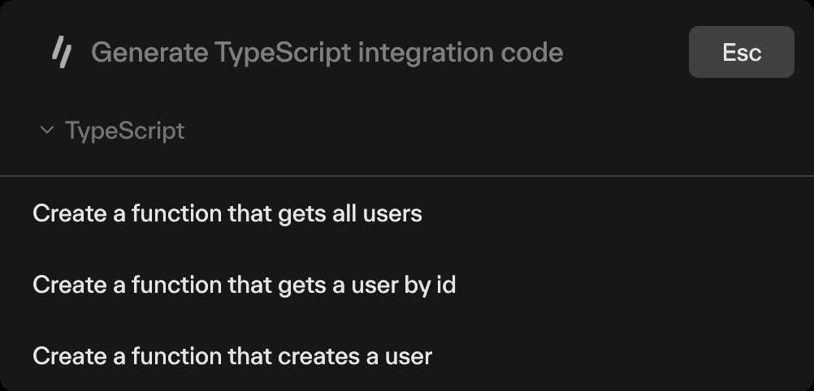

import { CodeWithTabs } from "@/mdx/components";

# Integrate via React

SnippetAI is a React package designed to simplify generating code samples directly from OpenAPI specifications, enabling developers to rapidly prototype and integrate APIs into their applications.

### Installation

To install SnippetAI in your React project, install it using your package manager of choice:

<CodeWithTabs>

```bash !!tabs npm
npm install @speakeasy-api/snippet-ai-react
```

```bash !!tabs yarn
yarn add @speakeasy-api/snippet-ai-react

```

```bash !!tabs pnpm
pnpm add @speakeasy-api/snippet-ai-react
```

</CodeWithTabs>

### Usage

After installation, import and utilize SnippetAI in your React components. An active publishing token is required. You can generate one in the settings page for your organization.

```jsx
import { SnippetAI } from "@speakeasy-api/snippet-ai-react";

function MyComponent() {
  return <SnippetAI codeLang="typescript" publishingToken="PUBLISHING_TOKEN" />;
}

export default MyComponent;
```

### Supported Languages

SnippetAI currently supports code generation for the following languages:

| Language   | Supported |
| ---------- | --------- |
| TypeScript | ✅        |
| Python     | ✅        |
| PHP        | ✅        |
| Java       | ✅        |
| C#         | ✅        |
| Go         | ✅        |

### Props

The `SnippetAI` component accepts the following props:
| Prop | Type | Description | Default |
| ---------------- | ------------------- | --------------------------------------------------------------------------------------------------- | ------------------------------- |
| `codeLang` | `string` | Programming language for suggestion results (`typescript`, `python`, `go`, `java`, `csharp`, `php`) | `typescript` |
| `toggleShortcut` | `string` | Keyboard shortcut to open the Command Bar | `$mod+k` (cmd+k / ctrl+k) |
| `zIndex` | `string` | Z-index of the command bar | `1000` |
| `suggestions` | `string[]` | Searchable list of suggestions for the command bar | `[]` |

### Language Selection

If a `codeLang` prop is not provided, a dropdown will be displayed to select the target language for the generated snippets.


