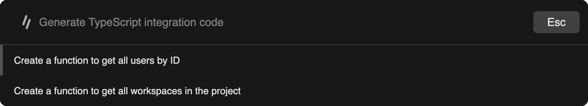
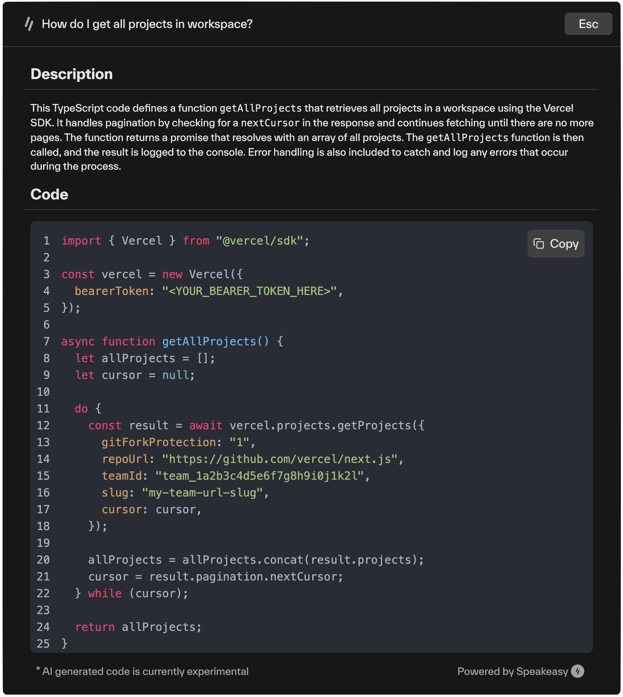

# SnippetAI Overview

import { Screenshot } from "@/mdx/components";
import snippetPrereqs from '../assets/snippet-ai/snippet-ai-prereqs-page.png'
import snippetConfig from '../assets/snippet-ai/snippet-ai-docs-highlight.png'
import snippetToken from '../assets/snippet-ai/snippet-ai-create-token-modal.png'
import snippetSetup from '../assets/snippet-ai/snippet-ai-setup-guide.png'

Add SnippetAI to your web application as a web component to help users generate code snippets with AI-powered tools.

## How It Works

SnippetAI offers an intuitive interface for code snippet generation. Users type their questions about API usage, and the component responds with ready-to-use code examples that leverage your actual SDK and code samples. SnippetAI stands out by using your existing SDK, which helps users discover your API's capabilities.

For example, when a user submits the query:
"How do I create a new user with the API?"

The component analyzes your OpenAPI specification and SDK code samples to generate a function that answers their question, matching your actual implementation.

## Prerequisites

Before implementing SnippetAI, complete the following configuration steps:

1. Enable the SnippetAI add-on in your documentation settings:
   - Navigate to the Docs tab in the Speakeasy dashboard
   - Select the SnippetAI card

<Screenshot variant="web"
image={{
    src: snippetConfig,
    alt: "Screenshot showing where to access SnippetAI configuration"
  }}
/>

2. Activate SnippetAI using the toggle switch. The indicator will display green when SnippetAI is enabled

<Screenshot variant="web"
image={{
    src: snippetPrereqs,
    alt: "Screenshot showing the SnippetAI toggle"
  }}
/>

3. Generate and configure a publishing token:
   - Select "New" to access the token configuration interface
   - Provide a descriptive identifier for the token
   - Select the target SDK
   - Define the SDK tag
   - Select "Generate" to create the token

<Screenshot variant="web"
image={{
    src: snippetToken,
    alt: "Screenshot showing the SnippetAI publishing token dialog"
  }}
/>

4. Integrate Snippet AI into your docsite
  - Upon completion, the site displays an integration guide with your publishing token and a quick start guide
  - Further details below!

<Screenshot variant="web"
image={{
    src: snippetSetup,
    alt: "Screenshot showing SnippetAI integration instructions"
  }}
/>

## Integration Options

### React

Implement SnippetAI as a React component to integrate with your React-based documentation.

### Web Component

Implement SnippetAI as a web component by selecting one of two script integration methods:

- **ES Module**: Recommended for modern web applications, providing optimal tree-shaking and module support
- **UMD**: Suitable for legacy browsers and traditional script loading implementations

Include the selected script tag in your HTML file's `<head>` section before implementing the `<snippet-ai>` element.

## Usage

Once integrated into your documentation, users can users can invoke the SnippetAI interface via the `Generate Code Example` button or the keyboard shortcut `⌘+S` / `Ctrl+S` to:
- Ask natural language questions about how to use your API
- Receive contextually relevant code snippets that use your actual SDKs
- Copy generated code directly into their applications to rapidly decrease time-to-integration
