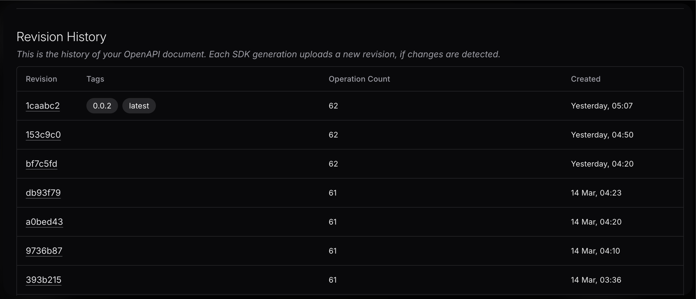

import { Callout } from "@/mdx/components";

# Manage your OpenAPI specs with Speakeasy. 

<Callout type="info" title="Use this guide only for managing your OpenAPI specs independent of generating SDKs.">

If you are looking for the quickstart to setup SDKs then see the [SDK Quickstart](../../docs/create-client-sdks).

</Callout>

In this guide we will walk you through the process of managing your OpenAPI specs using the Speakeasy API Registry and CLI. This is colloquially also 
known as a "source-only workflow" as it only utilises the sources feature of [Speakeasy workflows](../../docs/speakeasy-reference/workflow-file). 

## Prerequisites

- A Speakeasy account and CLI installed. Log in [here](https://app.speakeasy.com/) to get an account created. 
- An OpenAPI spec for your API

## Overview

To get started create a github repository. Something like `company-specs` or `company-openapi` or common repository names. 

Initialise a new workflow file by running `speakeasy configure sources` and follow the prompts to add in your OpenAPI spec and any
[Overlays](../../docs/prep-openapi/overlays/create-overlays) you have. Make sure to give your `source` a meaningful name as this will be then
name used for the API Registry in your workspace dashboard.

A common repository structure will look like the following:

```yaml
company-specs
├── .speakeasy/
│   ├── workflow.yaml
├── specs
│   ├── openapi.yaml
│   ├── ...
├── overlays
│   ├── overlay.yaml
│   ├── ...
├── overlayed_specs          👈 this folder includes specs that have been modified by overlays
│   ├── openapi_modified.yaml
│   ├── ...
└── .gitignore
```

The workflow file will be generated in the `.speakeasy` folder and will look like the following:

```yaml
workflowVersion: 1.0.0
speakeasyVersion: latest
sources:
    my-api:             👈 this is the name of the source used in `speakeasy configure sources`
        inputs:
            - location: specs/openapi.yaml
        registry:
            location: registry.speakeasy.com/your-company/your-company/my-api
        outputs:
            - location: overlayed_specs/openapi_modified.yaml
targets: {}
```

## Publishing spec changes

Any time you would like to publish a new version of your OpenAPI spec to the API Registry simply run

```bash
speakeasy run -s target
```

This will publish the spec to the API Registry as a new revision for the source `my-api`.

You can also optionally tag the revision of a spec by running:

```bash
speakeasy tag apply -n v0.0.2
```

This will tag the most recent revision of the spec with the tag `v1.0.0`.

## API Registry

This will show up as the latest revision in your API Registry tab in the dashboard.



You can leverage this to: 
* Track changes to your spec, view detailed change reports and download past versions of the spec.
* Create a stable public URL for sharing a paritcular revision of the spec..
* Use the registry URI as a source for generating SDKs, eg: `registry.speakeasy.com/your-company/your-company/my-api`.
