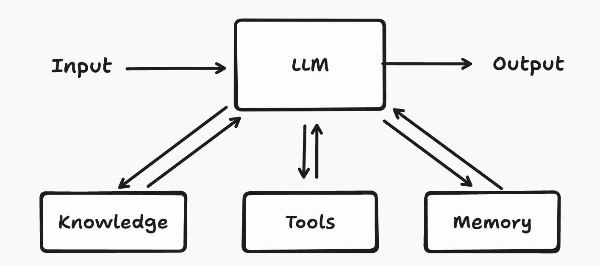
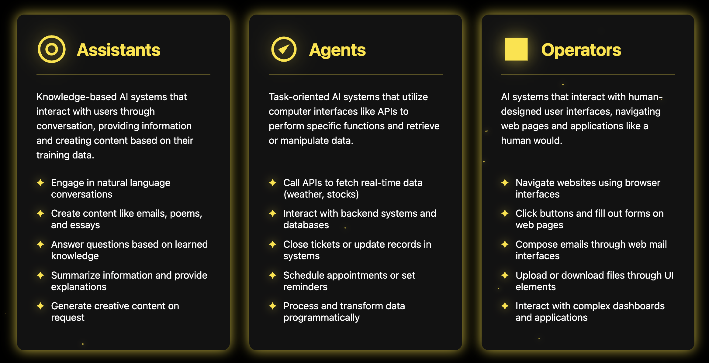
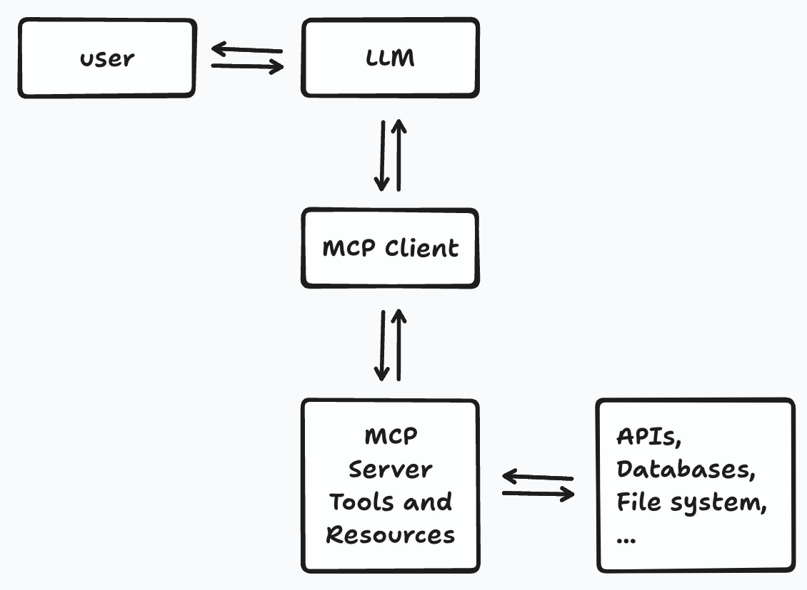

import { Callout } from "@/mdx/components";

<Callout title="Gram AI by Speakeasy">
  Unlock AI engineering by turning your API platform into an AI platform with
  [Gram](https://app.getgram.ai). Generate agent tools for internal services and
  connect to popular third party APIs from one platform. [Join the
  waitlist](https://app.getgram.ai) today.
</Callout>

# Introduction to AI Agents

Unlike traditional software, AI agents can gather context, make decisions, and execute tasks without constant human supervision. These autonomous AIs can do work for you. AI agents that use large language models (LLMs) are the most useful and show the most promise, as they let you automate complex workflows using natural language. In this context, an AI agent is a system that uses an LLM to control the flow of processes.

Many think of AI agents as fully autonomous systems capable of performing complex multi-step tasks with various tools, like a human. However, AI agents fall on an agentic spectrum: The more agentic the system, the more its LLM decides how it operates. You probably think that, in most contexts, more agentic systems are more useful. However, there are tradeoffs with agentic systems, which can be slow, inaccurate, and unpredictable. It's best to start off simple and only add complexity as needed. You may find that you don't need an agentic system at all.

This introduction to AI agents explains how they work, discusses how they're used, and clarifies common misconceptions. We'll also examine how AI agents can connect to external systems, such as databases and APIs, using structured protocols like the [Model Context Protocol (MCP)](https://modelcontextprotocol.io/).

This article is the first in a series designed to take you from a basic understanding of AI agents to building your own agentic applications:

- **What are AI agents?**
- **Optimizing your OpenAPI document for MCP servers**
- **Real-world agent use cases**
- **The architecture of agentic applications**
- **The agentic ecosystem: Frameworks and tools**
- **Integration with agents**

Let's start by learning the difference between agents, operators, and assistants.

## AI solutions

Broadly speaking, we can group AI solutions into three distinct categories: assistants, agents, and operators. Although they all use AI under the hood, what sets them apart is the method and purpose of their interactions.

### Assistants

Assistants are perhaps the most familiar category of AI solution. Conversational knowledge-based systems, such as ChatGPT or Siri, are built to interact with humans using natural language. They often use LLMs to answer queries, generate content, or even compose poetry and write essays.

LLMs like ChatGPT are trained using massive datasets and machine learning to recognize patterns and relationships in data. When provided with input, LLMs generate text sequentially, producing responses one word or phrase at a time. At each step, the LLM evaluates potential words or phrases (by assigning each a likelihood of occurring next in the sequence) and selects the most probable option. This process typically produces a reasonable response.

The assistant interaction flow can be simplified into four steps:

LLM training data is static and can quickly become outdated. To address this limitation, you can use retrieval-augmented generation (RAG), a method that dynamically fetches relevant and up-to-date external data. This data is then injected into the prompt, providing the LLM with additional context so that it can produce more accurate responses. Adding RAG to an LLM doesn't make it an agent because it doesn't enable autonomy or give the LLM the ability to perform actions based on inputs.

### Agents

Agents extend the capabilities of assistants by allowing them to conduct autonomous actions through digital interfaces, like APIs, in response to inputs.

Need the current stock price to make a split-second trading decision? An agent can grab it for you.

Have to schedule an appointment in your calendar, close a support ticket, or update records in a database? Agents can perform these tasks for you, too.

Agents use tools to interact with external systems. AI platforms like OpenAI and Claude provide built-in tools, including web search and file retrieval. Some of these platforms also support function-calling tools that allow you to connect agents to your own code, much like you would call a tRPC procedure in a full-stack TypeScript application.

Agents can also use knowledge and memory to retrieve and store external information, enabling them to carry out more accurate, up-to-date, and context-aware actions and responses. Knowledge refers to information stored externally (such as documentation or pre-existing data stored in a database), whereas memory refers to personalized, dynamic data that is built from interactions with users or contexts.

Input can take the form of a simple task from a user or a complex goal that involves multiple steps. The interaction flow can also be triggered by an environment sensor, such as a thermometer.

The agent interaction flow can be simplified into four steps:

Once an agent has been provided with a task or a goal, it gets to work. Agents can plan and operate independently, although they may pause for human feedback at critical checkpoints or when blocked. The task may finish after completion or when a specific stopping condition, such as the maximum number of iterations, has been reached. Agents may also be able to recover from errors. For example, Cursor's AI agent can read an error message and use it as a prompt to fix the error.

## Operators

OpenAI recently released a research preview of [Operator](https://openai.com/index/introducing-operator/), an agent that can browse the web to perform tasks by using OpenAI's [Computer-Using Agent](https://openai.com/index/computer-using-agent/). We can classify the OpenAI Operator as a type of operator.

Operators are a type of agent capable of interacting with graphical user interfaces.
They can perform actions, such as clicking, scrolling, or typing, until a task is completed or user input is required to carry out sensitive actions like entering login details. Operators can perform common tasks such as navigating websites, filling out forms, and uploading documents. For example, they can be used to automate the process of ordering groceries for a recipe. They are particularly useful when APIs aren’t accessible or when the fastest way to automate a task is to navigate through an existing user interface.

The operator interaction flow can be simplified into four steps:

OpenAI's [Computer-Using Agent](https://openai.com/index/computer-using-agent/) and Claude's [computer use](https://docs.anthropic.com/en/docs/agents-and-tools/computer-use) tools are examples of operators. They both perceive the screen by taking screenshots of the computer and adding them to the LLM's context.

Here’s a brief summary and list of example use cases for each AI system:

## The maturity of assistants, agents, and operators

While, in theory, operators are more powerful than agents and agents are more powerful than assistants, this doesn’t mean that operators are always the best choice. Assistants are well understood as models, and assistants like ChatGPT by OpenAI and Claude by Anthropic as mature systems. We understand the strengths and limitations of these AI assistants well, and they're already widely used in production settings.

AI agents, on the other hand, are still maturing, and the ecosystem of agents is evolving rapidly. The risk of an agent doing the wrong thing is higher than that of an assistant. While an assistant could embarrass the company it represents or get it into legal trouble, an agent could take down an API by flooding it with requests or ruin a project by erroneously closing all its tickets. There's also a risk of biased outputs. Ethical considerations such as transparency, data privacy, and clear accountability must be actively addressed when developing and deploying these systems.

Operators are the riskiest of all AI solutions. Because they may be given full access to a machine, and they can use a mouse and keyboard to do anything a human could do, the potential for damage is much higher. AI operators require safeguards to minimize the risk of their performing harmful actions. Claude's computer use tools require a sandboxed computing environment. OpenAI's Computer-Use Agent has protections against misuse, such as performing illegal actions and overlooking model mistakes. You can minimize model mistakes by adding user confirmations and limiting the tasks that operators can perform autonomously, for example, preventing banking transactions. Their use is limited because most operators are still in preview or beta phases.

## Building agentic systems

Anthropic released [a guide to building effective agents](https://www.anthropic.com/engineering/building-effective-agents), which shares insights gained from working with dozens of teams to build AI agents across different industries. Anthropic found that the most successful agents weren't using complex frameworks or specialized libraries but using simpler solutions with composable patterns.

### When to use agents

It's best to start with a simple system and only add multi-step agentic systems when needed. You might find that you don't need an agentic system at all. You need to consider the trade-off between the efficient system performance and low cost of straightforward systems and the improved task performance of agentic systems. A more agentic system also means more risk. If an agent makes reasoning errors, hallucinates, or relies on unreliable external APIs or data, task performance may decrease. Agents work best in situations requiring adaptability and autonomy, but for tasks with clear, predefined steps, it's better to use a workflow. A workflow is a system that uses LLMs and tools to complete tasks via predefined code paths.

### Frameworks: Use with caution

There are many AI agent frameworks, such as [LangChain](https://www.langchain.com/), which make agentic systems easier to build. Frameworks simplify calling LLMs, calling APIs, and generating responses, and some frameworks can create multi-agent workflows for complex use cases. There are even no-code tools that let you create agents through a UI without writing any code, such as Zapier’s AI Agent Builder.

However, these abstractions can make debugging more challenging if the underlying prompts and responses are obscured. Don't use a framework unless you need one. Start simple by using LLM APIs directly. If you use a framework, make sure you understand the underlying code, as it's a common source of errors.

Read our blog post, [Building an AI agent with OpenAPI: LangChain vs Haystack](https://www.speakeasy.com/post/langchain-vs-haystack-api-tools#security), to learn how you can build an AI agent with two popular frameworks. In our experience, Haystack is the better choice for production-level systems and quick proof-of-concept builds. LangChain is more suited to projects that need greater flexibility and allow time for experimentation, as LangChain’s official documentation is lacking. Even with these frameworks, we found the AI agents hallucinated endpoints and produced unexpected errors that would need to be handled in a production system.

### Common patterns for agentic systems

There is a range of common patterns used in agentic systems, from augmented LLMs to fully autonomous agents that use multiple LLMs. These patterns include:

- **Augmented LLMs**: LLMs enhanced with knowledge, tools, and memory form the basic building blocks of agentic systems. These augmentations can be implemented using the MCP, which allows developers to create two-way connections between their AI assistants, data sources, and tools.
- **Prompt chaining**: This technique breaks tasks down into sequential steps, in which each LLM call processes the output of the previous call.
- **Routing**: In a routing process, inputs are classified and directed to specific tasks. An example use case is directing easy questions to smaller LLM models and harder questions to more capable models to optimize cost and speed.
- **Parallelization**: Using this technique, independent subtasks are executed simultaneously to improve efficiency or to obtain diverse outputs.
- **Orchestrator-workers**: In an orchestrator-worker workflow, a central LLM dynamically breaks down tasks, delegates them to worker LLMs, and compiles the results.
- **Evaluator-optimizer**: In an evaluator-optimizer workflow, one LLM generates a response while another evaluates it and provides feedback. The process then loops, and the output is refined iteratively.

These patterns can be combined or customized to fit different use cases. We recommend you start with the simplest patterns and add to them as needed.

## AI agent use cases

Agents are best used for tasks that have clear success criteria, require conversation and action, and enable feedback loops. Customer support agents and coding agents show the most promise for widespread use.

AI agents can enhance customer support chatbots with tools that can perform actions such as accessing customer data and issuing refunds. The success of an agent can be measured using the customers' responses.

You can find AI agents integrated into popular coding environments and IDEs, such as VS Code, Cursor, JetBrains, Replit, and Windsurf. These agents improve developer productivity by generating code snippets, refactoring code, providing detailed code documentation, fixing bugs, and recommending best practices based on a project's context. You can even use them to create an MVP app using only prompts - a practice known as "vibe coding" - or set them up to interact with an external environment. For example, GitHub Copilot can create GitHub actions to automate dependency audits in a project.

There are also companies pursuing ambitious general-purpose agents, such as [Devin](https://www.cognition.ai/introducing-devin), an agent that claims to be the first AI software engineer. Although Devin's approach is to do everything for you, this won't yet work without intervention due to the unreliable output of AI agents and LLM limitations.

The [Microsoft Copilot Agents](https://support.microsoft.com/en-us/topic/introducing-copilot-agents-943e563d-602d-40fa-bdd1-dbc83f582466) provide an example of an enterprise use case for AI agents. These AI agents add to the capabilities of Microsoft 365 Copilot by connecting to your Microsoft 365 organization’s knowledge and data sources. They assist users in performing and automating a variety of tasks.

Here at Speakeasy, we create SDKs for your APIs using the OpenAPI Specification, which provides a structured format (JSON or YAML) for describing RESTful APIs.
The quality of your SDK depends on the quality of your OpenAPI document. Our AI agent, Speakeasy Suggest, is a tool that automatically improves OpenAPI documents. It suggests and applies fixes, then outputs the modified document. Speakeasy Suggest is available through the [Speakeasy CLI](https://www.speakeasy.com/docs/speakeasy-cli/suggest/README) or as a [Github workflow](https://www.speakeasy.com/docs/workflow-reference).

## The MCP

The [MCP](https://www.anthropic.com/news/model-context-protocol) is a new, reliable, and secure open-source standard that was developed by Anthropic for connecting AI assistants to external data sources and tools. LLMs alone can't interact directly with databases or APIs — they lack the necessary access to external resources.

The MCP fixes this by defining structured ways of giving LLMs access to these resources, including tools and resources. Tools are functions that an LLM can call to query databases or to connect to APIs. Resources provide supplementary data, such as documentation or information stored in a database.

The MCP design includes servers and clients that communicate through structured protocols like JSON-RPC. An MCP server can run locally using standard input/output on your system or remotely (as a deployed service) using HTTP server-sent events for streaming communication. MCP clients, like the chat interface in Cursor Agent, initiate interactions by sending structured requests to MCP servers.

A unique feature of the MCP is its reflection capabilities, which allow clients to dynamically discover the tools and resources available from servers. This differentiates it from conventional API frameworks such as REST or tRPC.

Applications that support MCP integrations include:

- [**Claude desktop**](https://claude.ai/download)
- [**Cursor**](https://www.cursor.com/)
- [**Cline**](https://cline.bot/)

Each client provides varying levels of integration and capabilities when connecting with MCP servers.

If you want to learn how to build an MCP server, take a look at our
[guide to building an MCP server for Discord](https://www.speakeasy.com/post/build-a-mcp-server-tutorial). We demonstrate how to create an MCP server that connects with the Discord API, enabling it to read, send, and add reactions to specific messages. For educational purposes, we guide you through developing a server by hand.

If you want to build a production-ready MCP server, you can use Speakeasy to [generate one automatically from your OpenAPI document](https://www.speakeasy.com/docs/model-context-protocol). Built on OpenAPI, Speakeasy can also generate SDKs, Docs, Terraform, and MCP for your APIs. TypeScript SDKs generated with Speakeasy include an MCP server that gives AI agents access to your APIs.

## Conclusion

AI agents let you build autonomous systems capable of performing complex tasks. However, increased capability comes with increased risk and complexity. Start simple and only introduce agentic capabilities to your projects as needed. Frameworks and protocols like the MCP simplify connecting LLMs with external resources, but you should always consider trade-offs carefully. Understanding these tools and their limitations will help you build effective, reliable, and maintainable agentic systems.

In the next article of this series, we'll explore how you can optimize your OpenAPI document for MCP servers to improve AI agent reliability and performance.
