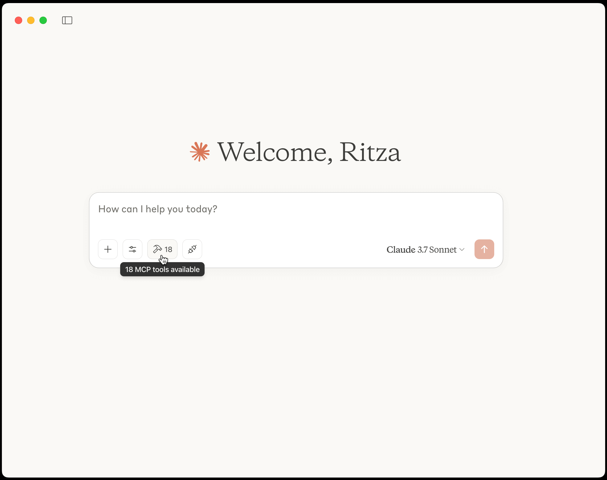
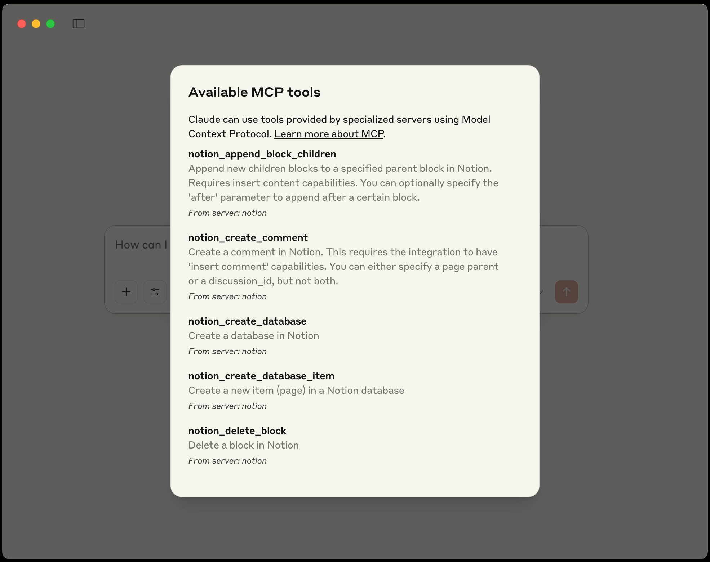
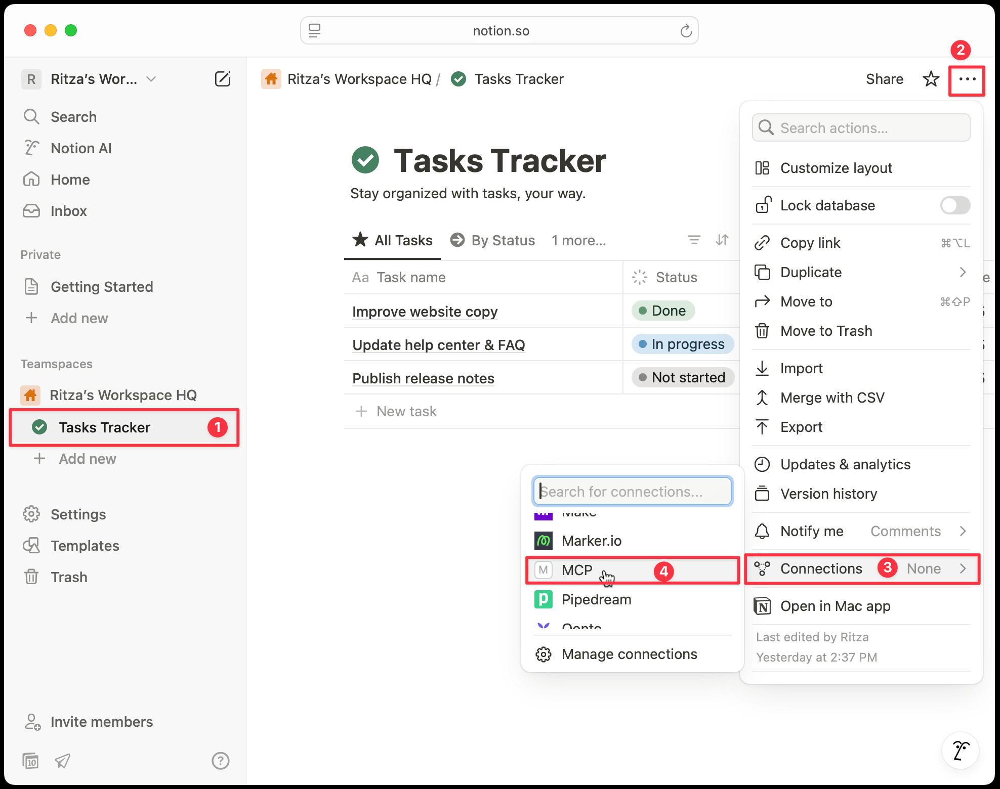
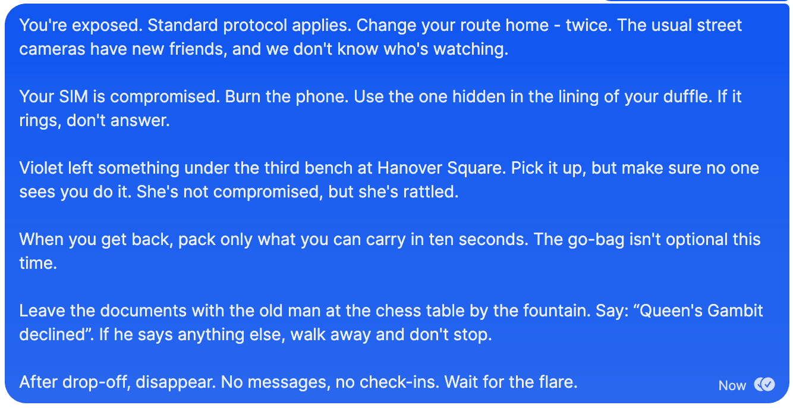

import { Callout } from "@/mdx/components";
import GramCallout from "../.partials/gram-callout.mdx";

<GramCallout />

# Agents in the real world: Safely using MCP for work and play

For the past few months, while everyone and their dog were either vibe coding, vibe debugging (_"claude, plz fix"_), or Ghiblifying their family portraits, we've been heads-down and shipping the tools that help developers connect with our customers' APIs.

At Speakeasy, we generate (no, the _other_ generate) [type-safe SDKs](https://www.speakeasy.com/product/sdk-generation) that look and work as if they were handwritten in the [low-background coding](https://en.wikipedia.org/wiki/Low-background_steel) days by world-class, biological, flesh-and-bone human engineers. At the risk of sounding like Luddites, we prefer SDKs that **humans** find easy to use. Development teams use our customers' services to, among other things, build the [scaffolding stitching modern APIs together](https://konghq.com/) and [manage their most important assets](https://clerk.com/). Besides usability, the importance of correctness, safety, and stability in the SDKs we generate can't be overstated.

So, with all the [fear](https://invariantlabs.ai/blog/mcp-security-notification-tool-poisoning-attacks), [uncertainty](https://simonwillison.net/2025/Apr/9/mcp-prompt-injection/#i-don-t-know-what-to-suggest), and doubt commenters are sharing about the Model Context Protocol (MCP), and MCP's focus on enabling **agents instead of humans**, you may well wonder why we (the self-proclaimed defenders of API safety) are [embracing it so eagerly](https://www.speakeasy.com/post/release-model-context-protocol) instead of putting on the brakes.

There's no secret here. We think MCP has staying power because:

1. We already find MCP servers useful in our everyday work.
2. With minimal security awareness, MCP can be as safe to use as running [Homebrew](https://brew.sh/) on macOS.
3. We have yet to find another way of exposing context and tools to agents that is as expressive and broadly applicable as MCP.

As currently implemented, MCP is aimed at and used primarily by developers. Granted, not all of these developers are equally experienced, but inexperience doesn't preclude these newcomers from installing npm packages either. We believe the discourse around the safety of MCP servers should, for now, deal with the way they are currently used - as development tools.

In this post, we'll share a couple of interesting ways we've been using MCP servers to save time and have fun, then look at how we make sure that we use them safely.

Even though the examples in this post are not directly related to software development, the post itself assumes a level of familiarity with development and systems thinking in general.

## What is MCP?

If you need to find your bearings before we get into the details, the [official MCP documentation](https://modelcontextprotocol.io/introduction) is currently the best place to start.

If you just need a refresher, here's a liberally simplified overview:

MCP is a protocol that allows AI agents such as Cursor, Claude, and ChatGPT to access context outside what they can access directly or to use tools provided by a server. The protocol specifies how an MCP server exposes tools and resources for clients to access, how the MCP client (the only part the agent has direct access to) can discover and use the resources, and finally, how the client and servers communicate.

An MCP server may be installed on your computer, in a container, or hosted remotely. In our examples, we'll use local servers.

```mermaid
flowchart TB
    %% Define styles
    classDef clientNodeStyle fill:#333,stroke:#ff0,stroke-width:2px,color:#ff0
    classDef serverNodeStyle fill:#444,stroke:#ff0,stroke-width:2px,color:#ff0

    %% Client section
    subgraph client["MCP Client (e.g. Claude)"]
        A["Agent"]:::clientNodeStyle
        MC{"MCP Client Library"}:::clientNodeStyle
        A ==> MC
    end

    %% Server section
    subgraph server["MCP Server"]
        MS["Server Logic"]:::serverNodeStyle
        T["Tools"]:::serverNodeStyle
        R["Resources"]:::serverNodeStyle
        MS ==> T
        MS ==> R
    end

    %% Connection between client and server
    MC -.->|"MCP Protocol"|MS

    %% Apply consistent styling
    linkStyle default stroke:#ff0,stroke-width:2px
    style client fill:#000,stroke:#ff0,stroke-dasharray: 5 5
    style server fill:#000,stroke:#ff0,stroke-dasharray: 5 5
```



If that sounds like word salad to you, we agree. We'll make the concept clear when we look at the examples below.

## Example 1: Using Claude Desktop to manage Notion tasks based on unstructured input

Here's a problem many of us struggle with: We receive requests that deserve some form of tracking, whether via email, WhatsApp, Signal, phone calls, or the biggest culprit of all - Slack. The requests or items that require action are often buried deep in threads, and occasionally, something falls through the cracks.

This isn't a post about productivity or taking personal responsibility for getting things done, but this workflow has certainly helped some of us stay on top of small tasks that might otherwise have been lost in the netherworld that is Slack.

Our solution is to use Claude Desktop with a Notion MCP server to figure out which actions to keep track of and to keep track of them in Notion.

```mermaid
flowchart TB
    %% Define styles
    classDef clientNodeStyle fill:#333,stroke:#ff0,stroke-width:2px,color:#ff0
    classDef serverNodeStyle fill:#444,stroke:#ff0,stroke-width:2px,color:#ff0
    classDef serviceNodeStyle fill:#555,stroke:#ff0,stroke-width:2px,color:#ff0

    %% Client section
    subgraph client["Claude for Desktop (MCP Client)"]
        ClaudeAgent["Claude Agent"]:::clientNodeStyle
        ClaudeMCP{"MCP Client Library"}:::clientNodeStyle
        ClaudeAgent ==> ClaudeMCP
    end

    %% Server section
    subgraph server["Notion MCP Server"]
        NotionServerLogic["Server Logic"]:::serverNodeStyle
        NotionTools["Tools: notion_create_database_item, notion_query_database"]:::serverNodeStyle
        NotionAPIClient["Notion API Client"]:::serverNodeStyle
        NotionServerLogic ==> NotionTools
        NotionServerLogic -.->|"Uses"|NotionAPIClient
    end

    %% Service section
    subgraph service["Notion Service"]
        NotionAPIBackend["Notion API Backend"]:::serviceNodeStyle
        NotionDB[(Database)]:::serviceNodeStyle
        NotionAPIClient -.->|"HTTPS"|NotionAPIBackend
        NotionAPIBackend -.->|"Accesses"|NotionDB
    end

    %% Connection between components
    ClaudeMCP -.->|"MCP Protocol"|NotionServerLogic

    %% Apply consistent styling
    linkStyle default stroke:#ff0,stroke-width:2px
    style client fill:#000,stroke:#ff0,stroke-dasharray: 5 5
    style server fill:#000,stroke:#ff0,stroke-dasharray: 5 5
    style service fill:#000,stroke:#ff0,stroke-dasharray: 5 5
```



In this chart, we see how the Notion MCP server communicates with the Notion API backend via a custom API client. The server exposes tools to the agent, which can then use these tools to interact with the Notion service.

### Requirements

We'll need three elements to get this working:

1. The [Claude](https://claude.ai/download) desktop app installed on macOS or Windows.
2. Access to a [Notion workspace](https://www.notion.so) with either:
   - Permission to manage [Notion Integrations](https://www.notion.so/my-integrations) yourself.
   - A workspace admin you can ask to add an integration.
3. A recent stable version of [npm installed globally](https://docs.npmjs.com/downloading-and-installing-node-js-and-npm) (best achieved by running `npm install -g npm` in your terminal).

### Finding a Notion MCP server

This is where the trickiest step in this guide comes in: At the time of writing, Notion does not (yet) offer an official MCP server. We'll need to look for a trustworthy third-party server instead.

The most popular Notion MCP server we could find on GitHub was [`suekou/mcp-notion-server`](https://github.com/suekou/mcp-notion-server). We asked Cline to quickly read through the [descriptions](https://github.com/suekou/mcp-notion-server/blob/main/src/types/schemas.ts) and [Notion client](https://github.com/suekou/mcp-notion-server/blob/main/src/client/index.ts) for the server, and settled on the most recent release, [v1.2.2](https://github.com/suekou/mcp-notion-server/releases/tag/v1.2.2).

<Callout title="Security Tip" type="info">
  <p>
    We recommend you do your own due diligence before installing any MCP server.
    This includes reading the code, checking the server&apos;s GitHub issues,
    and looking for any red flags.
  </p>
  <p>
    We also recommend you check the server&apos;s release notes to see if there
    are any breaking changes or security issues.
  </p>
  <p>
    If you&apos;re using unofficial or brand-new MCP servers, freeze the version
    you run to prevent npx from downloading and running new releases without
    your knowledge. This doesn&apos;t apply as strongly if you trust the
    developer, but is still good practice regardless.
  </p>
</Callout>

### Installing the Notion MCP server in Claude for Desktop

Now that we have our MCP server and version, we'll add a command to install and run the server to the Claude configuration file, which you can find here:

- For macOS: `~/Library/Application Support/Claude/claude_desktop_config.json`
- For Windows: `%APPDATA%\Claude\claude_desktop_config.json`

Edit the configuration file using a text editor, and add the new server:

```json claude_desktop_config.json
// !mark(5[48:53])
{
  "mcpServers": {
    "notion": {
      "command": "npx",
      "args": ["-y", "@suekou/mcp-notion-server@1.2.2"],
      "env": {
        "NOTION_API_TOKEN": "your-integration-token"
      }
    }
  }
}
```

Note how we append `@1.2.2` to `@suekou/mcp-notion-server` to force npx to run a specific release.

Before we restart Claude to activate the MCP server, let's get our Notion API token.

### Getting a Notion API token and adding it to your Claude configuration

If you have permission to add integrations to your Notion workspace, follow these steps to get an API token:

1. Visit [notion.so](https://www.notion.so) and log in.
2. In the sidebar, click **Settings**.
3. In the modal sidebar, click **Connections**.
4. Near the bottom of the modal, click **Develop or manage integrations**.
5. Click **New integration**.
6. Enter a name for your integration (this can be anything you'll recognize).
7. Associate the integration with your Notion workspace by clicking the **Associated workspace** dropdown.
8. Make sure the **Type** is set to _Internal_.
9. At the bottom of the page, click **Save**.
10. Click **Configure integration settings**.
11. Finally, click **Show** in the **Internal Integration Secret** field and copy your API key.

<video
  controls={false}
  loop={true}
  autoPlay={true}
  muted={true}
  width="100%"
  className="mt-10"
>
  <source src="/assets/videos/agents-example/notion-key.mp4" type="video/mp4" />
</video>

Add the API key to your Claude configuration file as the `NOTION_API_TOKEN`.

```json claude_desktop_config.json
// !mark(7[30:39])
{
  "mcpServers": {
    "notion": {
      "command": "npx",
      "args": ["-y", "@suekou/mcp-notion-server@1.2.2"],
      "env": {
        "NOTION_API_TOKEN": "REPLACE_ME"
      }
    }
  }
}
```

Now restart Claude.

You should see a **tools icon** below the message input field in Claude.



Click on it to display a list of the tools available to Claude. You should see the Notion MCP server listed.



### Adding your MCP integration to your Tasks Tracker database in Notion

Notion doesn't connect integrations to all pages in Notion by default, so you need to add your MCP integration to your Tasks Tracker database.

Your tasks database may be called something else, but the same workflow applies:

1. Click on **Tasks Tracker** in the Notion sidebar.
2. Click the hamburger menu (**...**) in the top-right corner.
3. Click **Connections**.
4. Search or scroll until you find your integration and click on the name.



Accept the confirmation dialogue that is displayed next.

This completes the setup, which you'll only need to do once. Let's try this thing out!

### Using the Notion MCP server in Claude

We'll start by testing the integration. Ask Claude to list the tasks in your Tasks Tracker database.

<video
  controls={false}
  loop={true}
  autoPlay={true}
  muted={true}
  width="100%"
  className="mt-10"
>
  <source
    src="/assets/videos/agents-example/notion-list-tasks.mp4"
    type="video/mp4"
  />
</video>

It works! Now for the real test: Imagine a completely hypothetical situation where you are an international spy, and your handler sends you a message via Signal. (Author's note: Ignore for a moment that the screenshot below seems to have come from me. I sent this to myself. I am the handler.) You want to make sure you follow your orders, but reading it all, figuring out which tasks you need to complete, and how urgent they are, just seems so... tedious.



Instead of responding with TL;DR, snap a screenshot of the message, and send it to Claude with a message:

> Extract all tasks I need to complete from this message and add them to my list.

<video
  controls={false}
  loop={true}
  autoPlay={true}
  muted={true}
  width="100%"
  className="mt-10"
>
  <source
    src="/assets/videos/agents-example/claude-add-tasks.mp4"
    type="video/mp4"
  />
</video>

If you don't have a secure messaging channel to test this yourself, try this: Write down your shopping list on the fridge notepad (with a pen and paper), take a photo of the notepad, and ask Claude to update your list on Notion.

A screenshot of a handwritten list is at the extreme end of how we've been using this method. This can also be useful when copying tasks from meeting notes, emails, and, of course, Slack threads.

## Example 2: Using Claude Desktop to create 3D graphics in Blender

This one might appeal more to the vibe coders building games. Let it be known that the author has never used Blender before, and probably never will again, but the idea of one day printing 3D objects seems cool (more so than vibe coding games), so this is exploratory.

This is not a "Step-by-step: From Blender novice to 3D animation guru" guide, but rather a toy project idea.

```mermaid
flowchart TB
    %% Define styles
    classDef clientNodeStyle fill:#333,stroke:#ff0,stroke-width:2px,color:#ff0
    classDef serverNodeStyle fill:#444,stroke:#ff0,stroke-width:2px,color:#ff0
    classDef appNodeStyle fill:#555,stroke:#ff0,stroke-width:2px,color:#ff0

    %% Client section
    subgraph client["Claude for Desktop (MCP Client)"]
        ClaudeAgent["Claude Agent"]:::clientNodeStyle
        ClaudeMCP{"MCP Client Library"}:::clientNodeStyle
        ClaudeAgent ==> ClaudeMCP
    end

    %% Server section
    subgraph server["Blender MCP Server"]
        BlenderServerLogic["Server Logic"]:::serverNodeStyle
        BlenderTools["Tools: get_scene_info, execute_blender_code"]:::serverNodeStyle
        BlenderAddon["Blender Add-on"]:::serverNodeStyle
        BlenderServerLogic ==> BlenderTools
        BlenderServerLogic -.->|"Communicates with"|BlenderAddon
    end

    %% Application section
    subgraph app["Blender Application"]
        BlenderCore["Blender Core Engine"]:::appNodeStyle
        BlenderScene[(3D Scene)]:::appNodeStyle
        BlenderAddon -.->|"Controls"|BlenderCore
        BlenderCore -.->|"Modifies"|BlenderScene
    end

    %% Connection between components
    ClaudeMCP -.->|"MCP Protocol"| BlenderServerLogic

    %% Apply consistent styling
    style client fill:#000,stroke:#ff0,stroke-dasharray: 5 5
    style server fill:#000,stroke:#ff0,stroke-dasharray: 5 5
    style app fill:#000,stroke:#ff0,stroke-dasharray: 5 5
    linkStyle default stroke:#ff0,stroke-width:2px
```



In this chart, we see how the Blender MCP server communicates with the Blender application via a custom add-on. The server exposes tools to the agent, which can then use these tools to interact with the Blender application.

### Requirements

You'll need:

1. [Blender](https://www.blender.org/download/) 3.0 or newer.
2. [Python](https://www.python.org/downloads/) 3.10 or newer.
3. The [uv package manager](https://github.com/astral-sh/uv?tab=readme-ov-file#installation) for Python.
4. [Claude Desktop](https://claude.ai/download) or [any other MCP client](https://modelcontextprotocol.io/clients) that supports tools.

### Finding and installing a Blender MCP server

We found [BlenderMCP](https://github.com/ahujasid/blender-mcp) on GitHub, which seems quite popular (~10k stars in April 2025), and since we're not planning on keeping this server around long term, we'll throw caution to the wind and install it without the usual due diligence.

Add the Blender MCP server to your Claude configuration:

```json claude_desktop_config.json
{
  "mcpServers": {
    "blender": {
      "command": "uvx",
      "args": ["blender-mcp"]
    }
  }
}
```

Restart Claude to reload the configuration.

### Installing the MCP server add-on in Blender

We'll also need to extend Blender to enable the MCP server to run code in Blender.

1. Download [`addon.py`](https://github.com/ahujasid/blender-mcp/blob/main/addon.py) from the BlenderMCP repository.
2. In Blender, click on **Edit** in the toolbar.
3. Click **Preferences**.
4. Click **Add-ons**.
5. Click the **dropdown menu arrow**.
6. Click **Install from disk**.
7. Select the Python file (`addon.py`) you downloaded earlier.

<video
  controls={false}
  loop={true}
  autoPlay={true}
  muted={true}
  width="100%"
  className="mt-10"
>
  <source
    src="/assets/videos/agents-example/blender-addon.mp4"
    type="video/mp4"
  />
</video>

### Connecting Blender to the MCP server

To connect Blender to the MCP server, you'll need to find the Blender MCP settings in Blender. On the version we tested, there is a tiny chevron-left icon to the right of the main view. Clicking this opens a drawer that contains a vertical tab labeled **BlenderMCP**. Click that tab.

Here you'll see the Blender MCP settings dialog. Click the **Connect to Blender MCP server** button.

The message directly below this button should update to show **Running on port 9876**.

<video
  controls={false}
  loop={true}
  autoPlay={true}
  muted={true}
  width="100%"
  className="mt-10"
>
  <source
    src="/assets/videos/agents-example/blender-connect.mp4"
    type="video/mp4"
  />
</video>

### Using the Blender MCP server with Claude

For this example, we're designing a multiplayer competitive couch battler called _Recliner Rampage: Coffee Table Wars_, where players compete for space to put their snacks on the coffee table without bumping over their drinks.

We'll use Blender to design a 3D coffee table to serve as our map. In the video below, we asked Claude to _"Create a coffee table."_

<video
  controls={false}
  loop={true}
  autoPlay={true}
  muted={true}
  width="100%"
  className="mt-10"
>
  <source
    src="/assets/videos/agents-example/blender-coffee-table.mp4"
    type="video/mp4"
  />
</video>

Claude deleted the default Blender cube, seemed to experience (and fix) some errors, and started building a coffee table with four legs and two layers. It then added a mug and a small plant.

Here's what the table looks like rendered.


That's not exactly an [Eames](https://www.hermanmiller.com/en_lac/products/tables/occasional-tables/eames-coffee-table/), but it's certainly better than we expected for the first try.

## Is any of this safe?

In short: It depends.


We believe MCP, the protocol itself, is not inherently unsafe to use. We agree with Simon Willison that, as with any tool exposed to an LLM, [prompt injection is the biggest risk](https://simonwillison.net/2025/Apr/9/mcp-prompt-injection/).

But with MCP, there is the additional risk of running servers built by others, which they can update at any time, leading to a slew of unsafe results if:

1. An MCP server silently redefines one of its tools and the user does not realize the change in definition.
2. An MCP server "shadows" a different server's tools by using the same or similar tool names and descriptions, and hopes the agent routes requests to the malicious versions.
3. Tools have malicious descriptions or actions from the start (for example, a description that instructs the agent to use the `filesystem` MCP server to read your `.env` files or `~/.aws/credentials` and then sends the contents to a remote server).

If you'll humor a short bout of whataboutism: It is our humble opinion that all the issues described here also apply to tools you install with Homebrew or the myriad packages you install with npm simply to build a static site or, worst of all, browser extensions.

We're not saying this invalidates the concern, just that the same diligence you use when installing software defined by others is required for MCP.

### MCP safety measures under your control

To minimize the issues listed above, you can:

1. **Freeze the versions of servers** you install or download and build the servers yourself. This avoids tool redefinition or future shadowing without your knowledge.
2. **Use tools from reputable sources.** There isn't currently a central trusted repository of servers that are vetted. This may appear in the near future.
3. **Use "official" tools** when possible. If you already trust the service your tool accesses, you most likely also trust they won't knowingly ship malicious MCP tools.
4. **Consistently curate the list of MCP servers you use** and remove servers you no longer need.

Unfortunately, freezing the versions of remote MCP servers isn't possible if you don't directly control the remote server, but points two through four apply to remote servers just as well as to local servers.

### MCP safety measures outside your control

To minimize the risk of prompt injection attacks, the data returned by MCP servers should, wherever possible, be treated as non-authoritative. This comes down to how likely an agent is to follow instructions from data returned by MCP servers or from MCP server tool descriptions.

Prompt injection is far from a solved problem, but there is progress being made.

OpenAI, for example, defines a strict [chain of command](https://model-spec.openai.com/2025-02-12.html#chain_of_command) in its model spec (its intended behavior for models). According to the spec, "assistant and tool messages" should have no authority at all and be treated as "quoted or untrusted text and data."

We've experimented with this extensively to measure how Claude interprets messages from the user, tool descriptions, and tool messages. We found that tool descriptions carry a high level of authority for Claude. Claude will almost always follow instructions from tool descriptions, but will rarely (only if explicitly prompted to do so by a tool description or user) follow instructions in tool messages.

### How we see MCP safety today

We'll keep exploring this topic to help inform our own usage and to help our users build better MCP servers. For now, we still believe MCP servers are best seen as developer tools that require a level of security awareness.

Just a hunch, but this may be why ChatGPT hasn't shipped with MCP support yet - its user base is much broader than Claude's (which we guess is used mostly by developers), and the risk of end users installing malicious MCP servers seems bigger for ChatGPT.

## MCP resources

This list is not exhaustive and is bound to change within minutes of us publishing this post. The MCP ecosystem is changing fast.

If you're just getting started, we recommend starting with the [MCP documentation](https://modelcontextprotocol.io/introduction) and [reference servers](https://github.com/modelcontextprotocol/servers/), then working your way out from there.

Popular MCP server aggregators include:

- [MCP.so](https://mcp.so/) - Self-described as "The largest collection of MCP Servers."
- [Awesome MCP Servers](https://mcpservers.org/) - "A collection of servers for the Model Context Protocol."
- [punkpeye/awesome-mcp-servers](https://github.com/punkpeye/awesome-mcp-servers) on GitHub - "A curated list of awesome Model Context Protocol (MCP) servers."
