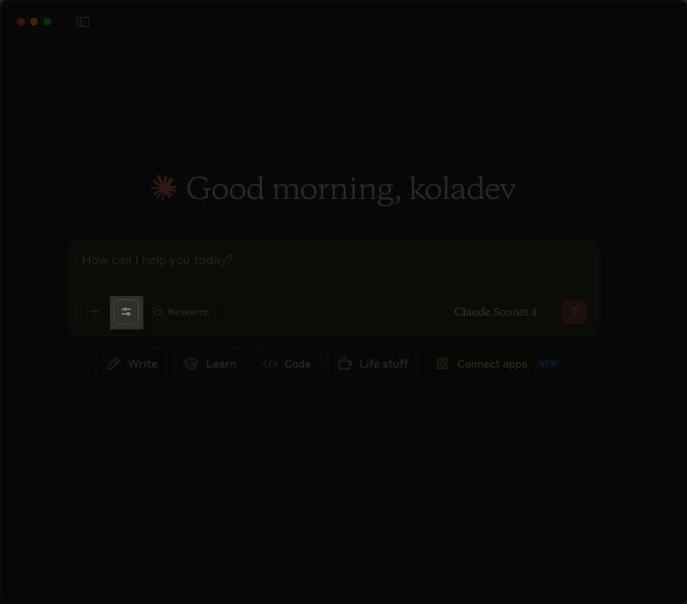
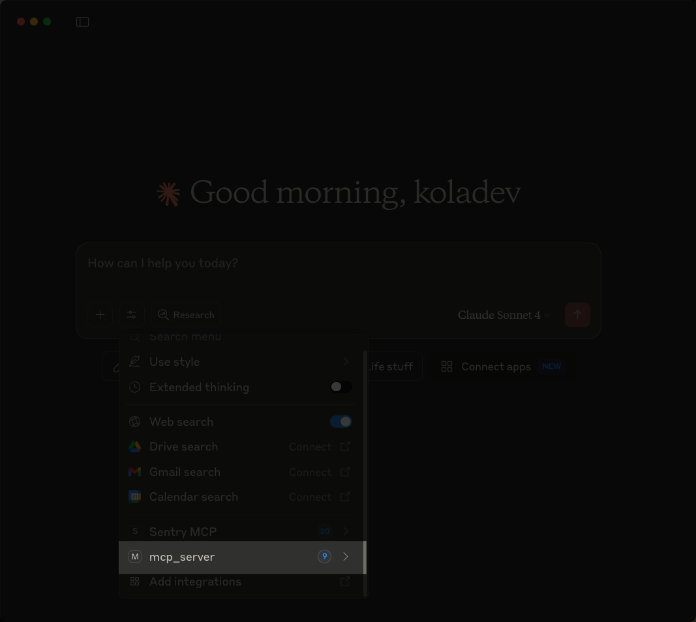
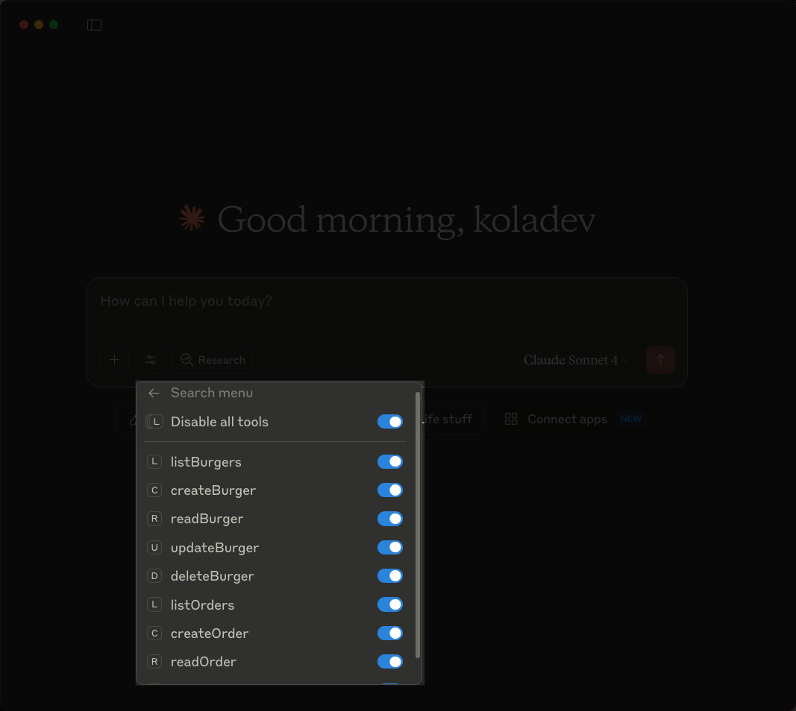
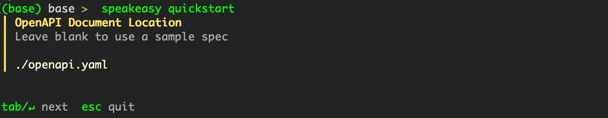
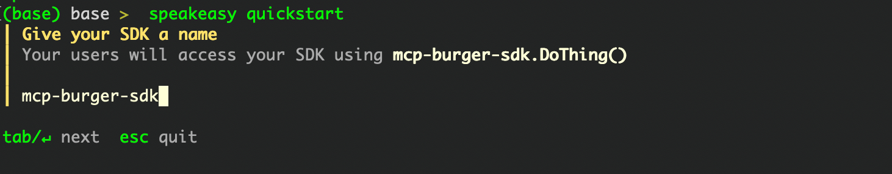
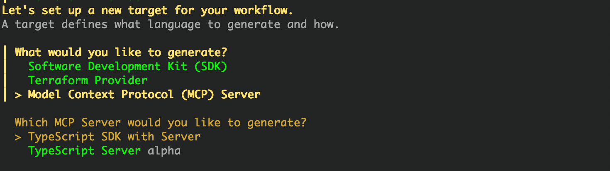
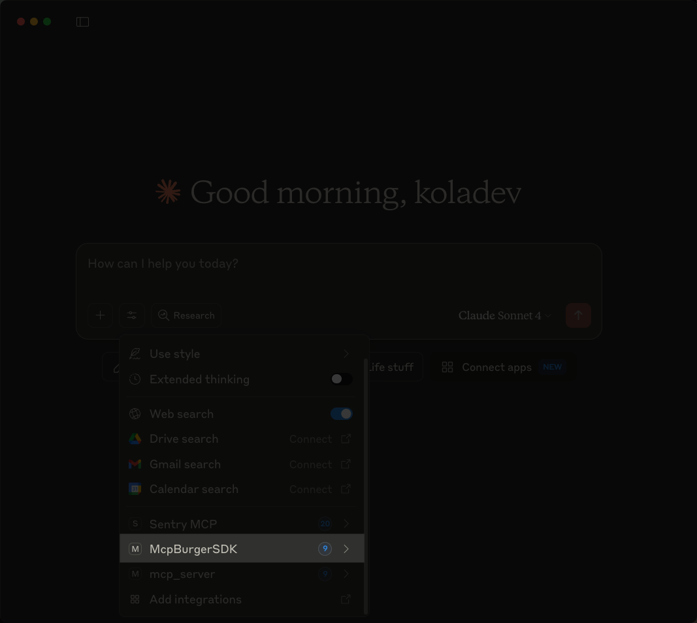

import { Callout } from "@/mdx/components";

The most interesting usage of MCP servers is communication with APIs. This opens the groundwork for many possible integrations, such as users being able to order via Claude Desktop or developers being able to understand your API using Cursor AI.

But let's be honest. Writing an MCP server from scratch with API integrations while you already have your controllers in place or an OpenAPI document seems tedious and repetitive. So, what if you could generate an MCP server just by having an API ready, just there? That's possible with FastMCP or Speakeasy if you are using FastAPI.

In this article, we will learn how to build an MCP server for a [FastAPI](https://fastapi.tiangolo.com/) API with [FastMCP](https://gofastmcp.com/getting-started/welcome) and [Speakeasy](https://www.speakeasy.com/). We will then compare the tools on characteristics such as maintenance, code quality, and usage.

## Requirements

For this article, we are building an MCP server using the Apitizing Burgers API project that you can find [here](https://github.com/speakeasy-api/examples/tree/main/fastmcp-speakeasy-project/base). Clone the project with the following command:

```bash
git clone https://github.com/speakeasy-api/examples
cd examples/fastmcp-speakeasy-project/base
```

To make the setup easier, we are working with the environment manager `uv`. You can use any Python environment creation tool which you are familiar with.

```bash
uv venv
source .venv/bin/activate
```

Then, install the required dependencies for the project. The `apitizing-burger` project is already set up with FastAPI, so we will install the FastAPI package and its dependencies.

```bash
uv pip install "fastapi[all]"
```

Then run the API using the following command:

```bash
uvicorn app.main:server --reload
```

We also recommend having [Claude Desktop](https://claude.ai/download) installed on your machine for testing the MCP servers. We can now start integrating FastMCP and Speakeasy in the project to build an MCP server. Let's begin by integrating FastMCP.

## Building an MCP server with FastAPI and FastMCP

FastMCP is a Python package that provides a high-level implementation of the MCP Python SDK. By using this package, you can quickly build an MCP server without worrying about the low-level implementation of component lifecycle management, including tools, resources, or prompts.

Interestingly, the FastMCP package provides an [integration with FastAPI](https://gofastmcp.com/servers/openapi#fastapi-integration), to have your controllers transformed into MCP tools. Let's see how to implement it.

### 1. Installing FastMCP

First, we need to install the [fastmcp](https://github.com/jlowin/fastmcp?tab=readme-ov-file#installation) package in the project.

```bash
uv pip install fastmcp
```

### 2. Creating the MCP server file

Then, create a file in the `app` directory called `mcp_server.py`. This file will contain the code for the MCP server.

```bash
cd app/ && touch mcp_server.py
```

### 3. Configuring FastMCP with FastAPI

Inside the `mcp_server.py` file, add the following code:

```python
from fastmcp import FastMCP
from app.main import server

# Create an MCP server from your FastAPI app
mcp = FastMCP.from_fastapi(app=server)

if __name__ == "__main__":
  mcp.run()
```

In the code above, you are registering your FastAPI app with FastMCP using a single line. From there, FastMCP inspects the app, finds the declared controllers in `app/main.py`, and turns each route into an MCP tool without needing any additional configuration.

### 4. Installing the MCP server in Claude Desktop

We can now install the MCP server. There's no need to write the configuration ourselves. We will use the `fastmcp install` command to handle the installation. Go into the `app` directory and run the following command:

```bash
fastmcp install mcp_server.py
```

You will obtain a similar output, confirming that the MCP server is indeed installed on Claude Desktop.


However, the configuration won't work. Let's have a look at the `claude-desktop-config.json` file.

<Callout title="Note" type="info">
You can find the configuration file by going to Settings -> Developer -> Edit config in Claude Desktop.
</Callout>

```json
{
  "mcpServers": {
    "mcp_server": {
      "command": "uv",
      "args": [
        "run",
        "--with",
        "fastmcp",
        "fastmcp",
        "run",
        "path/to/project/fastmcp-speakeasy-project/base/app/mcp_server.py"
      ]
    }
  }
}
```

The `--with` option enables us to specify the dependencies to use when running the file. But, `fastmcp` is not the only one dependency because we are also working with `fastapi`. Additionally, you may encounter issues with the Python path, which can result in import errors. Let's modify the configuration to ensure Claude can run the project without issues.

```json
{
  "mcpServers": {
    "mcp_server": {
      "command": "uv",
      "args": [
        "run",
        "--with",
        "fastmcp",
        "--with",
        "fastapi[all]",
        "fastmcp",
        "run",
        "path/to/project/fastmcp-speakeasy-project/base/app/mcp_server.py"
      ],
      "env": {
        "PYTHONPATH": "path/to/project/fastmcp-speakeasy-project/base/"
      }
    }
  }
}
```

We have added the `fastapi[all]` dependency and an environment variable to set the Python path, ensuring imports work.

We have completed the integration of FastAPI and FastMCP. Let's test the MCP server in Claude Desktop.

### Testing the integration

Open your Claude Desktop application and click on the `Search and tools` button.



Clicking on the button will display the MCP servers installed. The name of our MCP server will be `mcp_server`.



Clicking on the server, you will see the tools we added.



You can then ask Claude to create a burger in the chat


We can see that Claude was able to make a tool call to create Burger from our API.

We have now created an MCP server with FastAPI and FastMCP.

### More configuration with FastMCP

FastMCP gives you some flexibility in how tools are exposed. You can configure things like the server name, timeout values, custom tool names, and route maps to control which endpoints are included or excluded.

Here's an example that renames the server, overrides a tool name, and excludes the route for deleting a burger:

```python
mcp = FastMCP.from_fastapi(
    app=server,
    name="Apitizer MCP Server",
    timeout=5.0,
    mcp_names={"createBurger": "Create a burger menu"},
    route_maps=[
        # Exclude delete burger route
        RouteMap(methods="DELETE", pattern=r".*", mcp_type=MCPType.EXCLUDE, tags={"burger"}),
    ],
)
```

### Considerations for FastMCP in FastAPI

FastMCP avoids code duplication by reusing your existing FastAPI endpoints. Typing and schema definitions are preserved, including inheritance and Pydantic validations. That preservation also extends to dependencies, middleware, and authentication, all of which carry over into the MCP layer.

FastMCP behaves like a black box. You get speed and simplicity, but not much visibility into how tools, prompts, or resources are constructed. In contrast, when you use the MCP Python SDK directly – even with FastMCP – you build things manually but retain full control. You can interact with the component lifecycle, adjust behavior, and trace execution more easily.

Without that visibility, debugging tool behavior can be difficult when something breaks or doesn't work as expected.

## Building an MCP server with FastAPI and Speakeasy

[Speakeasy](https://www.speakeasy.com/) is a tool and service that helps you generate SDKs from OpenAPI documents in many languages. Speakeasy supports [generating MCP servers](https://www.speakeasy.com/docs/model-context-protocol) alongside your SDK code (currently only for TypeScript SDKs, with support for additional languages planned). All you need is an OpenAPI document and a [Speakeasy account](https://www.speakeasy.com/docs/introduction#sign-up).

Let's see how to build an MCP server with FastAPI and Speakeasy.

### 1. Installing the Speakeasy CLI

You will need to install [Speakeasy](https://www.speakeasy.com/docs/introduction#install-the-speakeasy-cli) on your machine first.

```bash
# Homebrew (macOS)
brew install speakeasy-api/homebrew-tap/speakeasy

# or script Installation (macOS and Linux)
curl -fsSL https://go.speakeasy.com/cli-install.sh | sh
```

If you are using a Windows machine, you can use those commands.

```bash
# Windows Installation
# Using winget:
winget install speakeasy

# or Using Chocolatey:
choco install speakeasy
```

### 2. Uploading the OpenAPI document

Our project already has OpenAPI document files, such as `openapi.yaml` and `openapi.json`. Therefore, we won't need to perform any configuration on that side.

<Callout title="Note" type="info">
 For your FastAPI project, you will need to generate those files. We have a tutorial which you can follow to understand how to generate a quality OpenAPI document for your FastAPI project [here](/openapi/frameworks/fastapi#basic-fastapi-setup).
</Callout>

To initiate the process, run the following command from the project's root directory.

```bash
speakeasy quickstart
```

This command will first prompt for authentication, and then after the successful authentication, you will enter the path to the OpenAPI document which is `./openapi.yaml`.



### 3. Naming the SDK

The next step is to give the SDK a name. Let's name the SDK `mcp-burger-sdk`.



### 4. Selecting the output

Speakeasy will ask you what you want to generate. Choose the Model Context Protocol (MCP) Server, and the sub-option will be TypeScript SDK with Server.



The Speakeasy CLI will then ask you for a directory to generate the SDK and a name for the NPM package. You can simply press **Enter** to use the current directory and the default package name, or modify them if needed.

At this stage, Speakeasy will generate a TypeScript SDK in the `mcp-burger-sdk-typescript` directory. The MCP server code will be located at `mcp-burger-sdk-typescript/src/mcp-server`. A built version is also available at `mcp-burger-sdk-typescript/bin/mcp-server.js`, which is the file you'll reference in your Claude Desktop configuration.

### 5. Installing the MCP Server in Claude Desktop

With the MCP server already built, the next step is to configure the MCP server in the `claude-desktop-config.json` file.

```json
{
  "mcpServers": {
    "typescript_mcp_server": {
      "command": "node",
      "args": [
        "path/to/sdk/mcp-burger-sdk-typescript/bin/mcp-server.js",
        "start"
      ]
    }
  }
}
```

<Callout title="Note" type="info">
 Speakeasy also allows you to install your MCP server after it has been published to the npm registry. In that case, you would use a similar configuration in the `claude-desktop-config.json` file.

```json
{
 "mcpServers": {
   "McpBurgerSDK": {
     "command": "npx",
     "args": [
       "-y",
       "--package",
       "mcp-burger-sdk",
       "--",
       "mcp",
       "start",
       "--api-key",
       "..."
     ]
   }
 }
}
```
</Callout>

Once the installation is complete, reload Claude Desktop and you should see the server and its tools available.



You now have a working MCP server generated with Speakeasy.

### More configuration with Speakeasy

Speakeasy allows you to [customize](https://www.speakeasy.com/docs/model-context-protocol#configuration-options) your server, whether it's about hiding certain tools and setting specific scopes, but the customization starts with the OpenAPI document. To disable the generation of a tool for an operation, use the `x-speakeasy-mcp` extension.

```yaml
paths:
  /products:
    post:
      operationId: createProduct
      tags: [products]
      summary: Create a product
      description: API endpoint for creating a product in the CMS
      x-speakeasy-mcp:
        disabled: false
        name: create-product
        scopes: [products, create, ecommerce]
        description: |
          Creates a new product using the provided form. The product name should
          not contain any special characters or harmful words.
```

In the code configuration above:

- `disabled` specifies when an operation should be ignored.
- `name` is used to set the name of the MCP tool, if you are looking to change it.
- `scopes` are a way of tagging tools, which is helpful when you want to run the MCP server for a specific set of tools only.

With Speakeasy, when starting the MCP server, you can specify which scopes to include with the `--scope` flag:

```json
{
  "mcpServers": {
    "EcommerceSDK": {
      "command": "npx",
      "args": [
        "-y",
        "--",
        "e-commerce-sdk",
        "mcp",
        "start",
        "--scope",
        "products"
      ],
      "env": {
        "API_TOKEN": "your-api-token-here"
      }
    }
  }
}
```

If modifying the OpenAPI document is a hassle, you can use [Overlays](https://www.speakeasy.com/openapi/overlays), which provides a convenient way to apply the `x-speakeasy-mcp` extension without changing the original file.

```yaml
overlay: 1.0.0
info:
 title: Add MCP scopes
 version: 0.0.0
actions:
 - target: $.paths.*["post","head","query"]
   update: { "x-speakeasy-mcp": { "scopes": ["products"] } }
```

The code above instructs Speakeasy to generate tools for operations with the tag **products** and HTTP operations of types `POST`, `HEAD`, and `QUERY`.

## Choosing Between FastMCP and Speakeasy

You have two solid options for building an MCP server: FastMCP and Speakeasy. Both can help you ship quickly, but they serve different needs depending on how much control, visibility, and long-term structure you require.

### Visibility

You don't see how tools are constructed when using FastMCP. FastMCP converts your FastAPI routes into MCP tools automatically, but the internal logic, prompt structure, and resource handling are hidden. This makes debugging harder as your server grows.

By comparison, Speakeasy generates explicit code for the server and tools in the `mcp-server` directory. You can inspect how each tool is defined, see the input/output mappings, and modify behavior as needed. This helps when you want to understand or extend how the MCP layer works.

### Setup

One big advantage of using FastMCP with FastAPI is that you can get a working MCP server quckly. FastMCP reuses your existing FastAPI app and requires minimal configuration. If your routes are typed and documented, FastMCP can expose them as tools with almost no extra work.

In contrast, Speakeasy requires an OpenAPI document and a short CLI flow to generate the server. This setup can take more time upfront but produces a clean SDK structure with the MCP server included, ready to use in Claude Desktop, Cursor AI or as a standalone service.

### Customization

You have limited customization in FastMCP. You can rename tools, set timeouts, or exclude routes using configuration options, but beyond that, you're constrained by what the abstraction allows.

With Speakeasy, customization begins in the OpenAPI document. You can change tool names, disable endpoints, apply scopes, or define overlays for external configuration. This makes it easier to create a curated toolset without touching application code.

### Maintainability

You stay close to your FastAPI app when using FastMCP. The MCP server depends directly on your controller structure, so changes to endpoints will reflect in the tools. This tight coupling works in smaller projects, but it can introduce friction as the system evolves.

Speakeasy separates your server from your application logic. The OpenAPI document becomes the source of truth, and the MCP server is generated from that document.

### Distribution

You typically run FastMCP locally inside Claude Desktop. FastMCP works well for local tools, but it's not built for external packaging or reuse across environments.

With Speakeasy, you can publish the MCP server as an NPM package or use it directly with `npx`. This allows you to distribute tools across environments or share access with other teams and your users.

## Final Thoughts

In this post, we have explored how to build an MCP server for a FastAPI API using FastMCP and Speakeasy. Each tool has its trade-offs, but to summarize:

- Choose FastMCP if you don't have an OpenAPI document or don't plan to deploy and maintain the MCP server long-term. FastMCP is a quick way to turn your existing controllers into tools, and it handles the complexity for you. It's especially useful if you're just exploring the MCP ecosystem or need something running quickly.
- Choose Speakeasy if you already have an OpenAPI document, plan to maintain the server over time, or want to share it with others. While it requires more setup, it gives you more control, visibility, and customization. Speakeasy also works well for prototyping, especially when you want to build something fast while keeping a path open to production.
