import { Callout, Table } from "@/mdx/components";
import { Steps } from "nextra/components";
import GramCallout from "../.partials/gram-callout.mdx";

<GramCallout />

# MCP: An in-depth introduction

To abuse a [famous quote about monoids](https://stackoverflow.com/questions/3870088/a-monad-is-just-a-monoid-in-the-category-of-endofunctors-whats-the-problem), "MCP is an open protocol that standardizes how applications provide context to LLMs, what's the problem?"

But even after a few hours of reading about [what MCP is](https://www.speakeasy.com/mcp/intro) and [working through an example](https://www.speakeasy.com/mcp/agents-mcp-real-world-example), it can be confusing to follow exactly what is happening when and where. What does the LLM do? What does the MCP server do? What does the MCP client do? Where does data flow, and where are choices made?

This is an in-depth introduction to MCP: what it is, how it works, and a full walkthrough example showing how everything fits together and exactly what happens at each step.

Specifically, we deployed a deliberately buggy Cloudflare Worker. The error surfaced in Sentry, and an AI assistant (Cline) running inside Visual Studio Code (VS Code) pulled the stack trace via the hosted **Sentry MCP Server**, opened a matching GitHub issue through a local **GitHub MCP Server**, patched the code, committed the fix, and redeployed - all under human approval. MCP cut the integration work from _M × N_ bespoke bridges to _M + N_ adapters, but it charged us in latency, security diligence, and a healthy learning curve.

## Why we need MCP

When an AI assistant has to juggle real-world systems - Sentry for monitoring, GitHub for code, Jira for tickets, and Postgres for data - every extra pairing means another custom adapter, another token shim, another place to break. The result is a hairball of one-off glue code that takes maintenance time and adds security risks. MCP was created to replace that chaos with a single, predictable handshake, so any compliant host can talk to any compliant tool out of the box.

### The M × N integration tax

Without MCP, each Large Language Model (LLM) host or agent (such as ChatGPT, Claude, Cline, or VS Code Copilot) plus each tool (such as Sentry, GitHub, Jira, MySQL, or Stripe) requires its own connector - that is **M hosts x N tools** bits of glue-code.

Every connector re-implements:

- Authentication and token refresh
- Data-format mapping
- Error handling and retries
- Rate-limiting quirks
- Security hardening

The cost grows quadratically. We imagine teams will end up prioritizing a handful of integrations and calling the rest "backlog".

### One protocol to rule the connectors

MCP proposes a USB-C moment for AI tooling: Every host implements MCP once, every tool exposes an MCP server once, and any host-and-tool pair can talk. Complexity collapses to **M + N**. This claim sounded too good to ignore, so we put it to the test.

Before we get to our walkthrough, let's go through a quick primer:

## MCP 101

If you already speak LSP or JSON-RPC, you'll feel at home. If not, here's the 30-second cheat sheet:

### Core vocabulary

<Table
  data={[
    {
      word: "**Host**",
      oneLiner: "App that holds the LLM and user UI",
      examples:
        "[Claude Desktop](https://claude.ai/download), [Cursor](https://www.cursor.com/), [Cline](https://cline.bot/), Windsurf",
      importance: "Generates tool calls, mediates approvals",
    },
    {
      word: "**MCP client**",
      oneLiner: "Library embedded in the host",
      examples: "[The MCP SDK](https://modelcontextprotocol.io/introduction)",
      importance: "Maintains a _stateful_ session per MCP Server",
    },
    {
      word: "**MCP server**",
      oneLiner: "Lightweight wrapper in front of a tool",
      examples:
        "[Sentry MCP](https://github.com/getsentry/sentry-mcp), [GitHub MCP Server](https://github.com/github/github-mcp-server)",
      importance: "Exposes tools and resources uniformly",
    },
    {
      word: "**Tool**",
      oneLiner: "A callable function",
      examples: "`list_organizations`, `create_issue`",
      importance: "Discoverable by the client at runtime; typed JSON args",
    },
    {
      word: "**Resource**",
      oneLiner: "Text or blob-like thing exposed by the MCP Server",
      examples: "PDF file, log file, query syntax description, documentation",
      importance: "Information the LLM or user can access",
    },
    {
      word: "**Transport**",
      oneLiner: "How bytes flow between the client and server",
      examples: "`stdio` or `SSE`",
      importance: "Local or cloud; always JSON-RPC 2.0",
    },
  ]}
  columns={[
    { key: "word", header: "Word" },
    { key: "oneLiner", header: "One-liner" },
    { key: "examples", header: "Examples" },
    { key: "importance", header: "Why it matters" },
  ]}
/>

### Stateful by design

MCP insists on a persistent channel, which is usually **HTTP + Server-Sent Events (SSE)** for remote servers and plain `stdio` for local processes. The server can remember per-client context (for example, auth tokens, working directory, in-progress job IDs). This is heavier than stateless REST but enables streaming diffs, long-running jobs, and server-initiated callbacks.

### Discovery flow

1. The client calls **`tools/list`** to ask the server, "What can you do?"
2. The server returns JSON describing each tool, including its name, summary, and JSON Schema for the parameters and result.
3. The host injects that JSON into the model's context.
4. When the user's prompt demands an action, the model emits a **structured call**:

   ```json
   {
     "name": "create_issue",
     "arguments": { "title": "...", "body": "..." }
   }
   ```

5. The MCP client executes it using the transport and streams back result chunks. The conversation then resumes.

## Our demo scenario

The best way to learn a new protocol is by using it to solve a real problem, so here's what we'll do: We'll create a real problem and build a real solution.

### The recurring nightmare of the 5 PM regression alert

To help set the scene, imagine this scenario: It's Friday afternoon, you're the last one in the office, and just as you're packing your bag, Slack starts screaming that there is a new regression in `worker.ts:12`.

We want to find the shortest route from that first Slack message to a deployed fix.

### The demo stack

We want a realistic but snack-sized scenario:

<Table
  data={[
    {
      component: "**Cloudflare Worker (`bug-demo`)**",
      role: "Emits a `TypeError` on every request and reports it to Sentry via the Sentry SDK.",
    },
    {
      component: "**Sentry MCP (hosted)**",
      role: "Tools: `list_issues` hosted by Sentry, SSE transport with OAuth",
    },
    {
      component: "**GitHub MCP (local)**",
      role: "Tools: `list_issues`, `create_issue`, `add_issue_comment`, `create_pull_request` (run with Docker), stdio transport with API key",
    },
    {
      component: "**Cline (VS Code)**",
      role: "MCP host, agent, code editor, and human-approval gate that connects to both MCP Servers.",
    },
  ]}
  columns={[
    { key: "component", header: "Component" },
    { key: "role", header: "Role" },
  ]}
/>

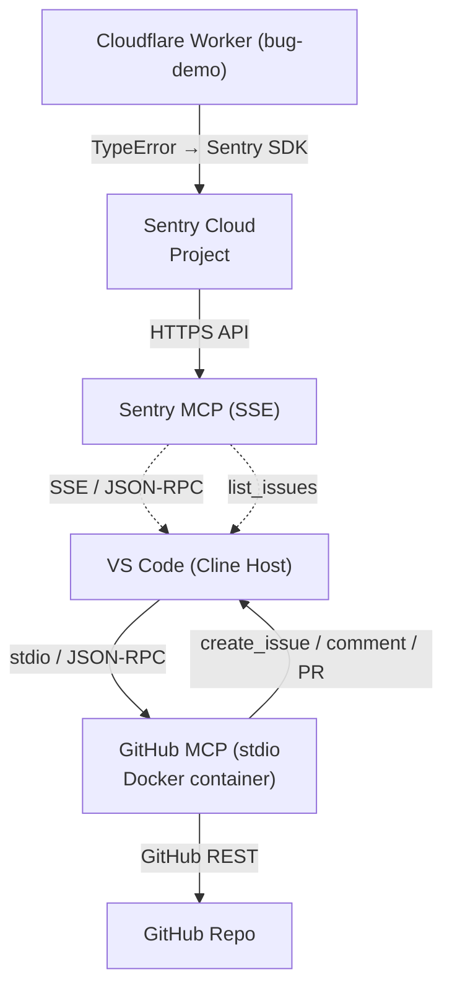

_A buggy Cloudflare Worker reports exceptions to Sentry, which surface through the hosted Sentry MCP (SSE) into Cline within VS Code. The same session then flows down to a local GitHub MCP (stdio) that is running in Docker, allowing the agent to file an issue, add comments, and push a pull request to the GitHub repository - all under human oversight._

## Setup walkthrough

Let's set up our stack.

<Steps>
{<h3>Setup requirements</h3>}

You'll need the following:

<Table
  data={[
    {
      requirement: "[Node](https://nodejs.org/en/download)",
      version: "≥ 18",
      purpose: "To build the Worker and run npx helpers",
    },
    {
      requirement: "[Docker](https://docs.docker.com/get-started/get-docker/)",
      version: "Latest desktop",
      purpose: "To run the GitHub MCP Server locally",
    },
    {
      requirement: "[VS Code](https://code.visualstudio.com/)",
      version: "Latest desktop",
      purpose: "Code editor",
    },
    {
      requirement:
        "[Cline](https://marketplace.visualstudio.com/items?itemName=saoudrizwan.claude-dev)",
      version: "Latest release",
      purpose: "MCP host/agent",
    },
    {
      requirement: "[Sentry account](https://sentry.io/)",
      version: "Free plan is fine",
      purpose: "To catch our crash",
    },
    {
      requirement: "[GitHub account](https://github.com/)",
      version: "Any tier",
      purpose: "Access token for MCP Server",
    },
    {
      requirement: "[Cloudflare account](https://www.cloudflare.com/)",
      version: "Free plan is fine",
      purpose: "To host our buggy code",
    },
  ]}
  columns={[
    { key: "requirement", header: "Requirement" },
    { key: "version", header: "Version/Details" },
    { key: "purpose", header: "Purpose" },
  ]}
/>

You'll also need an LLM to run the Cline agent. We used [Mistral Codestral 25.01](https://mistral.ai/) for this demo, but you can use [any LLM supported by Cline](https://docs.cline.bot/getting-started/model-selection-guide).

{<h3>Bootstrap the buggy worker</h3>}

In the terminal, run:

```bash Terminal
npx -y wrangler init bug-demo
```

When prompted, select the following options:

```text Terminal
╭ Create an application with Cloudflare Step 1 of 3
│
├ In which directory do you want to create your application?
│ dir ./bug-demo
│
├ What would you like to start with?
│ category Hello World example
│
├ Which template would you like to use?
│ type Worker only
│
├ Which language do you want to use?
│ lang TypeScript
│
├ Copying template files
│ files copied to project directory
│
├ Updating name in `package.json`
│ updated `package.json`
│
├ Installing dependencies
│ installed via `npm install`
│
╰ Application created

╭ Configuring your application for Cloudflare Step 2 of 3
│
├ Installing wrangler A command line tool for building Cloudflare Workers
│ installed via `npm install wrangler --save-dev`
│
├ Installing @cloudflare/workers-types
│ installed via npm
│
├ Adding latest types to `tsconfig.json`
│ added @cloudflare/workers-types/2023-07-01
│
├ Retrieving current workerd compatibility date
│ compatibility date 2025-04-26
│
├ Do you want to use git for version control?
│ yes git
│
├ Initializing git repo
│ initialized git
│
├ Committing new files
│ git commit
│
╰ Application configured

╭ Deploy with Cloudflare Step 3 of 3
│
├ Do you want to deploy your application?
│ no deploy via `npm run deploy`
│
╰ Done
```

Enter your new project:

```bash Terminal
cd bug-demo
```

Install the Sentry SDK npm package:

```bash Terminal
npm install @sentry/cloudflare --save
```

Open your project in VS Code:

```bash Terminal
code .
```

Edit `wrangler.jsonc` and add the `compatibility_flags` array with one item, `nodejs_compat`:

```json wrangler.jsonc
"compatibility_flags": [
  "nodejs_compat"
]
```

Visit the [Sentry setup guide for Cloudflare Workers](https://docs.sentry.io/platforms/javascript/guides/cloudflare/#setup-cloudflare-workers) and copy the example code. Paste it in `src/index.ts` and then add the intentional bug in the `fetch()` method.

Edit `src/index.ts`:

```typescript src/index.ts
// !mark(10:11)
import * as Sentry from "@sentry/cloudflare";

export default Sentry.withSentry(
  (env) => ({
    dsn: "https://[SENTRY_KEY]@[SENTRY_HOSTNAME].ingest.us.sentry.io/[SENTRY_PROJECT_ID]",
    tracesSampleRate: 1.0,
  }),
  {
    async fetch(request, env, ctx) {
      // ❌ intentional bug
      undefined.call();
      return new Response("Hello World!");
    },
  } satisfies ExportedHandler<Env>,
);
```

Deploy and trigger:

```bash Terminal
npm run deploy
```

In your browser, visit your Cloudflare Worker at `https://bug-demo.<your-cf-hostname>.workers.dev`.

You should see the following error:

```
Error 1101 - Worker threw exception
```


{<h3>Set up the Sentry MCP Server in Cline</h3>}

In VS Code, with Cline installed, follow the steps below:

    <Callout title="npx">
      You may need to adjust configuration settings depending on the path of your Node and npx installation. For this guide, we used Node and npx installed with Homebrew.
    </Callout>


    

1. Click the **Cline (robot)** icon in the VS Code sidebar.
2. Click the **MCP Servers** toolbar button at the top of the Cline panel.
3. Select the **Installed** tab.
4. Click **Configure MCP Servers**.
5. Paste the Sentry MCP Server config JSON that runs `npx mcp remote https://mcp.sentry.dev/sse` in the window, then press `Cmd + s` to save.

   ```json cline_mcp_settings.json
   {
     "mcpServers": {
       "sentry": {
         "command": "npx",
         "args": ["-y", "mcp-remote", "https://mcp.sentry.dev/sse"]
       }
     }
   }
   ```

6. Click **Done** in the top-right corner of the panel.

After saving the MCP configuration, your browser should open with a prompt to authorize **Remote MCP**.


Click **Approve** so that the application can allow the Sentry MCP Server to connect with your Sentry account.

{<h3>Set up the GitHub MCP Server in Cline</h3>}

Generate a GitHub personal access token:

1. In GitHub, click your profile picture to open the right sidebar.
2. Click **Settings** in the sidebar.
3. Click **Developer settings** at the bottom of the left sidebar.
4. Expand **Personal access tokens** in the left sidebar.
5. Click **Fine-grained tokens**.
6. Press the **Generate new token** button.
7. Enter any name for your token, and select **All repositories**.
8. Select the following permissions:

   - Administration: Read and Write
   - Contents: Read and Write
   - Issues: Read and Write
   - Pull requests: Read and Write

9. Click **Generate token** and save your token for the next step.

Now that we have a GitHub token, let's add the GitHub MCP Server.


1. Click the **Cline (robot)** icon in the VS Code sidebar.
2. Click the **MCP Servers** toolbar button at the top of the Cline panel.
3. Select the **Installed** tab.
4. Press **Configure MCP Servers**.
5. Paste the GitHub MCP Server config JSON that runs `docker run -it --rm -e GITHUB_PERSONAL_ACCESS_TOKEN=$GITHUB_PERSONAL_ACCESS_TOKEN ghcr.io/github/github-mcp-server` in the window, then press `Cmd + s` to save.

   ```json cline_mcp_settings.json
   {
     "mcpServers": {
       "sentry": {...},
       "github": {
         "command": "docker",
         "args": [
           "run",
           "-i",
           "--rm",
           "-e",
           "GITHUB_PERSONAL_ACCESS_TOKEN",
           "ghcr.io/github/github-mcp-server"
         ],
         "env": {
           "GITHUB_PERSONAL_ACCESS_TOKEN": "<YOUR_TOKEN>"
         }
       }
     }
   }
   ```

6. Click **Done**.

</Steps>

Let's take it for a spin.

## Create a GitHub repository

We'll use the GitHub MCP Server to create a new repository for our demo.

We asked Cline:

```text Cline
Add this repository to GitHub as a private repo
```

Here's what happened next:

<Steps>
{<h3>System prompt with tools and task</h3>}

Cline sent a completion request to the LLM. The request contained our prompt, a list of tools, and the tool schemas. You can see how Cline built this prompt in the Cline repository at [`src/core/prompts/system.ts`](https://github.com/cline/cline/blob/main/src/core/prompts/system.ts).

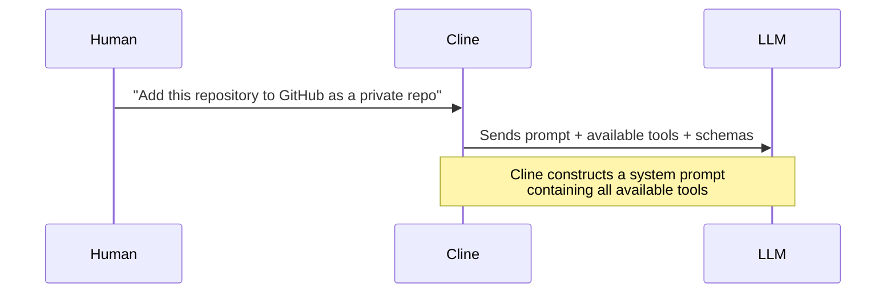

{<h3>LLM generates a tool call</h3>}

The LLM generates a tool call based on the prompt and the tools available. The tool call is a structured XML object that contains the name of the MCP server, the name of the tool to be called, and the arguments to be passed to it.

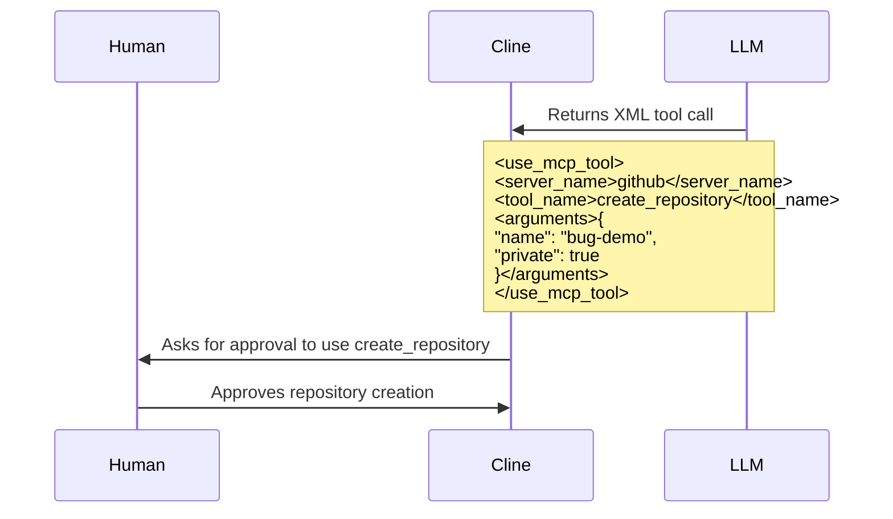

```xml
<use_mcp_tool>
  <server_name>github</server_name>
  <tool_name>create_repository</tool_name>
  <arguments>
  {
    "name": "bug-demo",
    "private": true
  }
  </arguments>
</use_mcp_tool>
```

{<h3>Cline sends the tool call to the MCP server</h3>}

Cline sends the tool call to the GitHub MCP Server using the `stdio` transport.

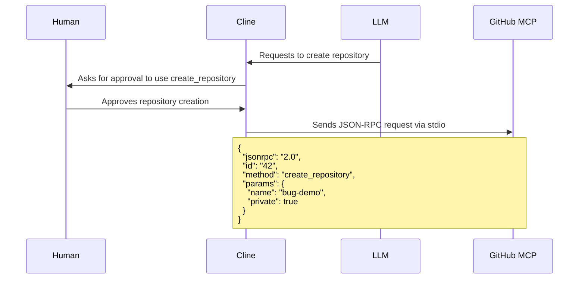

```json stdio
{
  "jsonrpc": "2.0",
  "id": "42",
  "method": "create_repository",
  "params": {
    "name": "bug-demo",
    "private": true
  }
}
```

- The message is sent over the already-open `stdio` pipe as a single UTF-8 line, typically terminated by `\n`, so the server can parse it line by line.
- The `id` is an opaque request identifier chosen by Cline; the server will echo it in its response to let the client match replies to calls.
- All MCP tool invocations follow the same structure - only the method and parameters change.

{<h3>GitHub MCP Server processes the request</h3>}

The GitHub MCP Server receives the tool call and processes it. It calls the GitHub API to create a new repository with the specified name and privacy settings, then parses the response from the API.

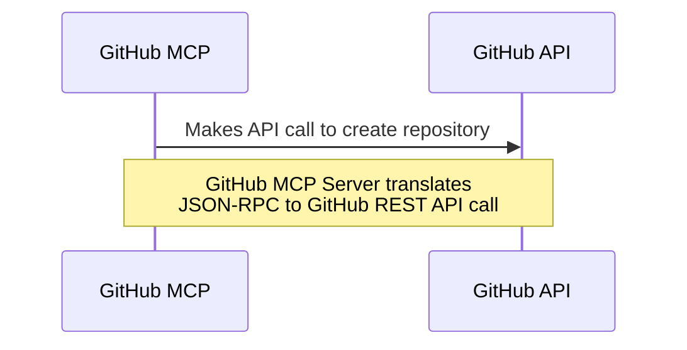

{<h3>GitHub MCP Server sends the response back to Cline</h3>}

The GitHub MCP Server sends the response back to Cline over the `stdio` transport.

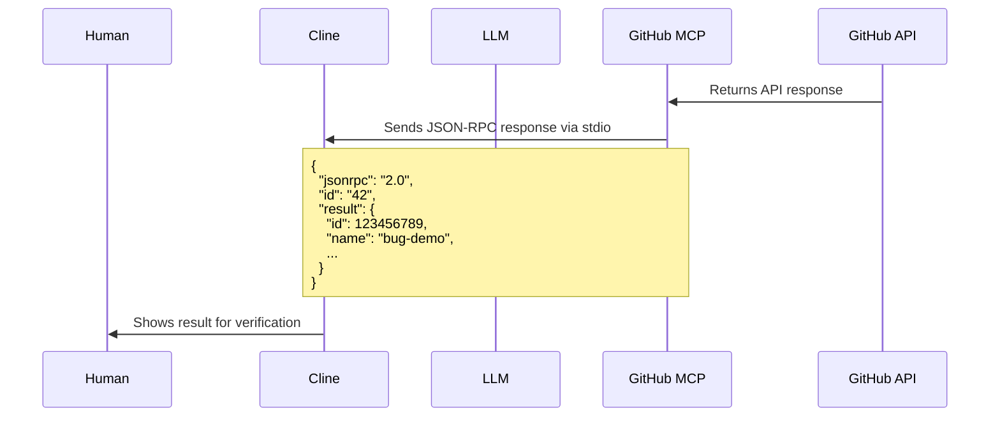

```json stdio
{
  "jsonrpc": "2.0",
  "id": "42",
  "result": {
    "id": 123456789,
    "name": "bug-demo",
    "visibility": "private",
    "default_branch": "main",
    "git_url": "git://github.com/speakeasy/bug-demo.git",
    "etc": "..."
  }
}
```

- The response contains the `id` of the request and the result of the tool call.
- The result is a JSON object that contains the details of the newly created repository.
- Cline receives the response and displays it in the UI.
- The response is also passed to the LLM for further processing and is now available in the context for the next prompt.

{<h3>Cline displays the result</h3>}

Cline displays the result of the tool call in the UI, and the LLM can use it in subsequent prompts.

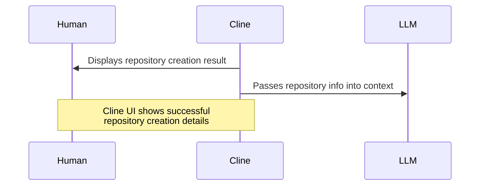

```json
{
  "id": 123456789,
  "name": "bug-demo",
  "visibility": "private",
  "default_branch": "main",
  "git_url": "git://github.com/speakeasy/bug-demo.git",
  "etc": "..."
}
```

{<h3>Cline pushes the repository to GitHub</h3>}

Cline pushes the new repository to GitHub using the `git` command.

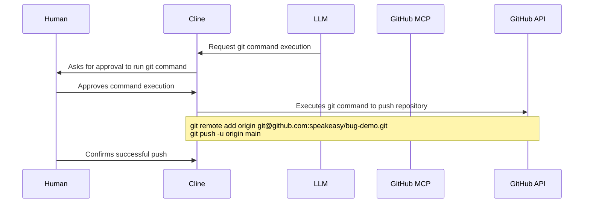

```bash Terminal
git remote add origin git@github.com:speakeasy/bug-demo.git && \
git push -u origin main
```

</Steps>

## Fixing the bug using MCP

That was the fiddly part, which only happens once. Now we can fix the bug.

<Steps>

{<h3>Giving Cline a task</h3>}

In Cline, we asked:

```text Cline
1. Fetch the latest issue from Sentry.
2. Create a new GitHub issue with a link back to the Sentry issue and a description.
3. Fix the bug based on the issue from Sentry.
4. Commit your changes in a new branch with an appropriate message and reference to both Sentry and the GitHub issues.
5. Push new branch to GitHub.
6. Open a PR with reference to the GitHub issue.
```

{<h3>Cline sends the request to the LLM</h3>}

Cline sends the request to the LLM, which generates a tool call to the Sentry MCP Server to fetch the latest issue.

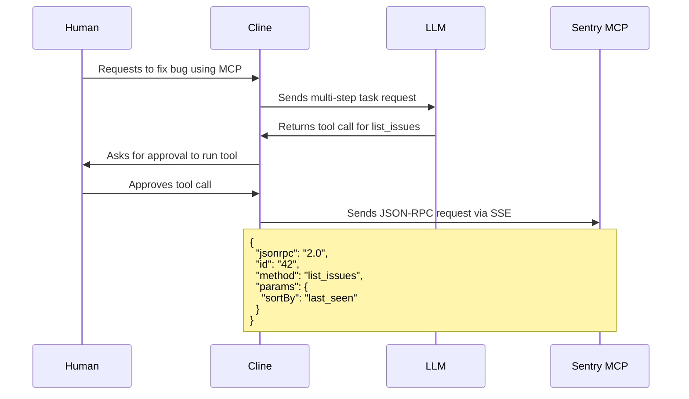

The JSON-RPC request sent to the Sentry MCP Server looks like this:

```json stdio
{
  "jsonrpc": "2.0",
  "id": "42",
  "method": "list_issues",
  "params": {
    "sortBy": "last_seen"
  }
}
```

{<h3>Sentry MCP Server processes the request</h3>}

The Sentry MCP Server processes the request and calls the Sentry API to fetch the latest issue. It returns the result to Cline.

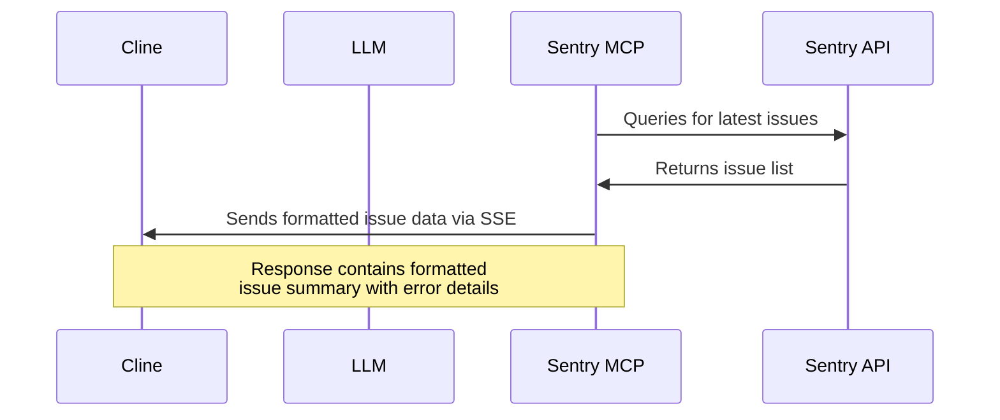

```json stdio
{
  "jsonrpc": "2.0",
  "id": "42",
  "result": {
    "content": [
      {
        "type": "text",
        "text": "# Issues in **speakeasy**\n\n## NODE-CLOUDFLARE-WORKERS-1\n\n**Description**: TypeError: Cannot read properties of undefined (reading 'call')\n**Culprit**: Object.fetch(index)\n**First Seen**: 2025-04-21T14:21:10.000Z\n**Last Seen**: 2025-04-21T15:05:33.000Z\n**URL**: https://speakeasy.sentry.io/issues/NODE-CLOUDFLARE-WORKERS-1\n\n# Using this information\n\n- You can reference the Issue ID in commit messages (e.g. `Fixes <issueID>`) to automatically close the issue when the commit is merged.\n- You can get more details about a specific issue by using the tool: `get_issue_details(organizationSlug=\"speakeasy\", issueId=<issueID>)`"
      }
    ]
  }
}
```

{<h3>Cline analyzes the Sentry issue</h3>}

After receiving the issue from Sentry, Cline requests additional details to understand the stack trace:

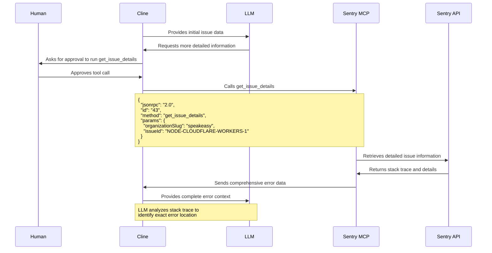

```json stdio
{
  "jsonrpc": "2.0",
  "id": "43",
  "method": "get_issue_details",
  "params": {
    "organizationSlug": "speakeasy",
    "issueId": "NODE-CLOUDFLARE-WORKERS-1"
  }
}
```

The Sentry MCP Server returns error details:

````text response
# Issue NODE-CLOUDFLARE-WORKERS-1 in **speakeasy**

**Description**: TypeError: Cannot read properties of undefined (reading 'call')
**Culprit**: Object.fetch(index)
**First Seen**: 2025-04-21T14:21:10.756Z
**Last Seen**: 2025-04-21T15:05:33.000Z
**URL**: https://speakeasy.sentry.io/issues/NODE-CLOUDFLARE-WORKERS-1

## Event Specifics

**Occurred At**: 2025-04-21T15:05:33.000Z
**Error:**
```
TypeError: Cannot read properties of undefined (reading 'call')
```

**Stacktrace:**
```
index.js:6633:25 (Object.withScope)
index.js:6634:14
index.js:3129:12
index.js:3371:21
index.js:3140:14
index.js:2250:26 (handleCallbackErrors)
index.js:3141:15 (handleCallbackErrors.status.status)
index.js:6996:33
index.js:7021:79
index.js:7090:16 (Object.fetch)
```

Using this information:

- You can reference the IssueID in commit messages (for example, `Fixes NODE-CLOUDFLARE-WORKERS-1`) to automatically close the issue when the commit is merged.
- The stack trace includes both first-party application code as well as third-party code, so it's important to triage to first-party code.
````

The stack trace reveals the exact nature and location of the bug: It's due to the `(undefined).call()` in `src/index.ts` on line 12.

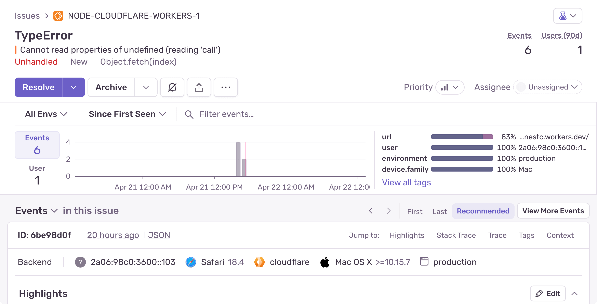

This response is passed to the LLM, which uses it to generate the next tool call.

{<h3>Cline creates a GitHub issue</h3>}

Next, at the request of the LLM, Cline uses the GitHub MCP Server to create an issue documenting the bug:

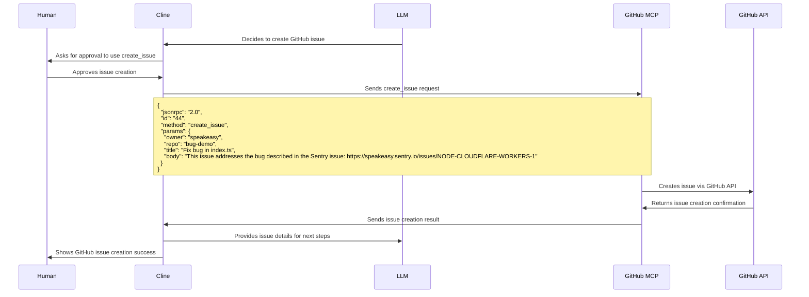

```json stdio
{
  "jsonrpc": "2.0",
  "id": "44",
  "method": "create_issue",
  "params": {
    "owner": "speakeasy",
    "repo": "bug-demo",
    "title": "Fix bug in index.ts",
    "body": "This issue addresses the bug described in the Sentry issue: https://speakeasy.sentry.io/issues/NODE-CLOUDFLARE-WORKERS-1"
  }
}
```

The GitHub MCP Server confirms that the issue has been created:

```json stdio
{
  "jsonrpc": "2.0",
  "id": "44",
  "result": {
    "id": 1,
    "number": 1,
    "state": "open",
    "locked": false,
    "title": "Fix bug in index.ts",
    "body": "This issue addresses the bug described in the Sentry issue: https://speakeasy.sentry.io/issues/NODE-CLOUDFLARE-WORKERS-1",
    "etc": "..."
  }
}
```


{<h3>Cline examines the codebase</h3>}

To fix the bug, the LLM needs to have the code in context. The LLM initiates a tool call to read the source code of the Cloudflare Worker.

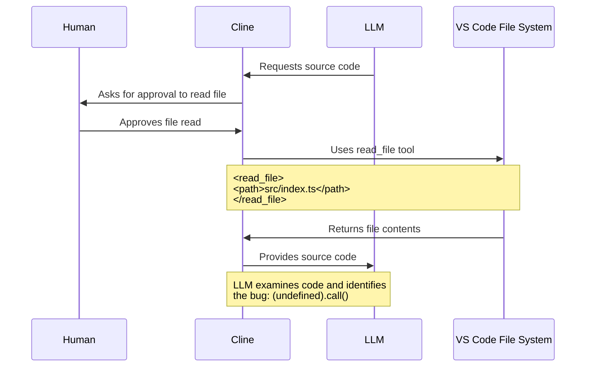

Since we're working directly in the VS Code editor, Cline uses the `read_file` tool:

```xml Tool Call
<read_file>
<path>src/index.ts</path>
</read_file>
```

Cline sends the result of the tool call to the LLM, which now has the full context of the codebase.

After examining the code, the LLM responds with a proposed fix.

{<h3>The LLM generates the fix and Cline applies it</h3>}

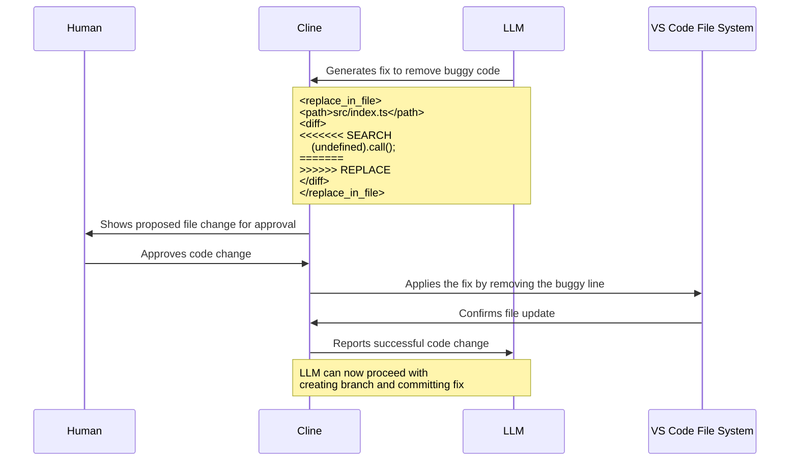

The LLM generates a fix for the bug, which is then sent to Cline:

```xml
<replace_in_file>
<path>src/index.ts</path>
<diff>
   (undefined).call();
</diff>
</replace_in_file>
```

{<h3>Cline creates a new branch and commits the fix</h3>}

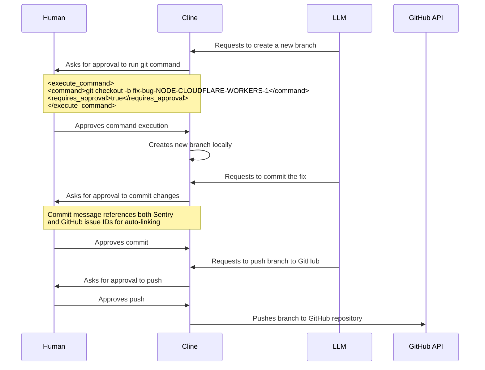

Cline creates a new branch for the fix:

```xml
<execute_command>
<command>git checkout -b fix-bug-NODE-CLOUDFLARE-WORKERS-1</command>
<requires_approval>true</requires_approval>
</execute_command>
```

This opens the VS Code terminal and creates a branch:

```bash Terminal
git checkout -b fix-bug-NODE-CLOUDFLARE-WORKERS-1
```

Cline then commits the fix:

```xml
<execute_command>
<command>git add src/index.ts && git commit -m "Fixes NODE-CLOUDFLARE-WORKERS-1 and closes #1"</command>
<requires_approval>true</requires_approval>
</execute_command>
```

Then, Cline pushes the new branch to GitHub:

```xml
<execute_command>
<command>git push origin fix-bug-NODE-CLOUDFLARE-WORKERS-1</command>
<requires_approval>true</requires_approval>
</execute_command>
```

{<h3>Cline opens a PR</h3>}

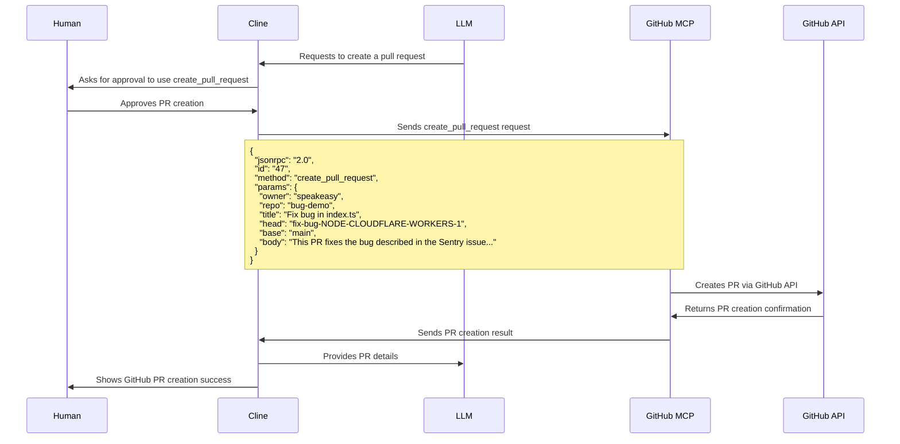

Finally, Cline creates a pull request (PR) with the fix:

```json stdio
{
  "jsonrpc": "2.0",
  "id": "47",
  "method": "create_pull_request",
  "params": {
    "owner": "speakeasy",
    "repo": "bug-demo",
    "title": "Fix bug in index.ts",
    "head": "fix-bug-NODE-CLOUDFLARE-WORKERS-1",
    "base": "main",
    "body": "This PR fixes the bug described in the Sentry issue: https://speakeasy.sentry.io/issues/NODE-CLOUDFLARE-WORKERS-1 and closes #1"
  }
}
```

The GitHub MCP Server confirms the PR creation.

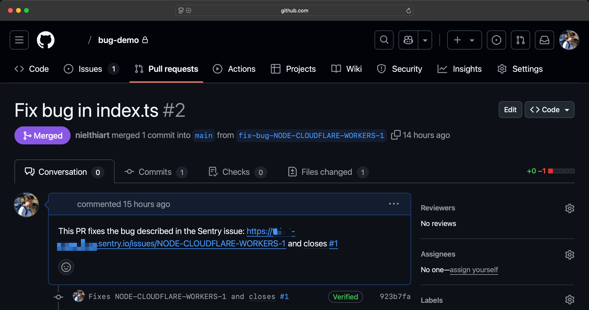

{<h3>Human approval and deployment</h3>}

The final step requires human approval. The developer reviews the PR, approves the changes, merges the PR, and deploys:

```bash Terminal
npm run deploy
```

A quick visit to the Cloudflare Worker URL confirms the fix is working, and Sentry shows no new errors.

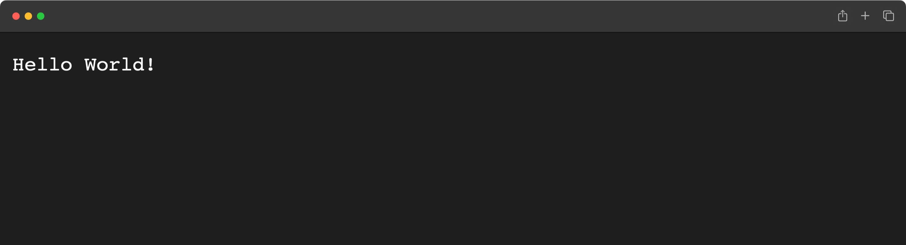

</Steps>

## What we learned

We learned a lot about MCP, both the good and the bad. Here are our key takeaways:

### The good: Protocol unification

The MCP approach delivered on its promise. We only had to set up each service once, rather than having to build custom bridges between every pair of services. This was our first concrete experience with the theoretical _M + N_ vs _M × N_ difference.

Consider our modest demo setup with just three components (the Cline host, Sentry server, and GitHub server):

<Table
  data={[
    { approach: "Direct APIs (M × N)", count: "3 × 2 = 6 integrations" },
    { approach: "MCP (M + N)", count: "3 + 2 = 5 components" },
  ]}
  columns={[
    { key: "approach", header: "Integration approach" },
    { key: "count", header: "Number of integrations needed" },
  ]}
/>

The difference is small, with just a few components, but scales dramatically. With 10 hosts and 10 tool backends (100 potential connections), MCP requires just 20 adapters.

Moreover, we found that the JSON Schema system improved tooling discoverability. When Cline connected to a server, it automatically received comprehensive documentation about available operations without having to consult external API references.

### The challenges: Latency, security, learning curve

MCP may not be suitable for all use cases. We encountered several challenges that could limit its applicability.

#### Latency

The MCP approach introduces additional layers between the LLM and the APIs. This comes with a latency cost.

In our testing, each MCP hop added a little time overhead, which is negligible for most use cases but could become significant in latency-sensitive applications or during complex multi-step workflows.

This isn't a flaw in the protocol, but rather a trade-off for the convenience of having a single, unified interface. The latency is manageable for most applications, but it's worth considering if you're building a performance-critical application.

#### Security

Authentication represents one of the more challenging aspects of MCP. The protocol requires the secure handling of access tokens, which introduces additional security considerations.

1. **Token management**: Each server requires its own authentication approach (OAuth for Sentry, API tokens for GitHub).
2. **Permission scoping**: The user needs to grant permissions for each server, which can be cumbersome.
3. **Token refresh**: OAuth flows with refresh tokens add complexity.

This may be a symptom of the relative immaturity of the ecosystem, but most MCP clients do not yet support OAuth flows or token refreshes. This is exactly why the Sentry MCP Server is called via `npx mcp-remote`, which is a wrapper MCP server that handles the OAuth flow and token refresh for you:

```json
{
  "command": "npx",
  "args": [
    "-y",
    "mcp-remote", // a wrapper MCP server
    "https://mcp.sentry.dev/sse"
  ]
}
```

#### Learning curve

While the protocol is reasonably straightforward for developers familiar with JSON-RPC, we encountered a few hurdles.

1. **Sparse documentation:** The specification is comprehensive, but practical guides are limited.
2. **Debugging challenges:** When tools failed, error messages weren't always clear. The first time we tried to run the Sentry MCP Server, we encountered an authentication error that was difficult to diagnose.

### Ecosystem maturity

MCP is still in its early days. The available servers are primarily reference implementations rather than production-ready services. We identified several areas needing improvement.

1. **Standardization**: Common operations (like CRUD) aren't yet standardized across servers.
2. **Host support**: LLM host support is limited and extremely variable. Some hosts support only `tools`, while others support `resources` and `tools`. Some hosts support only `stdio`, while others support `SSE`.

Despite these challenges, the direction is promising. Each new MCP server adds disproportionate value to the ecosystem by enabling any compliant host to connect to it.

## Future improvements

Here's a wishlist of improvements we think would benefit the MCP ecosystem:

### Performance optimizations

Future MCP implementations could benefit from several performance optimizations:

1. **Connection optimization**: Using streaming HTTP instead of SSE for long-lived connections would reduce the need for persistent connections and improve performance. (This is already in development in the MCP SDK and spec.)
2. **Schema caching**: Hosts and LLMs could cache tool schemas to avoid repeated discovery calls and wasted token usage.
3. **Request batching**: Grouping related operations into a single request would increase efficiency by reducing round trips between the client and server.
4. **Partial schema loading**: Loading only the schemas for tools likely to be used in a given context could reduce token usage and improve tool selection.

Our Cline session for this problem sent 413,300 tokens and received 2,100 in total. This is a lot of tokens for a single session, and we could have saved plenty of tokens by caching the schemas and using partial schema loading.

### Enhanced security

The security model could be strengthened with:

1. **Granular permissions**: Token scopes limited to specific tools rather than entire servers would allow for granular permissions. This is part of the MCP Specification (in the form of MCP roots) but isn't widely supported by clients or servers yet.
2. **Approval workflows**: Using more sophisticated approval UIs for dangerous operations could ensure the user is aware of the implications of each action and help them avoid prompt injection attacks.
3. **Audit logging**: Comprehensive tracking of all MCP operations would improve the security model.

## Verdict and recommendations

We're excited about the potential of MCP and think the protocol will become a key part of the AI ecosystem. However, we'd recommend caution for production use. Audit the security of any MCP server you use and be prepared to work around the ecosystem's current fragmentation.

While everyone is still figuring out the security details, perhaps deactivate YOLO mode and stick to human-in-the-loop workflows for now.
