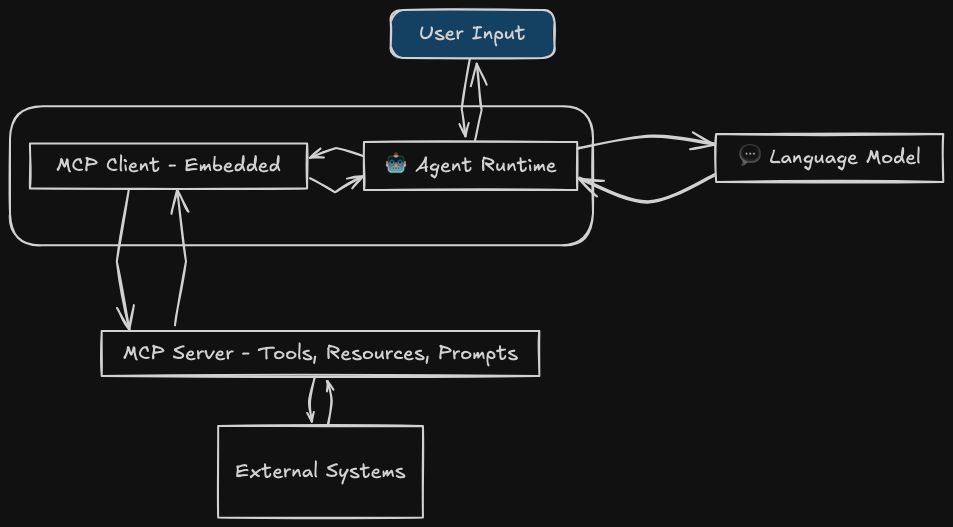

import { Spotlight } from "@/mdx/components";

# What is MCP? An overview of the Model Context Protocol

The AI ecosystem has evolved so much that today's LLMs are no longer just completion engines. Coupled with an interface, LLMs can become clients capable of taking actions, querying systems, and interpreting structured content.

In modern architectures, LLMs often operate alongside databases, APIs, or custom functions. To support this, developers frequently inject external data directly into their prompts. The simplest way to do this is to pull data from a service and pass it as plain text to the model:

```python
import requests
from openai import OpenAI

client = OpenAI()

# Step 1: Get real-world data
response = requests.get("https://api.weatherapi.com/v1/current.json?q=Paris&key=demo")
weather = response.json()

# Step 2: Inject it into a prompt manually
prompt = f"""
You are a weather assistant.
Here's the current weather in Paris:
Temperature: {weather['current']['temp_c']}°C
Condition: {weather['current']['condition']['text']}

Write a friendly weather summary.
"""

# Step 3: Call the model
completion = client.chat.completions.create(
    model="gpt-4o",
    messages=[
        {"role": "user", "content": prompt}
    ],
)
```

This works, but only on a small scale. The model has to interpret the meaning of the data from plain text, which bloats token usage and loses structure.

To minimize token use and loss of structure, native toolchains emerged. Using toolchains such as OpenAI function calling, Anthropic tools, and Mistral functions, you can define structured input and output schemas, register tools, and let the model **call** them in a controlled way.

```python
from openai import OpenAI

client = OpenAI()

tools = [{
    "type": "function",
    "function": {
        "name": "query_user_count",
        "description": "Query the database to get the total number of users.",
        "parameters": {
            "type": "object",
            "properties": {
                "table": {
                    "type": "string",
                    "description": "Name of the table to query, e.g. 'users'"
                }
            },
            "required": ["table"],
            "additionalProperties": False
        }
    }
}]

response = client.chat.completions.create(
    model="gpt-4o",
    messages=[
        {
            "role": "user",
            "content": "How many users are currently in the system?"
        }
    ],
    tools=tools,
    tool_choice="auto"
)

# Output the tool call generated by the model
print(response.choices[0].message.tool_calls)
```

However, using these toolchains comes with some issues:

- You are limited to a single model provider.
- Prompts also remain brittle, undocumented, and tied to proprietary formats.

This is where the Model Context Protocol (MCP) comes in.

## What is MCP?

MCP is a low-level JSON-RPC protocol originally proposed by Anthropic. It standardizes communication between LLMs and real-world environments.

At its core, MCP defines two roles: the server and the client.

The **MCP server** is the backend that exposes three primitives:

- Tools: Functions that perform actions (such as writing a file or placing an order)
- Resources: Read-only, URI-addressable context (for example, logs, config, and APIs)
- Prompts: Reusable message templates that guide interactions with the MCP server

The **MCP client** is the component that understands the protocol and communicates with the MCP server by sending the following requests and interpreting the server's structured responses:

- `tools/call`
- `resources/read`
- `prompts/get`

Here's where confusion often arises: Who actually talks to the MCP server? Is it the LLM or the agent?

The answer is that neither the LLM nor the agent talks directly to the MCP server.

The MCP client acts as the middle layer between the server and the model. It may be embedded in:

- A desktop application (such as the Claude desktop app)
- An agent runtime
- A custom LLM client

These systems use the MCP client to interact with the MCP server, but they are still responsible for integrating results into LLM prompts or workflows.

For example, in an agentic architecture, the flow looks like this:

1. The user inputs, *"How many users signed up this month?"*
2. The agent parses the request and calls a tool.
3. The agent's embedded MCP client sends a `tools/call` request to the MCP server.
4. The MCP server executes the tool function, which makes a database query and returns a result. The MCP server returns the result with a structured response to the MCP client.
5. The agent takes that response and incorporates it into the next LLM prompt or uses it to make a decision.

## How does MCP differ from APIs and tool calling?

Unlike many client-server protocols where clients only make requests and servers only respond, MCP supports full bidirectional communication.

- **Client-to-Server**: The client can request resources, call tools, and get prompts.
- **Server-to-Client**: The server can request LLM sampling, ask for root listings, and send notifications.
- **Notifications**: Both sides can send one-way messages without expecting responses.

This bidirectional design enables workflows in which servers can actively participate in decision-making by requesting LLM assistance through the client.



MCP offers SDKs in multiple languages (including Python and JavaScript) to simplify building and exposing MCP-compliant servers.

<Spotlight>

## !!steps overview

Here is an example of an MCP server in Python that exposes a single tool to write notes to a local directory:

```python ! mcp-server.py
!from ./assets/intro/mcp.py.txt
```

## !!steps tools

A tool is a function exposed by the server that an AI agent can call using `JSON-RPC`. Each tool includes its name, input parameters, output schema, and a description.

```python ! mcp-server.py focus=12:17
!from ./assets/intro/mcp.py.txt
```

## !!steps resources

Resources are named, read-only data references addressable via URIs. Resources are used to load contextual read-only data into the MCP session.

```python ! mcp-server.py focus=19:24
!from ./assets/intro/mcp.py.txt
```

## !!steps prompts

Prompts are predefined message templates that servers expose to clients. When invoked with arguments, they return a list of messages (`messages[]`) that the client sends to the LLM to perform a specific task.

```python ! mcp-server.py focus=26:31
!from ./assets/intro/mcp.py.txt
```

## !!steps roots

Roots are a set of scoped access boundaries provided by the client at handshake. Roots allow the server to limit the visibility of tools, resources, or data based on a given namespace.

```python ! mcp-server.py focus=33:38
!from ./assets/intro/mcp.py.txt
```

## !!steps transports

A transport defines the communication method the server uses to handle client connections. MCP supports multiple transports, including `stdio` for local execution and `http` for web-based deployment.

```python ! mcp-server.py focus=40:53
!from ./assets/intro/mcp.py.txt
```

</Spotlight>
