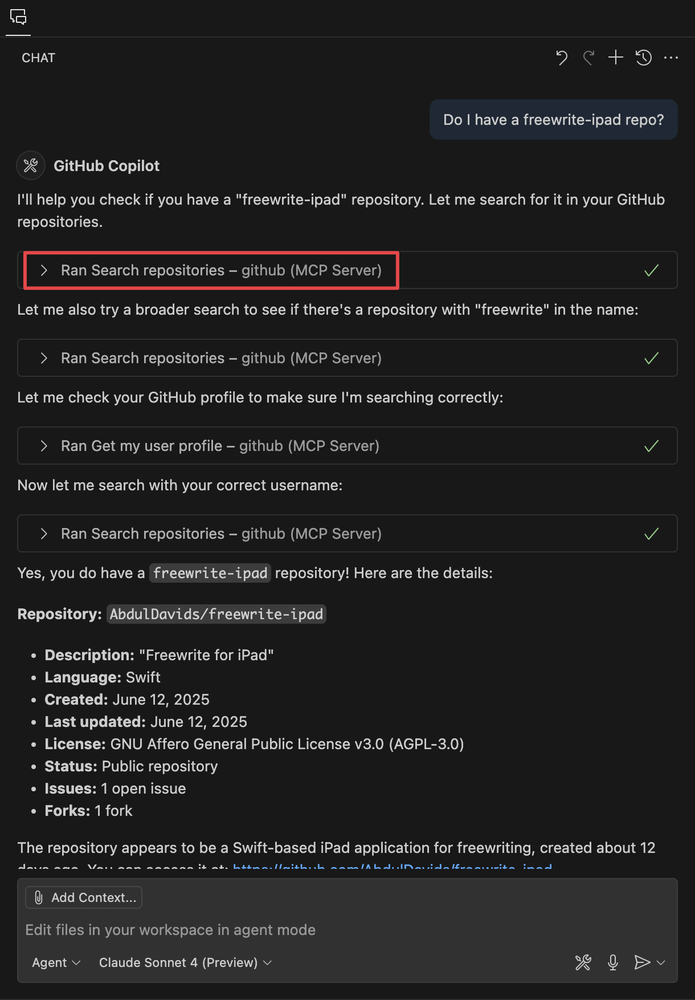

import { Callout, CodeWithTabs } from "@/mdx/components";

# MCP release notes

Each release of the Model Context Protocol (MCP) introduces changes to how LLM applications integrate external tools and context. These updates can improve developer experience, interoperability, and safety, but they may also introduce breaking changes or require adjustments in your implementation.

<Callout title="Note" type="info">
  This page is not an official MCP release notes page. It exists to help
  developers understand what changed, why it matters, and how to adopt the
  latest MCP revisions. For the full changelog, refer to the official{" "}
  <a
    href="https://github.com/modelcontextprotocol/modelcontextprotocol/tags"
    target="_blank"
    rel="noreferrer"
  >
    GitHub tags
  </a>
  .
</Callout>

## MCP version history

This section summarizes the significant differences between MCP versions. The following table summarizes major changes between MCP versions.

<Table
  data={[
    {
      fieldName:
        "**[2025-06-18](https://github.com/modelcontextprotocol/modelcontextprotocol/releases/tag/2025-06-18)**",
      type: "`Jun 18, 2025`",
      required: "`Yes`",
      description:
        "- Removes [JSON-RPC batching](https://www.jsonrpc.org/specification#batch) (reversal from 2025-03-26)\n" +
        "- Adds [structured tool output](https://modelcontextprotocol.io/specification/2025-06-18/server/tools#structured-content)\n" +
        "- Classifies MCP servers as [OAuth Resource Servers](https://modelcontextprotocol.io/specification/2025-06-18/basic/authorization#authorization-server-discovery)\n" +
        "- Requires [Resource Indicators](https://www.rfc-editor.org/rfc/rfc8707.html) for enhanced security\n" +
        "- Adds [elicitation](https://modelcontextprotocol.io/specification/2025-06-18/client/elicitation) for server-initiated user requests\n" +
        "- Adds [resource links](https://modelcontextprotocol.io/specification/2025-06-18/server/tools#resource-links) in tool results\n" +
        "- Requires MCP-Protocol-Version header for HTTP requests",
    },
    {
      fieldName:
        "**[2025-03-26](https://github.com/modelcontextprotocol/modelcontextprotocol/releases/tag/2025-03-26)**",
      type: "`Mar 26, 2025`",
      required: "`Yes`",
      description:
        "- Adds structured [OAuth 2.1-style authorization](https://modelcontextprotocol.io/specification/2025-03-26/basic/authorization)\n" +
        "- Replaces SSE with [Streamable HTTP](https://modelcontextprotocol.io/specification/2025-03-26/basic/transports#streamable-http)\n" +
        "- Adds [JSON-RPC batching](https://www.jsonrpc.org/specification#batch) (later removed in 2025-06-18)\n" +
        "- Introduces tool annotations (for example, read-only, destructive)\n" +
        "- Adds support for audio content, progress messages, and completions capability",
    },
    {
      fieldName:
        "**[2024-11-05](https://github.com/modelcontextprotocol/modelcontextprotocol/releases/tag/2024-11-05)**",
      type: "`Jan 17, 2025`",
      required: "`—`",
      description:
        "- Initial schema stabilization\n" +
        "- Defines core architecture and message format\n" +
        "- Introduces tool, resource, and prompt concepts\n" +
        "- Adds ProgressNotification and sampling features\n" +
        "- Uses HTTP with SSE for streaming transport",
    },
  ]}
  columns={[
    { key: "fieldName", header: "Version" },
    { key: "type", header: "Release date" },
    { key: "description", header: "Changes" },
    { key: "required", header: "Breaking changes" },
  ]}
/>

## MCP 2025-06-18 vs MCP 2025-03-26

The **2025-06-18** MCP release represents a significant refinement of the Model Context Protocol, introducing structured tool outputs, enhanced OAuth security, and server-initiated user interactions. However, it also removes JSON-RPC batching from the previous version, simplifying protocol implementation while adding new capabilities for better security and data handling.

Key highlights include:

- **Removal of JSON-RPC batching:** The batching feature introduced in 2025-03-26 has been removed, simplifying the protocol implementation
- **Structured tool output:** Tools can now return structured, predictable data formats for better integration
- **Enhanced OAuth security:** MCP servers are now classified as OAuth Resource Servers with additional security requirements
- **Elicitation capability:** Servers can now request additional information from users during interactions
- **Resource links:** Tool results can now reference MCP resources, creating better integration between tools and data

You may choose to remain on the **2025-03-26** version if you need:

- **JSON-RPC batching support:** If your implementation relies on batching multiple requests
- **Simpler OAuth implementation:** The earlier version has less stringent OAuth requirements

## What's new in MCP 2025-06-18?

MCP **2025-06-18** introduces structured tool outputs, removes JSON-RPC batching, enhances OAuth security with Resource Server requirements, and adds elicitation for server-initiated user requests. Here's a detailed breakdown of the major updates:

### Removal of JSON-RPC Batching

One of the most significant changes is the **removal of JSON-RPC batching** support, which was introduced in 2025-03-26. This decision simplifies the protocol implementation and reduces complexity for both clients and servers. The maintainers mentioned that there was ['no compelling use case for batching'](https://github.com/modelcontextprotocol/modelcontextprotocol/pull/416), but not all users agreed.

<Callout title="Note" type="info">
  If you were using batching in your 2025-03-26 implementation, you'll need to
  refactor to send individual requests instead of batched ones.
</Callout>

### Structured Tool Output

The new [structured tool output](https://modelcontextprotocol.io/specification/2025-06-18/server/tools#structured-content) capability allows tools to return data in predictable, structured formats rather than just plain text responses.

<<<<<<< HEAD
```python
@app.tool("get_user_info", description="Get structured user information")
async def get_user_info(user_id: str):
    return {
        "content": [{
            "type": "structured",
            "data": {
                "user": {
                    "id": user_id,
                    "name": "John Doe",
                    "email": "john@example.com",
                    "status": "active"
                }
            },
            "schema": {
                "type": "object",
                "properties": {
                    "user": {
                        "type": "object",
                        "properties": {
                            "id": {"type": "string"},
                            "name": {"type": "string"},
                            "email": {"type": "string"},
                            "status": {"type": "string"}
                        }
                    }
                }
            }
        }]
=======
**What you need to change:** Update your tool definitions to specify `Tool.outputSchema` and return `CallToolResult.structuredContent` in your tool implementations.

<CodeWithTabs>

```python !!tabs Python
# Using official Python SDK - mcp package
from mcp.server import Server
from mcp.types import (
    CallToolRequestSchema,
    ListToolsRequestSchema,
    Tool,
    CallToolResult,
)

server = Server("example-server")

# Define tool with outputSchema
@mcp.tool()
def get_user_info(user_id: str) -> CallToolResult:
    """Get structured user information"""
    user_data = {
        "user": {
            "id": user_id,
            "name": "John Doe", 
            "email": "john@example.com",
            "status": "active"
        }
>>>>>>> e82a58d (feedback)
    }
    
    return CallToolResult(
        content=[{"type": "text", "text": f"Retrieved user {user_id}"}],
        # New: Use structuredContent for predictable data format
        structuredContent=user_data
    )

# Set the tool's outputSchema property
get_user_info.outputSchema = {
    "type": "object",
    "properties": {
        "user": {
            "type": "object",
            "properties": {
                "id": {"type": "string"},
                "name": {"type": "string"},
                "email": {"type": "string"},
                "status": {"type": "string"}
            }
        }
        
        return CallToolResult(
            content=[{"type": "text", "text": f"Retrieved user {arguments['user_id']}"}],
            # New: Use structuredContent for predictable data format
            structuredContent=user_data
        )

# Register tool with outputSchema
@server.list_tools()
async def handle_list_tools() -> list[Tool]:
    return [
        Tool(
            name="get_user_info",
            description="Get structured user information",
            inputSchema={
                "type": "object",
                "properties": {
                    "user_id": {"type": "string"}
                },
                "required": ["user_id"]
            },
            # New: Add outputSchema to specify return format
            outputSchema={
                "type": "object",
                "properties": {
                    "user": {
                        "type": "object",
                        "properties": {
                            "id": {"type": "string"},
                            "name": {"type": "string"},
                            "email": {"type": "string"},
                            "status": {"type": "string"}
                        }
                    }
                }
            }
        )
    ]
```

```typescript !!tabs TypeScript
// Using official TypeScript SDK - @modelcontextprotocol/sdk package
import { Server } from "@modelcontextprotocol/sdk/server/index.js";
import {
  CallToolRequestSchema,
  ListToolsRequestSchema,
  Tool,
  CallToolResult,
} from "@modelcontextprotocol/sdk/types.js";

const server = new Server(
  { name: "example-server", version: "1.0.0" },
  { capabilities: { tools: {} } }
);

// Handle tool calls with structured output
server.setRequestHandler(CallToolRequestSchema, async (request) => {
  const { name, arguments: args } = request.params;
  
  if (name === "get_user_info") {
    const userData = {
      user: {
        id: args.user_id,
        name: "John Doe",
        email: "john@example.com", 
        status: "active"
      }
    };

    return {
      content: [{ type: "text", text: `Retrieved user ${args.user_id}` }],
      // New: Use structuredContent for predictable data format
      structuredContent: userData
    } as CallToolResult;
  }
});

// Register tool with outputSchema
server.setRequestHandler(ListToolsRequestSchema, async () => {
  return {
    tools: [
      {
        name: "get_user_info",
        description: "Get structured user information",
        inputSchema: {
          type: "object",
          properties: {
            user_id: { type: "string" }
          },
          required: ["user_id"]
        },
        // New: Add outputSchema to specify return format
        outputSchema: {
          type: "object",
          properties: {
            user: {
              type: "object",
              properties: {
                id: { type: "string" },
                name: { type: "string" },
                email: { type: "string" },
                status: { type: "string" }
              }
            }
          }
        }
      } as Tool
    ]
  };
});
```

</CodeWithTabs>

### Enhanced OAuth Security

MCP servers are now classified as [OAuth Resource Servers](https://modelcontextprotocol.io/specification/2025-06-18/basic/authorization#authorization-server-discovery), introducing two **MUST** requirements for both servers and clients:

1. **Resource Server Discovery:** Servers **MUST** provide metadata to help clients discover the corresponding Authorization Server
2. **Resource Indicators:** Clients **MUST** implement [RFC 8707](https://www.rfc-editor.org/rfc/rfc8707.html) Resource Indicators to prevent malicious servers from obtaining inappropriate access tokens

**What you need to change:** Update your server to expose authorization metadata and modify your client to include resource indicators in token requests.

<CodeWithTabs>

```python !!tabs Python Server
# Using official Python SDK - mcp package
from mcp.server.fastmcp import FastMCP
from mcp.server.auth.provider import TokenVerifier, TokenInfo
from mcp.server.auth.settings import AuthSettings

class MyTokenVerifier(TokenVerifier):
    async def verify_token(self, token: str) -> TokenInfo:
        # MUST: Validate token is scoped to this resource
        # Verify with your authorization server via token introspection
        response = await introspect_token(token)
        if not response.get("active"):
            raise ValueError("Token is not active")
        
        # Verify resource scope 
        if "https://api.example.com/" not in response.get("aud", []):
            raise ValueError("Token not valid for this resource")
            
        return TokenInfo(
            sub=response["sub"],
            scopes=response["scope"].split(),
            expires_at=response["exp"]
        )

# Create server with OAuth Resource Server configuration  
mcp = FastMCP(
    "example-server",
    token_verifier=MyTokenVerifier(),
    auth=AuthSettings(
        # MUST: Expose authorization server discovery metadata
        issuer_url="https://auth.example.com",
        resource_server_url="https://api.example.com/",
        required_scopes=["read", "write"],
    ),
)

async def introspect_token(token: str) -> dict:
    # Your token introspection implementation
    # Typically calls your authorization server's introspection endpoint
    pass
```

```python !!tabs Python Client  
# Using official Python SDK - mcp package
from mcp.client.auth import OAuthClientProvider, TokenStorage
from mcp.client.session import ClientSession
from mcp.client.streamable_http import streamablehttp_client
from mcp.shared.auth import OAuthClientInformationFull, OAuthClientMetadata, OAuthToken

class SecureTokenStorage(TokenStorage):
    async def get_tokens(self) -> OAuthToken | None:
        # Load tokens from secure storage
        pass

    async def set_tokens(self, tokens: OAuthToken) -> None:
        # Save tokens to secure storage
        pass

    async def get_client_info(self) -> OAuthClientInformationFull | None:
        # Load client registration info
        pass

    async def set_client_info(self, client_info: OAuthClientInformationFull) -> None:
        # Save client registration info  
        pass

async def connect_to_protected_server():
    # Set up OAuth authentication with Resource Indicators
    oauth_auth = OAuthClientProvider(
        server_url="https://api.example.com/",  # MUST: Specify target resource
        client_metadata=OAuthClientMetadata(
            client_name="My MCP Client",
            redirect_uris=["http://localhost:3000/callback"],
            grant_types=["authorization_code", "refresh_token"],
            response_types=["code"],
        ),
        storage=SecureTokenStorage(),
        redirect_handler=lambda url: print(f"Visit: {url}"),
        callback_handler=lambda: ("auth_code", None),
    )

    # Connect with resource-scoped authentication
    async with streamablehttp_client(
        "https://api.example.com/mcp", auth=oauth_auth
    ) as (read, write, _):
        async with ClientSession(read, write) as session:
            await session.initialize()
            # Authenticated session ready with resource-scoped tokens
```

</CodeWithTabs>

### Security Best Practices

The 2025-06-18 release introduces comprehensive [security best practices](https://modelcontextprotocol.io/specification/2025-06-18/basic/security_best_practices) documentation. This covers token validation, resource isolation, and threat mitigation to help prevent common security vulnerabilities in MCP implementations.

### MCP Elicitation Support

The new [elicitation](https://modelcontextprotocol.io/specification/2025-06-18/client/elicitation) capability enables servers to request additional information from users during interactions.

Elicitation allows servers to pause tool execution and ask users for specific information using structured JSON schemas. For example, a booking tool might request travel dates, or a file processor might ask for output format preferences.

**What you need to change:** Enable the `elicitation` capability and use `context.elicit()` to request user input when your tools need additional information.

<CodeWithTabs>

```python !!tabs Python
@server.call_tool()
async def handle_call_tool(
    name: str, arguments: dict[str, Any] | None, context: RequestContext
) -> list[types.TextContent | types.ImageContent | types.EmbeddedResource]:
    if name == "book_flight":
        departure = arguments.get("departure")
        destination = arguments.get("destination")
        
        # If departure city is missing, ask the user
        if not departure:
            result = await context.elicit(
                message="What city are you departing from?",
                schema={
                    "type": "object",
                    "properties": {
                        "departure": {"type": "string", "description": "Departure city"}
                    },
                    "required": ["departure"]
                }
            )
            
            if result.action == "accept":
                departure = result.content["departure"]
            else:
                return [types.TextContent(type="text", text="Flight booking cancelled")]
        
        # Continue with booking...
        return [types.TextContent(
            type="text", 
            text=f"Booking flight from {departure} to {destination}"
        )]
```

```typescript !!tabs TypeScript
server.setRequestHandler(CallToolRequestSchema, async (request, context) => {
  const { name, arguments: args } = request.params;
  
  if (name === "book_restaurant") {
    const restaurant = args.restaurant;
    const date = args.date;
    const partySize = args.partySize;
    
    // Check availability
    const isAvailable = await checkAvailability(restaurant, date, partySize);
    
    if (!isAvailable) {
      // Ask user if they want to check alternatives
      const result = await context.elicit({
        message: `No availability at ${restaurant} on ${date}. Would you like to check alternative dates?`,
        requestedSchema: {
          type: "object",
          properties: {
            checkAlternatives: {
              type: "boolean",
              title: "Check alternative dates",
              description: "Would you like me to check other dates?"
            },
            flexibleDates: {
              type: "string",
              title: "Date flexibility",
              description: "How flexible are your dates?",
              enum: ["next_day", "same_week", "next_week"],
              enumNames: ["Next day", "Same week", "Next week"]
            }
          },
          required: ["checkAlternatives"]
        }
      });

      if (result.action === "accept" && result.content?.checkAlternatives) {
        const alternatives = await findAlternatives(
          restaurant, 
          date, 
          partySize, 
          result.content.flexibleDates as string
        );
        return {
          content: [{
            type: "text",
            text: `Found these alternatives: ${alternatives.join(", ")}`
          }]
        };
      }
      
      return {
        content: [{
          type: "text",
          text: "No booking made. Original date not available."
        }]
      };
    }
    
    // Book the table
    await makeBooking(restaurant, date, partySize);
    return {
      content: [{
        type: "text",
        text: `Booked table for ${partySize} at ${restaurant} on ${date}`
      }]
    };
  }
});
```

</CodeWithTabs>

Key features:
- **Structured requests:** Use JSON schemas to define exactly what information you need
- **User control:** Users can accept, reject, or cancel elicitation requests  
- **Simple schemas:** Only primitive types (string, number, boolean) are supported for easier client implementation
- **Security:** Servers must not request sensitive information through elicitation

### Resource Links in Tool Results

Tools can now return [resource links](https://modelcontextprotocol.io/specification/2025-06-18/server/tools#resource-links) that reference MCP resources, creating better integration between tool outputs and available data sources.

### MCP Protocol Version Headers

HTTP requests now require the `MCP-Protocol-Version` header to enable [version negotiation](https://modelcontextprotocol.io/specification/2025-06-18/basic/transports#protocol-version-header). **Clients are responsible** for setting this header in all HTTP requests after the initial version negotiation is completed during the handshake.

**What you need to change:** Update your HTTP client to include the `MCP-Protocol-Version` header in all requests after connecting.

```http
POST /mcp HTTP/1.1
Host: example.com
Content-Type: application/json
MCP-Protocol-Version: 2025-06-18

{
  "jsonrpc": "2.0",
  "method": "tools/call",
  "params": { ... }
}
```

<<<<<<< HEAD
### Other Notable Changes in MCP 2025-06-18
=======
### Title Fields for Better UX

The `title` field has been added to tools, resources, and prompts to provide human-friendly display names while keeping `name` as the programmatic identifier. This improves how MCP items appear in client interfaces.

**What you need to change:** Add `title` fields to your tools, resources, and prompts for better user experience in clients like VS Code Copilot Chat.

In practice, this means users see "Search repositories" instead of "search_repositories" in their IDE:

```python
# Python SDK example
@mcp.tool(title="Search repositories")
def search_repositories(query: str, language: str = None) -> str:
    """Search for GitHub repositories"""
    # name remains "search_repositories" for programmatic access
    # title shows "Search repositories" in UIs
    return f"Searching repositories for: {query}"

@mcp.resource("search://{query}", title="Repository Search Results")
def get_search_results(query: str) -> str:
    """Get repository search results"""
    return f"Search results for {query}"
```

Here's how it looks in VS Code Copilot Chat:



### Other Notable Changes
>>>>>>> e82a58d (feedback)

- **Lifecycle Operations:** Changed from **SHOULD** to **MUST** for certain [lifecycle operations](https://modelcontextprotocol.io/specification/2025-06-18/basic/lifecycle#operation)
- **Meta Fields:** Added `_meta` field to additional interface types for better extensibility
- **Completion Context:** Added `context` field to `CompletionRequest` for LLM-based autocompletion support

## MCP 2025-03-26 vs MCP 2024-11-05

The **2025-03-26** release of the Model Context Protocol introduces a more mature and standardized approach to authorization, transport, and tool metadata. It brings significant improvements in security, flexibility, and client compatibility, but it also includes breaking changes that may require updates in existing implementations if you are moving from the **2024-11-05** version.

Key highlights include:

- **Structured OAuth-style authorization:** Authorization is now defined explicitly using a consistent schema, making supporting various auth models and token types easier.
- **Streamable HTTP transport:** The previous HTTP with SSE model has been replaced with a more robust, proxy-friendly HTTP streaming format.
- **JSON-RPC batching:** Developers can now bundle multiple requests in a single call, improving efficiency in complex workflows (note: this was later removed in 2025-06-18).
- **Tool annotations:** Tools can now describe their behavior (for example, `read-only`, `destructive`), allowing for safer and more user-aware execution.

You may choose to remain on the **2024-11-05** version if you need:

- **SSE-based transport compatibility:** If you're invested in SSE infrastructure and can't yet support chunked HTTP streaming.
- **Minimal tooling overhead:** The earlier version uses simpler schemas and fewer requirements, which may suit prototypes or early integrations.

## What's new in 2025-03-26?

MCP **2025-03-26** introduces the following changes: Authorization framework inspired by OAuth 2.1. and Streamable HTTP replacing HTTP with SSE.

### Authorization

The **2024-11-05** version of MCP doesn't include a standardized authorization model. As a result, developers must implement their own authorization schemes, which leads to inconsistent behaviors and security risks, as tokens are passed directly in the input parameters.

The new model supports role-based access control, dynamic client registration, and standard PKCE-based flows. It also allows for better error handling and smoother integration with existing identity providers.

For example, you might define a tool to make bank transfers as follows:

```python
from mcp.server import Server
from mcp.auth import TokenValidator

from apis import banking_api

app = Server("bank-transfer")
token_validator = TokenValidator()

@app.tool("initiateTransfer", description="Send money to another account", args={"amount": int, "recipient": str})
async def initiate_transfer(amount: int, recipient: str, context):
    # Require authentication
    token = context.auth.token
    if not token:
        raise PermissionError("Authentication required")

    # Check if user has permission to transfer funds
    user_roles = token_validator.get_roles(token)
    if "finance-admin" not in user_roles:
        raise PermissionError("Only finance admins can initiate transfers")

    # Proceed with the transfer
    result = await banking_api.transfer_funds(amount, recipient)
    return {"status": result.status, "recipient": recipient, "amount": amount}
```

Learn more about MCP authorization in the [MCP authorization documentation](/mcp/authorization).

### Streamable HTTP transport

In MCP **2024-11-05**, long-lived connections are handled using server-sent events (SSE). SSE supports server-to-client streaming, but client-to-server communication relies on HTTP POST requests. This means managing two different layers of communication, leading to avoidable complexity in coding and implementation.

With version **2025-03-26**, MCP introduces a new transport layer that uses chunked HTTP streaming, replacing SSE. Let's compare the implementation of a streamable HTTP server to the previous SSE-based server.

Here is an example of a simple server using SSE:

```python
from mcp.server import Server
from mcp.server.sse import SseServerTransport
from starlette.applications import Starlette
from starlette.routing import Route

app = Server("bank-transfer")
sse = SseServerTransport("/messages")

@app.tool("initiateTransfer", args={"amount": int, "recipient": str})
async def initiate_transfer(amount: int, recipient: str, context):
    return {
        "status": "transferred",
        "recipient": recipient,
        "amount": amount
    }

# SSE handler: for persistent GET connection
async def sse_handler(scope, receive, send):
    async with sse.connect_sse(scope, receive, send) as streams:
        await app.run(streams[0], streams[1], app.create_initialization_options())

# POST handler: for sending requests
async def post_handler(scope, receive, send):
    await sse.handle_post_message(scope, receive, send)

starlette_app = Starlette(routes=[
    Route("/sse", sse_handler),
    Route("/messages", post_handler, methods=["POST"])
])
```

Here is the equivalent server using Streamable HTTP:

```python
from mcp.server import Server
from mcp.server.streamable_http_manager import StreamableHTTPSessionManager
from starlette.applications import Starlette
from starlette.routing import Mount
from starlette.types import Scope, Receive, Send

app = Server("bank-transfer")
session_manager = StreamableHTTPSessionManager(app=app)

@app.tool("initiateTransfer", args={"amount": int, "recipient": str})
async def initiate_transfer(amount: int, recipient: str, context):
    return {
        "status": "transferred",
        "recipient": recipient,
        "amount": amount
    }

# Streamable HTTP handler
async def handle_streamable_http(scope: Scope, receive: Receive, send: Send):
    await session_manager.handle_request(scope, receive, send)

starlette_app = Starlette(
    routes=[
        Mount("/mcp", app=handle_streamable_http)
    ]
  )
```

Here are some reasons you should consider switching to Streamable HTTP:

- **Proxy and load balancer compatibility:** SSE often breaks under proxies due to connection timeouts and buffering limits. For example, AWS ALB and Cloudflare frequently terminate SSE connections, while Streamable HTTP uses standard chunked encoding and works reliably.
- **Full-duplex communication:** SSE only supports server-to-client messages, requiring separate POSTs for client input. Streamable HTTP enables bidirectional streaming over one connection, simplifying cases like real-time tool execution or chat interfaces.

### Other notable changes

Apart from the improvements to authorization and HTTP streaming transport, MCP **2025-03-26** introduces these changes:

- **Tool calls can now be batched:** Clients may send multiple tool invocations in a single JSON-RPC request. Servers that assume one call per request must handle arrays and concurrent execution. (Note: This feature was removed in 2025-06-18)
- **Tool behavior must now be declared explicitly:** Tools can define attributes like `readOnly` or `destructive`, which clients are expected to respect. This may impact how tools are displayed or gated in UIs.
- **Progress updates are now more descriptive:** The `ProgressNotification` object includes an optional `message` field. Clients that display progress may want to surface these descriptions to users.
- **Audio is a supported content type:** Servers and clients must now handle `audio` in addition to `text` and `image`.
- **Tools can advertise completion support:** Servers can declare that a tool supports input autocompletion. You may need to update your UI to initiate and render completion suggestions accordingly.

Learn more about changes to the protocol on the [MCP 2025-03-26 changelog page](https://modelcontextprotocol.io/specification/2025-03-26/changelog).
