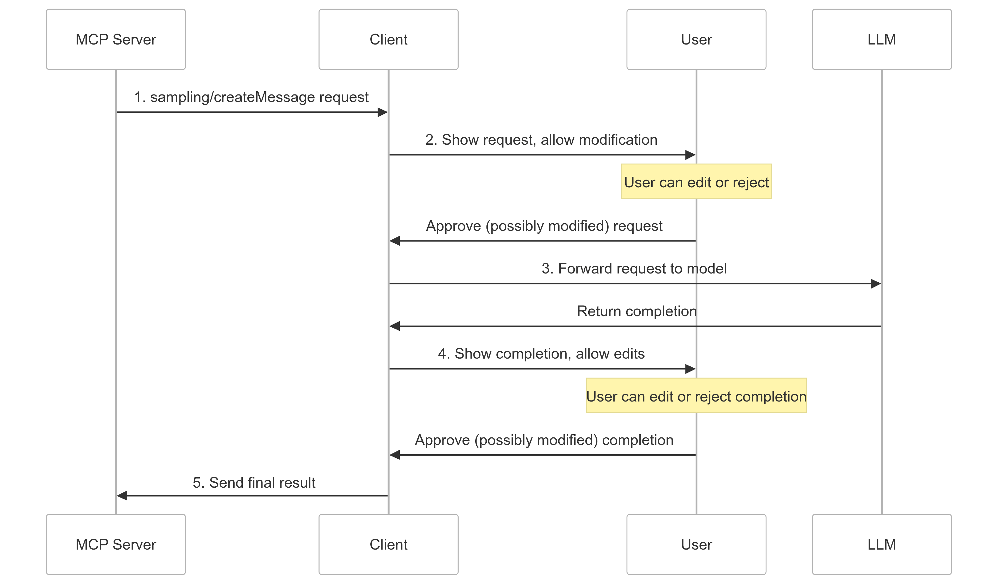

import { Callout } from "@/mdx/components";

<Callout title="Gram AI by Speakeasy">
  Introducing [Gram](https://getgram.ai/) by Speakeasy. Gram is everything you need to power integrations for Agents and LLMs. Easily create, curate and host MCP servers for internal and external use. Build custom tools and remix toolsets across 1p and 3p APIs. [Get on the waitlist](https://speakeasyapi.typeform.com/to/h6WJdwWr) today!
</Callout>

# What is MCP Sampling?

MCP Sampling lets servers ask for LLM completions through the client. This means your server can send a request to the LLM and receive a completion to continue solving a task.

MCP Sampling is unique in that it flips the typical flow: Rather than clients always initiating requests, servers can ask for AI help when needed. This enables an MCP server to:

- Use AI to make smart decisions based on available information.
- Create structured data outputs in specific formats.
- Complete multi-step workflows that require thinking.
- Analyze and respond to external data.

Sampling also allows for a human to be involved in the process: The user can review and approve both the request before sending it to the LLM and the completion before it's returned to the server.

## How sampling works

Here's how MCP Sampling works:

1. Your server sends a `sampling/createMessage` to the client while fulfilling a task.
2. **Human checkpoint one:** The client shows the user the exact prompt and context that will be sent to the LLM and the user may edit, approve, or reject this request.
3. If the user approves the request, the client requests a completion from the LLM.
4. **Human checkpoint two:** The client shows the user the full LLM response, which the user may edit, approve, or reject.
5. If the user approves the response, the client sends the approved response to the MCP server.

This human-in-the-loop design ensures users maintain control over what the LLM sees and generates and also allows the server to use AI to enhance the task it's trying to complete.



The beauty of this flow is that the human user maintains oversight. They can approve or reject the request before it's returned to the server.

### Request format

Sampling requests use a standardized message format:

```typescript
{
  messages: [
    {
      role: "user" | "assistant",
      content: {
        type: "text" | "image",
        text?: string,
        data?: string,             // base64 encoded
        mimeType?: string
      }
    }
  ],
  modelPreferences?: {
    hints?: [{
      name?: string                // Suggested model name/family
    }],
    costPriority?: number,         // 0-1, importance of minimizing cost
    speedPriority?: number,        // 0-1, importance of low latency
    intelligencePriority?: number  // 0-1, importance of capabilities
  },
  systemPrompt?: string,
  includeContext?: "none" | "thisServer" | "allServers",
  temperature?: number,
  maxTokens: number,
  stopSequences?: string[],
  metadata?: Record<string, unknown>
}
```

Here's what each field does:

- `messages`: Conversation messages with `role` and `content` (which can be text or an image)
- `modelPreferences`: Hints and priorities for model selection, for example, cost, speed, or intelligence
- `systemPrompt`: An optional directive for model behavior
- `includeContext`: Additional MCP context to include
- **Sampling parameters:** Controls like temperature and token limits

### Response format

The client returns a completion result from the LLM:

```typescript
{
  model: string,  // Name of the model used
  stopReason?: "endTurn" | "stopSequence" | "maxTokens" | string,
  role: "user" | "assistant",
  content: {
    type: "text" | "image",
    text?: string,
    data?: string,
    mimeType?: string
  }
}
```

The response includes:

- `model`: The LLM that was used (for example, `"claude-3.7-sonnet"` or `"gpt-4o-mini"`)
- `stopReason`: Why the generation stopped
- `role`: Typically `"assistant"` for model output
- `content`: The actual response content (which can be text or an image)

## Example: Code review with MCP

Here's an example of using sampling with an MCP-enabled dev tool integrated with an IDE. We want the language model to help us analyze and improve a code snippet. The server sends a sampling request containing the code and a prompt asking for refactoring suggestions.

### How it works:

1. **Server request:** The MCP server sends a sampling request with a prompt asking for a code review.
2. **LLM sampling:** The client forwards the prompt to the LLM, which returns detailed suggestions as completions.
3. **Returned completion usage:** The returned completion can be used by the MCP server to apply approved suggestions automatically.

Here's the sampling request from the server:

<div className="md:flex gap-10">
  <div className="md:w-1/2">
```json samplingRequest.json
{
  "method": "sampling/createMessage",
  "params": {
    "messages": [
      {
        "role": "user",
        "content": {
          "type": "text",
          "text": "codeToReview" // The code to review
        }
      }
    ],
    "systemPrompt": "You are a senior code reviewer with expertise in JavaScript. Provide detailed suggestions for refactoring the code.",
    "includeContext": "thisServer",
    "maxTokens": 150,
    "temperature": 0.4,
    "stopSequences": ["\n"]
  }
}
```
  </div>

  <div className="md:w-1/2">
```js codeToReview.js
// Simple function with a common pattern to improve
function greet(name) {
  if (name) {
    return "Hello, " + name + "!";
  } else {
    return "Hello, guest!";
  }
}
```
  </div>
</div>

Here's the returned completion:

<div className="md:flex gap-10">
  <div className="md:w-1/2">
```json completion.json
{
  "model": "claude-3.7-sonnet",
  "stopReason": "endTurn",
  "role": "assistant",
  "content": {
    "type": "text",
    "text": "suggestedCode" // The LLM's suggested code
  }
}
```
  </div>

  <div className="md:w-1/2">
```js suggestedCode.js
// Improved version with template literals and default parameter
function greet(name = 'guest') {
  return `Hello, ${name}!`;
}
```
  </div>
</div>

## What else can you do with sampling?

Sampling enables some powerful agentic patterns:

**Decision making:** Sampling can generate structured outputs for conditional logic in your applications. An agent could analyze available data to recommend the next steps in a complex workflow or evaluate user input to determine which process to trigger.

**Multi-step tasks:** With sampling, agents can chain multiple calls for complex workflows. This involves breaking down a complex problem into sequential steps and solving each, using the results of one step as input for the next while keeping the user in the loop.
