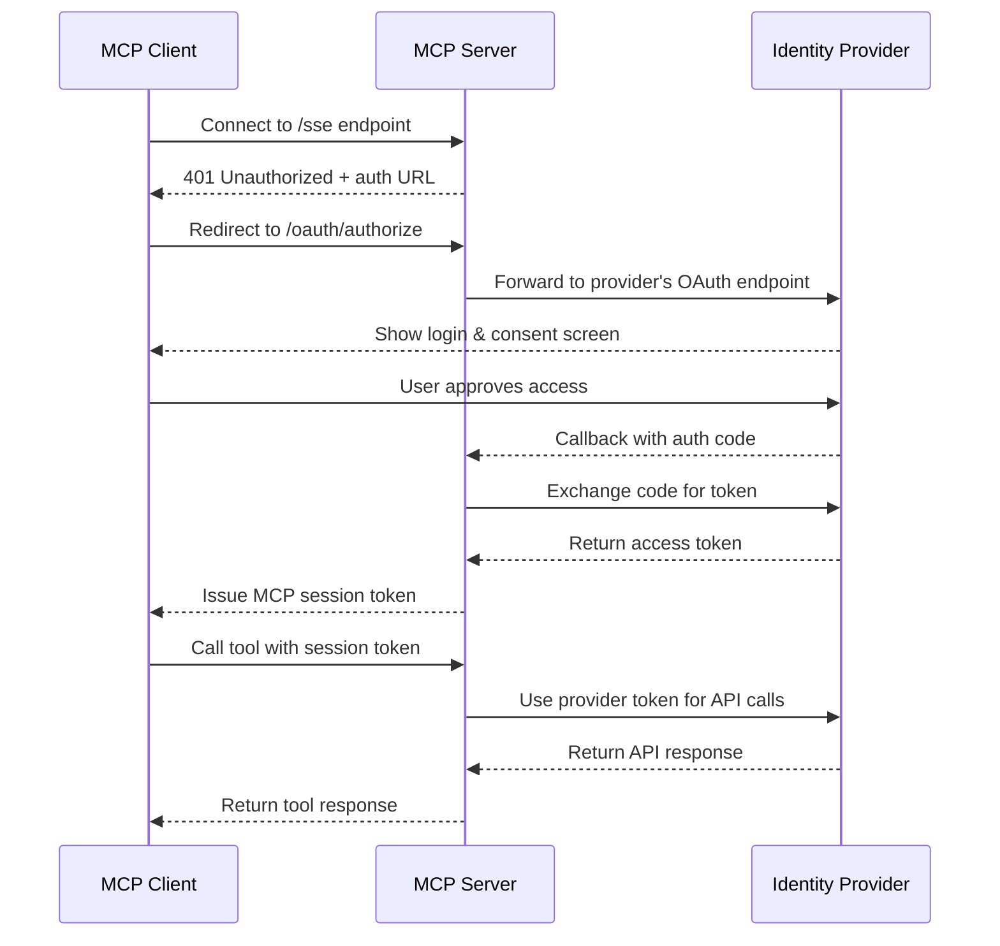
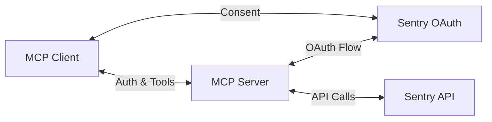

import { Callout } from "@/mdx/components";

# What is MCP authorization?

Imagine giving an AI assistant the keys to your database, customer records, or financial systems. Since the Model Context Protocol (MCP) allows agentic clients to access various parts of your systems as [tools](/mcp/building-servers/protocol-reference/tools) and [resources](/mcp/building-servers/protocol-reference/resources), how do you ensure that only the right agents can access the right tools?

This is where authorization comes in.

Authorization determines:

- **Who** can access your MCP server
- **What** specific tools and resources they can use
- **When** their access is valid
- **How** they need to be authenticated

## What is the difference between authorization and authentication?

Before diving deeper, let's clarify an important distinction:

- **Authentication** verifies identity, which is to say it confirms who or what is making the request.
- **Authorization** determines permissions, which is to say it decides what the authenticated entity can access.

### Why is authorization important?

Suppose you have a powerful MCP server that can perform various tasks, like accessing sensitive data or executing critical operations. In this case, you need to ensure that **only authorized agents** can perform these actions.

Without proper authorization, you risk an agent accessing sensitive data it's not supposed to or, even worse, [executing destructive commands](https://x.com/jxnlco/status/1910131264566485502).

### OAuth 2.1 within MCP

MCP uses a subset of the [OAuth 2.1 framework](https://oauth.net/2.1/) for authorization. OAuth 2.1 is mandatory, and the MCP Specification establishes [specific requirements](https://modelcontextprotocol.io/specification/2025-03-26/basic/authorization) for implementing it in your server.

1. **Mandatory PKCE implementation**: All MCP clients must use [Proof Key for Code Exchange](https://oauth.net/2/pkce/) (PKCE) to prevent authorization code interception attacks.
2. **Metadata discovery support**: MCP servers should support [RFC8414](https://tools.ietf.org/html/rfc8414) for automatic endpoint discovery.
3. **Dynamic client registration**: MCP servers should support [RFC7591](https://tools.ietf.org/html/rfc7591) to enable seamless client onboarding.
4. **Standardized error handling**: MCP servers must respond with specific HTTP status codes (`401`, `403`, `400`) for different authorization scenarios.

### Implementing OAuth in MCP

Here are a few ways you can implement OAuth when building your MCP server:

1. **Self-contained OAuth**: Your MCP server acts as both the resource provider and the authorization provider.
2. **Third-party OAuth provider**: Your MCP server integrates with established providers like Auth0.
3. **Custom OAuth provider**: You use your existing OAuth infrastructure behind your own API infrastructure to provide authorization for your MCP server.

Each approach has its own trade-offs, so you'll need to choose the one that best fits your needs.

## How does MCP authorization work in real-world applications?

Let's walk through an example to understand how you'd implement authorization in a real-world MCP server.

### Scenario: A document management system

Suppose you've built a document management MCP server that exposes these [tools](/mcp/tools):

- `createDocument`
- `readDocument`
- `updateDocument`
- `deleteDocument`
- `shareDocument`

You need to make sure different users have appropriate access levels:

| Role   | Access level                               | Allowed tools                                                                         |
| ------ | ------------------------------------------ | ------------------------------------------------------------------------------------- |
| Viewer | Can only read documents                    | `readDocument`                                                                        |
| Editor | Can read, create, and update documents     | `readDocument`, `createDocument`, `updateDocument`                                    |
| Admin  | Has full access to all document operations | `readDocument`, `createDocument`, `updateDocument`, `deleteDocument`, `shareDocument` |

When an agent tries to access this system through an MCP client, the following flow occurs:

1. **Initial request**: An MCP client tries to call the `deleteDocument` tool without an access token.
2. **Challenge response**: The MCP server responds with a `401 Unauthorized` status.
3. **Authentication initiation**: The client redirects the agent to an authorization URL.
4. **User consent**: The client is authenticated and granted the requested permissions, for example, for an `editor` role.
5. **Token exchange**: After consent, the authorization server issues an access token.
6. **Authorized request**: The client includes this token in subsequent requests and can access only the tools allowed by the role.
   - For example, a client with the `editor` role can call `readDocument`, `createDocument`, and `updateDocument`, but not `deleteDocument`.

7. **Permission verification**: The MCP server validates not just the token's authenticity but also the specific permissions it grants.

Here's how you can implement authorization checks in a real MCP server:

```python filename="mcp-server.py"
from mcp.server import Server
from mcp.auth import TokenValidator

app = Server("document-manager")
token_validator = TokenValidator()

@app.tool("deleteDocument", description="Delete a document by ID", args={"id": str})
async def delete_document(id: str, context):
    # Check if user has admin role via token claims
    token = context.auth.token
    if not token:
        raise PermissionError("Authentication required")

    user_roles = token_validator.get_roles(token)
    if "admin" not in user_roles:
        raise PermissionError("Admin role required to delete documents")

    # Proceed with deletion if authorized
    result = await database.delete_document(id)
    return {"status": "deleted", "documentId": id}
```

In this example, the `deleteDocument` tool checks whether the user has the `admin` role before allowing the deletion of a document. If not, it raises a `PermissionError`.

## Authorization patterns

There are a few authorization patterns you can implement to enhance the security of your MCP server.

### 1. Role-based access control (RBAC)

Define roles (like `viewer`, `editor`, and `admin`) and assign permissions to these roles. Depending on the context, clients can then be assigned roles rather than individual permissions.

```json
{
  "roles": {
    "viewer": {
      "permissions": ["readDocument"]
    },
    "editor": {
      "permissions": ["readDocument", "createDocument", "updateDocument"]
    },
    "admin": {
      "permissions": [
        "readDocument",
        "createDocument",
        "updateDocument",
        "deleteDocument",
        "shareDocument"
      ]
    }
  }
}
```

### 2. Attribute-based access control (ABAC)

Base authorization decisions on attributes (or claims) about the user, resource, action, and environment.

```python filename="mcp-server.py"
@app.tool("updateDocument", args={"id": str, "content": str})
async def update_document(id: str, content: str, context):
    document = await database.get_document(id)

    # Check if user is the document owner or has editor/admin role
    token = context.auth.token
    user_id = token_validator.get_user_id(token)
    user_roles = token_validator.get_roles(token)

    if (document.owner_id == user_id or
        any(role in ["editor", "admin"] for role in user_roles)):
        # Authorized to update
        return await database.update_document(id, content)
    else:
        raise PermissionError("Not authorized to update this document")
```

### 3. Third-party authorization

Instead of building your own authorization system from scratch, integrate your MCP server with existing identity providers like Auth0, Okta, GitHub, or even the authentication layer of your own API. This lets you use the established identity infrastructure and avoid duplicating user management.



In this flow:

1. The MCP server acts as a bridge between your MCP client and the identity provider.
2. The identity provider handles user authentication and consent.
3. The MCP server exchanges tokens with the provider and maintains the mapping.
4. Your tools can use the provider's APIs without exposing tokens to clients.

Let's see how this works with the Sentry MCP server, which uses Sentry's OAuth service as its identity provider:



1. **Initial connection**: Your MCP client connects to a Sentry MCP server.

2. **OAuth initiation**: The server responds with a `401 Unauthorized`, triggering the OAuth flow.

3. **First OAuth step**: The client redirects to the MCP server's OAuth endpoint.

4. **Server-side OAuth**: The MCP server shows its own consent screen first.

   

5. **Provider authentication**: After approving this first step, the server redirects to Sentry's OAuth service.

6. **Provider consent**: You'll see Sentry's consent screen showing which permissions the MCP server is requesting.

   

7. **Double token exchange**:
   - Sentry issues an OAuth token to the MCP server (not to your client).
   - The MCP server creates its own session token for your client.
   - The Sentry token stays secure on the server side.

8. **Using tools**: When you call a tool like `list_organizations`, the following flow begins.
   - The server validates your MCP session token.
   - It uses its Sentry token to call the Sentry API.
   - You get the results without ever handling Sentry credentials.

This setup creates a secure proxy pattern - the MCP server mediates interactions between clients and the identity provider. There are actually two OAuth flows happening:

1. One occurs between your client and the MCP server.
2. The other occurs between the MCP server and Sentry.

This double-layer approach provides extra security by keeping the provider's tokens isolated from clients.

For more details on how this works, see the [remote-servers](/mcp/using-mcp/remote-servers) page.

### Authorization Code Flow with PKCE

For browser-based applications and most MCP clients, the specification recommends the Authorization Code Flow with PKCE (Proof Key for Code Exchange). This is for public clients that cannot keep secrets.

The PKCE extension prevents authorization code interception attacks by requiring the client to generate a secret "code verifier" and its transformed value (the "code challenge"). This ensures that only the original requester can exchange the authorization code for tokens.

<Callout title="Note" type="info">
  Authorization in MCP is tightly integrated with the [transport
  layer](/mcp/transports). During the transport initialization handshake, the
  MCP server can immediately communicate its authorization requirements to the
  client.
</Callout>

## Authorization and root boundaries

MCP [roots](/mcp/roots) can be used in tandem with authorization to provide an additional layer of access control. While authorization determines which actions a user can perform, roots determine **which resources are visible** to the client.

For example, you might implement both in a tool like `readDocument` to make sure that a client can read only the documents within their authorized roots and only if they have the right permissions:

```python
@app.tool("readDocument", args={"id": str, "rootPrefix": str})
async def read_document(id: str, rootPrefix: str, context):
    # First check authorization
    if not has_permission(context.auth.token, "documents:read"):
        raise PermissionError("No permission to read documents")

    # Then validate against roots
    if not context.roots.can_access(f"{rootPrefix}/{id}"):
        raise PermissionError("Document outside accessible roots")

    # Return the document only if both checks pass
    return get_document(id)
```

## Best practices for secure MCP authorization

Here are a few best practices to keep in mind when implementing authorization in your MCP server:

1. **Apply the principle of least privilege**: Grant only the permissions necessary for the intended function.
2. **Implement short-lived tokens**: Set reasonable expiration times for access tokens.
3. **Validate tokens properly**: Check signature, expiration, issuer, and audience claims.
4. **Provide clear permission errors**: Help users understand why access was denied.
5. **Use TLS for all communications**: Encrypt all authorization-related traffic.
6. **Implement rate limiting**: Protect against brute-force and denial-of-service attacks.
