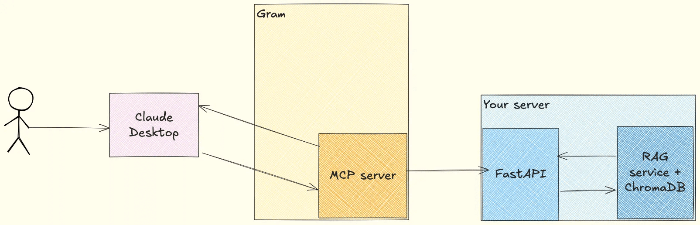
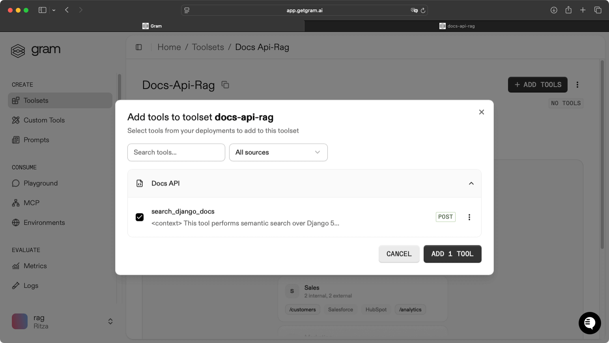
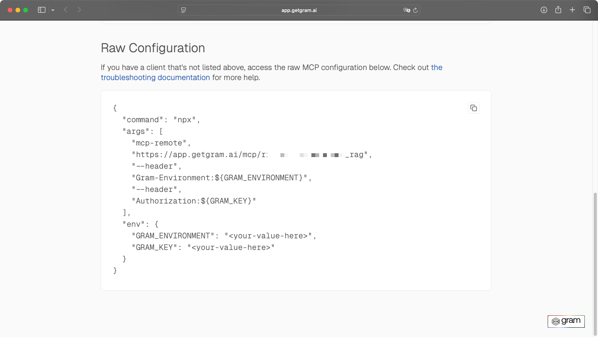
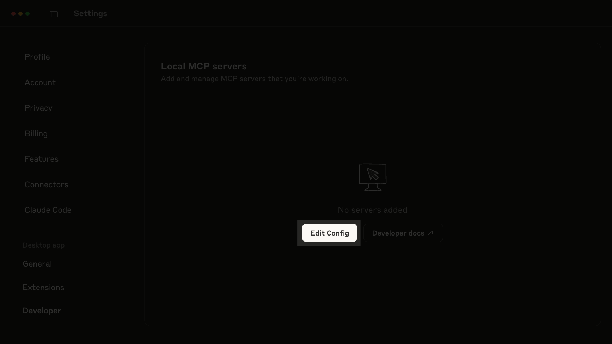
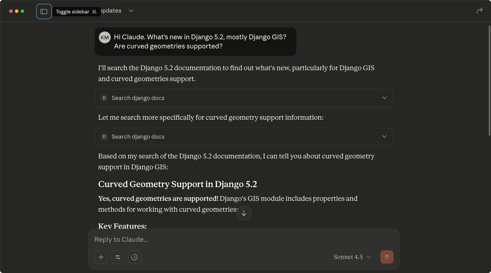
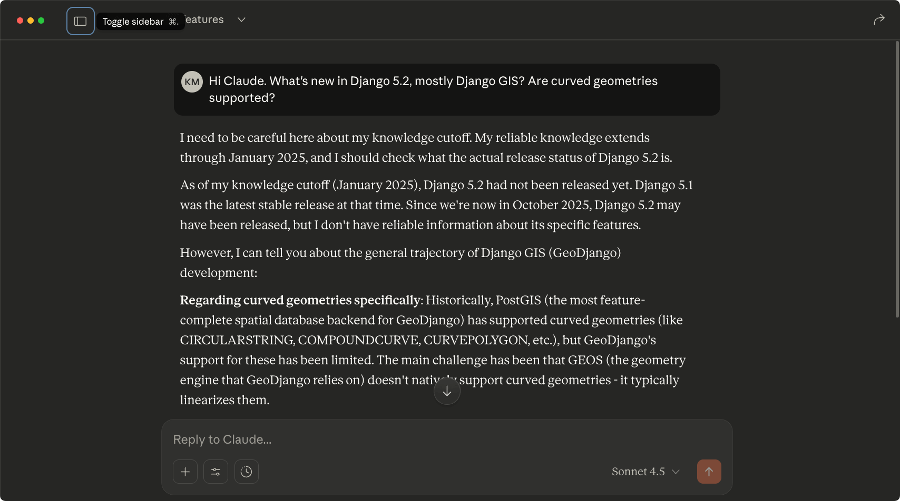

RAG and MCP are often positioned as alternatives: RAG enables semantic searches while MCP allows API actions. However, they can be complementary:  RAG searches your knowledge base efficiently, MCP standardizes how LLMs access that search. 

This guide shows you how to design RAG tools specifically for MCP: the input patterns that work, the output structures LLMs need, and the design choices that make the difference.

## What is RAG?

RAG or Retrieval-Augmented Generation is an architecture pattern for semantic search. It combines information retrieval with text generation, allowing LLMs to search external databases or sources for relevant context before generating an answer.

This usually works by embedding documents into vectors, storing them in a database, and then retrieving information based on the semantic similarity to user queries.

## Why should MCP servers have a RAG tool

MCP servers provide tools that LLMs interact with to perform actions—searching databases, calling APIs, and updating records. RAG gives agents a better context by searching your knowledge base semantically. MCP gives agents capabilities by connecting them to your systems.

For example, a RAG tool might power your enterprise AI chatbot to answer questions from your user guides and documentation. In contrast, MCP tools let your customer support agent retrieve a user's license information or create a new support ticket. In that example, RAG handles knowledge retrieval, and MCP handles your system actions.

### The problem with MCP Resources

But MCP servers provide three primitives: tools, resources, and prompts. MCP Resources are designed to give context to LLMs. These resources can be images, guides, or PDFs. For documentation search, MCP resources seem like the natural choice: expose your docs and let the LLM read them.

The problem is scale. MCP Resources dumps entire documents into the context window with no processing. Your 100-page product guide will be dumped into the LLM context, potentially bloating it and immediately hitting context limits, which can cause timeouts, refusals, or hallucinations. Also, most LLM clients like Claude Desktop or ChatGPT don't index resources from MCP servers because of these rate limits and context window issues.

### How RAG tools solve this

This is where RAG tools come in handy: instead of the LLM loading resources and searching through them, it calls a tool with a natural language query. The tool handles embedding, vector search, and relevance filtering and returns only the most relevant chunks. The LLM gets precisely what it needs without managing the search infrastructure.

In our RAG vs. MCP guide, we compared a RAG implementation to an MCP implementation for searching Django documentation. The RAG implementation used 9,798 tokens and found the answer. The MCP implementation used 32,189 tokens, 4x more, and still missed the answer because the relevant content was beyond the first 50 pages it could send within context limits.

RAG tools also enable features impossible with static resources: relevance scoring (LLM can request more context if scores are low), metadata filtering (search specific versions or sections), and context management (automatic token budgeting). The LLM uses a single tool with natural language instead of managing dozens of resources.

The diagram below shows how this architecture works in practice:



## What inputs should be added to a RAG tool

A well-designed RAG tool needs three types of parameters: the search query itself, result controls, and quality filters. Getting these wrong means either the LLM can't express what it needs, or it gets flooded with irrelevant results.

### The query parameter

The query parameter should actually be a natural language query, not a list of keywords. A RAG system uses embeddings for semantic search. The embedding models (`all-MiniLM-L6-v2`  or `text-embedding-3-small` for OpenAI) are trained on natural language sentences, not keyword lists. When a user asks, "How do I work with curved geometries in Django's GIS module?", the LLM has already parsed the intent (implementation guidance), identified the domain (Django GIS geometry handling), and understood the context (a how-to question)

Forcing the LLM to translate that into structured keywords like `["django", "gis", "curve"]` with filters `{"type": "tutorial"}` throws away semantic understanding. The LLM must decide which words are keywords versus context, map natural language to your filter taxonomy, and lose the semantic relationships that make embeddings work. This gives you worse search results and wastes tokens.

When the LLM translates "How do I work with curved geometries in Django's GIS module?" into keywords `["django", "gis", "curve"]`, your vector database retrieves pages containing those exact words—installation guides, general geometry tutorials, curve plotting—because keyword matching doesn't understand "curved geometries" means MultiCurve support. The LLM makes 2-3 attempts at $0.12+ versus one natural language query that retrieves the right results for $0.03."

### Result count control

LLMs understand and manage their context windows. In the tool parameters, let the LLM specify how many results it needs. Cap results at 10 to prevent context overflow. Make this parameter optional with a documented default (3 results works well).

### Quality filtering

Not all search results are equally relevant, and because of that, you should allow the LLM to filter by quality. 

For example, when you query a vector database like ChromaDB, it returns results ranked by **cosine similarity**, a score measuring how close the query embedding is to each document embedding. A score of **1.0** means identical semantic meaning, **0.5** means somewhat related, and 0.0 means unrelated.

This keeps low-quality results out of the LLM's context window entirely. When Claude asks for `min_score=0.7`, it's saying "only give me results that are at least **70%** semantically similar to my query", the RAG tool enforces this at retrieval time, and the LLM never sees the irrelevant chunks. If it gets back two results with scores of **0.72** and **0.71**, it knows the match is marginal and might lower the threshold to `min_score=0.6` for a broader search. If it gets **10** results all above **0.9**, it knows the search is highly targeted.

## How should the tool be designed

If you're exposing RAG capabilities behind an endpoint, use a single endpoint instead of multiple ones. If you have numerous guides or documentation sets to index, separate tools are tempting. But if you're designing RAG for an enterprise with dozens of products and documentation sets, many tools exposed to the LLM can create a tool explosion problem. The LLM faces decision paralysis, leading to wrong tool choices or hallucinations.

Instead, use one flexible search tool, and add a parameter to redirect to the correct user guide, for example.

### Response format

LLMs need results in a format they can immediately use. Here's what works:

```json
{
    "results": [
        {
            "content": "The actual documentation text...",
            "source": "https://docs.djangoproject.com/en/5.2/ref/contrib/gis/",
            "score": 0.87
        },
        {
            "content": "More documentation text...",
            "source": "https://docs.djangoproject.com/en/5.2/releases/5.2/",
            "score": 0.82
        }
    ],
    "total_found": 2,
    "tokens_estimate": 1847
}
```

The response format will vary depending on your case, but here are some best practices to follow: 

1. Flat result array: Don't nest results in complex structures. The LLM iterates through them sequentially—make that easy.

2. Content first: Put the actual text in `content`, not `text` or `document` or `chunk`. Be consistent and obvious.

3. Include sources: The LLM needs to cite where information came from. URLs, page numbers, or document IDs work.

4. Expose scores: Let the LLM judge result quality. If all scores are below 0.6, it knows the search was weak and might rephrase the query.

5. Token estimates: Critical for context management. The LLM needs to determine if it can fit these results, along with its reasoning, in the context window. Divide total characters by 4 for a rough estimate (works well for English documentation).

6. Avoid returning too much data to the LLM.

   ```json
   // ❌ Bad: too much metadata
   {
       "results": [
           {
               "content": "...",
               "metadata": {
                   "chunk_id": "abc123",
                   "embedding_model": "all-MiniLM-L6-v2",
                   "embedding_dimensions": 384,
                   "created_at": "2025-01-15T10:23:45Z",
                   "database_shard": "shard-3",
                   "index_version": "v2.1"
               }
           }
       ]
   }
   ```

### Error Responses for RAG Tools

When searches fail, LLMs need actionable errors. Compare these:

```json
# ❌ Bad: Generic error
{
    "error": "Search failed",
    "code": 400
}

# ✅ Good: Actionable error
{
    "error": "no_results_found",
    "message": "No documentation found for 'Djago GIS features'",
    "attempted_query": "Djago GIS features"
}
```

The second version tells the LLM what went wrong (typo in "Django"), and echoes the query so the LLM can verify what was searched.

## Building a Django Documentation RAG MCP server

Let's build a Django documentation search API and expose it as an MCP tool through Gram. This example extends the RAG implementation from the RAG vs. MCP article by wrapping it in a REST API with proper input/output design for LLM consumption.

You can find the complete project [here](#). Clone it and follow along, or build from scratch using the steps below.

### Setup

Clone and install the dependencies:

```bash
git clone [repo-url] django-rag-api
cd django-rag-api
uv sync
```

### Defining the search interface

In the `app/main.py` file, you will first see the schemas defined. 

```python
class SearchRequest(BaseModel):
    query: str = Field(..., description="Natural language search query", example="What's new in django.contrib.gis?")
    max_results: Optional[int] = Field(default=3, ge=1, le=10, description="Maximum number of results")
    min_score: Optional[float] = Field(default=0.5, ge=0.0, le=1.0, description="Minimum relevance score")

class SearchResult(BaseModel):
    content: str = Field(..., description="The documentation chunk")
    source: str = Field(..., description="Source reference")
    score: float = Field(..., description="Relevance score (0-1)")

class SearchResponse(BaseModel):
    results: List[SearchResult]
    total_found: int
    tokens_estimate: int
```

The query accepts natural language directly. The `max_results` attribute, capped at 10, prevents context overflow, and the `min_score` defaults to 0.5 for inclusive results, allowing the LLM to raise the threshold when it needs higher confidence.

For the response schema `SearchResponse`, it keeps results in a flat array for easy LLM iteration. The score field lets the LLM judge quality and adjust queries. The `tokens_estimate` attribute helps with context window management, critical for preventing overflow.

> **Note:** Token estimation divides total characters by 4 because most tokenizers average about 4 characters per token in English.

### Building the RAG search logic

The `RAGService` class handles the vector search:

```python
class RAGService:
    def __init__(self):
        self.model = SentenceTransformer("all-MiniLM-L6-v2")
        self.client = chromadb.PersistentClient(path="./chroma_db")
        self.collection = self.client.get_collection("django_docs")
    
    def search(self, query: str, max_results: int, min_score: float):
        query_embedding = self.model.encode(query).tolist()
        
        search_results = self.collection.query(
            query_embeddings=[query_embedding],
            n_results=min(max_results * 3, 50)
        )
        
        documents = search_results["documents"][0]
        distances = search_results["distances"][0]
        ids = search_results["ids"][0]
        
        results = []
        for doc, distance, doc_id in zip(documents, distances, ids):
            score = 1.0 / (1.0 + distance)
            if score >= min_score:
                results.append(SearchResult(
                    content=doc,
                    source=doc_id,
                    score=round(score, 3)
                ))
        
        results.sort(key=lambda x: x.score, reverse=True)
        total_found = len(results)
        filtered_results = results[:max_results]
        
        total_chars = sum(len(r.content) for r in filtered_results)
        tokens_estimate = total_chars // 4
        
        return filtered_results, total_found, tokens_estimate
```

The service retrieves `max_results * 3` candidates to ensure enough survive score filtering. ChromaDB returns distances, which get converted to 0-1 similarity scores using `1 / (1 + distance)`. Results are filtered by `min_score`, sorted by score descending, and limited to `max_results`.

### Wiring up the search API

The FastAPI endpoint wires everything together:

```python
app = FastAPI(
    title="Django Documentation RAG API",
    description="Semantic search over Django 5.2.8 documentation",
    version="1.0.0"
)

rag_service = RAGService()

@app.post(
    "/search",
    response_model=SearchResponse,
    operation_id="search_django_docs",
    summary="Search Django documentation semantically",
    description="""
    Performs semantic search over Django 5.2.8 documentation.
    Use natural language queries. Returns relevant documentation
    chunks with similarity scores and sources for citation.
    """
)
async def search_documentation(request: SearchRequest):
    results, total_found, tokens_estimate = rag_service.search(
        query=request.query,
        max_results=request.max_results,
        min_score=request.min_score
    )
    
    return SearchResponse(
        results=results,
        total_found=total_found,
        tokens_estimate=tokens_estimate
    )
```

The `operation_id="search_django_docs"` becomes the MCP tool name that Claude will call. The description tells the LLM what this tool does and when to use it. FastAPI handles validation and serialization automatically.

### Running the server

Start the server:

```bash
uv run uvicorn app.main:app --host 0.0.0.0 --port 8000 --reload
```

### Deploying the MCP Server with Gram

Gram is a service that allows you to create MCP servers using an OpenAPI document. Coding and building an MCP server from scratch is doable. You have tools like FastMCP to help, FastMCP cloud to host the server, and MCP SDKs to build MCP servers and expose them via HTTP streamable, for example. But at the end, you will: 

- Manage an infrastructure: maintain and monitor a service. 
- Implement CI/CD pipelines. 
- Need to handle security, and only OAuth2.1 is supported, which is a complex protocol to handle. 
- Gram generates MCP servers directly from your OpenAPI specification. You build a standard REST API, provide the OpenAPI document, and Gram handles the MCP protocol implementation, hosting, and authentication. This means you focus on implementing your endpoints and business logic – whether that's RAG search, database queries, or any API operations – not on coding the MCP server infrastructure.

With Gram, you will upload the OpenAPI document from the cloned project, configure the API URL using the Ngrok forwarding link, create the toolsets, enable remote MCP distribution, and then install and test it in Claude Desktop. 

[Sign up for Gram](https://getgram.ai) and follow these steps:

- On the [**Toolsets** page](https://docs.getgram.ai/build-mcp/create-default-toolset), upload the RAG API's OpenAPI document.

- Create a toolset named `Docs-Api-Rag` and add the `search_django_docs` tool.

  

- In the [**Auth** tab](https://docs.getgram.ai/concepts/environments), set `DOCS_API_SERVER_URL` to the URL of your internal tool API. If you're following this guide with the local RAG MCP API, expose the API with [ngrok](https://ngrok.com/) by running the `ngrok http 127.0.0.1:8000` command and using the forwarding URL to fill in the `DOCS_API_SERVER_URL` variable.
- In **Settings**, create a [Gram API key](https://docs.getgram.ai/concepts/api-keys).

### Connecting to Claude Desktop

In your Docs-Api-Rag toolset's MCP tab, click on the **View** button under the MCP installation section to be redirected to the MCP installation page details.

Copy the raw configuration details. 



Open the Claude Desktop application, navigate to **Settings -> Developer**, and click **Edit Config**.



Open the `claude_desktop_config.json` file, copy the raw configuration from Gram, and replace the value of `GRAM_ENVIRONMENT` with `default` or the name of the environment you are storing the environment variables, and `GRAM_KEY` with the Gram key.

### Testing with Claude

To test the RAG tool, open Claude Desktop and send the following prompt:

```txt
Hi Claude. What's new in Django 5.2, mostly Django GIS? Are curved geometries supported?
```

Claude will first use the MCP Rag tool to make a search and then reply. 



Disable both the RAG tool and Claude's web search feature, then ask the same question. Claude will indicate uncertainty about Django 5.2 GIS features because the information is beyond its January 2025 training cutoff, and it has no way to retrieve current documentation.



## Further Exploration

Now that you've built a RAG tool for documentation search, consider what else becomes possible when you combine RAG with other MCP tools:

- You can design a customer support agent. Combine a RAG tool for your product documentation with the Zendesk MCP server, for example, or any CRM tools, support tickets, and analytics. The agent learns product context from documentation and then pulls customer data to provide personalized support responses.
- You can power a code assistant. Build a RAG tool for your SDK documentation and code examples, paired with MCP tools that interact with your sandbox API. The LLM searches for implementation patterns, retrieves example code, and tests it against your sandbox environment.
- You can build an account management assistant. Create a RAG tool that searches your company's sales playbooks and account management guides. Pair it with the HubSpot MCP server. When a sales rep asks "update this client's status to renewal stage and log our last conversation", the LLM uses RAG to check your renewal protocols, then updates the contact record and creates the activity log in your CRM following those guidelines.

## Final thoughts

RAG and MCP are often compared as competing approaches, but they're most powerful when used together. An AI agent might use a RAG tool to search your product documentation for implementation guidance, then use other MCP tools to create tickets, update records, or query live data. The combination gives agents both knowledge and agency.

If you're building RAG tools for MCP, check out existing implementations like [mcp-crawl4ai-rag](https://github.com/coleam00/mcp-crawl4ai-rag) and [rag-memory-mcp](https://github.com/ttommyth/rag-memory-mcp) for more patterns. 

To host and manage your MCP servers using Gram, explore [Gram's documentation](https://docs.getgram.ai).