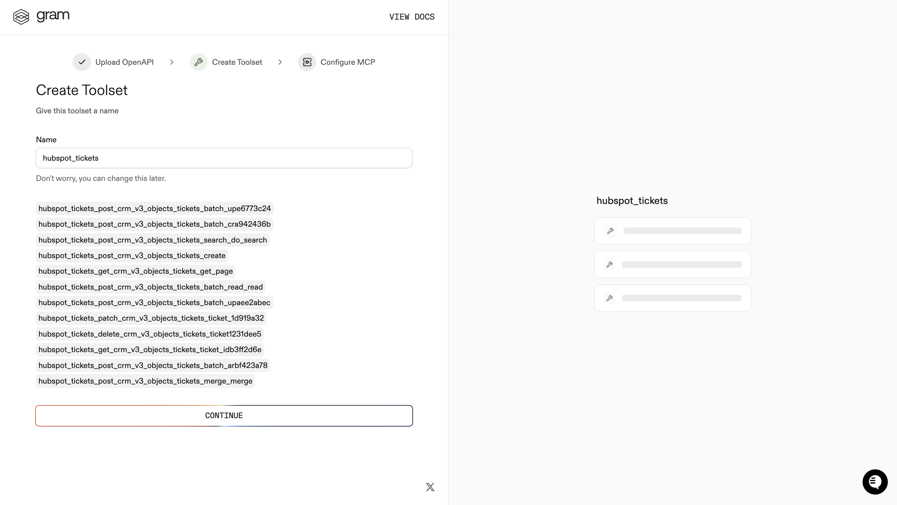
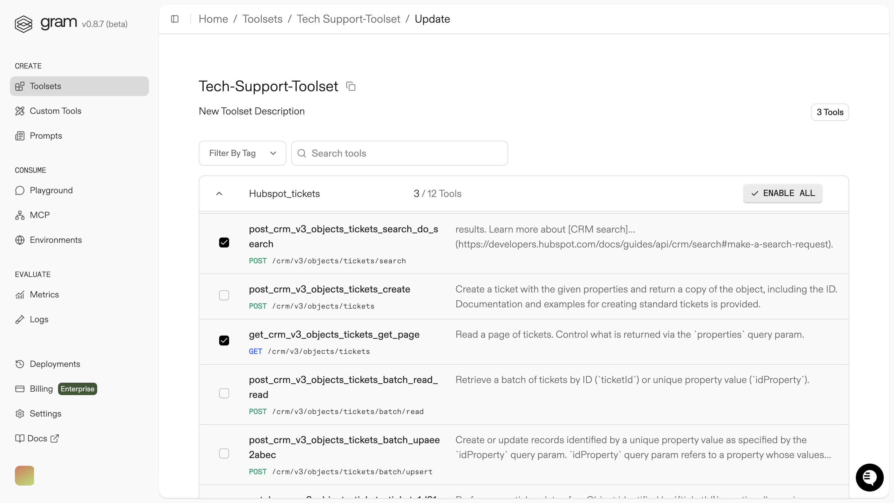
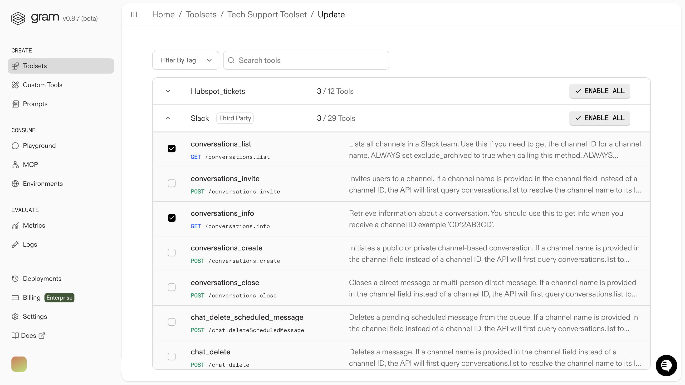

Picture this: someone forgot their password and submits a HubSpot ticket for a reset. Your IT team starts working on it in Slack. Meanwhile, the person who submitted the ticket has no idea what's happening. They just want to know: "Is anyone working on my password reset?"

Right now, they'd have to log into HubSpot, find their ticket, decipher the status updates, maybe check if there's any chatter in Slack. Most people don't bother, they just call IT and ask the same question over and over.

What if they could just say "Hey, what's the status of my password reset request?" and get an instant, spoken answer? Better yet, what if that same voice agent could post updates to your IT team's Slack channel?

<video
  controls={true}
  autoPlay={true}
  muted={true}
  loop={true}
  width="100%"
  className="mt-4 mb-4">
  <source src="./assets/realtime-agent-demo.mp4" type="video/mp4" />
</video>

## What are we building? 

AI agents can chat, but how do you give one the ability to actually check HubSpot tickets or post Slack messages? That's exactly what MCP (Model Context Protocol) solves.

We're using MCP to create a toolset that connects an AI voice agent to your existing helpdesk systems. Instead of the agent just talking about tickets, it can actually look them up, check their status, and even coordinate with your team through Slack.


We can use Gram to curate the perfect set of MCP tools from HubSpot and Slack APIs, then host them as a single MCP server. The voice agent connects to this server and therefore has real-world capabilities, not just conversational ones.

We'll use OpenAI's [Realtime Agent SDK](https://platform.openai.com/docs/guides/voice-agents?voice-agent-architecture=speech-to-speech) for the voice agent. You can find the demo app [here](https://github.com/ritza-co/taskmaster-realtime-agent-demo).

### What is Gram?

[Gram](https://gram.ai) allows you to convert APIs into MCP (Model Context Protocol) tools and hosts them as MCP servers. Instead of building your own MCP servers from scratch, you can upload OpenAPI documentation to Gram and it automatically generates the MCP tool definitions.

### How Gram works

Gram takes OpenAPI specifications and transforms them into MCP-compatible tools that AI agents can call. You can then curate these tools into focused toolsets for specific use cases. For example, instead of exposing HubSpot's entire CRM API to your IT helpdesk agent, you create a toolset with just the ticket-related operations you need.

What's more, suppose we want to give our agent access to a tech support Slack channel to check up on the team working on a ticket, we can **curate** a custom toolset with the Slack tools we need along with the HubSpot tools that the agent needs to call.

In short Gram has a few key concepts we'll explore in this guide:

**Tool curation**: Build focused toolsets from multiple APIs without exposing unnecessary endpoints. This keeps your agents efficient and reduces errors.

**Hosted MCP servers**: Gram hosts your toolsets as MCP servers, so you don't need to manage server infrastructure or handle MCP protocol details.

**Tool refinement**: You can customize tool names and descriptions to give your AI agent better context about when and how to use each tool.

## Creating an IT Support MCP Toolset (HubSpot + Slack)

We'll set up two API sources in Gram: upload a custom HubSpot tickets OpenAPI spec and enable Gram's prebuilt Slack integration. Then we'll curate a single "IT Helpdesk" toolset that contains only the tools our voice agent needs.

### Prerequisites

For this guide, you will need:

- Node.js 18+ (for the Realtime agent app)
- An OpenAI API key (Realtime + Responses access)
- A Gram account
- HubSpot Private App token (Service tickets)
- Slack Web API credentials (e.g., Bot/User token) to post messages via `chat.postMessage`

Optional (if adding an internal API):

- Python 3.11+
  - uv installed on your machine (for local API samples)

### Upload HubSpot Tickets OpenAPI to Gram

We'll use HubSpots Tickets API for fetching ticket details. The official HubSpot OpenAPI spec is available [here](https://developers.hubspot.com/docs/api/crm/tickets) however it needs some modifications to be used with Token based authentication in Gram.

You can find our [modified HubSpot OpenAPI spec here](https://github.com/ritza-co/taskmaster-realtime-agent-demo/blob/main/openapi/custom-hubspot-openapi.json).

1. First upload the HubSpot Tickets OpenAPI document and name it "HubSpot Tickets".


2. Complete the upload process. Gram converts endpoints to MCP tool definitions.




At this point, all HubSpot tools are available but not yet enabled for any specific use case.

For more information on how to create a toolset using Gram, you can read the Gram [Quickstart guide](https://docs.getgram.ai/gram-quickstart).

### Enable Slack integration

Instead of uploading the Slack OpenAPI document, we'll use Gram's prebuilt Slack integration which provides a curated set of Slack tools.

Navigate to `https://app.getgram.ai/<your-org>/<your-project>/integrations` and enable the Slack integration:


This gives you access to essential Slack tools like `chat.postMessage` without needing to manage your own OpenAPI specification.

### Create and curate the "IT Helpdesk" toolset

Next, we'll create a single *combined* and *curated* toolset that includes only the essential HubSpot and Slack tools. This focused approach reduces tool explosion and improves LLM efficiency. You can read more on the benefits of curated toolsets [here](/mcp/building-servers/less-is-more).

Go to *Toolsets* and click on the **+ ADD TOOLSET** button.


Enter the name of the toolset and click on the **CREATE** button.

When creating your IT Helpdesk toolset, be selective about which tools to enable:


**Only enable these specific tools:**

From `HubSpot` we'll enable the tools for:
- Get ticket by ID
- Find tickets by contact email  
- Read status/assignee/summary fields



From `Slack` we'll enable the tools for:
- Fetching Conversations
- Fetching Conversations by ID (for getting a full thread)
- Post message to channel/DM (`chat.postMessage`)



Leave all other tools disabled to keep your agent focused.

Configure authentication for both HubSpot and Slack under the toolset's **Auth** tab, using environment variables for tokens.


### Enable MCP hosting for the toolset

Navigate to the MCP tab on the IT Helpdesk toolset page. Click on the **ENABLE** button to enable MCP hosting.


Use **Pass-through authentication** so authentication tokens are passed directly from the client. This gives you more control over credential management and allows different clients to use different tokens.

## Setting up a Realtime voice agent

This guide uses our [Realtime voice agent demo](https://github.com/ritza-co/taskmaster-realtime-agent-demo) that connects to your Gram-hosted MCP toolset. The demo uses [OpenAI's Realtime Agent SDK](https://platform.openai.com/docs/guides/voice-agents?voice-agent-architecture=speech-to-speech) to handle both voice interaction and tool calling directly.

When you speak to the agent, it can:

1. **Direct tool calls**: Call your Gram-hosted MCP tools (HubSpot + Slack) directly and relay the results back in natural speech.
2. **Voice responses**: Convert tool results back to natural speech in real-time
3. **Conversational flow**: Maintain natural conversation while executing complex workflows

This gives you seamless voice-to-tool integration without needing separate APIs for different functions.

### Connecting the toolset to the Realtime voice agent

The Realtime agent app allows you to connect to your Gram-hosted MCP toolset through an MCP JSON configuration. The app reads remote MCP servers from this JSON and passes them to the model.

First lets set  up the demo app.

You can clone the repo from here: [Realtime voice agent demo](https://github.com/ritza-co/taskmaster-realtime-agent-demo)

```bash
git clone https://github.com/ritza-co/taskmaster-realtime-agent-demo
cd taskmaster-realtime-agent-demo
```

Install the dependencies:


```bash
npm install
```


Set your OpenAI API key:

```bash
cp .env.sample .env
# edit .env and set OPENAI_API_KEY=sk-...
```

Start the app:

```bash
npm run dev
```

The app will be available at http://localhost:3000. 


### Connecting the toolset to the Realtime voice agent

Navigate to the Settings page and paste the MCP JSON for your toolset.


Fill in the placeholders with your actual tokens and endpoint.

```json
{
  "mcpServers": {
    "GramTechsupporttoolset": {
      "command": "npx",
      "args": [
        "mcp-remote",
        "https://app.getgram.ai/mcp/<your-gram-it-helpdesk-endpoint>",
        "--header",
        "MCP-SLACK-TOKEN:<your-slack-bot-token>",
        "--header",
        "MCP-HUBSPOT-OPENAPI-BEARER-AUTH:<your-hubspot-private-app-token>"
      ]
    }
  }
}
```

Save. Optionally enable Logs and pick a codec (Opus default; PCMU/PCMA simulates PSTN).

### Try it with voice

Let's try it out with voice. We've set up a sample ticket in HubSpot with a password reset request. 


In Slack we've set up a channel called #it-support where the IT support team is discussing the ticket.


Let's connect to the agent and ask it to check the status of the ticket.

<video
  controls={true}
  autoPlay={true}
  muted={true}
  loop={true}
  width="100%"
  className="mt-4 mb-4">
  <source src="./assets/realtime-agent-demo.mp4" type="video/mp4" />
</video>

Awesome! It looks like our ticket is being worked on by the IT support team. The Agent has also posted a follow up message in the #it-support channel.


## What's next?

Pretty cool, right? You just built a voice agent that can check HubSpot tickets and post Slack updates without breaking a sweat. No more digging through support portals or playing phone tag with IT.

The real power here is in the curation. Instead of dumping every possible API endpoint into your agent, you picked exactly what you needed. That's what makes it actually useful instead of just impressive.

This same approach works for other IT workflows too. Think about adding password resets from your identity provider, or letting people request software licenses through voice. 

You can even extend the voice agent concept to handling phone calls and give the agent the ability to "hand off" to a human agent if needed.

Your helpdesk just got a lot more helpful.

## Further reading

- [Gram](https://getgram.ai)
- [OpenAI Realtime Agent SDK](https://platform.openai.com/docs/guides/voice-agents?voice-agent-architecture=speech-to-speech)
- [Tool curation](/mcp/building-servers/less-is-more)
- [Curating Tools with Gram](https://docs.getgram.ai/build-mcp/advanced-tool-curation)