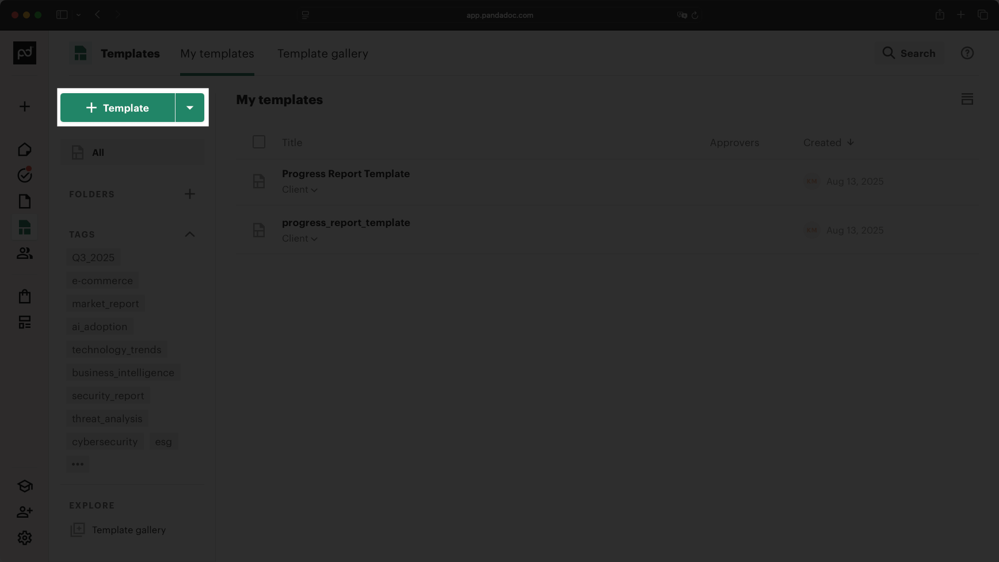
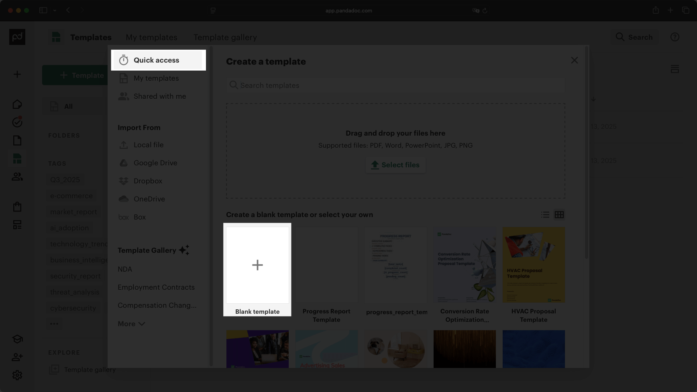
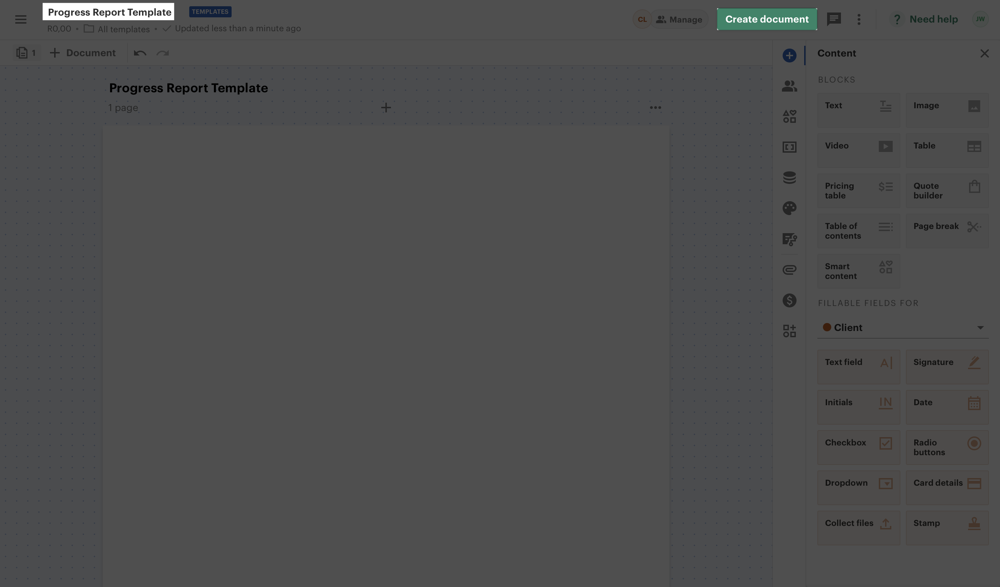
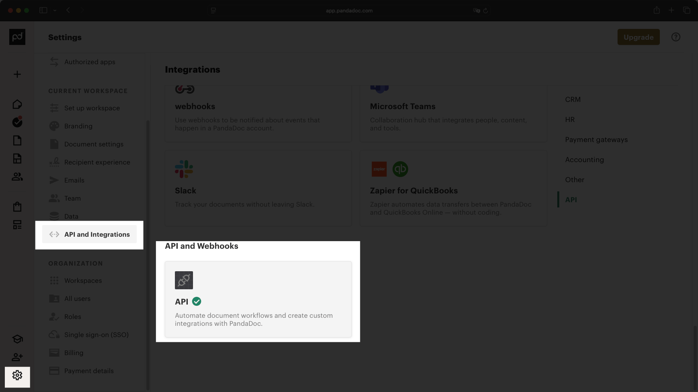
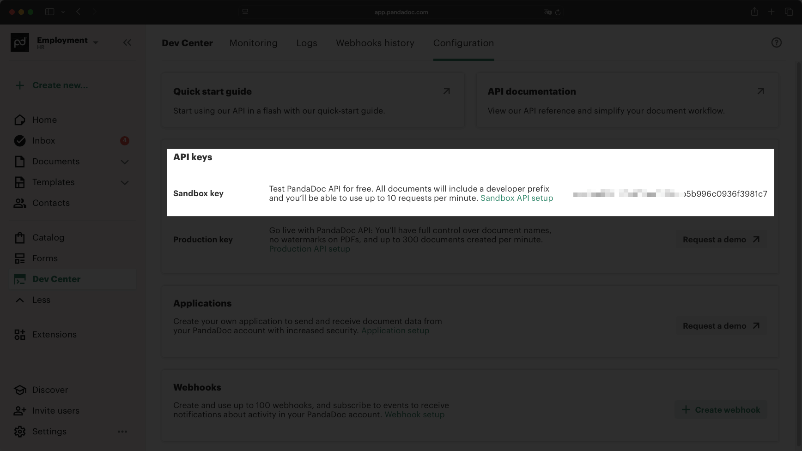
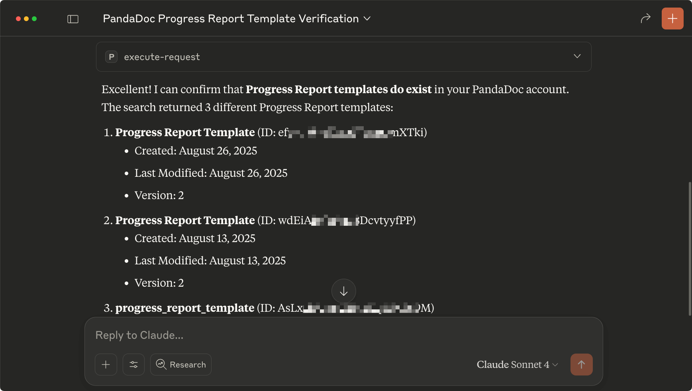
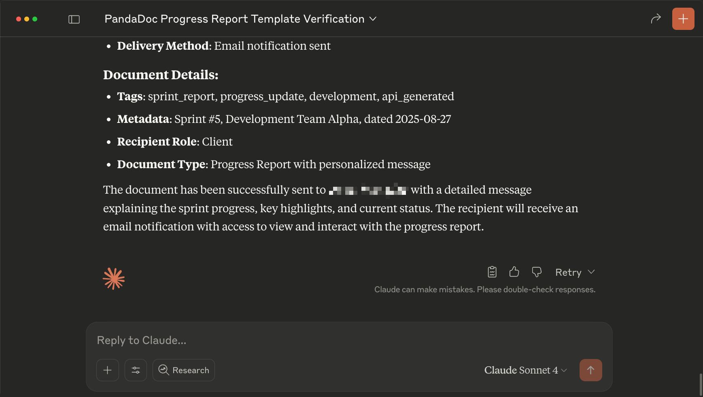

PandaDoc is a document automation platform that generates professional documents from templates. Their MCP server lets you create and populate documents directly through Claude Desktop, so you can generate contracts, proposals, and reports by describing what you need in natural language.

In this guide, you'll learn how to connect the PandaDoc MCP server with Claude Desktop.

## Prerequisites 

For this guide, you will need: 

- [PandaDoc account](https://www.pandadoc.com/). 
- [Claude Desktop](https://claude.ai/download). 

## Create a PandaDoc template

You need a template for Claude to work with when generating documents. PandaDoc uses templates as the foundation for all documents, so we'll create a simple one that Claude can populate with your specific content. In your PandaDoc dashboard, go to Templates and click **+ Template**.



Select **Blank Template** to create a clean template that Claude can populate with your content.



Name your template "Progress Report Template" by double-clicking the template name in the top left corner. This makes it easy to reference when asking Claude to generate documents.



Now that you have a template, get your PandaDoc API key.

### Retrieve the API Key

In the PandaDoc dashboard, navigate to **Settings → API and Integrations**. Scroll down and click "API".



This redirects you to the API configuration page where you can view your sandbox and production keys. Copy the Sandbox API Key and save it. You'll need it for the Claude Desktop configuration.



### Connect the PandaDoc MCP server

Add the PandaDoc configuration to your `claude_desktop_config.json` file:

```json
{
  "mcpServers": {
    "pandadoc": {
      "command": "npx",
      "args": [
        "mcp-remote",
        "https://developers.pandadoc.com/mcp",
        "--header",
        "Authorization: API-Key ${AUTH_TOKEN}"
      ],
      "env": {
        "AUTH_TOKEN": "YOUR_SANDBOX_KEY"
      }
    }
  }
}
```

Replace `YOUR_SANDBOX_KEY` with the sandbox key you copied from PandaDoc and restart Claude Desktop.

## Test the connection 

Test the integration by asking Claude to create a progress report using your template. This involves two steps: first, Claude needs to find your template in PandaDoc, then it can generate and share the document.

Ask Claude to find your template:

```txt
Please, confirm the Progress Report template exists using the PandaDoc MCP server.
```



Now ask Claude to generate a short scrum report, create the document and share it with an email in your organization:

```txt
Now, please create a short scrum report regarding tasks advancement. Then create a document in PandaDoc with the Progress Report template and fill it with the scrum report. Then, publish and share the document with an_email_address_com.
```



Claude will generate the report content, populate your template, create the document in PandaDoc, and share it with the specified email address.

## Conclusion

In this guide, you learned how to connect the PandaDoc MCP server to Claude Desktop for automated document generation. You can build on this by combining it with other MCP servers, like using[ Slack conversations](/mcp/using-mcp/slack-mcp-guide) to automatically generate project reports or client updates through PandaDoc.