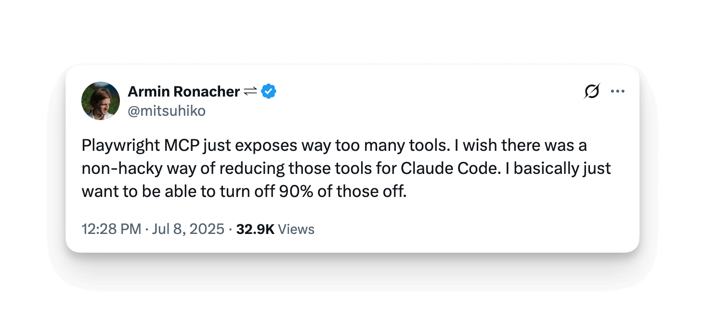
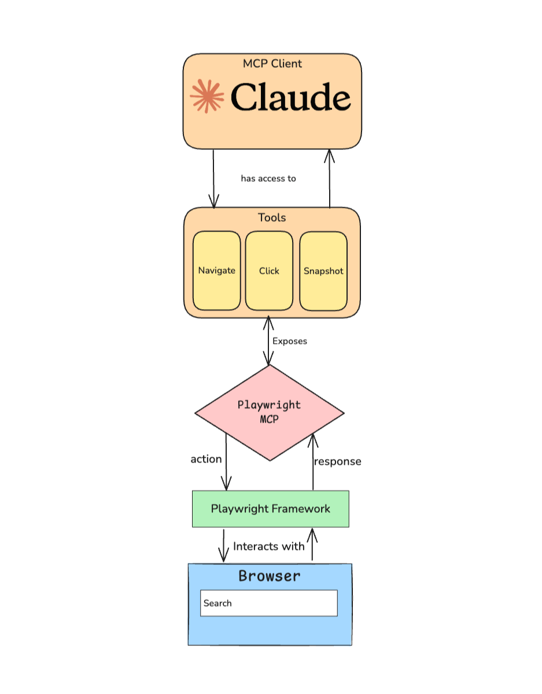
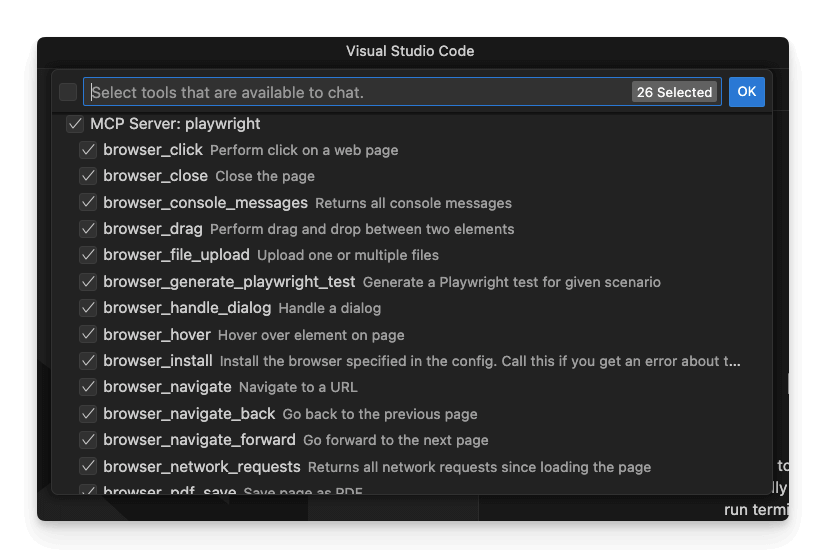
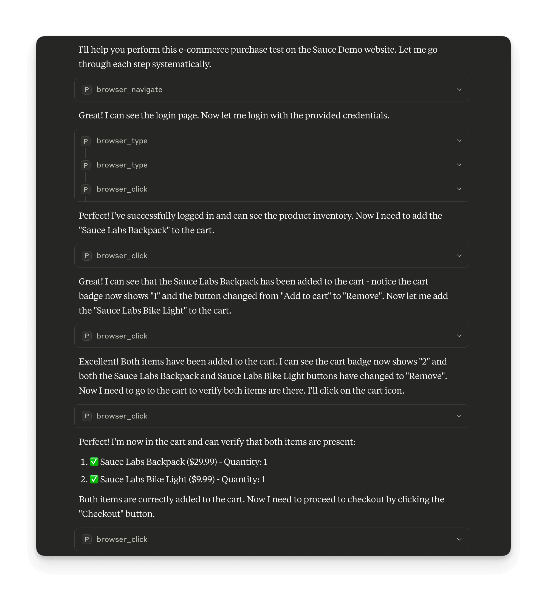
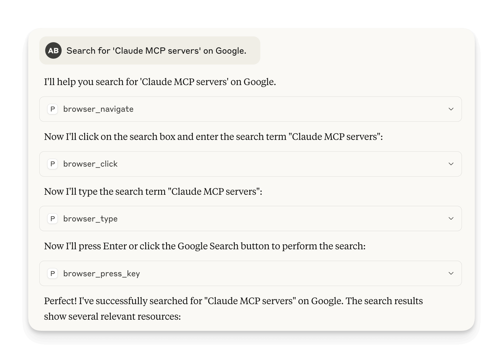
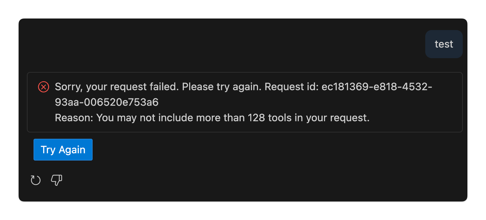

import GramCallout from "../.partials/gram-callout.mdx";

<GramCallout />

Flask creator, Armin Ronacher, [recently voiced a frustration](https://x.com/mitsuhiko/status/1942531115371131270) familiar to many MCP users:



When asked which tools he actually uses, [Armin's response was telling](https://x.com/mitsuhiko/status/1942533476592300215):

> Most of the time it's navigate, press key, handle dialog, click, type, select, wait for, page snapshot.

That's only eight of the 26 tools available on the Playwright MCP server.

## What is Playwright?

[Playwright](https://playwright.dev) is a framework that allows AI agents to access a browser. Microsoft built it as a "universal remote control" for web browsers, with which you can control Chrome, Firefox, Safari, and Edge using the exact same code. Originally designed for testing web applications, Playwright has been extended with an MCP server that allows AI agents to interact with websites programmatically.

What makes Playwright special is its reliability. Traditional browser automation tools suffer from flaky tests that fail randomly, usually because they don't wait for pages to load fully. Playwright solves this by automatically waiting for elements to be ready before interacting with them. It can also handle complex scenarios like multi-tab browsing, mobile device emulation, and even intercepting network requests to mock APIs.

But here's the thing: Playwright was built for developers writing code, not for AI agents making decisions on the fly. That's where the MCP server comes in.

### How the Playwright MCP server actually works

The Playwright MCP server acts as a bridge between AI agents and Playwright's browser usage capabilities. Instead of Claude Desktop trying to figure out Playwright's complex APIs directly, the MCP server translates requests from the agent into browser actions and returns the resultant state back to the browser.



The diagram above shows how Claude connects to your browser through the Playwright MCP server. Here's the flow when you ask Claude to  *"Click the login button"*:

1. **Claude** (the MCP client) has access to the **Tools** section, which exposes browser automation capabilities like Navigate, Click, and Snapshot.
2. Claude selects the appropriate tool (in this case, Click) and sends an **action** to the **Playwright MCP** server.
3. The MCP server translates this into commands for the **Playwright framework**.
4. Playwright **interacts with** your actual **browser** to perform the click.
5. The browser sends a **response** to Claude through the same chain.

Claude never directly touches the browser; it just selects from a curated set of tools that the MCP server exposes and manipulates the browser through the Playwright library.

## The tool proliferation problem

To understand why Armin Ronacher felt overwhelmed, let's examine exactly what Claude sees when it connects to the Playwright MCP server. The screenshot below shows the full tool inventory in VS Code:



This is what confronts every AI agent trying to automate a browser. Let's break down this extensive toolset:

**Core browser control (6 tools)**
- `browser_navigate`: Go to URLs
- `browser_navigate_back`: Select the browser back button  
- `browser_navigate_forward`: Select the browser forward button
- `browser_close`: Close browser
- `browser_resize`: Change browser size
- `browser_install`: Install browser binaries

**Element interaction (6 tools)**
- `browser_click`: Click elements
- `browser_type`: Type text
- `browser_press_key`: Enter keyboard input
- `browser_hover`: Hover cursor
- `browser_drag`: Drag and drop
- `browser_select_option`: Make dropdown selection

**Page analysis (4 tools)**
- `browser_snapshot`: Accessibility tree capture
- `browser_take_screenshot`: Visual screenshot
- `browser_wait_for`: Waiting conditions
- `browser_handle_dialog`: Popup management

**Advanced features (6+ tools)**
- `browser_console_messages`: Console log access
- `browser_network_requests`: Network monitoring
- `browser_pdf_save`: PDF generation
- `browser_file_upload`: File handling
- `browser_tab_*`: Tab management (4 tools)
- `browser_generate_playwright_test`: Code generation

This results in a **total of 26 tools** for what should be straightforward browser automation.

### When more tools mean more problems

Here's a real e-commerce test that demonstrates the problem. We gave Claude Code this specific prompt and gave it browser access using the Playwright MCP server:

```
Perform an e-commerce purchase test:
1. Go to https://www.saucedemo.com
2. Login with username "standard_user" and password "secret_sauce"  
3. Add "Sauce Labs Backpack" to cart
4. Add "Sauce Labs Bike Light" to cart
5. Go to cart and verify both items are there
6. Proceed to checkout
7. Fill checkout form: First Name "John", Last Name "Doe", Zip "12345"
8. Complete the purchase
9. Verify the success message appears
10. Logout 
```

**Here's what happened when all the tools were available:**

Claude wasted time taking **unnecessary screenshots** at every step. Notice in the workflow below how it repeatedly says, "Let me take a screenshot to better see the current state," and "Let me take another screenshot to see the current state," even after simple actions like clicking **Add to cart** buttons:


The agent got distracted by visual verification tools when it should have been focused on form automation. Screenshots aren't entirely necessary when the agent is receiving the page structure as a response.

**Here's what happened when we curated the toolset to just three essential tools:**

We restricted Claude to only these tools:

- `browser_navigate`: Go to URLs
- `browser_click`: Click elements  
- `browser_type`: Type text

With this focused toolset, Claude executed the same e-commerce workflow efficiently without any unnecessary verification steps.



The difference is dramatic: Claude generated no wasted screenshots and experienced no decision paralysis between similar tools.

When all 26 tools are available, every interaction becomes a multiple-choice question:

- Need to see the page? Choose between `browser_snapshot` and `browser_take_screenshot`.
- Want to wait? Decide whether to use `browser_wait_for` or just proceed.
- Does `browser_console_messages` need to be checked for errors?
- Is `browser_network_requests` relevant here?

This cognitive overhead slows down an agent's ability to complete a task by making it more difficult to reason about the best tool to use.

### How agents use interfaces

Let's take a look at how an agent approaches a seemingly simple task:

```
Search for 'Claude MCP servers' on Google.
```



- Step 1: Navigate and understand

  The agent starts by navigating to Google, then takes a snapshot to understand the page structure. With 26 tools available, it has to choose between `browser_navigate`, `browser_navigate_back`, or `browser_navigate_forward` just to get started.

- Step 2: Locate and interact

  Next, it needs to find the search box. Should it use `browser_click` first, then `browser_type`? Or should it just use `browser_type` directly? What about using `browser_hover` to ensure the element is ready?

- Step 3: Submit and verify

  Finally, it submits the search. Options include `browser_press_key` with `enter`, `browser_click` on the search button, or even `browser_select_option` if there's a dropdown involved.

Here's what becomes obvious: Even a simple Google search forces the agent through unnecessary decision points. Every step becomes a multiple-choice question when it should be straightforward execution.

The agent knows it needs to understand the page, interact with elements, and verify results. But instead of having clear tools for each phase, it's stuck with overlapping options that basically do the same thing.

Read more about this core issue in our blog post, [The Art of Tool Curation](https://docs.getgram.ai/blog/tool-curation).

## The problem with client-side tool curation

Most MCP clients offer some form of tool filtering. Claude Desktop lets you manually disable tools, while other clients provide similar interfaces. However, this puts the burden on users to figure out which tools they actually need.

The problem with client-side curation is that it requires users to understand the differences between `browser_snapshot` and `browser_take_screenshot`, or to know when they need `browser_console_messages` and when they can figure out the issue using basic navigation.

Manually selecting tools becomes tedious, especially when you're unsure which tools you need for a task.


Not to mention that not all clients support tool curation. For example, Claude Code and Gemini CLI don't offer tool curation at all. And other clients, like Copilot, limit how many tools you can provide to the agent at once.



Even when clients support tool selection, manual curation has drawbacks:

- **Configuration fatigue:** Users become tired when there are too many tools to manage manually.
- **A lack of persistence:** In most clients, settings aren't saved between sessions.
- **No sharing capabilities:** Teams are unable to share curated configurations.
- **Context switching:** Different tools can have vastly different use cases, making context switches more problematic.

## The solution: Build focused MCP servers

Instead of expecting users to curate tools client-side, MCP server builders should design focused servers from the ground up. The key is applying the [80/20 rule](https://en.wikipedia.org/wiki/Pareto_principle) by identifying the 20% of functionality that handles 80% of user workflows.

### Start with user workflows, not API coverage

The current Playwright MCP server was built as an extension of the existing [Playwright](https://playwright.dev) framework, essentially exposing every Playwright method as a tool. Instead, start with common browser automation workflows, such as:

- **Web scraping**: navigate → snapshot → extract → repeat
- **Form automation**: navigate → snapshot → fill → submit → verify
- **Testing**: navigate → interact → assert → screenshot

Build your MCP server around these workflows rather than around the underlying framework or API. For browser automation, 80% of the functionality is performed by a core 20% of the tools, including `navigate`, `snapshot`, `click`, `type`, `select`, `press_key`, `wait_for`, `handle_dialog`.

Consider the implications of focusing on specific workflows, rather than creating a comprehensive server.

**Traditional approach**: "Let's expose all of Playwright's APIs as tools"

- Results in 26 tools covering every edge case
- Forces users to learn complex tool relationships
- Creates decision paralysis for simple tasks

**Focused approach**: "Let's solve specific automation problems"

- Provides essential automation, using eight core tools for 90% of tasks
- Allows you to test workflows with core tools and debugging capabilities  
- Creates advanced automation with specialized tools for complex scenarios

The key difference is that different users need different tools, but the same user rarely needs all of the tools for a single task.

### Map tool dependencies

Once you have your browser workflows, identify the tool dependencies within them:

```
Successful page interaction depends on:
├── Navigation (from browser_navigate)
├── Page understanding (from browser_snapshot)
└── Element readiness (from browser_wait_for)

Form automation depends on:
├── Page structure (from browser_snapshot)
├── Element interaction (from browser_click, browser_type, browser_select)
└── Submission handling (from browser_press_key, browser_handle_dialog)
```

This is a good starting point for figuring out which tools are needed for specific tasks, so that you can decide which tools are essential and which can be excluded.

### Group tools for specific use cases

Create different toolsets for different browser automation scenarios, like in the examples below.

A **web scraping toolset** would focus on data extraction:

- `navigate`, `snapshot`, `wait_for`
- `click`, `type` (for pagination and forms)
- `take_screenshot` (for verification)

A **form automation toolset** would focus on data entry:

- `navigate`, `snapshot`
- `click`, `type`, `select`, `press_key`
- `handle_dialog`, `wait_for`

A **testing toolset** would focus on validation:

- `navigate`, `snapshot`, `take_screenshot`
- `click`, `type`, `wait_for`
- `console_messages`, `network_requests`

### Create purpose-built servers with progressive disclosure

Rather than creating one massive server with 26 tools, build focused servers with specialized toolsets, such as:

- **playwright-web-browser**: A server with just the core eight tools for giving an agent web browser access
- **playwright-testing**: A testing-focused server with tools that have debugging capabilities  
**playwright**: The original server with the full feature set for power users

If you must build a comprehensive server, organize tools by purpose and complexity, and use the tool descriptions to provide context that will help the agent decide which tools to employ:

```yaml
paths:
  /browser/navigate:
    post:
      operationId: browserNavigate
      summary: Navigate to URL
      description: Navigate to any URL to start browser automation
      x-speakeasy-mcp:
        disabled: false
        name: navigate
        scopes: [core, navigation]
        description: |
          Essential starting point for all browser automation workflows.
          Use this before any page interaction to establish the context.
        
  /browser/snapshot:
    post:
      operationId: browserSnapshot  
      summary: Capture page accessibility tree
      description: Capture the current page's accessibility tree for analysis
      x-speakeasy-mcp:
        disabled: false
        name: snapshot
        scopes: [core, discovery]
        description: |
          Critical discovery tool that provides structured data for element
          interaction. Prefer this over screenshots for element discovery.
        
  /browser/click:
    post:
      operationId: browserClick
      summary: Click page elements
      description: Click on page elements like buttons, links, or form fields
      x-speakeasy-mcp:
        disabled: false
        name: click
        scopes: [core, interaction]
        description: |
          Core interaction tool. Use after snapshot to identify clickable
          elements. Requires element reference from page structure.
```

The `scopes` field lets you organize tools into logical groups, while the MCP-specific description provides context for tool selection.

```
Essential Automation (default)
├── Navigation & Analysis
├── Element Interaction  
└── Flow Control

Testing & Debug (opt-in)
├── Visual Verification
├── Console Access
└── Network Monitoring

Advanced Features (specialized)
├── File Operations
├── Document Generation
└── Complex Interactions
```

## Testing your curation decisions

Testing an MCP server is different to testing a traditional application. Instead of testing the server itself, you're testing the "agentic experience" of how an agent would use the server. This is more akin to testing user experience than testing a traditional application.

Test the server by using specific prompts to assess each workflow.

**End-to-end workflow testing:**

```
Search for 'MCP servers' on Google and take a screenshot
```

- Does the agent choose efficient tools or get distracted by verification options?

**Form automation testing:**

```
Fill out the contact form on example.com with test data
```

- Does the agent complete the workflow without unnecessary screenshots?

**Error handling testing:**

```
Navigate to a page that doesn't exist and handle the error
```

- Does the agent have the right tools to detect and respond to failures?

Watch how agents navigate your tool selection. Do they get stuck choosing between similar options? Do they waste time with irrelevant tools? Use these insights to refine your MCP server's toolset.

## Summary

Although tool curation poses a potential solution to the proliferation problem in browser automation, it requires users to be capable of understanding agent workflows, mapping tool dependencies, and designing experiences that feel natural and efficient.

Instead, we recommend creating focused MCP servers. The goal isn't to restrict agents, but rather to empower them. A well-designed MCP server gives agents exactly what they need to accomplish their goals without overwhelming them with choices they don't need.

Start with your users' goals, work backward to identify the essential tools and dependencies, and build servers that support complete workflows. The best tools aren't the ones that do everything; they're the ones that do the right things effortlessly.
