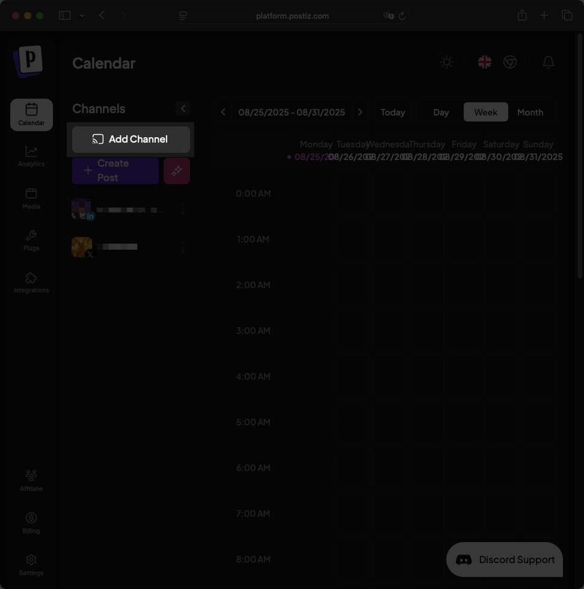
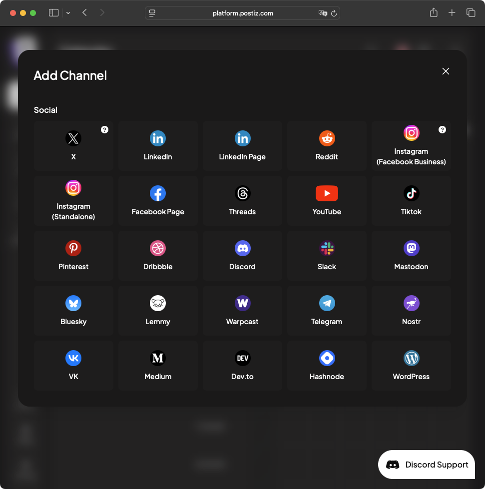
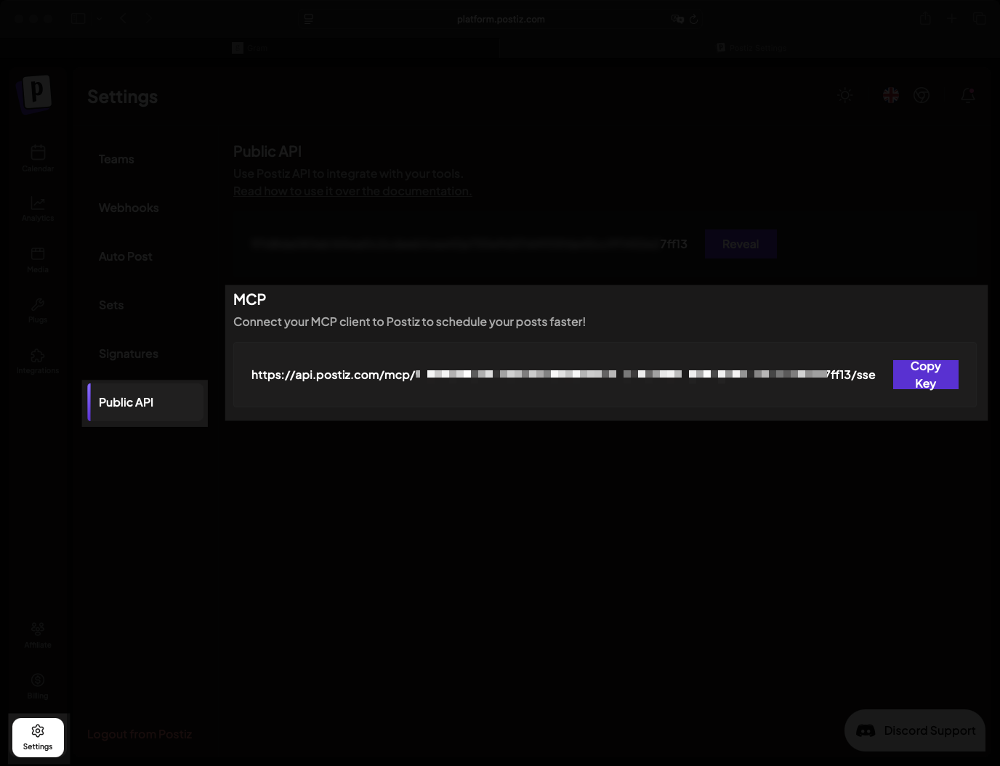
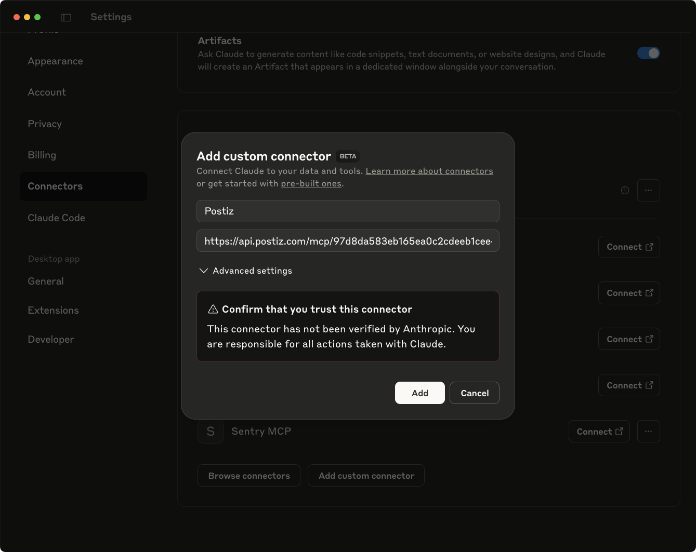
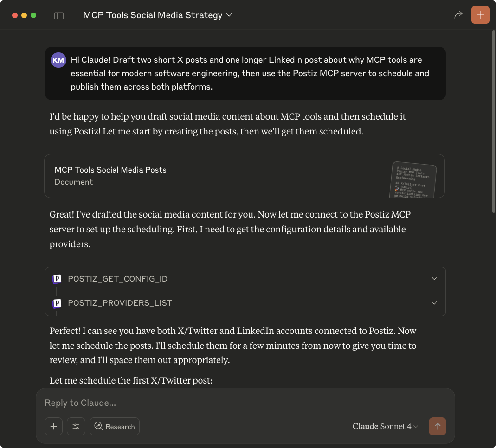
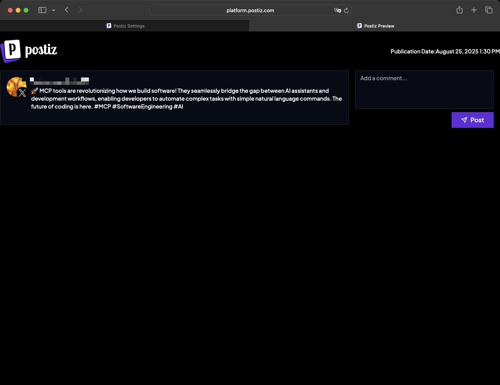

[Postiz](https://postiz.com/) connects to multiple social media platforms and schedules posts across channels. 

This guide shows you how to install the Postiz MCP server in Claude Desktop to generate and schedule content for X, LinkedIn, and other platforms.


## Prequisites

You'll need:

- [Claude Desktop](https://claude.ai/download).
- A Postiz account with at least one connected social media channel.

## Install the Postiz MCP server

To connect Postiz to Claude Desktop:

- Connect at least one social media channel in Postiz.

- Get your MCP server URL from Postiz settings.

### Connect a social channel 

Click **Add Channel** in your Postiz dashboard to connect a social media account.



Postiz will show social media options you can connect. For this guide, we'll use X and LinkedIn.



### Retrieve the MCP SSE link

From the Postiz dashboard, navigate to the **Settings** page and open the **Public API** tab. Find the MCP server URL in the **MCP** section. This URL provides direct access to Postiz's posting and scheduling functionality using MCP.



Copy the URL and open Claude Desktop. Go to Settings → Connectors and click **Add Custom Connector**. Enter "Postiz" as the connector name and paste your MCP server URL.



Click **Add** to save the connector and restart Claude Desktop.

## Test the integration

Test the integration by asking Claude to generate two short posts about MCP tools in software engineering, plus a longer detailed post.

The short posts work well for X, while the longer post fits LinkedIn better. Here's the prompt:

```txt
Hi Claude! Draft two short X posts and one longer LinkedIn post about why MCP tools are essential for modern software engineering, then use the Postiz MCP server to schedule and publish them across both platforms.
```

Claude will draft the posts and verify your Postiz configuration.



Then, Claude will schedule the posts. Click the generated links to view your scheduled posts in Postiz.



## Conclusion

You've connected Postiz to Claude Desktop for AI-powered social media scheduling. 

Try combining Postiz with other MCP servers to create advanced workflows, like turning your best [Slack threads](/mcp/using-mcp/claude-slack-postiz) into social media content.