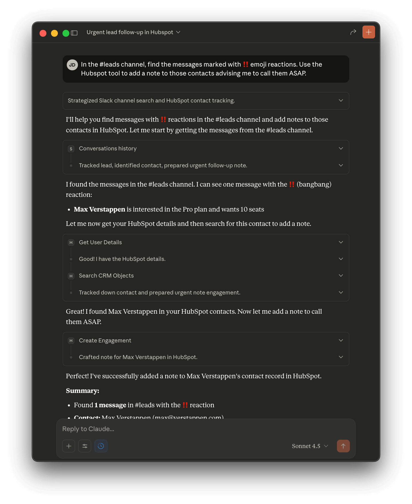
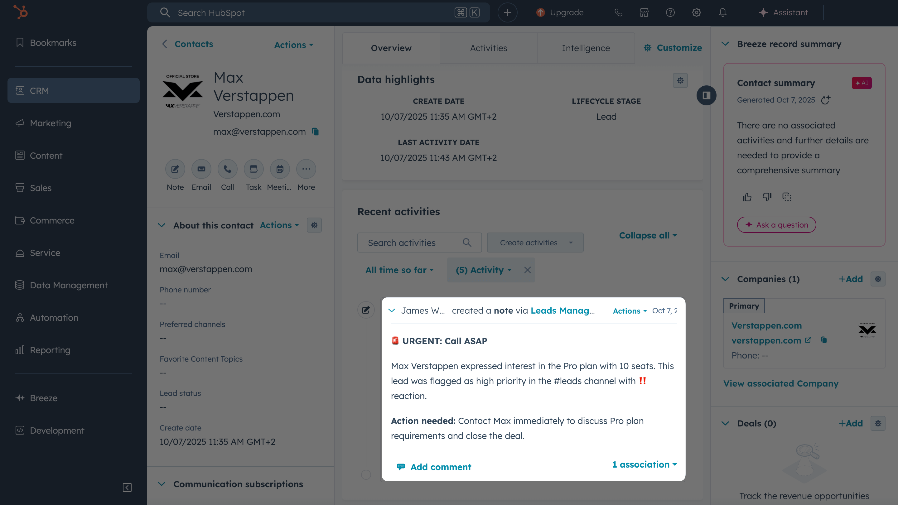
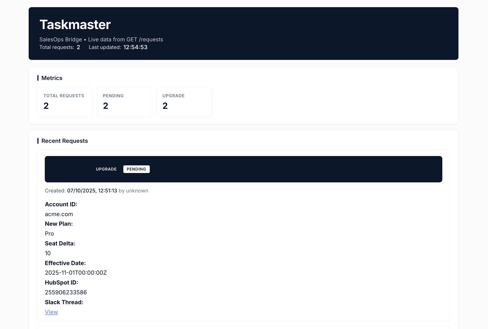

import GramCallout from "../.partials/gram-callout.mdx";

<GramCallout />

If your team lives in Slack, HubSpot, and an internal ops portal, every task turns into tool-switching: copy a link from Slack, search for the right record in HubSpot, then re-enter the same details into an internal system. It's slow, error-prone, and breaks the flow of work.
The problem is that often you need both external systems (Slack and HubSpot) and internal tools (often bespoke and hard to change) to move deals forward. Connecting them reliably is a challenge, and getting dev time to polish internal workflows can be difficult.

There's a simpler solution however: use MCP servers to connect all your tools so you can handle everything through Claude conversations. With MCP in Claude Desktop, you connect Slack, HubSpot, and your internal tool in one place so Claude can orchestrate the steps for you. In this guide, you'll see how to turn a Slack signal (like a ‼️ reaction) into a HubSpot update, and optionally kick off a simple internal request, all without leaving Claude Desktop.


## What are we building?

We're building an account management workflow that connects Slack, HubSpot, and a simple internal SalesOps API through MCP servers. Reps can ask Claude to find signal in Slack, update HubSpot, and create a small internal request, all in one conversation.

You'll set up three MCP servers:

- A Slack MCP server to find conversations 
- A HubSpot MCP server to update contacts and tasks
- An internal API MCP server to create small, auditable SalesOps requests


## Prerequisites

- Slack and HubSpot MCP servers installed. Follow these guides to connect each service individually.
  - [MCP Use Case: Connect Slack](/mcp/using-mcp/mcp-server-providers/slack)
  - [MCP Use Case: Connect HubSpot](/mcp/using-mcp/mcp-server-providers/hubspot)
- An MCP client like [Claude Desktop](https://claude.ai/download)

## Setting up HubSpot and Slack

Follow these guides to add both servers to Claude Desktop:

- [MCP Use Case: Connect Slack](/mcp/using-mcp/mcp-server-providers/slack)
- [MCP Use Case: Connect HubSpot](/mcp/using-mcp/mcp-server-providers/hubspot)

### Testing the flow

Let's imagine that your team shares lead updates in a Slack channel called `#leads` and marks urgent ones with the ‼️ emoji. You want Claude to add a "Schedule call ASAP" note to those contacts in HubSpot.


Ask Claude:

```txt
In the #leads Slack channel, find the messages marked with :bangbang: emoji reactions. Use the HubSpot tool to add a note to those contacts advising me to call them ASAP.
```

Claude will:

1. Search the #leads channel for messages with ‼️ reactions.
2. Parse contact information from those messages.
3. Look up matching contacts in HubSpot.
4. Add a priority note to each contact record.



The contacts in HubSpot will now have a "schedule call ASAP" note added to their records.



Now at this point, you could stop here and manually make account changes for each customer. However, we can take this a step further and use [Gram](https://getgram.ai) to create a SalesOps MCP server that can be used to let Claude interact with our internal account management system.

## Creating the SalesOps MCP server

Once Slack and HubSpot are working smoothly, you can bring your internal tool into the same flow. For this guide, our internal tool is a lightweight service called "SalesOps Bridge" that accepts simple requests like upgrade changes, trial extensions, or temporary feature grants. The service persists requests in SQLite, exposes a read-only `GET /requests` endpoint for dashboards, and ships with a small UI at `http://localhost:3080/` so you can inspect new requests as Claude creates them.

### Install and run SalesOps Bridge (locally)

You can run the example service included in our example repository. You can find it at `https://github.com/ritza-co/salesops-taskmaster-tool`.

After cloning the repo, navigate to the `salesops-taskmaster-tool` directory and run the following commands:

```bash
cp .env.template .env
# Edit .env to set AUTH_TOKEN, this can be any string if you're using it for demo purposes
npm install
npm run start
```

You can now check the health of the service by running a curl request to the health endpoint.

```bash
curl http://localhost:3080/health
```

The API exposes an OpenAPI document at `openapi.yaml` within the repository which we'll use to generate an MCP server on Gram.

### Expose your local service with ngrok

If you want to test in the Gram playground, you'll need to expose your local service using ngrok.

1. Install ngrok:

```bash
brew install ngrok
```

Or download from [ngrok.com](https://ngrok.com/download).

2. In a new terminal window, start ngrok to expose port 3080:

```bash
ngrok http 3080
```

3. Copy the HTTPS forwarding URL from the ngrok output (it will look like `https://abcd1234.ngrok.app`).

4. Update the server URL in `openapi.yaml`. Open the file and replace the placeholder on line 9 with your ngrok URL:

```yaml
servers:
  - url: https://YOUR-NGROK-URL.ngrok.app
```

Keep the ngrok terminal running while you test with Gram.

### Create the MCP server on Gram

Let's walk through the process of creating an MCP server on Gram. You can watch the video below for a quick walkthrough. Alternatively, for a more detailed walkthrough, see the [Gram docs](https://docs.getgram.ai/gram-quickstart).


1. Import your OpenAPI spec into Gram and generate a toolset.
2. Fill in your environment variables in the toolset.
3. You can test the toolset within the Gram Playground.

### Install the MCP server in Claude Desktop

First, create a Gram API key. In Gram, navigate to **Settings** in the sidebar, click **NEW API KEY**, select the consumer option, then click **CREATE**. Copy the API key.

Next, get your MCP configuration. Navigate to **Toolsets** in the sidebar, select your SalesOps toolset, then go to the **MCP** tab. Click the **ENABLE** button, scroll down to the managed authentication section, and copy that configuration.


In Claude Desktop, go to **Settings → Developer → Edit Config** and add an entry. Replace placeholders with your Gram server slug and API key. (`GET /requests` does not require auth, so Claude can read the dashboard without prompting for approval, while write actions will still require the bearer token you provide.)

```json
{
  "mcpServers": {
    "SalesOpsBridge": {
      "command": "npx",
      "args": [
        "mcp-remote",
        "https://app.getgram.ai/mcp/<your-mcp-server-slug>",
        "--header",
        "Gram-Environment:default",
        "--header",
        "Authorization:${GRAM_KEY}"
      ],
      "env": {
        "GRAM_KEY": "Bearer <your-gram-api-key>"
      }
    }
  }
}
```

## The complete account management workflow

Your `claude_desktop_config.json` might look like this:

```json
{
  "mcpServers": {
    "SalesOpsBridge": {
      "command": "npx",
      "args": [
        "mcp-remote",
        "https://app.getgram.ai/mcp/<your-mcp-server-slug>",
        "--header",
        "Gram-Environment:default",
        "--header",
        "Authorization:${GRAM_KEY}"
      ],
      "env": {
        "GRAM_KEY": "Bearer <your-gram-api-key>"
      }
    },
    "HubspotMCP": {
      "command": "npx",
      "args": ["-y", "@hubspot/mcp-server"],
      "env": {
        "PRIVATE_APP_ACCESS_TOKEN": "YOUR_HUBSPOT_KEY"
      }
    },
    "SlackMCPServer": {
      "command": "/path/to/slack-mcp-server",
      "args": ["-transport", "stdio"],
      "env": {
        "SLACK_MCP_XOXC_TOKEN": "YOUR_XOXC_TOKEN",
        "SLACK_MCP_XOXD_TOKEN": "YOUR_XOXD_TOKEN",
        "SLACK_MCP_USERS_CACHE": "/path/to/.users_cache.json",
        "SLACK_MCP_CHANNELS_CACHE": "/path/to/.channels_cache.json"
      }
    }
  }
}
```

To test the complete workflow, open Claude Desktop and send an example prompt like:

```txt
Find the :bangbang: thread in #leads about Acme. Summarize who asked, what's needed, and timing with the Slack link. Then use HubSpot to add a note and a task due tomorrow at 10:00. Finally, create an internal upgrade request via SalesOps Bridge for +10 seats effective the first of next month, including the Slack thread URL and HubSpot ID.
```


After Claude confirms the request ID, you can verify it by visiting the SalesOps Bridge dashboard at `http://localhost:3080/`.



## Final thoughts

You've built an account management workflow that connects Slack, HubSpot, and a simple internal API through MCP servers. Gram hosted the internal API integration without custom server code or infrastructure.

The internal API can represent any system with an OpenAPI document. You can adapt this for:

- **Discount approvals:** Capture context from Slack and add CRM notes, then create an approval request internally.
- **Trial extensions:** Log the request in HubSpot and create a short extension via the internal tool.
- **Feature flags:** Record the change in HubSpot and file a time-boxed feature grant internally.

For sensitive actions, prefer propose-then-confirm flows so you can review tool calls before execution.

For more information on MCP servers and how to host them blazingly fast, check out our [guide on deploying remote MCP servers](/mcp/using-mcp/remote-servers).