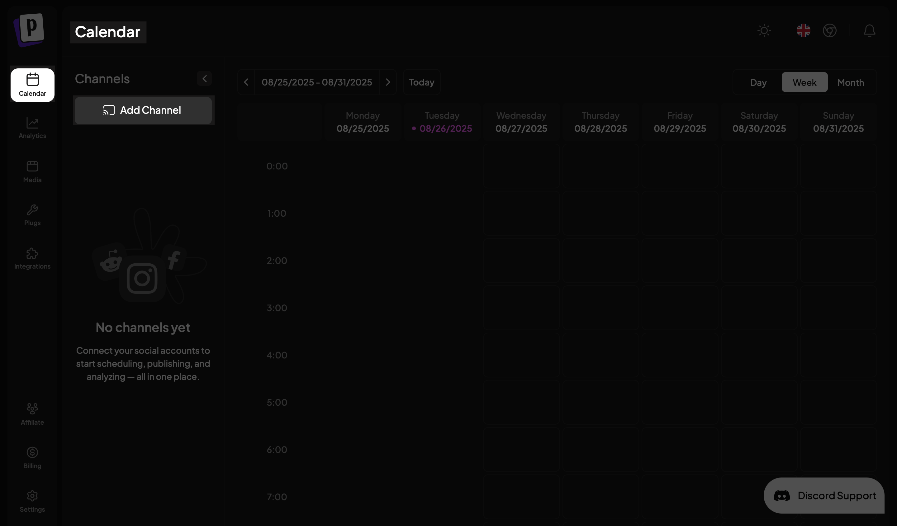
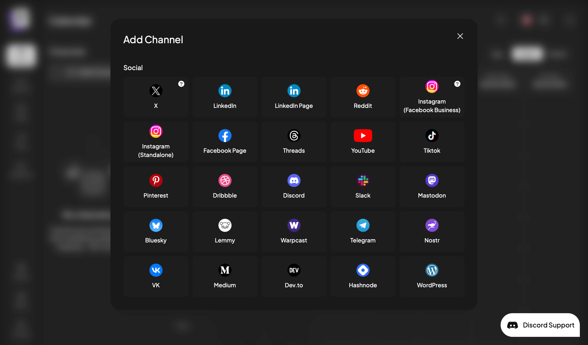
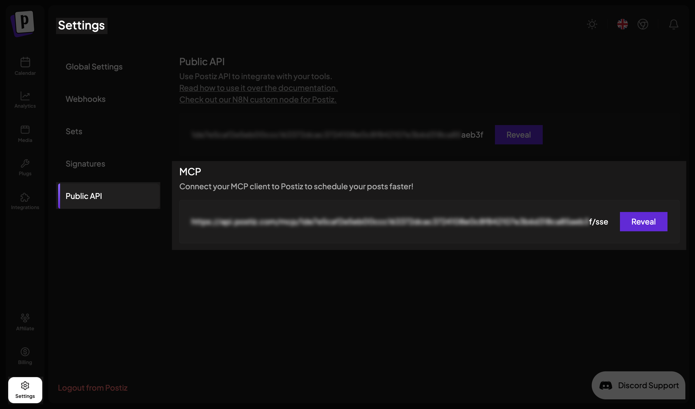
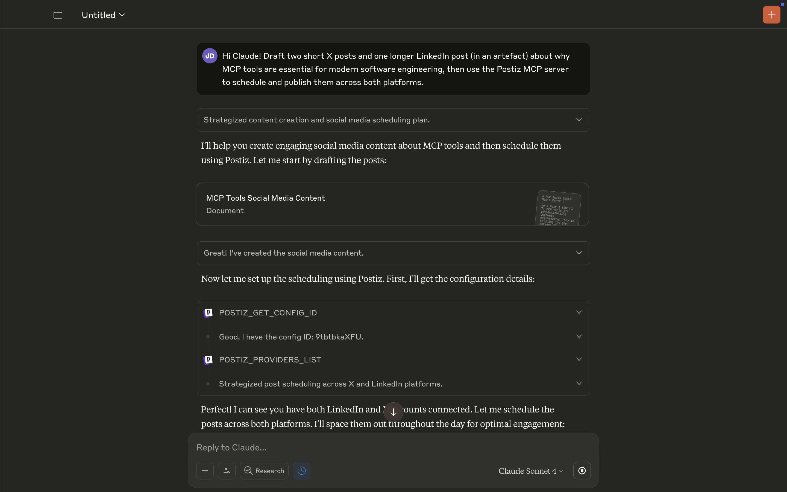
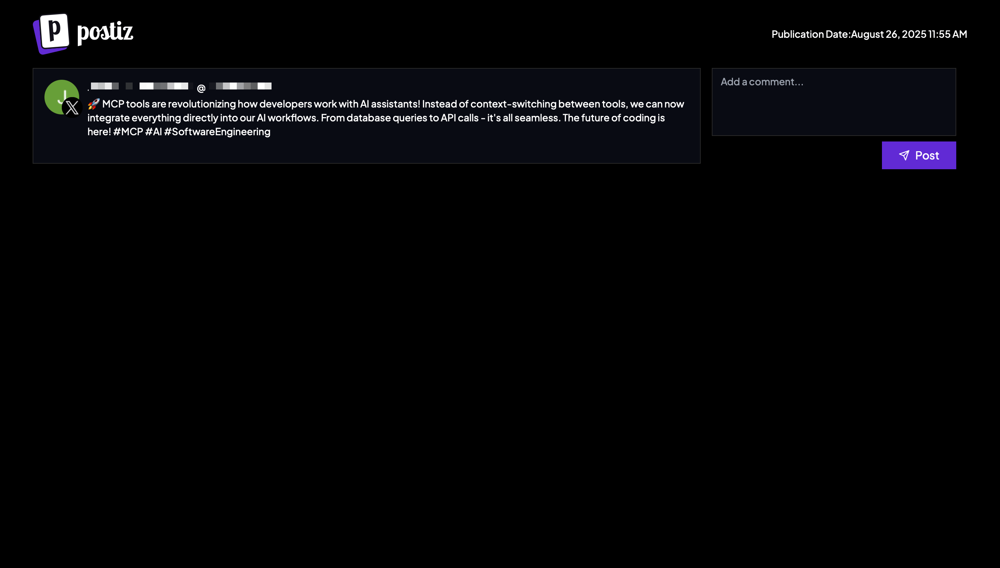

# Use Postiz from your MCP Client

[Postiz](https://postiz.com/) connects to multiple social media platforms and schedules posts across channels.

This guide shows you how to install the Postiz MCP server in Claude Desktop and use Claude to generate and schedule content for [X](https://x.com/), [LinkedIn](https://linkedin.com/), and other platforms.

<video
  controls={true}
  width="100%"
  className="mx-auto my-10"
>
  <source src="public/assets/videos/mcp/use-cases/postiz-mcp-demo.mp4" type="video/mp4" />
</video>

## Prequisites

You need:

- [Claude Desktop](https://claude.ai/download) installed
- A [Postiz account](https://platform.postiz.com/auth)

## Install the Postiz MCP server

To connect Postiz to Claude Desktop, you first need to:

- Connect at least one social media channel in Postiz
- Get your MCP server URL from the Postiz settings

### Connect a social channel

Click **Add Channel** in your Postiz dashboard to connect a social media account.



Postiz displays the social media options you can connect to. For this guide, use X and LinkedIn.



### Retrieve the MCP server link

From the Postiz dashboard, navigate to the **Settings** page and open the **Public API** tab. Find and copy the MCP server URL in the **MCP** section. This URL provides direct access to Postiz's posting and scheduling functionality using MCP.



In Claude Desktop, go to **Settings → Connectors** and click **Add Custom Connector**. Enter `Postiz` as the connector name and paste the Postiz MCP server URL in the designated field.


Click **Add** to save the connector and restart Claude Desktop.

## Test the integration

Test the integration by asking Claude to generate two short posts and a longer, more detailed post about MCP tools in software engineering.

The short posts work well for X, while the longer post suits LinkedIn better. Here's the prompt:

```txt
Hi Claude! Draft two short X posts and one longer LinkedIn post about why MCP tools are essential for modern software engineering, then use the Postiz MCP server to schedule and publish them across both platforms.
```

Claude drafts the posts and verifies your Postiz configuration.



Then, Claude schedules the posts. Click the generated links to view your scheduled posts in Postiz.



## Conclusion

With Postiz connected to Claude Desktop, you're ready for AI-powered social media scheduling.

Try combining Postiz with other MCP servers to create advanced workflows, like [turning your best Slack threads into social media content](/mcp/using-mcp/slack-postiz-guide).
