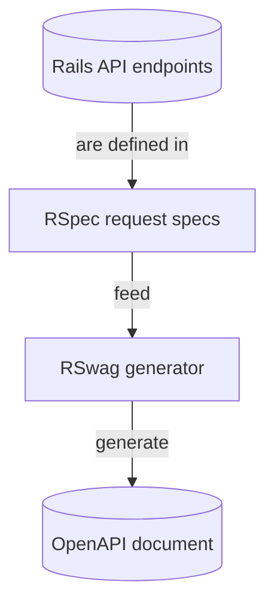

# How to generate OpenAPI documentation with RSwag for Rails APIs

When building APIs with Ruby on Rails, clear and accurate documentation is essential for your API consumers. [The OpenAPI Specification](https://swagger.io/specification/) (formerly Swagger) has become the industry standard for documenting RESTful APIs. However, manually writing and maintaining OpenAPI documents can be a time-consuming and error-prone process.

[RSwag](https://github.com/rswag/rswag) solves this problem by allowing you to generate OpenAPI documents directly from your RSpec tests. This ensures your documentation always stays in sync with your actual API implementation.

In this guide, we'll demonstrate how you can do the following:

- Document a Rails API with RSwag's RSpec-based domain-specific language (DSL).
- Generate OpenAPI documents.
- Use the Speakeasy CLI to generate client SDKs.

We'll also look at how to customize OpenAPI documents and troubleshoot some common issues.

## What is RSwag?

[RSwag](https://github.com/rswag/rswag) is a Ruby gem that helps you create documentation for your Rails APIs. Unlike other frameworks that let you add documentation directly in your code with comments, such as Django and FastAPI, RSwag builds your API documentation through your tests.

The basic idea behind RSwag is simple: You write special RSpec tests that describe what your API does, and RSwag uses these tests to generate OpenAPI documentation. This is different from most documentation tools because you're testing and documenting at the same time.

### Wait, what's RSpec?

[RSpec](https://rspec.info/) is a testing framework for Ruby that lets you write tests for your code. RSpec has a DSL that lets you write tests in a way that is easy to read and understand. RSwag is an extension of RSpec that uses RSpec's DSL to describe your API endpoints and then generates the OpenAPI document from those API definition files.

### So, to summarize:



RSwag has three main parts that we'll use in this guide:

- `rswag-specs`: This adds special test commands to [RSpec](https://rspec.info/) that let you describe your API endpoints. When you run these tests, they check whether your API works correctly and collect information for the documentation.
- `rswag-api`: This creates an endpoint in your Rails app that serves the OpenAPI document (in JSON or YAML format) so other tools can use it.
- `rswag-ui`: This adds the Swagger documentation UI to your app, giving you a nice webpage for viewing and trying out your API.

What makes RSwag really useful is that your documentation is always up-to-date with your code. If you change how your API works but forget to update the documentation, your tests will fail. This helps you catch documentation errors early. Also, since the documentation is generated from tests that actually run against your API, you can be confident that what's in the documentation really works.

## Example API repository

The source code for a complete implementation of this guide is available in the [rails-f1-laps-api repository](https://github.com/speakeasy-api/examples/tree/main/frameworks-rails-rswag). You can clone it and follow along with the tutorial or use it as a reference for your own Rails project.

For this guide, we'll use a simple Formula 1 (F1) lap times API with the following resources:

- **Drivers**: F1 drivers with their names, codes, and countries
- **Circuits**: Racing circuits with names and locations
- **Lap times**: Records of lap times for drivers on specific circuits

The API allows clients to list all drivers, circuits, and lap times. You can also use query parameters to filter lap times by specific drivers, circuits, and lap numbers, and use `POST` requests to create new lap time records.

### Requirements

To follow this guide, you should have:

- Ruby on Rails installed
- A Rails API application (you can use the example app provided above)

## Adding RSwag to your Rails application

Let's begin by adding RSwag to our Rails application. First, add the RSwag gems to your application's Gemfile:

```ruby filename="Gemfile"
group :development, :test do
  gem 'rswag-specs'
end

gem 'rswag-api'
gem 'rswag-ui'
```

The `rswag-specs` gem is only needed for development and testing, while the `rswag-api` and `rswag-ui` gems are required in all environments.

After updating your Gemfile, install the gems:

```bash
bundle install
```

Now, run the RSwag generators to set up the necessary files:

```bash
rails generate rswag:api:install
rails generate rswag:ui:install
rails generate rswag:specs:install
```

These generators create several important files, including:

- `config/initializers/rswag_api.rb`, which configures how the OpenAPI files are served
- `config/initializers/rswag_ui.rb`, which configures the Swagger UI
- `spec/swagger_helper.rb`, which sets up RSpec for generating OpenAPI specifications
- `config/routes.rb`, where the generators mount Rswag

## Configuring RSwag

Now that we have the RSwag components installed, we need to configure them to work with our API.

### Configuring the OpenAPI document generator

The `spec/swagger_helper.rb` file is the central configuration for your API documentation.

Here's an example configuration for our F1 Laps API:

```ruby filename="swagger_helper.rb"
RSpec.configure do |config|
  config.openapi_root = Rails.root.join('swagger').to_s

  config.openapi_specs = {
    'v1/swagger.yaml' => {
      openapi: '3.0.1',
      info: {
        title: 'F1 Laps API',
        version: 'v1',
        description: 'API for accessing Formula 1 lap time data and analytics',
        contact: {
          name: 'API Support',
          email: 'support@f1laps.com'
        },
        license: {
          name: 'MIT',
          url: 'https://opensource.org/licenses/MIT'
        }
      },
      paths: {},
      components: {
        securitySchemes: {
          bearer_auth: {
            type: :http,
            scheme: :bearer,
            bearerFormat: 'JWT'
          }
        }
      },
      servers: [
        {
          url: 'http://{defaultHost}',
          variables: {
            defaultHost: {
              default: 'localhost:3000'
            }
          }
        }
      ]
    }
  }

  config.openapi_format = :yaml
end
```

This configuration defines:

- The location where the OpenAPI files will be generated (`openapi_root`)
- The specification title, version, and description
- Contact information and license details
- Security schemes for authentication, such as JWT bearer tokens
- Server information

### Configuring the Swagger UI

You can customize the Swagger UI through the `config/initializers/rswag_ui.rb` file, which will be rendered at `<your-api-url>/api-docs` by default:

```ruby filename="rswag_ui.rb"
Rswag::Ui.configure do |c|
  c.openapi_endpoint '/api-docs/v1/swagger.yaml', 'F1 Laps API V1'

  # UI configuration options
  c.config_object['defaultModelsExpandDepth'] = 2
  c.config_object['defaultModelExpandDepth'] = 2
  c.config_object['defaultModelRendering'] = 'model'
  c.config_object['displayRequestDuration'] = true
  c.config_object['docExpansion'] = 'list'
  c.config_object['filter'] = true
  c.config_object['showExtensions'] = true
  c.config_object['showCommonExtensions'] = true
  c.config_object['tryItOutEnabled'] = true
end
```

### Configuring the OpenAPI files (rswag_api.rb)

The `config/initializers/rswag_api.rb` file configures how the OpenAPI files are served:

```ruby filename="rswag_api.rb"
Rswag::Api.configure do |c|
  c.openapi_root = Rails.root.to_s + '/swagger'
end
```

## Writing RSwag documentation specs

The most powerful feature of RSwag is its ability to generate OpenAPI documentation directly from your RSpec tests. These tests not only verify your API's functionality but also produce detailed OpenAPI documentation. Let's look at how to write these OpenAPI documents for different endpoints.

### Documenting a simple endpoint

Let's start with a simple health check endpoint that returns basic API status information:

```ruby filename="health_spec.rb"
# spec/requests/api/v1/health_spec.rb
require 'swagger_helper'

RSpec.describe 'Health API', type: :request do
  path '/api/v1/health' do
    get 'Get API health status' do
      tags 'Health'
      produces 'application/json'

      response '200', 'health status' do
        schema type: :object,
          properties: {
            status: { type: :string, enum: ['healthy'] },
            version: { type: :string },
            timestamp: { type: :string, format: 'date-time' }
          },
          required: ['status', 'version', 'timestamp']

        run_test!
      end
    end
  end
end
```

This spec does a few things:

- Defines the `/api/v1/health` endpoint as a `GET` request
- Categorizes it under the `'Health'` tag for organization
- Specifies that it produces JSON responses
- Documents the expected `200` response with a detailed schema
- Uses `run_test!` to execute the test and validate the actual response

The `run_test!` method is important, as it makes a request to your API and verifies that the response matches the documented schema. This ensures your documentation remains accurate and up-to-date with your implementation.

### Documenting endpoints with parameters

For more complex endpoints, such as those with parameters, request bodies, and multiple response types, you can create more detailed specs:

```ruby filename="lap_times_spec.rb"
# spec/requests/api/v1/lap_times_spec.rb
require 'swagger_helper'

RSpec.describe 'Lap Times API', type: :request do
  path '/api/v1/lap_times' do
    get 'List all lap times' do
      tags 'Lap Times'
      produces 'application/json'

      parameter name: :driver_id, in: :query, type: :integer, required: false, description: 'Filter by driver ID'
      parameter name: :circuit_id, in: :query, type: :integer, required: false, description: 'Filter by circuit ID'
      parameter name: :lap_min, in: :query, type: :integer, required: false, description: 'Minimum lap number'
      parameter name: :lap_max, in: :query, type: :integer, required: false, description: 'Maximum lap number'

      response '200', 'lap times found' do
        schema type: :array,
          items: {
            type: :object,
            properties: {
              id: { type: :integer },
              driver_id: { type: :integer },
              circuit_id: { type: :integer },
              time_ms: { type: :integer },
              lap_number: { type: :integer },
              created_at: { type: :string, format: 'date-time' },
              updated_at: { type: :string, format: 'date-time' }
            },
            required: ['id', 'driver_id', 'circuit_id', 'time_ms', 'lap_number']
          }

        run_test!
      end
    end

    post 'Create a lap time' do
      tags 'Lap Times'
      consumes 'application/json'
      produces 'application/json'

      parameter name: :lap_time, in: :body, schema: {
        type: :object,
        properties: {
          driver_id: { type: :integer },
          circuit_id: { type: :integer },
          time_ms: { type: :integer },
          lap_number: { type: :integer }
        },
        required: ['driver_id', 'circuit_id', 'time_ms', 'lap_number']
      }

      response '201', 'lap time created' do
        let(:lap_time) { { driver_id: 1, circuit_id: 1, time_ms: 80000, lap_number: 1 } }
        run_test!
      end

      response '422', 'invalid request' do
        let(:lap_time) { { driver_id: 1 } }
        run_test!
      end
    end
  end

  # Document nested routes
  path '/api/v1/drivers/{driver_id}/lap_times' do
    get 'Get lap times for a specific driver' do
      tags 'Lap Times'
      produces 'application/json'

      parameter name: :driver_id, in: :path, type: :integer, required: true

      response '200', 'lap times found' do
        let(:driver_id) { 1 }
        schema type: :array,
          items: {
            type: :object,
            properties: {
              id: { type: :integer },
              circuit_id: { type: :integer },
              time_ms: { type: :integer },
              lap_number: { type: :integer },
              created_at: { type: :string, format: 'date-time' },
              updated_at: { type: :string, format: 'date-time' }
            }
          }
        run_test!
      end
    end
  end
end
```

This more detailed spec documents multiple HTTP methods, query parameters, request bodies, different response types, and nested routes. The `let` statements provide test data that will be used when executing the tests.

### Understanding the RSwag DSL

When writing RSwag documentation specs, you'll use the following elements to describe your API:

- **Path and HTTP method definitions:** The `path` method defines the API endpoint being documented.

  ```ruby drivers_spec.rb
  path '/api/v1/drivers' do
    get 'List all drivers' do
      # Documentation for GET request
    end
  end
  ```

- **Tags for organization:** Tags help group related operations together, making your documentation more organized.

  ```ruby
  path '/api/v1/drivers' do
    get 'List all drivers' do
      tags 'Drivers'
      # Other documentation
    end
  end
  ```

- **Content types:** Specify what your API consumes and produces.

  ```ruby drivers_spec.rb
  path '/api/v1/drivers' do
    get 'List all drivers' do
      tags 'Drivers'
      produces 'application/json'
      consumes 'application/json'
      # Other documentation
    end
  end
  ```

- **Document parameters:** Define the query, path, or body parameters.

  ```ruby drivers_spec.rb
  path '/api/v1/drivers' do
    get 'List all drivers' do
      tags 'Drivers'
      produces 'application/json'

      parameter name: :team, in: :query, type: :string, required: false, description: 'Filter drivers by team'

      # Other documentation
    end
  end
  ```

- **Response definitions:** Define the possible responses with their schemas.

  ```ruby drivers_spec.rb
  path '/api/v1/drivers' do
    get 'List all drivers' do
      tags 'Drivers'
      produces 'application/json'

      parameter name: :team, in: :query, type: :string, required: false, description: 'Filter drivers by team'

      response '200', 'drivers found' do
        schema type: :array,
          items: {
            type: :object,
            properties: {
              id: { type: :integer },
              name: { type: :string },
              code: { type: :string }
            }
          }
        run_test!
      end
    end
  end
  ```

- **Test data:** Provide test data by using the `let` syntax to define the values that will be used during testing.

  ```ruby filename="drivers_spec.rb"
  path '/api/v1/drivers' do
    post 'Create a driver' do
      # ... parameter and other definitions ...

      response '201', 'driver created' do
        let(:driver) { { name: 'Max Verstappen', code: 'VER' } }
        run_test!
      end
    end
  end
  ```

## Generating the OpenAPI document

After writing your documentation specs, you can generate the OpenAPI document by running a single `rake` task:

```bash
RAILS_ENV=test # first we need to set the environment
```

```bash
rake rswag:specs:swaggerize
```

This command performs two important steps:

- It runs your RSwag specs to validate that your API implementation matches the documentation.
- It generates the OpenAPI document file at the configured location.

The result is an OpenAPI document (for example, `swagger/v1/swagger.yaml`) that you can use with various tools, including the built-in Swagger UI and the Speakeasy CLI.

If your tests fail during this process, it indicates that your API implementation doesn't match your documentation. This is a valuable feature of RSwag, as it ensures your documentation stays accurate and up-to-date with your actual implementation.

### Understanding the generated OpenAPI document

After running the `rswag:specs:swaggerize` command, RSwag generates a comprehensive OpenAPI document. Here's what a section of that generated document looks like for the lap times endpoint:

```yaml filename="swagger.yaml"
# Generated OpenAPI spec for Lap Times endpoint
"/api/v1/lap_times":
  get:
    summary: List all lap times
    tags:
      - Lap Times
    parameters:
      - name: driver_id
        in: query
        required: false
        description: Filter by driver ID
        schema:
          type: integer
      - name: circuit_id
        in: query
        required: false
        description: Filter by circuit ID
        schema:
          type: integer
      - name: lap_min
        in: query
        required: false
        description: Minimum lap number
        schema:
          type: integer
      - name: lap_max
        in: query
        required: false
        description: Maximum lap number
        schema:
          type: integer
    responses:
      "200":
        description: lap times found
        content:
          application/json:
            schema:
              type: array
              items:
                type: object
                properties:
                  id:
                    type: integer
                  driver_id:
                    type: integer
                  circuit_id:
                    type: integer
                  time_ms:
                    type: integer
                  lap_number:
                    type: integer
                  created_at:
                    type: string
                    format: date-time
                  updated_at:
                    type: string
                    format: date-time
                required:
                  - id
                  - driver_id
                  - circuit_id
                  - time_ms
                  - lap_number
  post:
    summary: Create a lap time
    tags:
      - Lap Times
    parameters: []
    responses:
      "201":
        description: lap time created
      "422":
        description: invalid request
    requestBody:
      content:
        application/json:
          schema:
            type: object
            properties:
              driver_id:
                type: integer
              circuit_id:
                type: integer
              time_ms:
                type: integer
              lap_number:
                type: integer
            required:
              - driver_id
              - circuit_id
              - time_ms
              - lap_number
```

You can see how RSwag has automatically documented:

- The HTTP methods (`GET` and `POST`)
- Query parameters for filtering
- A request body schema for creating new records
- Response codes and schemas
- The required fields

This is all generated from your RSwag spec files and matches the actual implementation of your API.

## Customizing your OpenAPI document

While the basic RSwag setup provides a solid foundation, you can customize your OpenAPI documents and enhance them with additional details to make your doc more useful to API consumers.

### Documenting authentication

If your API requires authentication, you can configure security schemes in `spec/swagger_helper.rb` and add security requirements to your specs:

```ruby filename="swagger_helper.rb"
components: {
  securitySchemes: {
    bearer_auth: {
      type: :http,
      scheme: :bearer,
      bearerFormat: 'JWT'
    }
  }
}
```

And then in your specs:

```ruby filename="lap_times_spec.rb"
path '/api/v1/protected_resource' do
  get 'Access protected resource' do
    tags 'Protected'
    security [bearer_auth: []]

    # Other documentation
  end
end
```

This tells API consumers that they need to include a bearer token in their requests to access the protected endpoints.

### Documenting file uploads

For endpoints that handle file uploads, you can use the `multipart/form-data` content type and specify file parameters:

```ruby filename="lap_times_spec.rb"
post 'Upload file' do
  consumes 'multipart/form-data'

  parameter name: :file, in: :formData, type: :file, required: true

  response '200', 'file uploaded' do
    # Test implementation
  end
end
```

### Creating reusable schemas

To keep your specs DRY [(Don't Repeat Yourself)](https://en.wikipedia.org/wiki/Don%27t_repeat_yourself), you can define reusable schema components in `spec/swagger_helper.rb`:

```ruby filename="swagger_helper.rb"
components: {
  schemas: {
    lap_time: {
      type: :object,
      properties: {
        driver_id: { type: :integer },
        circuit_id: { type: :integer },
        time_ms: { type: :integer },
        lap_number: { type: :integer }
      },
      required: ['driver_id', 'circuit_id', 'time_ms', 'lap_number']
    }
  }
}
```

And then in your specs:

```ruby filename="lap_times_spec.rb"
parameter name: :lap_time, in: :body, schema: { '$ref' => '#/components/schemas/lap_time' }
```

This allows you to define common models once and reference them throughout your documentation.

## Troubleshooting common issues

Let's look at some of the common issues you may encounter when using RSwag and how you can troubleshoot them.

### Missing documentation

If the endpoints don't appear in your Swagger UI:

- Ensure your specs include the proper RSwag DSL syntax.
- Verify that your spec files are in the correct location.
- Check that your controller routes match the paths in your specs.

Ideally, the CLI will give you a good error message if something is missing.

### Test failures

If your RSwag specs fail, it may be because the implementation doesn't match the documentation. To fix this, check the generated OpenAPI document to see what is missing, then update your specs to match the implementation.

Make sure to check the required parameters in both specs and controllers.

### Generation issues

If your OpenAPI document hasn't been generated correctly, check that you are running the command in the test environment (`RAILS_ENV=test`) and that the file permissions are correct in the destination directory.

## Generating SDKs with Speakeasy

Once you have created your OpenAPI document with RSwag, you can use Speakeasy to generate client SDKs for your API. This makes it easy for developers to interact with your API in their preferred programming language.

First, install the Speakeasy CLI:

```bash
curl -fsSL https://go.speakeasy.com/cli-install.sh | sh
```

Next, you can follow the instructions on the [Getting Started](https://www.speakeasy.com/docs/speakeasy-reference/cli/getting-started) page to set up and authenticate with Speakeasy.

To generate a client SDK, run the following command from the root of your project:

```bash
speakeasy quickstart
```

Follow the prompts to provide your OpenAPI document location (`swagger/v1/swagger.yaml`) and configure your SDK options.

Speakeasy then generates a complete SDK based on your API specification, making it easy for developers to integrate with your API.

## Summary

In this guide, we've explored how you can use RSwag to generate OpenAPI documents for your Rails API. We've covered how to document your API endpoints using RSwag's RSpec-based DSL and then use RSwag to generate your OpenAPI document, as well as how you can customize the OpenAPI document and use it to generate client SDKs with Speakeasy.
