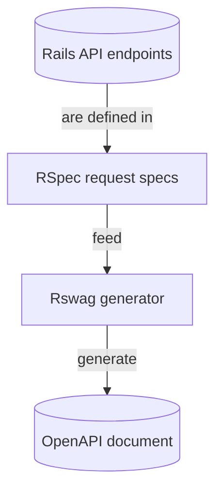

# How to generate OpenAPI documentation with Rswag for Ruby on Rails

When building APIs in a Ruby on Rails application, "Convention over Configuration" is already embraced. Building RESTful routes is standard for most Rails developers, as is writing tests using Test Driven Development (TDD), but creating an OpenAPI document that accurately describes an API can be another matter.

[The OpenAPI Specification](https://swagger.io/specification/) (formerly Swagger) has become the industry standard for documenting RESTful APIs, but manually writing and maintaining OpenAPI documents can be a time-consuming and error-prone process.

[Rswag](https://github.com/rswag/rswag) solves this problem by enabling OpenAPI documents to be generated directly from RSpec tests. This approach helps documentation stay in sync with the actual API implementation.

This guide demonstrates how to:

- Document a Rails API with Rswag's RSpec-based domain-specific language (DSL).
- Generate OpenAPI documents.
- Use the Speakeasy CLI to generate client SDKs.

The guide also covers customization of OpenAPI documents and troubleshooting common issues.

## What is Rswag?

[Rswag](https://github.com/rswag/rswag) is a Ruby gem that helps generate documentation for Rails APIs. Unlike other Ruby gems that add API documentation directly into code with comments or special attributes, Rswag builds API documentation through tests.

The idea behind Rswag is simple: RSpec tests describe API behavior using Rswag's extended rspec-rails OpenAPI-based DSL, and those tests are used to generate OpenAPI documentation. Unlike other tools, this approach tests the application while producing documentation at the same time.

### Wait, what's RSpec?

[RSpec](https://rspec.info/) is a Ruby testing framework used to write tests for code. Specifically, [rspec-rails](https://github.com/rspec/rspec-rails) brings RSpec testing to Rails applications. RSpec has a DSL (Domain Specific Language) that makes tests easy to read and understand. Rswag builds on this with its OpenAPI-based DSL to describe API endpoints and then generate the OpenAPI document from spec tests.

### So, to summarize:



Rswag has three main parts used in this guide:

- `rswag-specs`: Adds an OpenAPI-based DSL to [RSpec](https://rspec.info/) to describe API endpoints. When these spec tests run, they verify that the API works correctly and collect information for the documentation.
- `rswag-api`: Creates an endpoint in the Rails app that serves the OpenAPI document (in JSON or YAML format) for use by other tools.
- `rswag-ui`: Adds the OpenAPI documentation UI to the app, providing a webpage for viewing and trying out the API.

Rswag keeps documentation aligned with code changes. If the API behavior changes without updated documentation, tests will fail, helping catch documentation errors early. Because the documentation is generated from tests that run against the API, the documented behavior reflects reality.

## Example API repository

The source code for a complete implementation of this guide is available in the [rails-f1-laps-api repository](https://github.com/speakeasy-api/examples/tree/main/frameworks-rails-rswag). Clone the repository to follow along with the tutorial or use it as a reference for a Rails project.

This guide uses a simple Formula 1 (F1) lap times API with the following resources:

- **Drivers**: F1 drivers with their names, codes, and countries
- **Circuits**: Racing circuits with names and locations
- **Lap times**: Records of lap times for drivers on specific circuits

The API allows clients to list all drivers, circuits, and lap times. Query parameters can be used to filter lap times by specific drivers, circuits, and lap numbers, and `POST` requests can be used to create new lap time records.

### Requirements

To follow this guide, the following should be available:

- Ruby on Rails installed
- A Rails API application (the example app provided above can be used)

## Adding Rswag to a Rails application

Begin by adding Rswag to a Rails application. First, add the Rswag gems to the application's Gemfile:

```ruby filename="Gemfile"
group :development, :test do
  gem 'rswag-specs'
end

gem 'rswag-api'
gem 'rswag-ui'
```

The `rswag-specs` gem is needed only for development and testing, while the `rswag-api` and `rswag-ui` gems are required in all environments to allow other tools to interact with OpenAPI specs.

After updating the Gemfile, install the gems:

```bash
bundle install
```

Now, run the Rswag generators to set up the necessary files:

```bash
rails generate rswag:api:install
rails generate rswag:ui:install
rails generate rswag:specs:install
```

These generators create several important files, including:

- `config/initializers/rswag_api.rb`, which configures how the Rails Enginge exposes the OpenAPI files
- `config/initializers/rswag_ui.rb`, which configures the OpenAPI UI and OpenAPI endpoints
- `spec/swagger_helper.rb`, which sets up RSpec for generating OpenAPI specifications
- `config/routes.rb`, configures where Rails mounts Rswag's OpenAPI documentation engine

## Configuring Rswag

With the Rswag components installed, configure them to work with the API.

### Configuring the OpenAPI document generator

The `spec/swagger_helper.rb` file is the central configuration for API documentation.

Here is an example configuration for the F1 Laps API:

```ruby filename="swagger_helper.rb"
RSpec.configure do |config|
  config.openapi_root = Rails.root.to_s + '/openapi'

  config.openapi_specs = {
    'v1/openapi.yaml' => {
      openapi: '3.0.1',
      info: {
        title: 'F1 Laps API',
        version: 'v1',
        description: 'API for accessing Formula 1 lap time data and analytics',
        contact: {
          name: 'API Support',
          email: 'support@f1laps.com'
        },
        license: {
          name: 'MIT',
          url: 'https://opensource.org/licenses/MIT'
        }
      },
      paths: {},
      components: {
        securitySchemes: {
          bearer_auth: {
            type: :http,
            scheme: :bearer,
            bearerFormat: 'JWT'
          }
        }
      },
      servers: [
        {
          url: 'http://{defaultHost}',
          variables: {
            defaultHost: {
              default: 'localhost:3000'
            }
          }
        }
      ]
    }
  }

  config.openapi_format = :yaml
end
```

This configuration defines:

- The location where the OpenAPI files will be generated (`openapi_root`)
- The specification title, version, and description
- Contact information and license details
- Security schemes for authentication, such as JWT bearer tokens
- Server information

### Configuring the OpenAPI UI

The OpenAPI UI can be customized through the `config/initializers/rswag_ui.rb` file, which renders at `<api-url>/api-docs` by default:

```ruby filename="rswag_ui.rb"
Rswag::Ui.configure do |c|
  c.openapi_endpoint '/api-docs/v1/openapi.yaml', 'F1 Laps API V1'

  # UI configuration options
  c.config_object['defaultModelsExpandDepth'] = 2
  c.config_object['defaultModelExpandDepth'] = 2
  c.config_object['defaultModelRendering'] = 'model'
  c.config_object['displayRequestDuration'] = true
  c.config_object['docExpansion'] = 'list'
  c.config_object['filter'] = true
  c.config_object['showExtensions'] = true
  c.config_object['showCommonExtensions'] = true
  c.config_object['tryItOutEnabled'] = true
end
```

### Configuring the OpenAPI files (rswag_api.rb)

The `config/initializers/rswag_api.rb` file configures the root location where the OpenAPI files are served:

```ruby filename="rswag_api.rb"
Rswag::Api.configure do |c|
  c.openapi_root = Rails.root.to_s + '/openapi'
end
```

When using rswag-specs to generate OpenAPI files, ensure both `rswag-api` and `swagger_helper.rb` use the same `<openapi_root>`. Different settings exist to support setups where `rswag-api` is installed independently and OpenAPI files are created manually.

## Writing Rswag documentation specs

The most powerful feature of Rswag is the ability to generate OpenAPI documentation directly from RSpec tests. These tests not only verify API functionality but also produce detailed OpenAPI documentation. The following sections show how to write these OpenAPI documents for different endpoints.

### Documenting a simple endpoint

Let's start with a simple health check endpoint that returns basic API status information:

```ruby filename="health_spec.rb"
# spec/requests/api/v1/health_spec.rb
require 'swagger_helper'

RSpec.describe 'Health API', type: :request do
  path '/api/v1/health' do
    get 'Get API health status' do
      tags 'Health'
      produces 'application/json'

      response '200', 'health status' do
        schema type: :object,
          properties: {
            status: { type: :string, enum: ['healthy'] },
            version: { type: :string },
            timestamp: { type: :string, format: 'date-time' }
          },
          required: ['status', 'version', 'timestamp']

        run_test!
      end
    end
  end
end
```

This spec does a few things:

- Defines the `/api/v1/health` endpoint as a `GET` request
- Categorizes it under the `'Health'` tag for organization
- Specifies that it produces JSON responses
- Documents the expected `200` response with a detailed schema
- Uses `run_test!` to execute the test and validate the actual response

The `run_test!` method makes a request to the API and verifies that the response matches the documented schema, helping documentation remain accurate and aligned with the implementation.

### Documenting endpoints with parameters

For more complex endpoints, such as those with parameters, request bodies, and multiple response types, more detailed specs can be created:

```ruby filename="lap_times_spec.rb"
# spec/requests/api/v1/lap_times_spec.rb
require 'swagger_helper'

RSpec.describe 'Lap Times API', type: :request do
  path '/api/v1/lap_times' do
    get 'List all lap times' do
      tags 'Lap Times'
      produces 'application/json'

      parameter name: :driver_id, in: :query, type: :integer, required: false, description: 'Filter by driver ID'
      parameter name: :circuit_id, in: :query, type: :integer, required: false, description: 'Filter by circuit ID'
      parameter name: :lap_min, in: :query, type: :integer, required: false, description: 'Minimum lap number'
      parameter name: :lap_max, in: :query, type: :integer, required: false, description: 'Maximum lap number'

      response '200', 'lap times found' do
        schema type: :array,
          items: {
            type: :object,
            properties: {
              id: { type: :integer },
              driver_id: { type: :integer },
              circuit_id: { type: :integer },
              time_ms: { type: :integer },
              lap_number: { type: :integer },
              created_at: { type: :string, format: 'date-time' },
              updated_at: { type: :string, format: 'date-time' }
            },
            required: ['id', 'driver_id', 'circuit_id', 'time_ms', 'lap_number']
          }

        run_test!
      end
    end

    post 'Create a lap time' do
      tags 'Lap Times'
      consumes 'application/json'
      produces 'application/json'

      parameter name: :lap_time, in: :body, schema: {
        type: :object,
        properties: {
          driver_id: { type: :integer },
          circuit_id: { type: :integer },
          time_ms: { type: :integer },
          lap_number: { type: :integer }
        },
        required: ['driver_id', 'circuit_id', 'time_ms', 'lap_number']
      }

      response '201', 'lap time created' do
        let(:lap_time) { { driver_id: 1, circuit_id: 1, time_ms: 80000, lap_number: 1 } }
        run_test!
      end

      response '422', 'invalid request' do
        let(:lap_time) { { driver_id: 1 } }
        run_test!
      end
    end
  end

  # Document nested routes
  path '/api/v1/drivers/{driver_id}/lap_times' do
    get 'Get lap times for a specific driver' do
      tags 'Lap Times'
      produces 'application/json'

      parameter name: :driver_id, in: :path, type: :integer, required: true

      response '200', 'lap times found' do
        let(:driver_id) { 1 }
        schema type: :array,
          items: {
            type: :object,
            properties: {
              id: { type: :integer },
              circuit_id: { type: :integer },
              time_ms: { type: :integer },
              lap_number: { type: :integer },
              created_at: { type: :string, format: 'date-time' },
              updated_at: { type: :string, format: 'date-time' }
            }
          }
        run_test!
      end
    end
  end
end
```

This more detailed spec documents multiple HTTP methods, query parameters, request bodies, different response types, and nested routes. The `let` statements provide test data that will be used when executing the tests.

### Understanding the Rswag DSL

When writing Rswag documentation specs, the following elements are used to describe the API:

- **Path and HTTP method definitions:** The `path` method defines the API endpoint being documented.

  ```ruby drivers_spec.rb
  path '/api/v1/drivers' do
    get 'List all drivers' do
      # Documentation for GET request
    end
  end
  ```

- **Tags for organization:** Tags help group related operations together, making your documentation more organized.

  ```ruby
  path '/api/v1/drivers' do
    get 'List all drivers' do
      tags 'Drivers'
      # Other documentation
    end
  end
  ```

- **Content types:** Specify what your API consumes and produces.

  ```ruby drivers_spec.rb
  path '/api/v1/drivers' do
    get 'List all drivers' do
      tags 'Drivers'
      produces 'application/json'
      consumes 'application/json'
      # Other documentation
    end
  end
  ```

- **Document parameters:** Define the query, path, or body parameters.

  ```ruby drivers_spec.rb
  path '/api/v1/drivers' do
    get 'List all drivers' do
      tags 'Drivers'
      produces 'application/json'

      parameter name: :team, in: :query, type: :string, required: false, description: 'Filter drivers by team'

      # Other documentation
    end
  end
  ```

- **Response definitions:** Define the possible responses with their schemas.

  ```ruby drivers_spec.rb
  path '/api/v1/drivers' do
    get 'List all drivers' do
      tags 'Drivers'
      produces 'application/json'

      parameter name: :team, in: :query, type: :string, required: false, description: 'Filter drivers by team'

      response '200', 'drivers found' do
        schema type: :array,
          items: {
            type: :object,
            properties: {
              id: { type: :integer },
              name: { type: :string },
              code: { type: :string }
            }
          }
        run_test!
      end
    end
  end
  ```

- **Test data:** Provide test data by using the `let` syntax to define the values that will be used during testing.

  ```ruby filename="drivers_spec.rb"
  path '/api/v1/drivers' do
    post 'Create a driver' do
      # ... parameter and other definitions ...

      response '201', 'driver created' do
        let(:driver) { { name: 'Max Verstappen', code: 'VER' } }
        run_test!
      end
    end
  end
  ```

## Generating the OpenAPI document

After writing documentation specs, generate the OpenAPI document by running a single `rake` task:

```bash
rake rswag:specs:swaggerize
```

Alternatively, run the aliased command:

```bash
rake rswag
```

If the command fails, set the environment to "test" using:

```bash
RAILS_ENV=test rails rswag
```

This command performs two important steps:

- Runs Rswag specs to validate that the API implementation matches the documentation.
- It generates the OpenAPI document file at the configured location.

The result is an OpenAPI document (for example, `openapi/v1/openapi.yaml`) usable with various tools, including the built-in OpenAPI UI and the Speakeasy CLI.

If tests fail during this process, it indicates that the API implementation doesn't match the documentation. This behavior ensures documentation stays accurate and aligned with the actual implementation.

### Understanding the generated OpenAPI document

After running the `rswag:specs:swaggerize` command, Rswag generates a comprehensive OpenAPI document. Here's what a section of that generated document looks like for the lap times endpoint:

```yaml filename="openapi.yaml"
# Generated OpenAPI spec for Lap Times endpoint
"/api/v1/lap_times":
  get:
    summary: List all lap times
    tags:
      - Lap Times
    parameters:
      - name: driver_id
        in: query
        required: false
        description: Filter by driver ID
        schema:
          type: integer
      - name: circuit_id
        in: query
        required: false
        description: Filter by circuit ID
        schema:
          type: integer
      - name: lap_min
        in: query
        required: false
        description: Minimum lap number
        schema:
          type: integer
      - name: lap_max
        in: query
        required: false
        description: Maximum lap number
        schema:
          type: integer
    responses:
      "200":
        description: lap times found
        content:
          application/json:
            schema:
              type: array
              items:
                type: object
                properties:
                  id:
                    type: integer
                  driver_id:
                    type: integer
                  circuit_id:
                    type: integer
                  time_ms:
                    type: integer
                  lap_number:
                    type: integer
                  created_at:
                    type: string
                    format: date-time
                  updated_at:
                    type: string
                    format: date-time
                required:
                  - id
                  - driver_id
                  - circuit_id
                  - time_ms
                  - lap_number
  post:
    summary: Create a lap time
    tags:
      - Lap Times
    parameters: []
    responses:
      "201":
        description: lap time created
      "422":
        description: invalid request
    requestBody:
      content:
        application/json:
          schema:
            type: object
            properties:
              driver_id:
                type: integer
              circuit_id:
                type: integer
              time_ms:
                type: integer
              lap_number:
                type: integer
            required:
              - driver_id
              - circuit_id
              - time_ms
              - lap_number
```

Rswag automatically documents:

- The HTTP methods (`GET` and `POST`)
- Query parameters for filtering
- A request body schema for creating new records
- Response codes and schemas
- The required fields

All of this is generated from Rswag spec files and matches the actual implementation of the API.

## Customizing the OpenAPI document

While the basic Rswag setup provides a solid foundation, OpenAPI documents can be customized and enhanced with additional details to make them more useful to API consumers.

### Documenting authentication

If the API requires authentication, configure security schemes in `spec/swagger_helper.rb` and add security requirements to specs:

```ruby filename="swagger_helper.rb"
components: {
  securitySchemes: {
    bearer_auth: {
      type: :http,
      scheme: :bearer,
      bearerFormat: 'JWT'
    }
  }
}
```

And then in the specs:

```ruby filename="lap_times_spec.rb"
path '/api/v1/protected_resource' do
  get 'Access protected resource' do
    tags 'Protected'
    security [bearer_auth: []]

    # Other documentation
  end
end
```

This tells API consumers that they need to include a bearer token in their requests to access the protected endpoints.

### Documenting file uploads

For endpoints that handle file uploads, use the `multipart/form-data` content type and specify file parameters:

```ruby filename="lap_times_spec.rb"
post 'Upload file' do
  consumes 'multipart/form-data'

  parameter name: :file, in: :formData, type: :file, required: true

  response '200', 'file uploaded' do
    # Test implementation
  end
end
```

### Creating reusable schemas

To keep specs DRY [(Don't Repeat Yourself)](https://en.wikipedia.org/wiki/Don%27t_repeat_yourself), define reusable schema components in `spec/swagger_helper.rb`:

```ruby filename="swagger_helper.rb"
components: {
  schemas: {
    lap_time: {
      type: :object,
      properties: {
        driver_id: { type: :integer },
        circuit_id: { type: :integer },
        time_ms: { type: :integer },
        lap_number: { type: :integer }
      },
      required: ['driver_id', 'circuit_id', 'time_ms', 'lap_number']
    }
  }
}
```

And then in the specs:

```ruby filename="lap_times_spec.rb"
parameter name: :lap_time, in: :body, schema: { '$ref' => '#/components/schemas/lap_time' }
```

This allows common models to be defined once and referenced throughout the documentation.

## Troubleshooting common issues

Common issues encountered when using Rswag and how to troubleshoot them are outlined below.

### Missing documentation

If endpoints do not appear in the OpenAPI UI:

- Ensure specs include the proper Rswag DSL syntax.
- Verify that spec files are in the correct location.
- Check that controller routes match the paths in the specs.

Ideally, the CLI provides a helpful error message if something is missing.

### Test failures

If Rswag specs fail, the implementation may not match the documentation. To fix this, check the generated OpenAPI document to identify missing elements, then update specs to match the implementation.

Make sure to check the required parameters in both specs and controllers.

### Generation issues

If the OpenAPI document has not been generated correctly, ensure the command is run in the test environment (`RAILS_ENV=test`) and that file permissions are correct in the destination directory.

## Generating SDKs with Speakeasy

Once an OpenAPI document has been created with Rswag, Speakeasy can be used to generate client SDKs for the API. This makes it easier for developers to interact with the API in their preferred programming language.

First, install the Speakeasy CLI:

```bash
curl -fsSL https://go.speakeasy.com/cli-install.sh | sh
```

Next, follow the instructions on the [Getting Started](https://www.speakeasy.com/docs/speakeasy-reference/cli/getting-started) page to set up and authenticate with Speakeasy.

To generate a client SDK, run the following command from the root of the project:

```bash
speakeasy quickstart
```

Follow the prompts to provide the OpenAPI document location (`openapi/v1/openapi.yaml`) and configure SDK options.

Speakeasy then generates a complete SDK based on the API specification, making it easier for developers to integrate with the API.

## Summary

This guide explored how Rswag can be used to generate OpenAPI documents for a Rails API. It covered documenting API endpoints using Rswag's RSpec-based DSL, generating an OpenAPI document with Rswag, customizing the OpenAPI document, and using it to generate client SDKs with Speakeasy.
