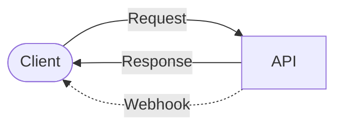

# Webhooks in OpenAPI

Generally speaking REST/HTTP APIs work in a request and response fashion: the client send a request, and the API immediately sends a response back. This is known as the "pull" method.

When APIs need time to work through a solution (like generating a large archive for export) or want to allow a client to subscribe for a series of events in the long term (letting them know about every e-commerce sale as it happens) then the "push" method is far more helpful.

One of the most popular ways to handle this for a REST/HTTP API is Webhooks. Webhooks let users integrate with APIs in realtime, sending data/events to a URL provided by a user.



Unlike other event-driven technologies, webhooks require the client to be running a web server to handle the incoming HTTP requests. Not all clients will be able to use this, especially frontend/mobile apps, but for any other APIs, microservice, or server-side web apps will be fine.

## How are webhooks used in OpenAPI

OpenAPI supports two different approaches to handling webhooks.

- `callbacks` - a user will specify a URL in the HTTP request which the API will use to send update(s) about the progress of the request.
- `webhooks` - assumes a user has registered a long term (potentially permanent) subscription, and then turns on the firehose of data.

Both webhooks and callbacks are a way of defining asynchronous communication with an API. It's possible to use webhooks and callbacks somewhat interchangeably, but it's recommended to stick to the following convention:

- If the initial API request triggers a long-running job and the user wants to receive the response asynchronously, use `callbacks`.

- If users will be receiving a stream of data over time with a consistent format, you should use `webhooks`.

## Quick example

Here is a simple example of a webhook in an inventory management API, that notifies another application when the stock levels of a drink or ingredient change. This could be used to update an e-commerce site or point of sale system, to keep track of stock levels in real time.

```yaml
webhooks:
  stockUpdate:
    post:
      summary: Receive stock updates.
      description: Receive stock updates from the bar, this will be called whenever the stock levels of a drink or ingredient change.
      requestBody:
        required: true
        content:
          application/json:
            schema:
              type: object
              properties:
                drink:
                  $ref: "#/components/schemas/Drink"
                ingredient:
                  $ref: "#/components/schemas/Ingredient"
      responses:
        "200":
          description: The stock update was received successfully.
        "5XX":
          $ref: "#/components/responses/APIError"
        default:
          $ref: "#/components/responses/UnknownError"
```

Here the `stockUpdate` webhook is defined with a `post` method. The request body contains a JSON object with the drink or ingredient details.

One thing to keep in mind here is that the response is not describing what the response is, but what the response should be. The server needs to respond with a `200` response if the stock update was received successfully, or a `5XX` error if there was an issue.

## A short history of webhooks in OpenAPI

Callbacks were added to the OpenAPI Specification in [version 3](https://spec.openapis.org/oas/v3.0.0#callback-object) in 2017; webhooks in [version 3.1](https://spec.openapis.org/oas/v3.1.0#oasWebhooks) in 2021.

| OpenAPI Version                               | Date    | Notes           |
| --------------------------------------------- | ------- | --------------- |
| [3.0.0](https://spec.openapis.org/oas/v3.0.0) | 2017-07 | Callbacks added |
| [3.1.0](https://spec.openapis.org/oas/v3.1.0) | 2021-02 | Webhooks added  |

In OpenAPI, webhooks and callbacks are defined as follows:

- `webhooks` are a top-level entry represented by a map of Path Item Objects or OpenAPI Reference Objects that are keyed by the unique name of the webhook. Webhooks specify what is pushed to a given URL but provide no way of setting the target URL. The subscription itself might be configured by a sales representative, entered during the sign-up process when a user creates an account on your system, or even set by a separate API endpoint (duplicating how callbacks work).
- A `callback` is a map of runtime expressions (that represent a URL the callback request is sent to) to a Path Item Object or Reference that defines a request to be initiated by the API provider and a potential response to be returned. The expression, when evaluated at runtime, will resolve to a URL represented in the parameters, request body, or response body of the parent operation.

## Creating a webhook in OpenAPI

Let's create an example of webhooks used for notifying another server about upcoming concerts at a club.

### Add a webhook description

Add a webhook named `concertAlert` that describes what information will be pushed to a subscriber. The webhook is a `post` method that will be called when a concert is scheduled. The request body contains a string with the details of the concert, but it could just as easily be JSON, XML, or even [JSONL](/openapi/jsonl-responses).

```yaml openapi.yaml
# !focus(5:19)
openapi: 3.1.0
info:
  title: SpeakeasyClub
  version: 1.0.0
webhooks:
  concertAlert:
    post:
      summary: Concert alert
      description: Notify the registered URL with details of an upcoming concert
      requestBody:
        required: true
        content:
          text/plain:
            schema:
              type: string
            example: "The Swing Machine will be playing at 19h30 tomorrow. $10 cover charge."
      responses:
        "200":
          description: Notification received by the external service.
```

Notice that there is no way for a user to register for this alert using the API, nor is the URL on which the user will be notified specified. This is a common pattern for webhooks, where the user registers for the webhook through a different process (like on a control panel or application settings somewhere) and then provides the URL to be notified.

### Add a Subscription Path

To allow users to register for alerts without using a callback, you can optionally mimic callback functionality by proving a subscription endpoint in a `/path`.

OpenAPI has no way to explicitly link the webhook with the registration. You will have to make this clear to users in your `description` elements or by grouping the operations with tags.

```yaml openapi.yaml
# !focus(20:40)
openapi: 3.1.0
info:
  title: SpeakeasyClub
  version: 1.0.0
webhooks:
  concertAlert:
    post:
      summary: Concert alert
      description: Notify the registered URL with details of an upcoming concert
      requestBody:
        required: true
        content:
          text/plain:
            schema:
              type: string
            example: "The Swing Machine will be playing at 19h30 tomorrow. $10 cover charge."
      responses:
        "200":
          description: Notification received by the external service.
paths:
  /registerForAlert:
    post:
      summary: Register for concert alerts
      description: Register a URL to be called when new concerts are scheduled.
      requestBody:
        required: true
        content:
          application/json:
            schema:
              type: object
              properties:
                url:
                  type: string
                  format: uri
                  description: The URL to be notified about approaching concerts.
            example:
              url: "https://example.com/notify"
      responses:
        "200":
          description: Registration successful.
```

There is no way to link the webhook with the registration, so you will have to make this clear to users in the `description` elements, or by grouping the operations with tags.

## Creating a Callback in OpenAPI

Here is how that same concept may look as a callback registering for more information about a specific concert, which is more in line with what callbacks are about than webhooks.

### Add a Subscription Path

Now add a single `/concertUpdates` endpoint that a user can pass a URL to for concert notifications.

```yaml openapi.yaml
# !focus(5:29)
openapi: 3.1.0
info:
  title: SpeakeasyClub
  version: 1.0.0
paths:
  /concertUpdates:
    post:
      summary: Register for concert updates
      description: Subscribe to updates such as ticket availability or schedule changes.
      requestBody:
        required: true
        content:
          application/json:
            schema:
              type: object
              properties:
                concertId:
                  type: string
                  examples:
                  - abc123
                callbackUrl:
                  type: string
                  format: uri
                  description: The URL to receive notifications.
            example:
              callbackUrl: "https://example.com/concerts/providerX:abc123"
      responses:
        "200":
          description: Registration successful.
```

To subscribe to this endpoint, a user would send a POST request with a JSON body containing the URL to be notified. For example:

```http
POST /concertUpdates HTTP/1.1
Host: example.com
Content-Type: application/json

{
  "concertId": "abc123",
  "callbackUrl": "https://example.com/concerts/providerX:abc123"
}
```


### Add a Callback to the Path

Finally, add a callback URL which will receive updates for that concert. The `callbacks` element is a map of runtime expressions to Path Item Objects, where the key is a [runtime expression](https://spec.openapis.org/oas/v3.1.0#runtime-expressions) that will be evaluated at runtime to determine the URL to which the callback request is sent.


```yaml openapi.yaml
# !focus(30:45)
openapi: 3.1.0
info:
  title: SpeakeasyClub
  version: 1.0.0
paths:
  /concertUpdates:
    post:
      summary: Register for concert updates
      description: Subscribe to updates such as ticket availability or schedule changes.
      requestBody:
        required: true
        content:
          application/json:
            schema:
              type: object
              properties:
                concertId:
                  type: string
                  examples:
                  - abc123
                callbackUrl:
                  type: string
                  format: uri
                  description: The URL to receive notifications.
            example:
              callbackUrl: "https://example.com/concerts/providerX:abc123"
      responses:
        "200":
          description: Registration successful.
      callbacks:
        concertAlert:
          "{$request.body#/callbackUrl}":
            post:
              summary: Concert alert
              description: Notify the registered URL with details of an upcoming concert.
              requestBody:
                required: true
                content:
                  text/plain:
                    schema:
                      type: string
                    example: "The Swing Machine has been cancelled. Refunds will be sent automatically."
              responses:
                "200":
                  description: Notification received by the external service.
```

The callback here is going to be sent to the user provided callbackUrl, which in this instance is defined in the request body. It can be referenced using a [runtime expression](https://spec.openapis.org/oas/v3.1.0#runtime-expressions), for example: `{$request.body#/callbackUrl}`. If the URL was a query string parameter called `callbackUrl` it would instead be `{$request.query.queryUrl}`. Learn more about [runtime expression](https://spec.openapis.org/oas/v3.1.0#runtime-expressions).

Selecting parameters in a POST request in this way is called . Read more about the syntax in the specification.

## Syntax Rules

The `webhooks` element has identical syntax to the `paths` element. Both are lists of [Path Item Objects](https://spec.openapis.org/oas/v3.1.0#pathItemObject), because a webhook is like a reverse path: just as paths describe endpoints on the server's API, webhooks describe endpoints on the client's API.

A `callback` is also a Path Item Object.

This means a webhook or callback has all the following path properties available to it: `$ref`, `summary`, `description`, `get`, `put`, `post`, `delete`, `options`, `head`, `patch`, `trace`, `servers`, and `parameters`.

## Callbacks and Webhooks in Speakeasy

Speakeasy will [automatically include webhook types](/docs/customize-sdks/webhooks) in generated code and documentation. There's no extra work or configuration require to make Speakeasy enable these features.

## Best practices for OpenAPI Webhooks

Here are a few more considerations when designing your API's use of webhooks and callbacks:

- If using callbacks, you can manage multiple subscriptions in the same endpoint using multiple parameters — one for each URL. This might be neater than creating one registration path per callback.
- If using webhooks, be sure to explain in the summary or description exactly how users can subscribe and unsubscribe, as well as any associated fees for the service.
- Any `description` elements may use [CommonMark syntax](https://spec.openapis.org/oas/v3.1.0#rich-text-formatting).
- Callbacks and webhooks must have unique names in the schema. The names are case-sensitive.
- Make your webhooks idempotent. Sending or receiving the same event multiple times should not cause side effects.
- Protect your API from DDoS attacks by making sure webhooks are protected from spam registrations with authentication and that limits are in place for the rate and size of your messages.

## What about AsyncAPI

OpenAPI is a general-purpose API specification that can be used for asynchronous APIs, but it is not necessarily optimized for them. If you find that OpenAPI is insufficient for your use case, you should check out [AsyncAPI](https://www.asyncapi.com/). Just be aware that AsyncAPI is still in the early stages of development and is not yet widely supported by the tooling ecosystem.

## Example of webhooks

There’s a full example of webhooks in the [Train Travel API](https://github.com/bump-sh-examples/train-travel-api/).
