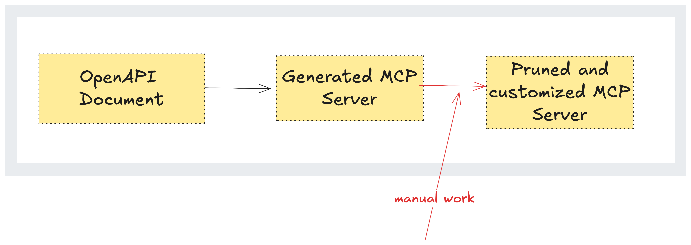
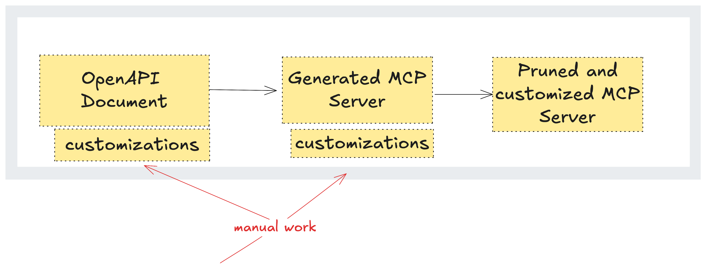
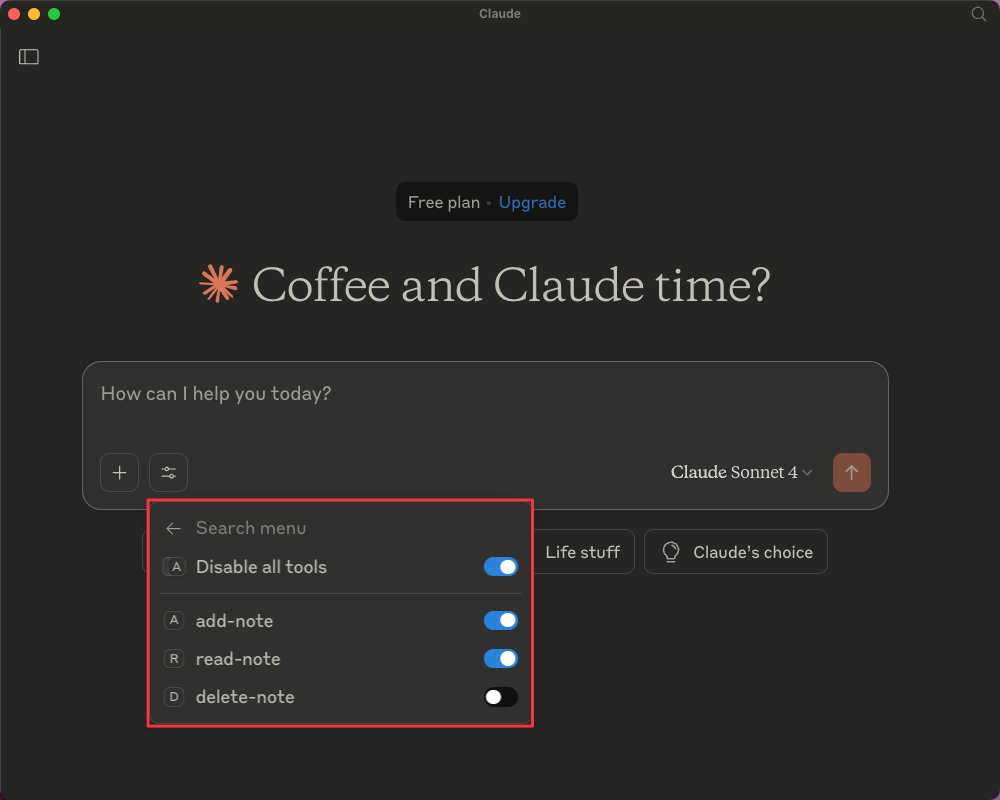
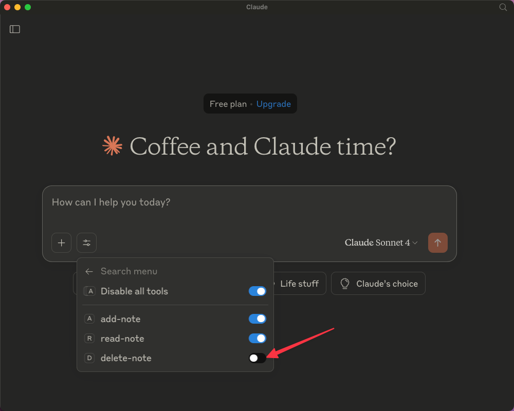

Suddenly, everyone wants an MCP server. You built an API for humans—now AI agents need to use it. That means you need an MCP server. What if you could just point to your OpenAPI document and generate one?

Actually, you can. We've built a [tool](https://www.speakeasy.com/docs/model-context-protocol) that takes your OpenAPI document and turns it into an MCP server.

So far, we've used it to generate [over 50](https://github.com/search?q="speakeasy"+path%3A**%2Fsrc%2Fmcp-server%2Fmcp-server.ts&type=code) MCP servers for customers, many of them already running in production. But generating MCP servers from OpenAPI isn't trivial. In their post [Auto-generating MCP Servers from OpenAPI Schemas: Yay or Nay?](https://neon.tech/blog/autogenerating-mcp-servers-openai-schemas), Neon captured many of the challenges, such as:

- Overwhelming decision space because MCP servers tend to have the same number of tools as the number of operations, which becomes an issue with an API with more than 500 operations, like the GitHub API.
- Fragile interactions with complex JSON inputs. 
- Difficulties with LLMs understanding workflows from the OpenAPI document, like a user adding items to a cart before validating the cart and paying.

To address those challenges, they recommend a hybrid approach:

> I'd recommend looking at the tools for generating an MCP server from OpenAPI specs, then begin aggressively pruning and removing the vast majority of the generated tools, keeping only low-level operations that represent genuinely useful, distinct capabilities that an LLM might perform.

The approach described above is the same as that used at Speakeasy. However, our generator automates the tasks of pruning and allows for customization to achieve better specificity. After generating more than 50 production MCP servers, we've seen what breaks, what matters, and what to avoid. 

The lessons that follow will help you build and optimize your own MCP server, whether you use our tool or not.

## A short terminology refresher

MCP is a fast-evolving space and can get complex, but for this guide, you only need to understand a few key concepts:

- **An OpenAPI** Document is a YAML or JSON file that describes your API, from endpoints to fields to schemas for request payloads, successful responses, and errors. See more on our [OpenAPI Hub](http://speakeasy.com/openapi).

- **A generator** is a tool that takes an OpenAPI document as input and produces an artifact. Previously, our generator focused on creating client SDKs or documentation to help users interact with our client APIs, but now it also supports generating MCP servers.

- **[MCP]()** is a protocol for AI agents to interact with your API.

- **A [tool](https://www.speakeasy.com/mcp/tools)** is a function that an agent can call. An MCP tool consists of the following components:

  - Name
  - Schema
  - Description

  The description can be seen as the "prompt". You need a high-quality description to ensure agents accurately and correctly identify the tool they need to call for a specific action.

  

## Optimizing OpenAPI Documents for MCP Servers

Being verbose in OpenAPI documents is normal when they're used to generate SDKs and API documentation. Since we, humans, will read and interact with these artifacts, it's intuitive to repeat key information across endpoint, schema, or field descriptions. This helps readers understand things in context without having to jump around the entire document.

However, more words mean more characters and therefore more tokens consumed in the LLM's context window. LLMs prefer concise and direct descriptions. Since LLMs process the entire document at once, unlike humans, this creates a strong reason to modify the OpenAPI document for better efficiency.

So, how do you balance being both concise and clear while avoiding repetition? The truth is, it's impossible without drastically affecting your OpenAPI document, which must serve both the MCP server's needs and API documentation. That's why at Speakeasy, we shifted the optimization layer across three components:

- **The OpenAPI Document:** This serves as your single source of truth, so you want to make as many changes directly here as possible. However, how much you can modify the document depends on balancing your MCP server's needs without compromising the clarity or usability of your API documentation and SDKs.
- **The generator itself:** It handles aspects like data formats, streaming, and other common API behaviors that don't work well with agents.
- **A custom function file:** Located alongside your generated MCP server, this lets you precisely control how specific tools behave.

Shifting the optimization layer helps us avoid manual changes directly on the generated MCP server that would need to be repeated after every regeneration.



Instead, it creates a workflow that allows us to elegantly control the MCP server while enabling regeneration at any time without losing customizations.



This change in workflow taught us how to tackle common problems when generating production-ready MCP servers. We addressed these challenges by adding customization options both in the OpenAPI document and within the MCP server generator. Let's take a closer look at the issues and our solutions.

## Too Many Endpoints = Too Many tools

Let's say you have 200 endpoints in your OpenAPI document. Generating an MCP server from this document will easily create around 200 tools. Now, assume you have 200 buttons in front of you, with a vague initial premise. You'd struggle to find the right button to press, whether it's taking time to analyze or taking a risk and pressing the wrong button. 

This is no different for LLMs. When given 200 tools, the model becomes confused because the context window gets overwhelmed. Additionally, many users rely on smaller models with even shorter context windows.

### Our solution to tool Explosion

To resolve the tool explosion issue, the first solution is to prune your OpenAPI document when generating MCP servers using it. Exclude non-useful endpoints such as `health/`, `inspect/`, or any endpoints that do not address the problem you are resolving by using an MCP server. 

For example, if you are building an MCP server to assist users with your e-commerce API, allowing them to order items by interacting with an AI agent. It'll be better to exclude endpoints for user authentication, user management, and payments, and leave only the endpoints related to navigating products, creating carts, and setting addresses.

Another solution to the tool explosion is to disable the tools on the client side instead. Claude Desktop allows this, but if the server makes over 200 tools available, then you're probably still not going to have a great time toggling off each one that you don't want individually.



At Speakeasy, tool explosion was the first problem we needed to solve, and also the easiest. Our generator looks for a custom `disabled` key in the OpenAPI Document, which defaults to false. Setting it to `True` means a tool will not be generated for this operation.

```yaml
x-speakeasy-mcp:
    disabled: true
```

### OpenAPI Descriptions Are Not Made for LLMs

Some OpenAPI documents include lengthy descriptions written for humans, not large language models (LLMs). These multi-paragraph descriptions often repeat the exact details and add noise. The extra text increases token usage, and with users having many MCP servers and using weaker LLM models, it can fill up the context window before the prompt is processed. This leads the LLM to choose the wrong tool or hallucinate a response.

However, short and vague descriptions also create issues. If several endpoints have similar names but do different things, the LLM won't know which one to use. 

```yaml
paths:
  /user/profile:
    get:
      summary: Get user profile
      description: Returns the user profile.
      responses:
        "200":
          description: OK
          content:
            application/json:
              schema:
                $ref: "#/components/schemas/UserProfile"

  /user/details:
    get:
      summary: Get user details
      description: Fetches user details.
      parameters:
        - name: userId
          in: query
          required: true
          schema:
            type: string
      responses:
        "200":
          description: OK
          content:
            application/json:
              schema:
                $ref: "#/components/schemas/UserDetails"

  /user/info:
    get:
      summary: Get user info
      description: Get user info.
      parameters:
        - name: userId
          in: query
          required: true
          schema:
            type: string
      responses:
        "200":
          description: OK
          content:
            application/json:
              schema:
                $ref: "#/components/schemas/UserPublicInfo"
```

In the OpenAPI document snippet above, we have three endpoints that return information about users. The description of each of those operations is vague. To avoid confusion, each operation should have a clear, precise description that explains exactly what it does and when to use it.

```yaml
paths:
  /user/profile:
    get:
      summary: Get current user profile
      description: Retrieves the profile of the authenticated user, including display name, bio, and profile picture.
      responses:
        "200":
          description: OK
          content:
            application/json:
              schema:
                $ref: "#/components/schemas/UserProfile"

  /user/details:
    get:
      summary: Get internal user details by ID
      description: Retrieves detailed internal data for a specific user by ID, including email, role assignments, and account status. Requires admin access.
      parameters:
        - name: userId
          in: query
          required: true
          schema:
            type: string
      responses:
        "200":
          description: OK
          content:
            application/json:
              schema:
                $ref: "#/components/schemas/UserDetails"

  /user/info:
    get:
      summary: Get public user info
      description: Returns limited public-facing information for a specific user by ID, such as username and signup date. Useful for displaying user data in public or shared contexts.
      parameters:
        - name: userId
          in: query
          required: true
          schema:
            type: string
      responses:
        "200":
          description: OK
          content:
            application/json:
              schema:
                $ref: "#/components/schemas/UserPublicInfo"
```

However, you may still need a long description for your endpoint, especially if you are using your OpenAPI document for API references or developer documentation.

To resolve that issue, Speakeasy enables the usage of `x-speakeasy-mcp`, a custom OpenAPI extension that describe endpoints to LLMs. 

```yaml
paths:
  /products:
    post:
      operationId: createProduct
      tags: [products]
      summary: Create product
      description: API endpoint for creating a product in the CMS
      x-speakeasy-mcp:
        disabled: false
        name: create-product
        scopes: [write, ecommerce]
        description: |
          Creates a new product using the provided form. The product name should
          not contain any special characters or harmful words.
      # ...
```

And if you don't want to pollute your OpenAPI document with extensions or non-native terminologies, you can use an [overlay](https://www.speakeasy.com/openapi/overlays), which is essentially a separate document that modifies the OpenAPI document.

## MCP Servers Struggle with Complex Formats

Agents generally expect simple JSON responses, but APIs often return complex and varied payloads. For example, if you build an MCP server for an API based on the TM Forum OpenAPI specification, the payloads can be quite large and complicated. Since LLMs struggle with complex JSON formats, it's common for them to have difficulty processing such responses. For instance, an agent might see:

- A streaming response, where the consumer is expected to keep a connection open until a stream of information has completed.
- A binary response, such as an image or audio file.
- Unnecessary information included in responses, such as metadata.
- Complex structures, such as the content being returned within a nested {result} field, wrapped in an envelope like the  [ProductOffering](https://github.com/tmforum-apis/TMF620_ProductCatalog/blob/4a76d6bcef7ce63783ef2ffb93944cc9a9bbb075/TMF620-ProductCatalog-v4.1.0.swagger.json#L5780) object from the TM forum [ProductCatalog OpenAPI document](https://github.com/tmforum-apis/TMF620_ProductCatalog/blob/master/TMF620-ProductCatalog-v4.1.0.swagger.json). 

### Our Solution To MCP and Complex Formats

Speakeasy solves this issue by automatically transforming data before sending it to the MCP server. For example, if Speakeasy detects an image or audio file, it converts it to base64 encoding before passing it to the LLM. This step is crucial for MCP server code generation because it requires understanding the data type and translating it appropriately for the MCP client.

Similarly, for streaming data, Speakeasy generates code that first streams all the data, and only after the stream completes does it pass the full response to the client.

Speakeasy also lets you customize how data is transformed. For instance, if you receive a CSV file and want to extract information and convert it to JSON, you can write an [SDK hook](https://www.speakeasy.com/docs/customize/code/sdk-hooks). This hook runs after a successful request and before the response moves on to the next step in the SDK lifecycle.

## MCP Servers Expose Everything

Say you have a Salesforce MCP server, locally connected to a Claude desktop. Even with restricted controls, you're one tool call away from leaking sensitive identity information or modifying accounts in unintended ways – whether due to hallucinations, missing context, or any of the issues we've already covered.

This risk exists because MCP servers expose capabilities directly to the client. If you're using a custom MCP client, you can choose not to expose certain tools. With Claude Desktop, you can toggle off specific tools to prevent them from being called. 



However, things become complicated when you have multiple tools or descriptive actions. Managing this complexity across multiple clients or environments quickly becomes unscalable.

So what if you could define these rules before the MCP server and clients are even generated?

#### Our Solution To MCP Servers Exposing Everything

We have a complementary approach to resolving access control issues. By using scopes, you can restrict tool use on the server, rather than the client, and configure it instead of using a UI like Claude Desktop. Now, regardless of which client the user is using, you can have built-in protections in the server configuration.

A scope is another annotation on a specific endpoint, such as a tag, with relevant keywords. You can tag all GET requests with a read scope and PUT, DELETE, and PATCH with a write scope.

```yaml
overlay: 1.0.0
info:
  title: Add MCP scopes
  version: 0.0.0
actions:
  - target: $.paths.*["get","head","query"]
    update: { "x-speakeasy-mcp": { "scopes": ["read"] } }

  - target: $.paths.*["post","put","delete","patch"]
    update: { "x-speakeasy-mcp": { "scopes": ["write"] } }
```

Then, you can start the server with a scope read and only expose the read operations. Scopes are not limited to write and read only. Because they are like tags, you can also use them to allow access to specific tools regarding a domain. 

For example, if you want to limit the MCP server to expose only operations regarding products, you can add the scope `product` to the endpoints concerned. 

Then, when starting the MCP server, specify the scopes to include, and you are good to go. 

```json
{
  "mcpServers": {
    "MyAPI": {
      "command": "npx",
      "args": ["-y", "--", "your-sdk-package", "mcp", "start", "--scope", "products"]
      "env": {
        "API_TOKEN": "your-api-token-here"
      }
    }
  }
}
```

- MCP servers are powerful tools that shape how users interact with AI agents. But given limitations like static context windows, insufficient descriptions, and the difficulty of handling complex data structures, they can quickly become sources of hallucinations and errors instead of enablers of great experiences for your users.

  At Speakeasy, we believe these issues can be mitigated by following a few best practices:

  - **Write clear, concise descriptions** for fields, schemas, and endpoints to help LLMs reason accurately.
  - **Avoid tool explosion** by limiting the number of generated tools and focusing only on what's useful.
  - **Transform complex data**, like binary files or deeply nested JSON, into simpler formats before sending the data to the client.
  - **Use scopes and Azzario documents** to restrict tool exposure and control tool generation by domain.